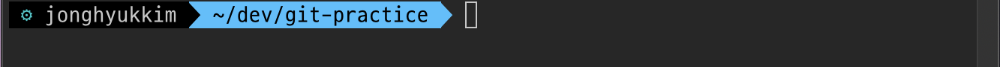

깃을 사용하는 방법을 요점만 콕콕 찝어서 한번 정리해보려 합니다! 깃 명령어 일일히 공부하실 필요 없이, 이 포스팅대로 처음부터 끝까지 따라해보시면 **혼자** 깃을 사용하고, 깃헙 계정 관리하시는데는 문제가 없을 거에요!
<!–-break-–> 
{: .lead}

 > 이번 포스팅은 저번 겨울방학에 진행했던 웹 개발 동아리 [피로그래밍](https://www.facebook.com/p.rogramming3k/)의 깃 관련 세션을 진행하면서 사용했던 강의 자료를 보충한 것입니다.

## 시작하기 전에(1)

1. 깃헙 레포지토리 == 리모트 저장소
2. 자신의 프로젝트 폴더 == 로컬 저장소
3. 깃 ≠ 깃헙
    - 깃 : 버전관리 소프트웨어
    - 깃헙: 깃을 토대로 하는 리모트 저장소. 깃헙 이외에도 빗버켓,깃랩 등이 있습니다.

## 시작하기 전에(2)

1. 깃(+깃 배쉬) 설치하기[(링크)](https://git-scm.com/downloads)
    - 윈도우 쓰시는 분들은 설치 Setup창에서 windows Explorer Integration을 선택해주세요
    - [설치 참고링크](https://gabii.tistory.com/entry/Git-Git-Bash-219-%EC%84%A4%EC%B9%98%ED%95%98%EA%B8%B0)
2. 깃헙 계정 만들기[(링크)](https://github.com/)
3. 깃헙 레포지토리 만들기
    1. 깃헙 로그인 후 좌측 상단의 `new` 버튼을 누릅니다
    
    2. 레포지토리의 이름과 설명을 입력하고 `create repository`버튼을 누릅니다
    
    3. 레포지토리가 만들어졌습니다!
    

이 3개가 모두 끝났다면 깃을 써볼 준비 완료!!

깃배쉬/CMD(윈도우)나 터미널(맥, 리눅스)을 열어주시고, 로컬 저장소로 이용할 폴더 디렉토리를 만들고 그 경로로 이동해주세요.

## 깃 시작하기(git init)

깃 배쉬, 터미널을 통해 자신이 깃헙 레포지토리에 올리고 싶은 폴더에 접근했다면,

`git init` 명령어로 **해당 디렉토리를 로컬 저장소로 지정**합니다. 이 명령어를 입력하면 **깃이 로컬 저장소로 지정한 디렉토리를 계속 지켜보고** 있는 상태입니다. 깃은 지정된 로컬 저장소 내부 파일들의 수정이나, 삭제, 추가 등을 모두 감지해냅니다.

## 최초 설정하기(git config)

# 커밋에 쓰일 이름 입력(꼭 깃헙 아이디일 필요는 없습니다.)
git config --global user.name "Max Kim"   

# 깃헙에 가입 이메일 입력
git config --global user.email hwaseen@gmail.com    

본격적으로 깃을 시작하기 전에, 깃 깔고 **최초에 한번만 하면 되는** 설정을 합시당(맨날 할 필요 X)

깃헙 계정 정보를 등록하는 것인데요. 커밋에 쓰일 이름, 깃헙 이메일을 붙여서 저렇게 두 명령어를 차례로 실행해 주시면 됩니다.

깃 설정에서 이메일을 자신의 깃헙 계정 정보와 다르게 적으면 흔히 말하는 **잔디가 심어지지 않습니다.(일일 몇 커밋 확인 불가ㅜㅜ)** 정확하게 적어주세요!!

# 깃 설정 보기
git config --list   

위 명령어를 입력하면 설정을 볼 수 있습니다. 이메일과 아이디가 제대로 입력되었는지 확인해주세요!!(Q를 누르면 닫힙니다.)

## 깃헙 레포지토리 연결하기(git remote)

# 리모트 저장소 연결 명령어
git remote add origin 레포지토리 링크 

이제 로컬 저장소와 깃헙 레포지토리(리모트 저장소)를 연결해보겠습니다! 이 과정은 레포지토리를 만들고 깃헙을 통해 작업을 시작하는 시점에 하시면 됩니다.

레포지토리 주소는 url창을 참조해도 되고, 레포지토리를 만들면 최초 화면에 주소가 나와 있습니다. 이 주소를 따옴표 없이 origin뒤에 한 칸 띄고 그대로 복붙해주세요!

여기서 `origin`이 무슨 의미냐면, 리모트 저장소의 **'약칭'**입니다. **한 로컬 저장소에 여러개의 리모트 저장소를 지정할 수 있어요**. `origin` 대신에 다른 이름을 쓰셔도 됩니다만, 로컬 저장소에 붙는 최초의 리모트 저장소의 이름은 보통 `origin`을 사용합니다. 이제 우리는 `origin`으로 리모트 저장소를 칭할 수 있게 됐습니다.

## 상태변화 감지(git status)

일단 로컬 저장소 안에 `.md`파일을 하나 만들어보겠습니다. 그리고 `git status` 명령어를 실행해 보겠습니다.

빨간 글씨가 보이시나요? 그렇다면 **깃이 로컬 저장소의 변화를 감지**해냈다는 것입니다! 이렇게 `git status`는 **변형된 파일의 양상을 깃이 감지해냈는지 확인**할 수 있는 명령어입니다. 파일의 추가나 삭제, 파일 내용의 수정까지 모두 잡아냅니다.

## 스테이지 위에 올리기(git add)

# 지금까지 변형된 모든 파일을 스테이지 위에 올림
git add .  

# 특정 파일만 스테이지 위에 올림
git add 특정 파일명   

깃이 로컬 저장소의 상태변화를 감지해낸 상태라면, 이 변형된 파일의 수정사항을 **스테이지 위에 올릴 수 있습니다**. 스테이지 위에 올라간 변경사항은 잠시 후에 할 **커밋에 반영**됩니다. 커밋은 로컬 저장소의 **수정사항을 스테이지 위에 올린 상태에서만** 가능합니다. 

`git add`를 수행하고 나면 저렇게 터미널 바의 색깔 또는 모양이 바뀝니다.

## 커밋하기

# 커밋 명령어
git commit -m "커밋명" 

드디어 커밋을 해볼겁니다! 커밋은 **수정되기 전 파일로부터 수정 된 후 파일이 되기까지의 변경 이력**을 기록해 놓는 것이라고 할 수 있습니다. `git add` 명령어로 스테이지에 변경 사항을 올리는 것이 장바구니에 물건을 담는 것이라면, 커밋은 장바구니 안의 물건들을 주문하는 것과 같습니다. 

커밋의 `-m` 옵션은 메시지를 달아서 커밋하겠다는 옵션이고요, `git commit -m`까지 써준 다음에 큰따옴표 안에 커밋 메시지를 적습니다. 커밋 메시지에는 일반적으로 자신이 저장소의 어떤 파일을 수정했는지, 어떻게 수정했는지에 대한 정보가 들어갑니다. 

로컬 저장소의 깃 커밋 로그를 보는 명령어도 있습니다. 아래 명령어를 실행하시면 그동안 로컬 저장소에 커밋했던 내역들을 모두 볼 수 있습니다. `Q`를 누르시면 빠져나옵니다.

# 커밋 로그 보기
git log

## 레포지토리에 푸쉬하기

# 푸쉬 명령어 : git push (리모트 저장소 별칭) (브랜치명)
git push origin master

커밋을 하고, 깃헙에 들어가셔서 리모트 저장소 커밋 이력을 한 번 보겠습니다. 커밋이 반영되어 있나요? 

안 되어 있는게 정상입니다! 우리가 한 커밋은 **로컬 저장소에 먼저 반영**됩니다. 아직 리모트 저장소에 반영된게 아니죠! 리모트 저장소에 우리의 커밋을 반영하려면 `push`명령어를 쓰셔야 해요. 여기서 `origin`은 아까 설정했던 리모트 저장소의 별칭이고요, `master`는 레포지토리의 기본(default) 브랜치입니다. 브랜치에 대해서는 다음 포스팅에서 자세히 이야기해볼게요.

위의 명령어를 실행해주시고 명령어 실행이 완료되면 깃헙 레포지토리를 다시 봐주세요.(새로고침!) 로컬 저장소의 커밋 이력이 반영되었을 겁니다! 깃헙 계정으로 처음 푸시를 하신다면, 깃헙 아이디와 비밀번호를 확인하는 과정을 거칠 것입니다.

여기까지 깃을 시작하고 커밋, 푸시하는 과정이 끝났습니다!

## 마무리

# 깃 시작 => 커밋 => 푸쉬까지의 전체 과정 정리
git init
git config --global user.name "커밋에 쓰일 이름"
git config --global user.email 이메일
git remote add origin 깃헙 레포지토리 주소
--프로젝트 폴더 수정--
git add .
git commmit -m "커밋명"
git push origin master


이 포스팅을 통해 혼자서 본인의 레포지토리에 커밋하고 푸시하는데는 문제가 없으실만큼 배우셨네요!!👏 수고하셨습니다! 레포지토리의 `master` 브랜치에 커밋을 하면, 잔디라는 것이 심어집니다.(`master` 브랜치가 아닌 다른 브랜치에 푸쉬를 하면 잔디가 심어지지 않습니다.) 

요즘 개발자 사이에서의 "**1일 1커밋 하자**" 라는 이야기가 하루에 잔디 하나씩 심자는 말이기도 합니다. 채워지는 잔디를 보면서 보람을 많이 느끼곤 합니다! 저는 배웠던 것을 정리하는 [TIL레포나](https://github.com/MaxKim-J/TIL) 매일 알고리즘 문제를 풀어 커밋하는 [ALGO 레포](https://github.com/MaxKim-J/Algo)를 만들어 1일 1커밋을 실천하려 노력 중입니다.