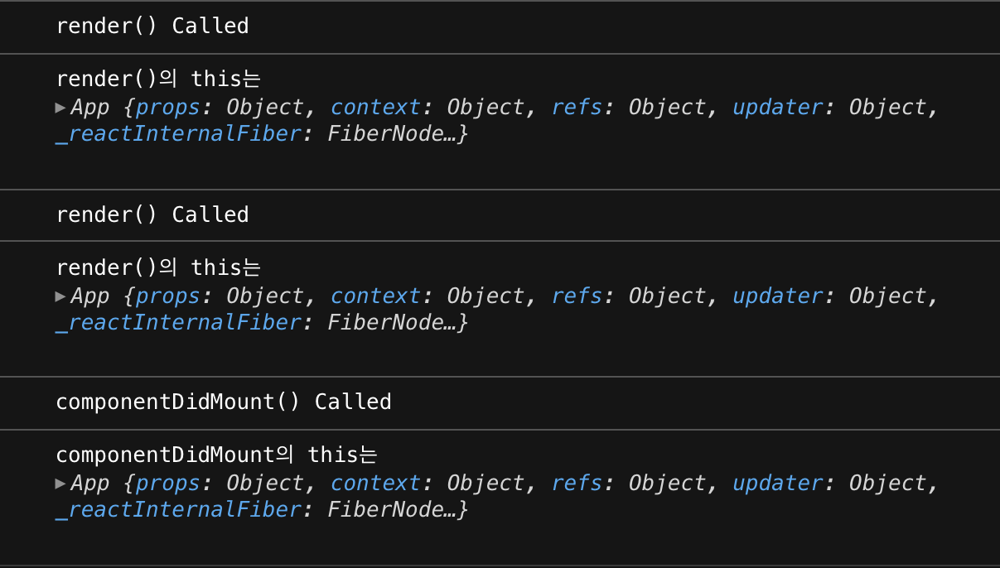
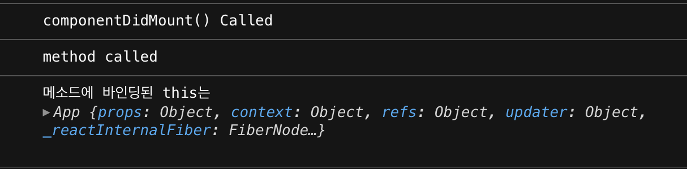
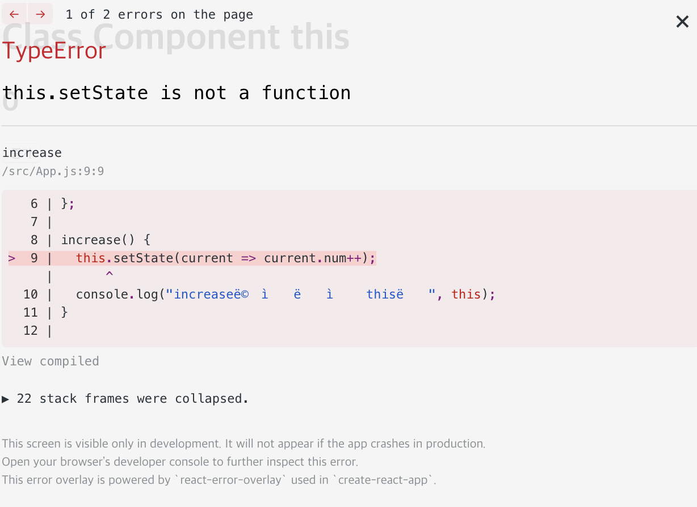
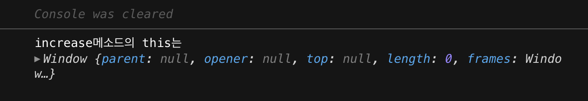

리액트 클래스 컴포넌트를 작성할때는 `this`를 신경써야 합니다. 여러 리액트 튜토리얼을 따라해 보면 상태값(state)나 속성값(props), 컴포넌트에 선언한 메서드를 참조하기 위해 `this`를 사용하고 있음을 직관적으로 이해할 수 있습니다. 이 포스팅에서는 컴포넌트를 이루는 프로퍼티들의 `this` 바인딩이 정확히 어떤지에 대해 정리해봅니다. 
<!–-break-–> 
{: .lead}

## 컴포넌트 안에서 this로 참조할 수 있는 프로퍼티들 
1. state (+setState)
2. props
3. refs
4. 컴포넌트 메서드 ⇒ 이벤트 핸들링시 예외 발생
5. 생명주기 매서드

## 생명주기 메서드
먼저 생명주기 메서드의 `this`가 어디에 바인딩되는지 알아보겠습니다.

import React from "react";

class App extends React.Component {

  componentDidMount() {
    console.log("componentDidMount() Called");
    console.log("componentDidMount의 this는", this); //App
  }

  render() {
   console.log("render() Called");
   console.log("render()의 this는", this); //App
    return (
      

        <h1>Class Component this</h1>
      

    );
  }
}

export default App;


이렇게 클래스 컴포넌트를 만들고 실행해보면, 콘솔에 이렇게 찍히는 것을 알 수 있습니다([codesandbox](https://codesandbox.io/s/new)를 사용했습니다.)

생명주기 메서드의 this는 메서드를 호출한 **해당 컴포넌트**를 가리킵니다. `this`가 컴포넌트를 가리키고 있으니 컴포넌트 안에 선언한 다른 메서드도 생명주기 메서드 안에서 `this`를 사용하면 잘 불립니다. 

import React from "react";

class App extends React.Component {

  // 메서드 선언
  componentMethod() => {
    console.log("method called");
    console.log("메서드에 바인딩된 this는", this); //App
  };

  componentDidMount() {
    console.log("componentDidMount() Called");
    this.componentMethod();
  }

  render() {
    return (
      

        <h1>Class Component this</h1>
      

    );
  }
}

export default App;


이렇게 컴포넌트에서 선언한 메서드 역시 해당 컴포넌트가 `this`로 바인딩되어 있는 것으로 보입니다. 

## 컴포넌트 메서드 예외
컴포넌트에서 선언한 메서드들은 기본적으로 해당 컴포넌트를 this로 바인딩하고 있습니다. 하지만 **JSX 이벤트 핸들러의 콜백 함수**로 컴포넌트에서 선언한 메서드를 전달할 때는 상황이 좀 달라지는데요. 화면의 버튼을 클릭하면 숫자가 증가하는 매우 간단한 리액트 앱을 짜보겠습니다.


import React from "react";

class App extends React.Component {
  // 상태값 num 선언
  state = {
    num: 0
  };

  // 버튼을 누르면 this.state.num을 1만큼 증가시킴
  increase() {
    this.setState(current => ({ num: current.num + 1 }));
    console.log("increase메서드의 this는", this);
  }

  render() {
    return (
      

        <h1>Class Component this</h1>
        <h2>{this.state.num}</h2>
	{/* 클릭 이벤트 핸들러의 콜백으로 컴포넌트 메서드 전달 */}
        <button onClick={this.increase}>증가</button>
      

    );
  }
}

export default App;


이렇게 `onClick` 이벤트의 인자로 `this`를 붙인 메서드를 그대로 넘기면 숫자가 증가하지 않고 `this.setState is not a function` **에러가 발생합니다.**

메서드가 실행될 때 바인딩된 `this`로 `setState()` 함수를 참조할 수 없기 때문입니다. 이상하죠. 아까 살펴봤던 것처럼 컴포넌트에서 선언한 메서드의 `this`는 해당 컴포넌트에 바인딩되어 있었으니, 그대로 그 `this`를 가지고 `setState()`함수를 참조할 수 있어야 할텐데요.

이유를 알아보기 위해 일단 에러의 원인이 되는 `setState()`행을 주석으로 처리 해보겠습니다.

increase() {
    // this.setState(current => ({ num: current.num + 1 }));
    console.log("increase메서드의 this는", this);
}

이렇게 하면 클릭 이벤트 발생 시 `increase()`메서드가 호출될때 `this`가 어디에 바인딩되어있는지 알 수 있습니다. 콘솔을 보시죠.

신기하게도 전역 객체인 `window`에 `this`가 바인딩되어 있습니다! 아까 컴포넌트에서 선언한 메소드의 `this`가 해당 컴포넌트에 바인딩되어 있었다는 것을 확인했는데도 말이죠. 왜 이런 일이 일어나는 걸까요?

이 포스팅에서 리액트 이벤트 핸들러의 정확한 동작을 뜯어보지는 않겠지만, 아마 아래와 같은 상황이 일어났으리라 추측해볼 수 있을 것 같습니다. 아래 선언한 클래스를 보시죠.


class App {
  constructor(state){
    this.state = state
  }
  
  showState(){
    console.log(this.state);
  }
}

const app = new App('num');
app.showState(); // num

const showState = app.showState; 
showState(); // TypeError: Cannot read property 'state' of undefined


클래스로 선언한 인스턴스에서 메서드를 호출하는 건 문제가 없지만, 메서드를 다른 변수에 옮겨 호출하면 TypeError가 발생합니다. **이는 메서드가 `this`를 잃어버렸기 때문입니다.** 인스턴스에 `.`을 붙여 클래스 메서드를 호출하면 `this`는 정상적으로 클래스에 바인딩되어 멤버변수인 `this.state`를 참조할 수 있게 됩니다. 하지만 다른 변수에 메서드를 할당해 호출하면 `this`는 원래 바인딩되어 있었던 클래스를 잃어버리고, 전역객체인 `windows` 혹은 `global`에 바인딩됩니다. 따라서 `this.state`도 참조할 수 없는 것이죠.

그렇다면 우리는 조심스럽게 리액트가 이벤트를 감지하고 콜백 함수를 호출하는 과정에서 **컴포넌트 메소드가 다른 변수에 할당되어 따로 호출되는 것과 상응하는 일**이 일어나 메소드가 기존의 `this` 바인딩인 상위 컴포넌트를 잃고 전역객체에 바인딩되었다고 추측할 수 있겠습니다. 그렇다면 이런 상황은 어떻게 해결할까요?

### 해결방안 1) bind()
`Function`객체의 메서드인 `bind()`는 어떤 함수의 `this`를 명시하는 역할을 합니다. 이 메서드가 호출되면 인자로 받은 객체를 함수의 this로 하는 새로운 함수를 리턴합니다. `Constructor()`에 작성하거나, 이벤트 핸들러의 인자로 `bind()`를 호출한 메서드를 넘깁니다.

render() {
    return (
      

        <h1>Class Component this</h1>
        <h2>{this.state.num}</h2>
        {/* 기존 increase메소드에 render()의 this인 App을 바인딩함 */}
        {/* this를 명시적으로 작성해줬기 때문에 this를 잃어버릴 일이 없음 */}
        <button onClick={this.increase.bind(this)}>증가</button>
      

    );
  }


### 해결방안 2) 화살표 함수
화살표 함수는 다른 함수와 달리 따로 `this`를 가지고 있지 않고, 항상 상위 스코프의 `this`에 바인딩합니다. (이걸 `lexical this`라고 한다네요.) 이벤트 핸들러의 인자로 넘긴 화살표 함수는 상위 스코프인 `render()` 메서드의 `this`인 `App`을 바인딩하고, 컴포넌트 메소드를 리턴하는데 이때 컴포넌트 메소드 앞에 붙는 `this`는 화살표 함수의 `this`, 즉 `App`을 가리킵니다. 

render() {
    return (
      

        <h1>Class Component this</h1>
        <h2>{this.state.num}</h2>
        {/* 컴포넌트 메소드 앞에 붙는 요 this는 App을 가리킨다*/}
        <button onClick={() => this.increase()}>증가</button>
      

    );
  }


## 함수형 컴포넌트의 this
함수형 컴포넌트에서의 `this`는 클래스형 컴포넌트에서만큼 중요하지 않습니다.


import React, {useState} from "react";

function App() {
  const [num, setNumber] = useState(0);

  const increase = () => {
    setNumber(num+1);
    console.log("increase메소드의 this는", this); //window
  }

  return (
    

      <h1>Class Component this</h1>
      <h2>{num}</h2>
	{/* 딱히 뭘 해줄 필요가 없다! */}
      <button onClick={increase}>증가</button>
    

  );
}

export default App;

일단 함수형 컴포넌트의 상태값은 `useState`훅으로 관리되기 때문에 컴포넌트의 `this`로부터 자유롭습니다. 또한 함수형 컴포넌트 자체와 함수형 컴포넌트 안에서 선언한 함수들 모두 전역 객체를 `this`로 가지기 때문에 **애초에 `this`가 다 같습니다.** 그래서 이벤트 핸들러에 콜백 함수를 넘기는 상황에도 딱히 신경 쓸 필요가 없습니다.

함수형 컴포넌트는 클래스형 컴포넌트보다 눈으로 보기에 **자연스러운 로직**을 가지고 있는 것 같습니다. 클래스형 컴포넌트들은 생성, 갱신될때 생명주기 메소드가 실행되는데, 이 메소드들은 컴포넌트에 명시하지 않아도 자동으로 실행됩니다. 이런 구조는 어쩌면 명시적이지 않습니다. 

하지만 함수형 컴포넌트는 [훅을 포함해서](https://ko.reactjs.org/docs/hooks-rules.html) 함수형 컴포넌트 내에 선언한 함수나 변수들이 순서대로 작동하고, `this`바인딩을 신경 쓸 필요도 없습니다. 클래스형 컴포넌트보다 명시적인 구조를 가지고 있다는 생각이 드네요.

## reference
- [This is why we need to bind event handlers in Class Components in React](https://www.freecodecamp.org/news/this-is-why-we-need-to-bind-event-handlers-in-class-components-in-react-f7ea1a6f93eb/)
- [mdn - Function.prototype.bind()](https://developer.mozilla.org/ko/docs/Web/JavaScript/Reference/Global_Objects/Function/bind)