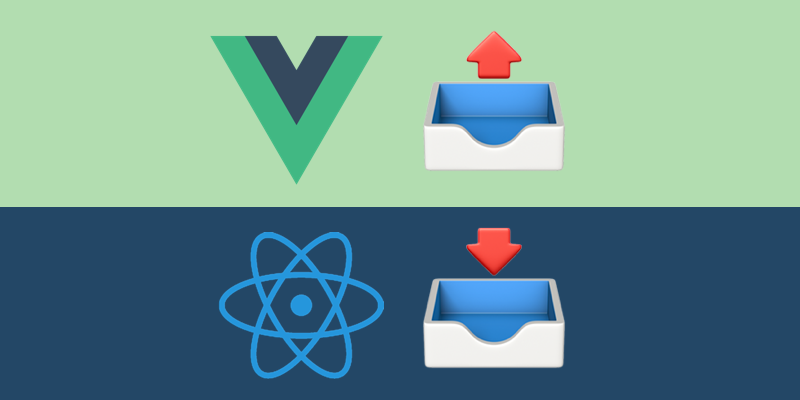

React에서 상위 컴포넌트의 state를 하위 컴포넌트에서 수정하기 위해서는 해당 state를 수정하는 함수를 상위 컴포넌트에서 함께 props로 넘겨야 합니다. **이 방식이 Vue에서도 가능할지 궁금했습니다.** Vue에서는 하위 컴포넌트에서 event를  발생(emit)시키고 상위 컴포넌트에서 이를 감지해 특정 로직을 수행하는 방법을 사용하죠. <!–-break-–>이 포스팅에서는 React.js의 function props와 Vue.js의 event emit이라는 두 상위 컴포넌트 데이터 업데이트 방식을 비교해볼까 합니다.
{: .lead}

## React의 경우 : function props

Vue와 React를 이용하여 화면에 숫자, 그리고 숫자를 증가시키는 버튼을 띄우는 간단한 앱을 만들어 보겠습니다. React의 경우에는 서두에서 언급했듯 해당 state를 수정하는 함수를 상위 컴포넌트에서 props로 넘겨야 합니다.


// 상위, 하위 컴포넌트를 한 .js 파일에 같이 구현

import React, {useState} from 'react'

function App() {
  const [count, setCount] = useState(0)

  const increaseCount = () => {
    setCount(count + 1)
  }
  return <ShowCount count={count} increaseCount={increaseCount} />
}

function ShowCount({count, increaseCount}) {
  return (
    

      
{count}

      <button onClick={increaseCount}>누르면 증가</button>
    

  )
}


## Vue의 경우 : event emit

Vue의 경우에는 똑같은 로직을 event emit으로 처리할 수 있습니다. 하위 컴포넌트에서 `this.$emit('increase')` 로 이벤트를 발생시키고 상위 컴포넌트에서 이를 `@increase` 이벤트 핸들러로 잡아주고 메서드를 실행합니다. 이때 `@`는 `v-on` 디렉티브의 축약형입니다.



<template>
  <!-- 상위 컴포넌트 app.vue -->
  

    <!-- 하위 컴포넌트에서 발생하는 이벤트 등록(increase) -->
    <ShowCount :count="this.count" @increase="increaseCount"/>
  

</template>





<template>
<!-- 하위 컴포넌트 showCount.vue -->
  

    
{{ count }}

    <button @click="increaseEventEmit">누르면 증가</button>
  

</template>



## Vue에서의 function props

Vue에서도 리액트에서처럼 함수를 props으로 넘겨 상위 컴포넌트의 데이터를 수정할 수 있는지 보겠습니다. 아래와 같이 코드를 바꿔보겠습니다. increasement 이벤트 핸들러는 `increseCount`라는 prop을 내려주는 `v-bind`로 바꿉니다. `:`는 축약형입니다. 


<template>
  

    <!-- v-on bind로 함수를 넘겨줌  -->
    <ShowCount :count="this.count" :increaseCount="this.increaseCount"/>
  

</template>



그리고 하위 컴포넌트의 props 객체에 increaseCount을 함수로 지정하고 버튼을 클릭했을 때 props로 받은 increaseCount를 호출하도록 수정합니다.


<template>
  

    
{{ count }}

    <button @click="increaseCount">누르면 증가</button>
  

</template>



어떤가요? 아까 event emit을 사용했던 코드와 똑같이 잘 작동합니다. Vue에서도 function props는 잘 작동하네요!

## 쓰면 안 될까?

Vue에서 function props가 잘 작동한다는 것을 알게 되었습니다. 그렇다면 이게 Vue의 안티패턴일까요? 그렇게 말할 수 있는 충분한 근거를 찾지는 못했습니다. 다만 아래와 같은 의견이 존재하기는 합니다.

1. event emit이 브라우저가 이벤트를 감지해내는 동작과 비슷하고 이것은 Vue 설계의 취지이니 이걸 존중해서 Vue에서 function props를 안티패턴으로 생각하고 event emit을 사용해야 한다는 의견(Vue의 이벤트 핸들러는 브라우저의 이벤트와 event emit으로 개발자가 만들어낸 이벤트를 모두 `v-on` 디렉티브로 처리합니다.) [(관련 포스팅)](https://michaelnthiessen.com/pass-function-as-prop/)

2. 한 컴포넌트 여러번 재사용하는 경우, 그 컴포넌트에 일일히 함수를 prop으로 넘기는 것 보다 event emit을 이용하는게 더 깔끔하다는 의견 [(관련 포스팅)](https://medium.com/js-dojo/using-react-style-callback-props-with-vue-pros-and-cons-e0ee7455695b)

 저는 둘 다 잘 모르겠습니다. 첫 번째 의견은 일리가 있지만 function props를 쓰지 말자는 충분한 근거가 되지 못합니다. 두 번째 의견은 props로 함수를 넘겨주는 것과 해당 컴포넌트에 이벤트를 바인딩 해주는 것 사이에 유의미한 코드 수나 가독성 차이가 생기지 않는 것 같아서 잘 모르겠습니다. 물론 두 방식을 섞어쓰는 것 보다는 하나만 쓰는게 낫겠지만요. 판단은 유보하고, 두 방식의 확실한 차이점을 알아보며 포스팅을 마무리하려 합니다. 

### React와 Vue 컴포넌트간 통신 방식 차이

Vue에서는 props와 event emit으로 컴포넌트간 양방향 통신이 가능합니다. React에는 props만 있으니 상위에서 하위로 내려가는 단방향 통신만 가능하죠. 

### 컴포넌트간 의존 차이

두 방식 각각은 데이터를 업데이트할 책임이 어떤 컴포넌트에 있는지를 결정합니다. event emit의 경우 하위 컴포넌트가 상위 컴포넌트에 데이터를 업데이트해야 한다는 사실을 알려주는 역할만 하고 실질적인 업데이트는 상위 컴포넌트에서 이루어집니다. props는 데이터를 변경할 수 있는 로직을 아예 하위 컴포넌트에 전달했으니 data 업데이트도 하위 컴포넌트에서 이루어진다고 할 수 있습니다. 

따라서 event emit은 컴포넌트의 특정 데이터와 관련있는 로직들이 해당 컴포넌트에만 존재하고 수행될 수 있게 만듭니다. 이것은 컴포넌트들이 다른 컴포넌트에 덜 의존하게 만들죠. Vue 공식 문서에서 event emit을 설명하는 다음과 같은 [구절](https://kr.vuejs.org/v2/guide/components.html)이 있는데요. 이게 아마 event emit의 설계 이유가 아닐까 생각해봅니다. 

> 이 예제(event emit)에서는 하위 컴포넌트가 외부에서 발생 하는 것과 완전히 분리 된다는 점에 유의해야 합니다. 부모 컴포넌트가 신경 쓸 수 있는 경우를 대비하여 자체 활동에 대한 정보를 보고 하는 것뿐입니다.

## Reference

- [How to Pass a Function as a Prop in Vue](https://michaelnthiessen.com/pass-function-as-prop/)
- [Using React-Style Callback Props With Vue: Pros and Cons](https://medium.com/js-dojo/using-react-style-callback-props-with-vue-pros-and-cons-e0ee7455695b)
- [Passing methods as props in Vue.js](https://medium.com/front-end-weekly/passing-methods-as-props-in-vue-js-d65805bccee)