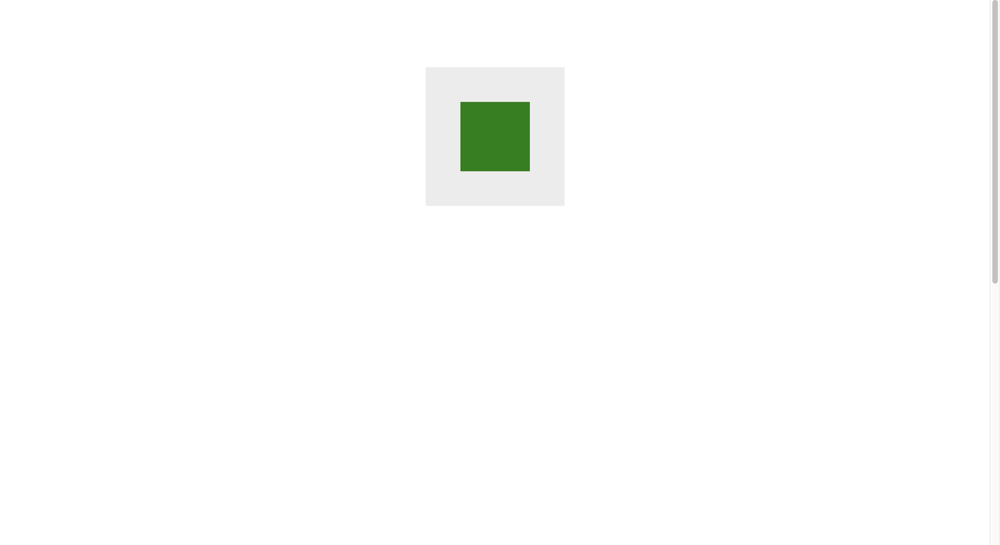
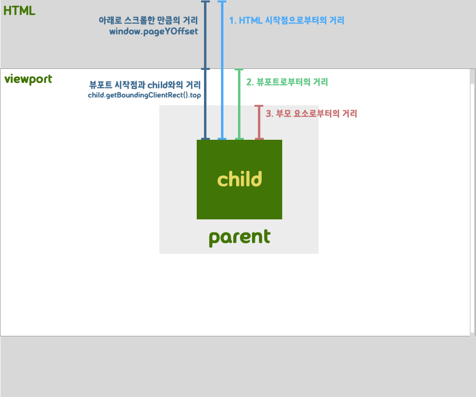
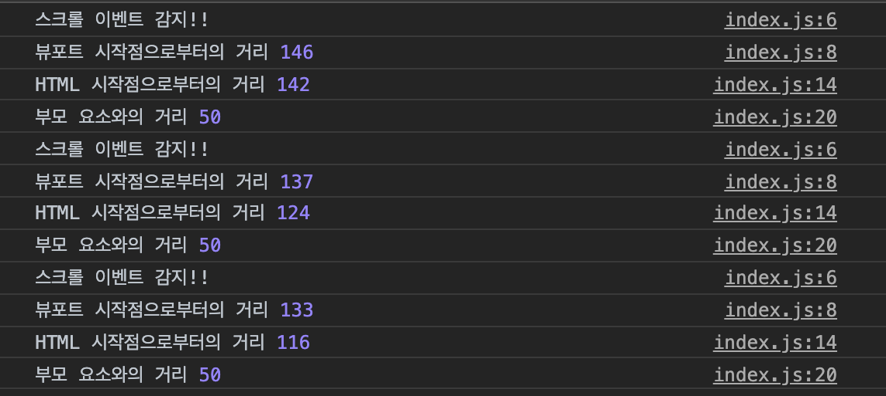

이 포스팅에서는 DOM요소의 수직 좌표를 얻는 법에 대해 알아보겠습니다. 프론트엔드 라이브러리를 사용하여 앱을 만들다 보니, DOM을 자꾸 잊어버리는 것 같아 복습 중입니다. 앱의 기능을 구현하면서 특정 이벤트가 발생하면 스크롤바를 특정 엘리멘트의 위치로 이동시켜야 할 때가 있는데요. <!–-break-–>좌표 구하는 법을 외우지 못해서 관련 기능을 만들 때 마다 구글링을 하는 것 같아 아예 포스팅을 작성해보려 합니다.
{: .lead}
## 수직상의 위치

수평 스크롤과 요소의 x축 좌표는 개발에 쓰이는 일이 많지는 않습니다. 유저가 화면을 아래로 스크롤하며 웹과 상호작용하는 것이 보통이기 때문이죠. 따라서 아래로 스크롤할 때마다 달라지는, 혹은 달라지지 않는 DOM 요소의 y축 좌표에 대해 이야기해보고자 합니다. 간단한 마크업부터 작성해보겠습니다.


<!DOCTYPE html>
<html lang="en">
  <head>
    <meta charset="UTF-8" />
    <meta name="viewport" content="width=device-width, initial-scale=1.0" />
    <title>스크롤과 위치</title>
    
  </head>
  <body>
    

      

    

    

    
  </body>
</html>

이렇게 작성하면 다음과 같이 화면이 나옵니다. 녹색 사각형이 child 요소이고, 회색 사각형이 parent 요소입니다.

녹색 사각형의 y좌표를 구해볼텐데요. 구하는 방식이 기준에 따라 다릅니다. 그림으로 설명해 보겠습니다.

뷰포트는 브라우저에서 사용자에게 화면을 보여주는 범위입니다. 보여주는 HTML 전체는 뷰포트보다 클 수 있습니다. 스크롤을 하면 웹페이지의 일부가 뷰포트 밖으로 사라지니까요. 따라서 child 요소는 좌표값을 여러개 갖습니다. HTML시작점 기준, 뷰포트의 시작점 기준, 부묘 요소의 시작점 기준으로 요소의 y좌표를 구할 수 있습니다.

### 관련 API

좌표를 얻기 위해 사용할 DOM API는 다음과 같이 2가지입니다.

- `element.getBoundingClientRect()` : 뷰포트를 이루는 가장자리와 element와의 거리 정보를 가지고 있는 객체를 리턴하는 메소드입니다. 반환하는 객체에는 top, bottom, left, right 프로퍼티가 있는데 이게 각각 뷰포트와의 방향별 거리를 의미합니다.
- `window.pageYOffset` : 수직 방향으로 얼마나 스크롤했는지 픽셀 단위로 알려주는 window의 속성입니다. `window.scrollY`와 같은 값을 가집니다.

## 위치 시작점에 따른 거리 구하기

### 1. HTML 시작점


// 수직으로 스크롤한 정도 + 뷰포트와의 거리 
const distanceFromHtml = child.getBoundingClientRect().top + window.pageYOffset


### 2. 뷰포트 


// 뷰포트와의 거리  
const distanceFromViewport = child.getBoundingClientRect().top


### 3. 부모 요소 


// 부모요소 뷰포트까지의 거리 - 자식요소 뷰포트까지의 거리  
// 이 값은 스크롤에 상관없이 항상 같습니다.
const distanceBetweenParentAndChild = child.getBoundingClientRect().top - parent.getBoundingClientRect().top


### 결과 확인하기

같은 디렉토리에 index.js를 만들고, 다음과 같이 코드를 작성한 후 저장해줍니다. 


window.onload = () => {
  const parent = document.querySelector(".parent");
  const child = document.querySelector(".child");

  // 스크롤 이벤트를 감지하는 이벤트 리스너를 만들어줍니다.
  window.addEventListener("scroll", function () {

    console.log("스크롤 이벤트 감지!!");

    // 뷰포트 시작점과의 거리
    const distanceFromHtml = child.getBoundingClientRect().top + window.pageYOffset

    // HTML 시작점으로부터의 거리
    const distanceFromViewport = child.getBoundingClientRect().top

    // 부모 요소와의 거리
    const distanceBetweenParentAndChild = child.getBoundingClientRect().top - parent.getBoundingClientRect().top
    
    console.log("뷰포트 시작점으로부터의 거리",distanceFromViewport);
    console.log("HTML 시작점으로부터의 거리",distanceFromHtml);
    console.log("부모 요소와의 거리",distanceBetweenParentAndChild);
  });
};


스크롤바를 밑으로 내림에 따라 child요소의 y좌표와 변하지 않는 부모 요소와의 거리가 픽셀 단위로 콘솔에 찍히는 모습을 볼 수 있습니다. 

## 스크롤 API

DOM 요소의 수직 위치를 알아내는 방법을 알아봤습니다. 그렇다면 그 위치를 토대로 스크롤바를 움직이고 싶다면 어떻게 할까요? 크게는 scrollTo와 scrollBy 정도를 알고 있으면 될 것 같습니다.

- window.scrollTo(x좌표, y좌표) : 문서의 지정된 위치로 스크롤
- window.scrollBy(x좌표, y좌표) : 현재 스크롤 위치에서 x, y 만큼 더 스크롤

## Refernce
- [개발자로 홀로 서기 - 요소의 상대좌표 절대좌표 구하기](https://mommoo.tistory.com/85)
- [MDN - element.getBoundingClientRect()](https://developer.mozilla.org/en-US/docs/Web/API/Element/getBoundingClientRect)
- [MDN - window.scroll()](https://developer.mozilla.org/en-US/docs/Web/API/Element/getBoundingClientRect)