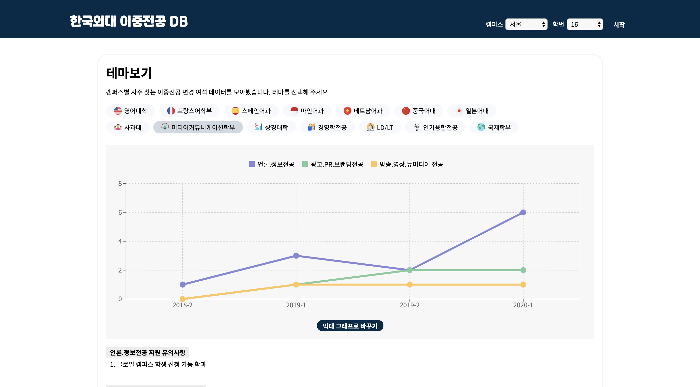

이 포스팅은 제가 재학 중인 대학교를 다니는 학생들을 타겟으로 한 서비스에 대한 간단한 회고글입니다. 프로젝트를 소개하고, 학교 단위로 작은 서비스를 만드는 개인 프로젝트을 진행하면서 깨달은 점이나 어떻게 하면 더 잘할 수 있을지 생각해본 지점들을 적어보려 합니다. <!–-break-–>
{: .lead} 

## ✌🏻 두 개의 프로젝트

올해 3월에 크롬 확장앱 외대 종강시계, 5월에 외대 이중전공 DB 웹 서비스를 만들었고, 학교 커뮤니티에 홍보했습니다. 간단하게 프로젝트에 대해서 설명해볼게요!

### 외대 종강시계

[외대 종강시계](https://github.com/MaxKim-J/HUFS-Semester-Clock-Extension)는 새로운 탭을 만들때마다 나타나는 new tab 테마 크롬 확장앱입니다. 종강까지의 남은 시간, 대학 입학일로부터 얼마나 지났는지를 기본적으로 보여줍니다. 배경화면을 커스텀할 수 있는 기능과 학사 공지사항과 학교 주변 날씨를 조회할 수 있는 편의기능도 제공하고 있습니다. 

### 한국외대 이중전공 DB

[한국외대 이중전공 DB](https://github.com/MaxKim-J/HUFS-Second-Major-Visualize)는 외대 학생들에게 이중전공 변경에 필요한 데이터를 정리하고 시각화하여 제공하는 웹서비스입니다. 한국외대같은 경우는 이중전공 혹은 부전공이 필수인데요, 매 학기마다 이중전공을 변경하거나 신청할 수 있습니다. 매 학기마다 학사 공지사항에 이중전공 학과별 여석이 기록된 엑셀 파일이 올라오는데요, 이 엑셀 파일을 그래프를 통해 쉽게 조회할 수 있는 웹 서비스입니다. 

### 성과

외대 종강시계 크롬 확장앱은 현재 약 190분의 유저가 계속 사용하고 있습니다. 이중전공 DB의 경우는 5월 런칭 후 약 1000이 조금 넘는 페이지뷰를 기록했네요. 둘 다 학교 커뮤니티에서는 좋은 반응을 얻었습니다...! 엄청 대단한 트래픽은 아닙니다만 제 앱을 써주시는 분들이 계속 있다는 걸 생각하면, 책임감있게 유지보수를 계속 해야겠다는 생각이 듭니다!

다음으로 왜 학교 유저들을 대상으로 하는 서비스를 만들었는지, 어떻게 프로젝트 기획과 개발에 접근했는지에 대해서 이야기해보려 합니다. 이런 학교 단위 프로젝트를 진행하는 것에 대한 장단점도요!

## 🏃🏻 접근법

### "없던" 서비스 기획하기

학교는 특수성이 존재하는 작은 사회입니다. 학교를 구성하는 구성원들은 다른 보통 유저와 차별되는 니즈가 존재하죠. 하지만 일반 유저들의 그룹보단 그 규모가 작기 때문에, 이윤을 추구하는 상업적인 프로덕트를 만들기에는 수지타산이 맞지 않습니다. 즉, 학교 구성원들의 특수하고 작은 니즈들을 충족시켜줄 프로덕트는 자주 만들어지지 않습니다. 그래서 서비스를 만들 수 있는 개발자의 측면에서 보면, 학교는 기회의 땅이죠. 작지만 어느정도의 유저들의 니즈를 충족시켜줄 수 있는, "정말 쓰이는" 앱을 만들 수 있어 트래픽을 유치할 수 있습니다. 클론 코딩이나 튜토리얼로는 얻을 수 없는 경험이죠. 

그렇다면 무엇을 만들어야 할까요? 개발자 본인이 학교의 구성원이라면 생각하기도 쉽습니다. 개발자 본인의 불편이 곧 학생들, 유저들의 불편이니까요. 개발자가 학교의 유저들이 원하는 그 특수한 니즈에 접근하기 쉽습니다. 제 프로젝트를 예로 들어 보면, 외대 이중전공 DB가 해결하는 불편은 저의 불편이기도 했습니다. 저는 과거에 다른 이중전공을 이수하고 있었는데, 소프트웨어 융합 전공으로 변경하고 싶었어요. 그래서 학사 공지에 있는 3학기의 이중전공 변경 여석 정보를 대조하면서 이번 학기에 자리가 날지 계산해보고 있었습니다. 그런데 그 엑셀파일의 가독성이 정말 좋지 못해서, 이걸 그래프로 그려서 한 눈에 볼 수 있게 하면 좋을 것 같다는 생각이 들더군요. 게다가 저의 불편만은 아니라는 생각이 들었습니다. 그렇게 앱을 만들게 되었죠.

### 부족해도 빨리 런칭하기

개인 프로젝트를 통해 그동안 써보지 않은 기술들을 사용해보고 싶었습니다. 동시에 처음 접하는 기술들로 완성도가 있는 서비스로 만들 수 있을지에 대한 의문이 깊었습니다. 최대한 완벽한 상태로 앱을 런칭하고 싶었지만, 당시에는 학기중이었고 개인 프로젝트를 하면서도 일정에 쫓기기는 싫었습니다. 그래서 빨리 런칭과 홍보를 하고, 피드백을 받아서 앱을 고쳐 나가기로 했습니다. 빠른 배포 주기 때문에 앱이 항상 완벽하지는 못했고, 배포를 막상 해보고 "이걸 왜 여기서 안 고쳤지" 후회하는 경우도 꽤 많았습니다. 그래도 피드백을 많이 받을 수 있고 점점 완성도를 갖추게 되었습니다. 유저가 규모가 적고, 이윤을 위해 서비스를 하는게 아니라서 앱의 버그나 오류들이 엄청난 손실을 가져오지 않아 가능한 일이 아닐까 생각해봅니다. 

## 👍🏻 장점

### 홍보가 비교적 쉽고, 초기에 유저가 쉽게 증가한다

개발자 역시 학교의 학생이기 때문에, 학생들에게 효과적인 홍보 채널 역시 잘 알고 있습니다. 학교 학생들에게만 접근 권한이 있는 커뮤니티에 접근할 수도 있고요. 게다가 학생들에게 도움이 되는 새로운 뭔가를 만들었다는 홍보는 커뮤니티에서 꽤 주목을 받습니다. 외대 종강시계의 런칭을 처음으로 홍보하는 글은 학교 커뮤니티의 베스트 게시판에 이주 정도 있었던 것 같네요. 그래서 유저 역시 초기에 수월하게 증가합니다. 물론 초기에 유치한 유저들을 잃지 않기 위해서는 지속적인 유지보수와 확장이 필요합니다. 작은 서비스이기 때문에 유저들은 앱의 결함을 마주하거나 크게 필요가 없다고 조금이라도 느끼면 쉽게 떠날 수 있기 때문이죠. 

### 유저들로부터 피드백을 받을 수 있다

서비스에서 트래픽이 조금이라도 발생해야 개발자는 유저의 입장에서 생각해볼 수 있습니다. 혹은 유저들이 적극적으로 피드백을 줄 수도 있고요. 이게 앱을 계속 유지보수 할 수 있게 하는 동기부여가 됩니다. 외대 종강시계를 처음 런칭했을 때, 스스로 꽤 완성도가 있는 서비스라고 생각했습니다. 하지만 앱에 띄워놓은 이메일 주소를 통해 많은 분들이 앱에 대해 지적을 많이 하셨어요. 유저분들의 피드백에는 오타, 제가 사용하지 않는 운영체제에서 발생하는 버그에 대한 정보가 있었습니다. 같은 학교의 다른 캠퍼스를 다니는 유저분들이 정보 표기를 지적하시기도 했는데, 저는 이전에 알기 힘든 것이었죠. 유저분들의 여러 피드백을 통해 외대 종강시계는 더욱 완성도 있는 앱으로 바뀔 수 있었습니다.

## 👎🏻 단점

### 지속적인 홍보는 힘들 수도 있다

학교 커뮤니티 위주의 홍보 방식은 한계가 있습니다. 처음에야 앱에 사람들이 호응을 많이 해주지, 점점 다른 게시물을 올리고 홍보를 해도 관심도가 점점 떨어지는게 눈으로 보이기 때문입니다. 커뮤니티에 특정 공간을 확보한 것도 아닌데 게시판에 계속 글을 올리는 것도 사실 민망한 일일 수도 있고요. 여기서 서비스가 학교 커뮤니티 홍보에 의존을 멈추고, 양적으로 더 성장하기 위해서는 입소문을 타야 한다고 생각합니다. 학교 강의실에서 만난 학생들이 제가 만든 서비스를 쓰는 친구를 보고 따라서 설치하거나... 그런 일이 많이 일어나야 한다는 말이죠. 하지만 요즘은 코로나 바이러스로 인한 비대면 수업으로 기대하기가 힘들게 되었습니다....😿 

### 기능 확장에 한계가 있다

학교 유저들의 니즈는 확실하지만, 그렇게 다양하지는 않습니다. 그래서 어떤 문제를 해결하는 앱을 만들면, 원래 기능의 취지를 확장하여 계속 기능을 추가하기가 어렵습니다. 이중전공 DB같은 경우가 그렇습니다. 어찌보면 이중전공 관련 데이터를 그래프로 제공한다는 확실한 기능을 제공하고 있지만, 딱히 이 서비스가 해결할 수 있는 문제는 더 없는 것이죠. 그렇다고 아예 다른 기능을 개발해 붙이면 앱의 취지에 맞지 않고 이질감이 드니까 좋지 못하고요. 기획 단계에서 앱이 어떻게 확장될 수 있는지, 어떤 기능을 중장기적으로 추가할 수 있을지 곰곰히 생각해보면 좋을 것 같습니다. 

## 😎 취하면 좋은 자세

이런 생각을 가지고 학교에서 개인 프로젝트를 진행하면 좋을 것 같아요.

### 착각 주도 개발을 멈추고 일단 (좋은) 앱을 만들자

저는 개발자 이동욱님이 블로그에 포스팅하셨던 글 중에 있는 표현인 [착각 주도 개발](https://jojoldu.tistory.com/496)이라는 말을 좋아합니다. 뭔가 본인이 만든게 엄청 흥할 거 같아서 지레 설레는(?) 현상입니다. 이거 만들었는데 아이디어 너무 좋다. 너무 잘되서 서버비 너무 많이 나오면 어쩌지? 이런 생각(착각)들 말이죠. 저도 프로젝트 진행하면서 그런 생각 진짜 많이 했거든요. 하지만 그런 일은 잘 일어나지 않습니다(팩트). 그러니까 일단 만들어 보고, 성과를 측정해보면 좋을 것 같아요. 진짜 잘 되면 그때 생각해봐도 늦지 않습니다. 

엄청 당연한 말인데 좋은 앱은, 불편함을 효과적으로 해결하는 앱은 계속 유저가 찾습니다. 프로젝트들을 시작하기 전에 학교에서 학생이 개발한 앱을 좀 찾아봤었는데, 업데이트가 중단된 것도 있었어요. 좋은 앱은 업데이트가 중단되더라도 앱 스토어 댓글에서라도 "왜 중단됐나요ㅜㅜ 다시 해주세요ㅜㅜ" 이런 댓글을 쉽게 찾아볼 수 있었습니다. 그런 앱을 만드는 걸 목표로 삼았습니다. 

### 부담을 가져보자

저한테 전적으로 유지보수 책임이 있으면서, 실제로 유저가 사용하는 앱은 만들어본 적이 없었습니다. 프로젝트의 시작도 사실은 유저들의 불편을 해결하는 것 보다는 개인 프로젝트를 한 번 진지하게 하고 싶었던 이유가 더 컸고요. 하지만 런칭하고, 유저들이 얼마나 쓰는지 성과를 측정하니까 부담을 가질 수 밖에 없었습니다. 제 이름을 걸고 만든 앱인데, 유저들이 앱을 사용하면서 불편함을 느끼거나 하는 일은 없었으면 좋겠더라고요. 제 앱을 통해 더 효용을 많이 느꼈으면도 싶었고요. 회사에 근무해봤거나, 주도적으로 프로덕트를 빌드해본 경험이 없는 분들은 학교 안에서 진행하는 프로젝트를 통해 프로덕트에 대한 부담과 책임감을 느낄 수 있을 것 같습니다. 버전 하나 하나를 올리는데도 신중해지고, 빨리 해결하고 싶어서 조바심내는 자신을 보면서 조금 더 좋은 개발자가 되지 않았나 생각합니다.
