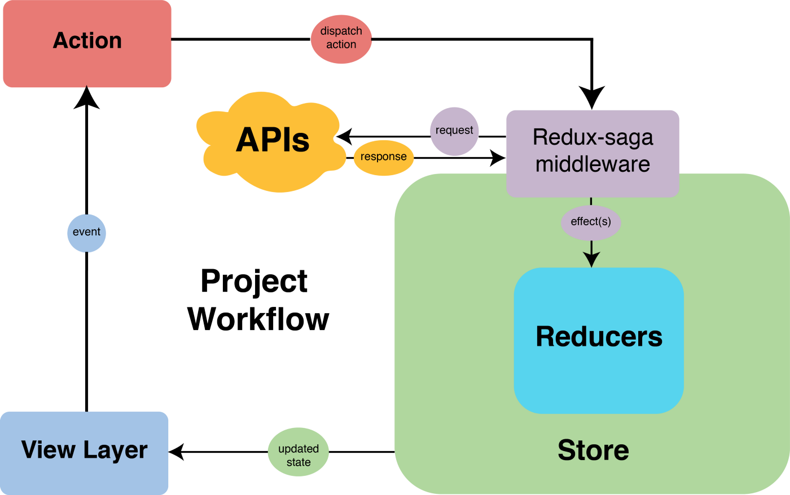

Redux에서의 비동기 로직 작성을 가능하게 해주는 Redux Saga가 **참 잘 쓰기 힘든** 기술이라는 생각을 많이 합니다. Saga에 대한 생각도 자주 바뀌었습니다. Saga를 배우고 조금 사용해본 시점에서는 비동기로 불러온 값들을 지금 쓸 것도 아닌데 왜 굳이 다 저장하고, 상태를 하나하나 매겨야 하나 이해를 하지 못하고 Saga를 쓰기 위한 타이핑이 쓸데없이 많다는 생각을 가지고 있었습니다.<!–-break-–>

프로덕션 레벨의 제품을 만져보고 나서 Saga가 좋은 구조를 가진, 예측 가능한 웹앱을 만드는데 도움을 줄 수 있다는 깨달음을 얻었습니다. 그 이후에 Saga를 잘 활용해보고 싶었지만 예기치 않은 난관에 부닥치는 경우가 많아 잘 사용하는데 실패한 경험이 많은 것 같습니다.

이번 포스팅에서는 Saga를 잘 쓰는 법에 대한 고민과 생각의 결과를 정리합니다. Saga와 관련해 몇가지 생각할 거리들을 놓고 글을 써볼 예정입니다.

> Redux+Saga가 무엇인지 설명하는 글은 아닙니다. Redux+Saga를 프로젝트에 적용해보셨거나, 지식이 있는 상태로 읽으시면 좋습니다!

## 꼭... 그렇게... 서버에서 받는 데이터를 모두 모아놓아야 하나?


store 만들기 => action 선언하기 => action, payload 리턴하는 함수 만들기 => reducer 함수 만들기
=> 비동기 로직이라면 이 과정 \* 3(fetch,success,failure) => store에 비동기 데이터 저장하는 Saga 작성하기
=> 컴포넌트에서 사용하기


솔직히 말하면 이 과정이 쓸데없는 낭비라고 생각했던 적이 있습니다. **왜 지금 쓸 것도 아닌데 비동기 데이터를 전부 redux store에 모아두는 거지?** 그냥 컴포넌트단에서 async await 하면 되는데... 타이핑은 왜 이렇게 많지? 하지만 이것은 너무 나이브한 생각이었던 것입니다.

비즈니스 로직과 UI로직은 분리할수록 좋습니다. 컴포넌트에서 직접 async/await 문법을 통해 데이터를 패칭하는게 간편한 방법으로 보이긴 합니다. 하지만 많이 쓸수록 컴포넌트에 비즈니스 로직이 직접 의존하는 경우가 많아지고, 얽히고 섥혀서 UI를 수정하기 위해 비즈니스 로직을 같이 건드려야 하거나 그 반대의 경우도 생길 수 있습니다.

앱의 크기가 작다면 로직이 섞여서 발생하는 복잡성을 충분히 처리할 수도 있겠지만, 꽤 큰 앱의 경우에는 이렇게 로직이 섞였을 경우 유지보수가 점점 힘들어집니다.

소프트웨어 아키텍처의 고전인, [클린 아키텍처](http://www.yes24.com/Product/Goods/77283734) 에서도 주장하는 것이, 웹이나 모바일 앱 등의 클라이언트는 크게 중요하지 않아 관련된 의사결정을 미룰 수도 있는 **부수사항**일 뿐이라는 것입니다.

UI를 실질적으로 채우는 데이터를 다루는 로직들은 앱의 **중심, 즉 코어를 이룹니다**. 데이터와 관련된 로직인 이 코어를 그대로 둔 채, 클라이언트는 얼마든지 바꿔 끼울 수 있습니다. 그리고 Redux + Saga는 이러한 앱의 코어가 아래 그림처럼 UI로직과는 확실히 분리된 채로 작동할 수 있도록 만드는 도구입니다.

이 외에 Redux + Saga를 사용할때 얻을 수 있다고 생각하는 장점은 다음과 같습니다.

- **비동기 API 호출의 재사용성 극대화** : 프론트엔드 개발을 진행하다보면 초기 계획과는 완전 다르게, 주로 백엔드 API의 생김새 때문에 정말 생각지도 못한 곳에서 생각지도 못한 데이터가 필요할 수도 있습니다. 이때 async await로 비동기를 컴포넌트 단에 붙여서 처리하고 있었다면 똑같은 로직을 다른 컴포넌트에 한 번 더 써야하죠.
  - 서버도 처음부터 완성되있는 것은 아니기 때문에 어떤 response에서 UI에 필요한 모든 데이터를 보내주지는 못하는 경우도 종종 생깁니다. 작은 팀일수록 그런 상황에 부닥치기 쉬운데요.
  - 백엔드가 수정되기 전까지 프론트엔드에서는 다른 비동기 로직 호출을 통해 UI가 필요한 데이터를 적당히 때워(?) 줘야 하는 상황도 충분히 가능합니다. 웹앱의 여러 곳에서 특정한 데이터 패칭이 필요하면 필요할수록 Saga를 사용하기 위해 지출했던 비용에 상회하는 이득을 얻을 수 있다고 봅니다.
  - 물론 모든 API 호출 함수를 util을 모아놓듯 한 곳에 정리하는 방식으로 재사용하기 쉽게 만들수도 있어Redux+Saga만의 장점이라고 말하기엔 좀 애매하긴 합니다. 더 좋은 점이 있다면, Saga에서는 앱의 UI를 전역적으로 바꿀 수 있는 store의 상태까지 건드릴 수 있다는 것 정도겠습니다.
- **캐싱을 활용할 수 있는 여지** : 유저가 앱을 사용하는 흐름 안에서 store에 이미 데이터가 이미 있는 경우 굳이 fetch를 하지 않아도 되는 상황이 있습니다. store에 이런 식으로 데이터를 저장해 놓는다면, 불필요한 패칭을 하지 않는 방향으로 앱을 최적화할 수 있습니다.

물론 모든 앱에 Redux+Saga가 필요한 것은 아닙니다. 앱이 크지 않아 전역 상태를 활용할 여지가 많이 없고, 비동기 API를 많이 호출하지 않고, 컴포넌트 단에서 여러 유형의 예외처리를 해줘야 하는 것도 아니라면 Context API나 useReducer 같은 더 작은 상태관리 도구들을 사용하는게 바람직합니다. Redux+Saga는 **웹앱의 복잡함이 Redux+Saga의 복잡함을 상회할 때** 사용하면 좋다고 생각합니다.

## 너무나 많은 타이핑 줄이기

하나의 Saga 작성을 위해, 별다른 헬퍼 라이브러리를 쓰지 않는다면 대충 이 정도의 타이핑이 필요합니다.


// 1. redux module

// 액션 문자열
export const GET_DATA = 'data/GET_DATA' as const;
export const GET_DATA_SUCCESS = 'data/GET_DATA_SUCCESS' as const;
export const GET_DATA_FAIL = 'data/GET_DATA_FAIL' as const;

// 액션 반환 함수
export const getData = () => ({type:GET_DATA});
export const getDataSuccess = (data:Data) => ({type:GET_DATA_SUCCESS, payload:data});
export const getDataFAIL = (error:Error) => ({type:GET_DATA, payload:error});

// 초기 상태
const initialState:DataState = {
userData: Data,
status: 'success' | 'loading' | 'fail',
error: Error,
}

type DataAction =
| ReturnType<typeof getData>
| ReturnType<typeof getDataSuccess>
| ReturnType<typeof getDataFail>;

// 리듀서
export const dataReducer = (state:DataState = initalState, action:DataAction) => {
switch(action.type) {
case GET_DATA:
return {...state, status : 'loading' };
case GET_DATA_SUCCESS:
return {...state, userData: action.payload, status: 'success' };
case GET_DATA_FAIL:
return {...state, error:action.payload, status: 'fail'};
default:
return state;
}
}

export default dataReducer



// 2. saga

function\* getDataSaga(action) {
try {
const { data } = fetchData()
yield put(getDataSuccess({ data }));
} catch(error) {
yield put(getDataFail({ error }));
}
}

export function\* dataSaga() {
yield takeEvery(GET_DATA, getDataSaga);
}


위 예제에서는 타입 선언까지 모두 해주지는 않았고 대충 있는 타입을 이렇게 활용한다 정도 보여드렸습니다. TypeScript까지 하려면 여러개의 타입 선언도 더 필요하고요.

Saga + Redux는 타이핑이 정-말 많습니다. Saga의 존재감이 빛날 수 있을 정도의 규모를 가진 앱을 만든다고 해도, 어마무시한 타이핑 때문에 개발 과정에서 상당히 지칠 수 있습니다.

나름의 변호?를 하자면, 많은 타이핑은 Redux + Saga가 엄밀하고 정확하게 작동하는 데 기여합니다.

- Redux state의 변화는 오로지 action의 발행으로 일어납니다. 모든 액션은 사전에 정의되어야 하고, dispatch에 사용되는 action 리턴 함수 역시 사전에 정의되어야 해서 액션 관련한 타이핑이 많습니다. ⇒ **장점)모든 state 변화의 양상을 사전에 정의하여 예측 가능하며 부수효과 없는 상태관리를 가능하게 합니다**
- reducer는 모두 순수함수여야 하므로 불변성을 고려해서 작성되어야 하기 때문에 reducer 타이핑이 귀찮습니다. ⇒ **장점) state를 수정하는 reducer가 순수함수면 부수효과에서 자유롭고 테스트를 작성하기가 쉽습니다.**
- Saga는 Redux와는 별개인 미들웨어로 동작하기 때문에 추가적인 보일러 플레이트를 필요로 합니다. ⇒ **장점) Redux의 모든 상태변경은 순수해야하기 때문에 비동기 요청과 같은 불순한 로직들은 미들웨어단에서 따로 처리하는 것입니다. 부수효과를 불러일으킬 수 있는 불순한 비동기 로직이 Redux와 분리되므로 Redux의 상태를 더 믿을만하게 만듭니다.**

하지만...백번 양보해도 Redux+Saga 타이핑이 진짜 너무 많습니다. 개발 시작 단계에서 Saga와 Redux의 타이핑을 줄일 수 있는 계획을 가지고 있지 못하면, saga마다 반복되는 try/catch문 작성과 SUCCESS, FAILURE 액션 작성에 지친 나머지 컴포넌트에다가 직접 async/await를 갈기는 본인과 동료 개발자들의 모습을 볼 수 있을지도 모를 일입니다ㅜㅜ

Redux + Saga 타이핑을 줄일 수 있는 전략을 생각해보면 다음과 같습니다.

- [Redux Toolkit](https://redux-toolkit.js.org/) : slice를 사용하면 action과 액션 반환 함수를 하나하나 선언해야하는 엄청난 타이핑에 압박에서 자유로울 수 있습니다.
- [Saga Entity Pattern](https://github.com/redux-saga/redux-saga/blob/master/examples/real-world/sagas/index.js) : Saga 제네레이터 함수에 반복적으로 try/catch문과 비동기 로직의 각 상태를 토글해주는 작업이 계속 반복되는데, 반복되는 작업을 쉽게 해주는 fetchEntity함수를 선언하여 타이핑을 줄일 수 있습니다.

Saga 타이핑 줄이는 방법을 적용하는 실제 코드는 포스팅이 길어질 것 같아 다음 포스팅에 정리해보도록 하겠습니다.

## Saga에 어떤 로직까지 넣을 수 있는가?


// 순수한 Saga => 서버에서 내려주는 데이터를 있는 그대로 저장합니다
// fetchEntity 패턴을 사용하기도 좋습니다
function\* getDataPureSaga(action) {
try {
const { data } = fetchData()
yield put(getDataSuccess({ data }));
} catch(error) {
yield put(getDataFail({ error }));
}
}

// 불순한 Saga
function\* getDataImpureSaga(action) {
try {
const { data } = fetchData();
Cookie.set(data.id); // 쿠키를 건든다던가
const processedData = nomalizeData(data); // 데이터를 가공한다거나
yield put(getDataSuccess({ data: processedData }));
} catch(error) {
yield put(getDataFail({ error }));
}
}


Reducer을 순수함수로 유지하는 것은 Redux의 원칙을 지키는 위함입니다. 하지만 Saga는 Side Effect Manager이다 보니 어떤 로직이든 끼워넣는게 가능해서 불순한 로직도 들어갈 수는 있습니다.

불순한 Saga가 문제를 일으키는 지점이 있다면, React로 만든 프로젝트에서 사용하는 Redux+Saga를 그대로 뜯어 React Native 프로젝트에서 쓴다거나 하는 상황에서 웹이 의존하는(Cookie 관련 로직이라던가... window 전역 객체라던가...)로직들이 Saga 함수에 존재한다면 에러를 뿜을 것입니다.

Redux+Saga를 Core의 일부로 볼 것인지에 대한 판단이 필요합니다. 웹앱 하나 개발한 후 프로젝트가 끝나고 다시 유지보수할 니즈가 크게 없다면 Saga에 프로덕트에 의존하는 로직이 들어가는 건 크게 문제가 없을 수 있습니다. 하지만 기존 Saga의 로직들이 그대로 필요한 새로운 웹 프로젝트나 모바일 앱 프로젝트를 시작할 가능성이 있다면 Redux+Saga를 부수사항과 관련없는 core의 일부로 보고 프로덕트에 의존하는 로직들이 Saga에 들어가지 못하게 하는 것이 바람직하겠죠.

근데 또 개인적으로는 굳이 지금 필요가 없다 하더라도 Saga에 프로젝트에 의존하는 로직들이 들어가면 안된다고 생각합니다. 일단 사람/회사 일이 어떻게 될지 모르고(대표 : RN으로 앱만들 수 있다며? 우리두 앱 만들자!!), 프로덕트에 의존하는 로직들이 비즈니스 로직, 코어라고 하기 애매한 지점이 있기 때문입니다.

또 다른 맥락으로, 서버에서 가져오는 데이터를 클라이언트의 입맛에 맞게 변형해서 쓰고 싶을 수 있습니다. 그래서 Store에 저장하기 직전에 Saga에서 SUCCESS되었을 경우 서버의 데이터를 적당히 바꾸는 함수로 데이터를 가공해 store에 저장할 수도 있을 것입니다. 옛날엔 저도 별 생각 없이 클라이언트에서 쓰기 좋은 형태로 가공해서 store에 저장했었는데 그렇게 좋은 방식은 아닌 것 같습니다.

일단 TypeScript를 사용한다면 서버에서 내려주는 response에 대한 타입과, 클라이언트에서 이를 가공하여 사용한 response' 에 대한 타입 이렇게 2개의 타입선언이 필요할 수 있어 번거롭습니다.

또한 클라이언트에서 임의로 데이터를 바꿔쓰면 서버 개발자랑 소통이 잘 안 될 수 있습니다. 서로 말하는 데이터, 프로퍼티의 의미가 엇갈릴 수 있습니다. 이런 경우에 스펙 문서의 형태로 서버-클라이언트간의 합의가 있다면 일단 합의된 데이터의 구조를 그대로 쓰는게 좋습니다.

그리고 앞에서 말한 것처럼 데이터를 가공하는 로직은 프로덕트에 의존하는 로직이기 때문에 혹시라도 다른 프로젝트에서 Saga가 필요할 때 뚝 떼서 쓰기 어려워집니다.

## Store 프로퍼티 설정

비동기 로직들의 상태를 컴포넌트단에서 잘 파악할 수 있게끔 프로퍼티를 설정하는것이 중요합니다.

SUCCESS, FAIL, LOADING 정도로 비동기 로직의 상태를 표현하는 것이 일반적인 유스케이스입니다. Redux Docs에서도 다음과 같은 예제가 있습니다.


{
status: 'idle' | 'loading' | 'succeeded' | 'failed', // 초기 | 로딩 | 성공 | 실패
error: string | null
}


하지만 가끔 SUCCESS, FAIL, LOADING 이렇게 대표적인 3개의 상태로만 모든 비동기 상태가 설명되지 않을 수도 있다고도 생각합니다. 특히 GET이 아닌 서버의 데이터를 수정을 시도하여 이에 대한 응답을 받는 POST나 PUT, DELETE 메소드의 요청일 경우, 또는 error의 응답코드에 따라 예외처리를 해줘야 한다면 다른 방식의 상태 기록이 필요할 수 있습니다.


{
// 실패하거나 성공하는 방식이 여러가지일 경우
status: 'idle' | 'loading' | 'succeeded1' | 'succeeded2' | 'failed1' | 'failed2',
error: string | null
}


모든 Store 프로퍼티가 모두 똑같아야할 필요는 없다고 생각합니다. 복수의 상태 타입을 설정해두고 필요하면 돌아가면서 써도 괜찮을 것 같습니다. 대신에 문서화나 타입선언을 통해 개발자 모두가 잘 이해하고, 타입들이 관리될 수 있도록 하는게 좋을 듯 합니다. 아래와 같은 방식으로 store 타입 지정에 적용할 수 있습니다.


type DefaultEntity<T> = {
data: T;
status: 'loading' | 'success' | 'fail';
error: Error;
}

type ParticularEntity<T> = {
data: T;
status: 'loading' | 'success' | 'fail1' | 'fail2';
error: Error;
}

type initialState = {
data1: DefaultEntity<Data1>;
data2: ParticularEntity<Data2>;
}


## 컴포넌트와 Saga의 소통

컴포넌트의 useEffect에서 useSelector로 연결한 프로퍼티의 변화를 체크하는 방식으로 Redux와 컴포넌트를 연결합니다. 만약에 비동기 요청이 실패했을 때 alert 같은 것을 띄워야 한다면 컴포넌트단에서는 대략 이렇게 처리해줄 수 있습니다.


function SomeComponent() {
const dipatch = useDispatch()
const { data, status, error } = useSelector((state:RootState) => (state.dataReducer), shallowEqual)
const [showAlert, setShowAlert] = useState(false);

useEffect(() => {
dispatch(getData())
}, [])

useEffect(()=> {
if (status === 'fail') {
setShowAlert(true);
}
},[status])

...
}


이러한 처리 방법이, 어쩌면 컴포넌트와 Redux가 너무 멀어 직관적이지 않다고 느낄 수 있습니다. Redux의 상태값을 원격으로 받아들여 적절한 처리를 해 주고 있으니까요.

로직을 더 직관적으로 만들고 Saga 단에서 UI 에러처리 로직까지 처리하고 싶다면, Saga 함수 안에서 store의 프로퍼티를 변화시키고 이 store의 프로퍼티를 컴포넌트단에서 구독하게 하여 alert가 보여지도록 할 수도 있습니다.


// saga
function\* getDataSaga(action) {
try {
const { data } = fetchData()
yield put(getDataSuccess({ data }));
yield put(showAlert()); // store의 alert state를 true로 바꿈
} catch(error) {
yield put(getDatafail({ error }));
}
}

// component
function SomeComponent() {
const dipatch = useDispatch()
const { data, status, error } = useSelector((state:RootState) => (state.dataReducer), shallowEqual)
const showAlert = useSelector((state:RootState) => (state.alertReducer.showAlert))
const [showAlert, setShowAlert] = useState(false);

useEffect(() => {
dispatch(getData())
}, [])

return (

{showAlert ? <Alert/> : null}
...

)
}


이러한 방법으로 비동기 로직의 완결과, 완결에 따른 UI 처리까지 Saga에서 처리할 수 있습니다. Saga에서 모든게 한꺼번에 처리되는, 꽤 직관적인 로직이 된 것 같지만 고려해봐야 하는 것이 있습니다.

- 예외처리 구문을 Saga entity 패턴을 사용해 함수로 선언해서 사용하는 경우, 예외처리시 그냥 fail 액션을 부르는 것 뿐 아니라 위처럼 다른 로직을 수행한다면 다른 형태의 Saga Entity 함수가 필요할 수 있습니다. SagaEntity를 만드는 함수를 하나 더 만들어서 위처럼 alert처리가 필요한 비동기 로직의 경우 활용하면 될 것 같습니다.
- 앞에서도 자주 언급했던 사항으로 Saga에 프로덕트에 의존하는 로직(UI를 보여주는 state)의 변화를 발생시키는 것이 비즈니스 로직이 아닌 UI로직에 더 가깝다고 볼 수 있기 때문에 Saga에 포함시키는게 찝찝할 수 있습니다. 하지만 해당 Redux+Saga를 활용해 개발하는 다른 클라이언트에서도 똑같은 예외 처리 방법을 가지고 간다면 크게 문제는 없을 수 있습니다.

## 맺는말

저는 Redux + Saga가 정말 많은 타이핑과 가파른 러닝커브를 가지고 있지만, 방법을 잘 선택해 사용하면 앱의 Core을 단단하게 만드는 멋진 도구가 될 수 있다고 생각합니다. 이제 이렇게 정리를 했으니 남은 일은 잘 쓰는 일 뿐이겠네요ㅜ 물론 아직도 온갖 상황에서 가장 좋은 방법으로 Saga를 사용할 수 있다는 자신감이 들지는 않습니다..

Saga를 고민한대로 잘 사용하고 유스 케이스를 더 발전시키며, 결과적으로는 서비스에 기여하는 경험을 꼭 하고 싶습니다. 짧은 식견으로 쓴 긴 글 읽어주셔서 감사합니다.

## reference

- [Erşah Ihlamur - Scalable Redux architecture for React Projects with Redux-Saga and Typescript](https://itnext.io/scalable-redux-architecture-for-react-projects-with-redux-saga-and-typescript-f6afe1dece9b)
