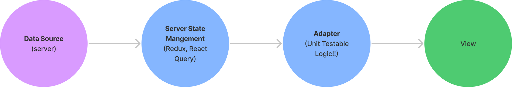
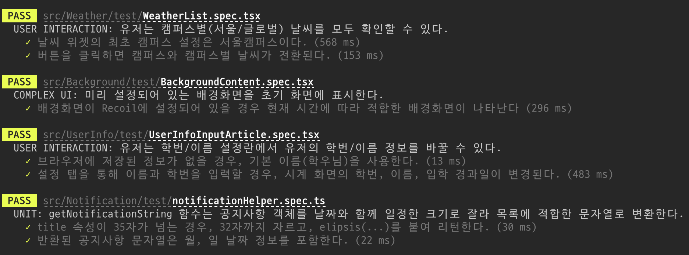
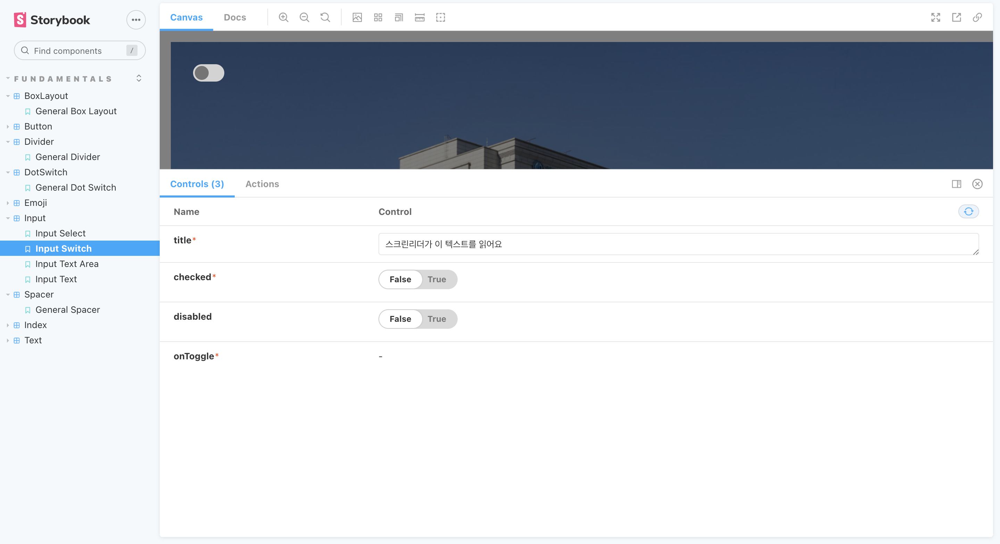

2년여 동안 유지보수하고 있었던 [개인 프로젝트](https://github.com/MaxKim-J/hufs-semester-clock-v2)의 2.0버전 개발을 끝냈습니다. 구직 준비 중 틈틈히 시간을 내어 진행해왔습니다. 나름의 테스트 전략을 정해 테스트 코드도 붙였습니다. 앞으로도 프로젝트를 계속 유지보수 할 예정이기도 하고, 그동안 프론트엔드 프로젝트를 진행해오면서 테스팅을 체계적으로 해볼 기회가 많이 없었기 때문에 이번 기회를 빌어 테스트를 많이 작성해보고 싶었습니다. <!–-break-–>

시간이 촉박했었던 이번 프로젝트를 진행하면서 가성비 있는 테스트 전략을 고민했습니다. 결과적으로 기능 개발을 병행하며 70개의 테스트를 작성하고, 85%정도의 커버리지를 달성할 수 있었습니다. 

이 포스팅에서는 프로젝트에 적용해보았던 “가성비” React 프로젝트 테스트 전략에 대해 소개하고, 테스트에 임하는 마음가짐에 대해 정리해봅니다. 

# 관점 설정

테스트 코드가 없다고 해서 런서버가 안 되는 것은 아닙니다. 돌아가게는 만들어집니다.

테스트 코드는 제품 개발, 유지/보수에 빠지면 섭섭하긴 하지만 **필수 불가결한** 요소는 아니기 때문에 테스트는 어떻게 개발을 해야 무조건 맞는 것이라는 왕도도 없고, 개발자나 팀이 어떤 관점으로 테스트를 바라볼지 많은 부분을 취사 선택할 수 있습니다. 

따라서 테스트 코드에 팀과 개발자에 대한 관점을 설정하고, 테스트의 범위, 테스트로 무엇을 얻고자 하는 것인지 등을 설정하는 것은 테스트 코드를 작성하기 전 꼭 필요한 행위입니다. 이러한 의사결정들을 통해 꼭 필요한 리소스들만 테스트에 투입할 수 있도록 할 수 있습니다.

게다가 프론트엔드 제품은 다른 소프트웨어와는 약간 다른 특징을 가지고 있어, 그런 부분이 테스트 코드 작성에도 반영되어야 한다고 봅니다.

## 모든 것을 테스트하지 않는다

테스트의 경계를 정확하게 정해야 합니다.

웹 프론트엔드 프로젝트에 React를 사용한다면 **React를 테스트하는 것은 무의미**합니다. 이미 React라는 오픈소스가 많은 테스트 코드들을 바탕으로 잘 유지되고 있음을 전제하고 프로젝트에 도입한 것이니까요. 

React의 동작 방식이 의심스럽다면 React를 사용하지 않아야 합니다. 그래서 React의 동작, 즉 React의 컴포넌트가 잘 합성되거나 렌더링되는지, props를 잘 받는지, 함수를 만들어 내는지에 대한 테스트는 하지 않습니다. 

게다가 React의 동작에 대한 테스트가 통과된다고 해서, 프로젝트의 기능이나 UI에 [버그가 없을거라는 보장은 없습니다.](https://jbee.io/react/testing-1-react-testing/#%EC%9D%B4-%EC%95%B1-%EC%A7%80%EA%B8%88-%EC%A0%9C%EB%8C%80%EB%A1%9C-%EB%8F%99%EC%9E%91%ED%95%98%EB%8B%88)

테스트 경계의 내부는 **지금 작업하는 제품과 UI**입니다. 백엔드의 Response가 잘 오는지 마는지 테스트할 필요도 없습니다. 관심사가 아닙니다. 테스트 경계 외부는 모두 잘 작동한다는 전제를 가지고 테스트를 작성합니다.

그렇다고 테스트 경계 내부의 **모든 기능을 테스트하려고 할 필요는 없습니다.** 당연히 모든 기능을 테스트하고 커버리지는 100%인 것이 좋겠지만, 이 글의 테스트 전략은 “가성비”를 따집니다. 

마틴 파울러의 책 “리팩토링”에서는 테스트에 대해 합리적인 관점, 가성비 친화적인 관점을 견지합니다.

> 테스트를 너무 많이 만들다 보면 오히려 필요한 테스트를 놓치기 쉽기 때문에 아주 중요한 포인트다. 나는 적은 수의 테스트만으로도 큰 효과를 얻고 있다. **잘못될까봐 가장 걱정되는 영역을 집중적으로 테스트하는데, 이렇게 해서 테스트에 쏟는 노력의 효과를 극대화하는 것이다.** (143)
> 

가성비 있는 테스트 전략은 “잘못될까봐 가장 걱정되는 영역”에 테스트를 집중적으로 붙입니다. 

중요도가 떨어지거나 덜 걱정스럽다면 일단은 테스트하지 않을 것입니다. 혹은 뒤에서 더 자세히 설명할 테스트 방법인, 로직을 순수함수로 분리해 쉽게 유닛 테스트를 붙이는 방식으로 가성비있게 접근할 것입니다. 

## 함수형 마인드

React는 함수의 조합처럼 동작하는 라이브러리입니다. 

[물론 React 전체가 함수형 프로그래밍이라고 말하는 것에는 한계가 있습니다만](https://gyuwon.github.io/blog/2020/07/24/react-has-no-functional-components.html), 큰 그림으로 바라보면 React는 데이터를 파라미터로 받아, 여러가지 함수와 처리를 거쳐, 종국에는 UI를 반환하는 거대한 함수입니다.


// 아주 거칠게 말하면 이런 멘탈 모델이라는 것입니다.
// 함수형 프로그래밍의 조합과 비슷합니다.
const View = React.pipe(
  fetch(),
  saveServerState(),
  adapter(),
  render(),
)


이런 구조 속에서 원하는 UI를 개발하기 위해 중요한 것들 중 하나는, 데이터를 UI라는 최종 목적에 맞게 변환하는 작은 단위의 함수들입니다. 

저는 이걸 `adapter` , `Data Adapting Function` 이라 부릅니다. 서버와 같은 특정 출처에서 받아온 원래의 데이터를 개발될 UI에 맞는 방식으로 어댑팅 시키기 때문이죠.  adapter는 특정 기능의 핵심을 이루는 코어 로직들입니다.

만약에 이 어댑터들을 컴포넌트에 흩트려놓지 않고, 순수 함수로 만들어 특정 모듈들에 모아놓을 수 있으면 어떨까요? **유닛 테스트를 붙이기 쉬울 것입니다.** 핵심 로직을 함수를 테스트하는 형태로 바꾸어, 가성비있게 특정 기능을 테스트할 수 있는 방법이 되기도 할 것입니다.

React를 하나의 함수로 본다면, 파라미터는 데이터, 그리고 함수 내부의 동작은 React 컴포넌트의 내부에 삽입된 Adapter, 또는 Hooks들일 것입니다. 핵심 로직이자 React의 결과물을 내는데 필수적인 Adapter가 잘 동작한다면 React가 올바른 결과물을 낼 확률도 높아질 것입니다. 

**과정이 무결하면 결과도 무결할 확률이 높아질 것이다.** 이게 제가 소개하는 테스팅 전략의 함수형 마인드입니다. 

모든 로직을 테스트하기보다, 최종 결과물에 미치는 임팩트가 높은 로직들을 쉽게 테스트하자는 가성비 관점이기도 합니다.

함수형 프로그래밍에서 로직을 이루는 조합의 대상인 작은 순수 함수들이 무결하면 무결할수록, 함수형 프로그래밍의 결과도 정확할 확률이 높을 것입니다. 그래서 이 포스팅의 테스트 전략에서는, 컴포넌트 내부의 Data Adapting 로직들을 **최대한 순수함수로 분리한 후 유닛테스트를 작성**할 것입니다. 뒤에서 더 설명하겠습니다.

## 하나의 기능을 다른 방법으로 여러번 테스트하지 않는다(테스트 얇게 퍼바르기)

유닛 테스트, 통합 테스트 등 여러 테스트 방식을 병행하면 한 로직을 여러번 테스트하는 꼴이 될 수도 있습니다. 어떤 한 기능에 테스트가 두툼하게 붙은 것이죠.

그만큼 제품의 무결함이 더 보장이 되겠지만, 가성비에는 좋지 않습니다. 

특히 시간이 한정되있는 실무에서 테스트 코드를 처음 작성하는 시점에 이런 겹침이 발생하면 할수록, 특정 모듈을 “두껍게” 테스트하는데 리소스가 낭비되어 테스트 코드가 더 필요한 곳에 테스트를 작성하지 못할 수도 있습니다.

이 포스팅의 전략에서는 **테스트를 얇게 퍼바릅니다.** 통합 테스트든, 유닛 테스트든 어떤 테스트 suites로 커버가 된다면, 다른 방법으로 테스트하지 않습니다. 그리고 추후에 걱정이 되는 부분이 생겼을 때, 다른 테스트를 덧바릅니다.

물론 이런 중복을 아예 지양해야 하는 것은 아닙니다. 뒤에서 더 설명하겠지만, jest로 유틸을 테스트하고(유닛 테스트), react-test-library로 특정 유틸을 쓰는 컴포넌트를 또 테스트(통합 테스트)할 필요와 이유가 생긴다면 그렇게 해도 되고, 불가결하게 생기는 중복도 있을 것입니다

유저 여정과 관련지어 생각해봐도 좋을 듯 합니다. 유저가 웹앱을 사용할 때 거치는 여러 유스케이스들을 어쨌든, 종류에 상관 없이 테스트가 하나씩은 커버하고 있다면 그것은 가성비가 좋은 테스트라고 할 수 있지 않을까 생각합니다.

## 깨지기 쉬운 테스트를 최대한 적게 작성한다.

깨지기 쉬운 테스트는 매우 고통스럽습니다. 그런데 프론트엔드 제품은 태생적으로 깨지기 쉬운 테스트를 작성할 수 있는 가능성이 다른 소프트웨어에 비해 높다고 생각합니다.

그것은 프론트엔드 제품이 **변할 수 있는 이유가 너무 많기 때문**이라고 생각합니다. 프론트엔드는 백엔드가 보내는 응답의 구조가 바뀌면 수정이 필요한 경우가 생깁니다. 디자인이 바뀌거나, 기획이 바뀌는 족족 프론트엔드는 자주 수정됩니다.

특히 UI의 변화에 관여하는 이해관계자가 매우 많습니다. UI는 눈에 보이기 때문입니다. 당장 고객들이 CS 창구를 통해 수많은 피드백을 던지고 있을 것입니다. 회사 앞을 지나가는 모르는 아저씨 한 분마저도 회사의 프론트엔드 제품을 **보시기만 하면** 피드백을 주실 수 있습니다. 

UI에 대한 테스팅은 깨지기 쉽기 때문에 프론트엔드 개발자들이 작성에 엄두를 못내고, [많이 논의하는 부분](https://www.reddit.com/r/programming/comments/595i2r/why_tdding_your_frontend_feels_pointless/)이기도 합니다. 아예 UI에 의존하는 테스팅을 하지 않고 다른 테스팅 방법을 찾는 것도 방법이라고 생각합니다.

그래도 이 포스팅의 전략에서는 UI에 대한 테스팅, 즉 React 컴포넌트가 반환하는 View에 대한 테스팅을 하기는 할 것입니다. 컴포넌트를 테스팅해야만 특정 기능의 무결함을 보장할 수 있는 복잡한 기능이 존재할 수 있기 때문입니다. 

하지만 깨지기 쉬운 테스트임을 인지하고, 최대한 적게, 엄격한 기준을 정해 작성하려고 노력할 것입니다. 

React에서는 react-test-library라는 도구가 UI 테스팅, React 컴포넌트 테스팅에 대한 부담을 조금은 덜고 있습니다.

DOM에 직접 접근하지 않고, innerText, Role, Label 등 요소를 설명하는 내용을 토대로 테스트를 할 UI를 쿼리하면서, 사용자 관점에서 테스트를 작성하도록 돕습니다.

**그럼에도** UI에 의존하는 테스트는 깨지기 쉽습니다. text, role, label의 내용이 자주 바뀌지 않는다고 말할 수 없기 때문입니다.

# 테스트 작성

이제 실질적으로 테스트를 작성해보겠습니다.

## 유닛 테스트 - jest

앞에서 말했듯이, 유닛 테스트는 컴포넌트 내부의 Data Adapting 로직들을 **최대한 순수함수로 분리한 후 작성하는 테스트입니다.** 순수함수로 분리할 수 있는 데이터 로직을 util, 또는 다른 디렉토리로 분리하고, 컴포넌트와 관련된 로직들은 컴포넌트에 둡니다. 

이해를 돕기 위해 아주 간단한 예제로, TodoList 컴포넌트를 생각해 보겠습니다.


function TodoList() {
  // 서버에서 데이터 받아오는 쿼리
  const todos = useTodoQuery('/todos');

  // 서버로부터 받은 데이터를 가공할 필요 있을 경우
  const processedTodos = todos.map((todo) => ({
    ...todo,
    // 만료시간이 한시간 이전일 경우 urgent flag 표시
    isUrgent: +new Date(todo.deadline) - +new Date() < 3600;
  }))

  return (
    <ol>
      {processedTodos.map((todo) => (
        <li key={todo.id}>
          
{todo.title}

          
{todo.content}

          
{todo.urgent && '급합니다!'}

        </li>
      )}
    </ol>
  )
} 


위의 예제에서 todos를 processedTodos로 만드는 로직은 함수로 분리가 가능합니다.



// todoHelper.ts
const validIsUrgent = (todo:Todo) => +new Date(todo.deadline) - +new Date() < 3600

const processTodos = (todos:Todo[]) => todos.map((todo) => ({
    ...todo,
    isUrgent: validIsUrgent(todo);
}))

// TodoList.tsx
function TodoList() {
  const todos = useTodoQuery('/todos');
  const processedTodos = processTodos(todos);

  return (
    <ol>
      {processedTodos.map((todo) => (
        <li key={todo.id}>
          
{todo.title}

          
{todo.content}

          
{todo.urgent && '급합니다!'}

        </li>
      )}
    </ol>
  )
} 


분리한 두 함수들에 대한 Jest 테스트 코드를 작성합니다.


decribe('prcessTodo', () => {
  it('processTodo 함수는 isUrgent를 붙여 새로운 todo 배열을 반환한다.', () => {
    ...
    expect(...).toEqual(...)
  })
})


순수 함수를 Jest로 테스트하는 것이 가성비가 제일 좋습니다. 테스트를 돌리는 시간도 무지 짧고, 순수 함수라서 테스트 케이스 고안도 쉽습니다. 핵심 로직을 정말 쉽게 테스트할 수 있습니다. 꼭 필요한 부분에 유닛 테스트를 많이 붙이면 붙일수록 테스트의 가성비가 높아진다고 생각합니다.

물론 React 컴포넌트를 직접 테스트하는 것이 아니니, 아직 컴포넌트 내부에서 버그가 발생할 여지는 남아 있습니다. 이건 다음 컴포넌트 테스트에서 살펴보도록 하겠습니다.

단점이 있다면, 순수 함수로 분리하고 빼는 과정에서 추상화의 깊이가 한 단계 깊어진다는 것입니다. 

컴포넌트의 핵심 로직들을 컴포넌트에 모아놓는 방식으로 추상화가 잘 이루어져 있다면, 그 상태에서 한번 더 다른 모듈로 분리하는 것은 불필요한 추상화일지도 모릅니다. 테스트만을 목적으로 함수를 분리하는 것을 달갑게 생각하지 않으실 수도 있습니다

하지만 추상화 비용을 지불하더라도, 테스트는 필요한데 정말 투자할 시간이 없다면 혹은 프로젝트에 기능들이 개발이 진행 중이라면, 이런 식으로 로직을 분리하고 유닛 테스트만 작성해줘도 리팩토링이나 타 개발자와의 협업에 큰 도움을 받을 수 있을 것이라 생각합니다.

## 컴포넌트 테스트 - React Testing Library

컴포넌트 테스트는 유닛 테스트들의 대상이 모여있는 컴포넌트를 테스트하는 통합 테스트라고 볼 수도 있고, 유닛 테스트만으로는 커버가 되지 않는 컴포넌트 내부를 테스트할 수 있다는 점에서 의의를 가집니다.

예제로 prop 값에 따라 컴포넌트 내부의 Dialog를 토글해야 하는 가상의 컴포넌트를 보여드리겠습니다.


// prop값에 따라 dialog open

function NameUpdateArticle({ name }:{ name:string }) {
  const [isDialogOpen, setIsDialogOpen] = useState(false);

  const openDialog = () => {
      setIsDialogOpen(true);
  }

  const closeDialog = () => {
      setIsDialogClose(false);
  }

  // 사용자가 이름이 없다면, 이름 변경 dialog를 미리 열어둔다.
  // 이름이 있어야만 하는 상황임
  useEffect(() => {
    if (!name) {
      setIsDialogOpen(true);
    }
  },[name])

  return (
    <article>
      
{name ?? '이름 없음'}

      <button>이름 바꾸기</button>
      {isDialogOpen && <NameUpdateDialog onClickClose={closeDialog}/>}
    </article>
  )
}


유저 인터랙션이 발생하는 부분이고, 내부에 독특한 로직이 있어서 테스트를 해보고 싶을 수 있습니다. 

하지만 모든 로직이 컴포넌트와 바인딩되어 있어서, 따로 순수 함수로 뽑아서 테스팅할 수 있는 부분은 없어 보입니다. 이런 경우에 컴포넌트 테스트를 사용합니다. 


// NameUpdateArticle.spec.tsx

describe('NameUpdateArticle', () => {
  it('이름이 있으면 초기에 이름 수정 다이얼로그를 열지 않는다.', () => {
    const { getByText } = render(<NameUpdateArticle name="max"/>)
    expect(getByText(...)).toBeInDocument();
  });

  it('이름이 없으면 초기에 이름 수정 다이얼로그를 연다.', () => {
    const { getByText } = render(<NameUpdateArticle name=""/>)
    expect(getByText(...)).toBeInDocument();
  });
}) 


앞에서 설명했듯 컴포넌트 테스트는 **무자비하게 깨지기 때문에** 다음과 같이 명확한 이득을 얻을 수 있는 경우에만 작성합니다. 왠만한 핵심 로직들은 유닛 테스트로 커버가 되었다는 전제가 필요합니다.

- 유저 인터랙션(User Interaction) : UI가 깨지는 버그라면 눈으로 쉽게 판단할 수 있지만, 직접 동작을 해서 테스트를 해봐야 버그를 감지할 수 있는 경우, 놓칠 가능성이 크게 높아집니다. 엄선해 잘 짜놓은 유저 인터랙션 테스트는 개발자가 직접 브라우저 위에 화면을 띄워놓고 이것저것 검증하는 시간을 줄여준다는 면에서 의미가 있는 테스트입니다.
- 복잡한 컴포넌트 로직(Complex UI) : 물론 유닛 테스트를 여러개 작성해서 모두 통과한다면, 컴포넌트에도 문제가 없을 가능성이 높아집니다. 하지만 상태값이 컴포넌트의 렌더링에 영향을 미치는 useEffect등의 훅을 여러개 쓰고 있거나, 상태값에 따라 UI가 분기되는 복잡한 UI의 경우 컴포넌트 테스팅을 통해 기능이 잘 동작 되는지 테스트를 해보는 것이 좋습니다.

개인 프로젝트에 작성한 테스트 케이스에는 플래그를 테스트 suites 앞에 붙여서 테스트 케이스를 구분했습니다.

예제처럼 모든 컴포넌트가 밖에서 데이터를 주입해서 테스트해볼 수 있을 정도로 순수하면 좋겠지만, 실제로 그렇게 되기 어렵고, 일부러 테스트를 위해 순수한 컴포넌트를 만드려고 하면 구조를 해치게 됩니다. 그래서 **모킹**이 필요한 부분이 생길 수 있습니다. 

가성비를 위해 모킹은 최대한 지양하자는 생각이 있습니다. 특히 서버의 Response를 모킹하는 것은 최대한 지양하는게 좋다고 생각합니다. 응답의 구조나 내용이 변경이 프론트엔드 개발자에게 달린 것이 아니기 때문에, 모킹한 테스트와 관련된 기능을 작업하지 않더라도, 모킹한 응답은 싱크를 맞추기 위해 계속 수정될 수 밖에 없습니다. 따라서 모킹은 꼭 필요한 부분에만 사용해야 한다고 생각합니다.

서버 모킹을 하지 않고, 전역 상태관리 도구(Redux, Recoil 등)를 모킹할 수 있거나, prop을 모킹하는 것으로 테스트를 할 수 있다면 그런 방법을 택하는게 더 미래의 리소스를 아낄 수 있습니다. 

## 다른 테스팅 방식

### UI 테스팅 - Storybook

- 컴포넌트를 테스트하지 않는다고 결정했을 때 Storybook은 좋은 대안이 될 수 있습니다. 테스트가 필요한 컴포넌트를 특정 상태값을 가지게끔 렌더링하여 특정 상황의 UI를 눈으로 볼 수 있는 런타임을 제공하니까요.
- 하지만 눈으로 확인하는 방식은 깨진 UI를 쉽고 빠르게 확인할 수 있도록 하겠지만, 모든 버그를 찾아내줄 수 있는지는 의문입니다. jest처럼 테스트를 돌려서 빨간불을 켜주지 않기 때문이죠.
- [Storybook 스냅샷 테스팅](https://medium.com/@pitapat/3-react-storybook-puppeteer-jest-%EA%B0%9C%EB%B0%9C%ED%99%98%EA%B2%BD-%EA%B5%AC%EC%B6%95%ED%95%98%EA%B8%B0-85cc8be9b56c)을 사용하면 좀 더 적극적으로 테스팅에 Storybook을 이용할 수 있을 것 같기는 합니다만, 스냅샷 테스팅이 좋은 테스트 방식인지는 아직 의문이 있습니다.
- 저는 Storybook을 디자인 시스템과 같은, 실제로 사용되어 개발되기 전에는 어떻게 생겼는지 알 수가 없는 작은 컴포넌트를 렌더링시켜 테스트해볼 때 주로 사용합니다. 

### E2E 테스팅

- 유저의 환경을 그대로 구성해놓고 테스팅을 하는 방법입니다. 진정으로 프론트엔드 제품의 종단(End to End)을 테스트하는 방식이라고 할 수 있습니다.
- 비용이 매우 높은 테스트이고, [제대로된 시나리오가 필요합니다](https://jbee.io/react/testing-5-react-testing/#e2e-test%EC%97%90-%EB%8C%80%ED%95%9C-%EC%83%9D%EA%B0%81). 그리고 시나리오는 제품의 변화에 따라 유지보수되어야 합니다. E2E 테스트 시나리오가 갱신되지 않아서 테스트 자체가 레거시가 되는 상황을 본 적이 있습니다... 제대로 할 수 없다면 안 해야 하지 않나 싶습니다.
- QA 직군, 혹은 다른 개발자들과 협심해서 시나리오가 레거시가 되지 않도록 노력할 수 있는 환경이면 좀 나을 수도 있겠다 싶긴 합니다.

# 남은 이야기

## 유지/보수 중인 프로젝트에 적용할 수 있을까?

로직 분리가 힘들게 짜진 기존 프로젝트의 경우, 로직을 함수로 분리해서 유닛 테스트로 붙이는게 어려울 수 있습니다. 

이럴 경우에 테스트 코드를 붙이고 싶다면, 제품의 종단, 끝과 끝을 테스트할 수 밖에 없을 것입니다. 이러한 경우에는 중요한 케이스에 한해 E2E 테스트, 혹은 컴포넌트에 테스트를 붙이는게 더 좋은 접근일 수 있습니다.

하지만 역시 E2E나 컴포넌트 테스트는 UI를 테스팅해야 하기 때문에, 깨지기 쉽다는 점은 변하지 않습니다. 관리할 수 있는 범위에 한해서, 기준을 세우고, 중요하고 꼭 필요한 케이스만 테스트 케이스를 붙이는게 좋지 않을까 싶습니다.

> 모 회사 커피챗을 갔었는데 거기서 만난 개발자분이, “컴포넌트에 코어 로직이 흩어져있고, 컴포넌트랑 강결합하고 있는 레거시의 경우에는 로직을 분리해서 테스트하는게 어려울 수 있다. 블랙박스로 보고 테스트하는게 나을 수 있다.” 라는 말씀을 해주셔서 적어본 단락입니다. 좋은 지점 말씀해주셔서 감사합니다!☺️
> 

## 테스트 코드 작성 시점과 TDD

TDD는 테스팅이 아닙니다. TDD는 테스트 코드 작성을 기능 개발보다 먼저 진행하고, 결과적으로는 모든 테스트 케이스를 통과하는 것을 목표로 삼아 기능을 개발하는 방법론입니다.

TDD는 일반적으로 개발자가 기능을 개발해나가는 과정과 상이하기 때문에 익숙해지기 힘든 방법이라고 생각합니다. 익숙해지면 좋은 효과가 나겠지만, TDD를 사용해서 개발을 잘 하게 되기까지는 시간이 필요하다고 생각하기는 합니다. 

저같은 경우에는 TDD를 시도해보면서, 기능 개발 전에 필요할 모듈이나 코드에 대한 설계를 정확하게 하는게 힘들다는 생각이 들었습니다. 테스트를 다 작성해놓고 구현을 하는데, 막상 개발해보니 새로운 모듈도 필요한,, 그런 상황을 마주합니다. 아직 경험이 부족해서라고 생각합니다. 연습을 더 해야할 것 같아요.

물론, TDD 방법론으로 테스트를 작성하지 않는다고 해서 테스트의 가치가 빛이 바래는 것은 아니라고 생각합니다. 테스트는 미래에 더더욱 복잡해질 제품 속에서 버그를 잡아내는 역할을 해야하기 때문에, 테스트 코드의 작성 시점 보다는 존재 유무가 더 중요하다고 생각합니다.

## 테스트 코드 파일을 어디에 어떻게 저장할 것인가?

테스트를 붙일 모듈의 디렉토리를 만들어서 모듈과 같은 경로에 저장하는 경우도 있고, 프로젝트 루트 디렉토리에 test 폴더를 만들어 그곳에 테스트 코드를 작성하는 방법도 있습니다.

모듈과 같은 경로에 테스트를 작성하는 것은 테스트가 있는 코드와 없는 코드의 저장된 모습 차이를 유발하게 됩니다. 이런 차이는 복잡하기도 하고, (저만 그런 것 같기는 한데) 저장되어 있는 모습을 일정하게 맞추고 싶어 모든 모듈에 테스트를 작성해야 할 것 같은 강박이 생기기도 합니다. 어떤 부분이 테스팅되고 있는지 디렉토리를 탐색해야만 알 수 있어서 한눈에 파악하기 힘듭니다. 

그렇다고 루트 디렉토리의 폴더 하나에 테스트 코드를 전부 작성하면 모든 테스트코드가 섞여있기 때문에 특정 모듈에 대한 테스트를 쉽게 찾는게 힘이 듭니다.

저는 이 두 방법의 중간 쯤이 좋은 것 같습니다. 저는 이번 개인 프로젝트를 진행하면서 프로젝트 디렉토리를 기능 단위로 분리하고, 기능 단위 폴더 하나마다 테스트 코드 폴더를 넣는 방식으로 테스트코드를 작성했습니다.

루트보다는 더 구체적인 경로에 테스트코드를 저장하니 찾기 쉽고, 자유롭게 기능 단위에서 필요한 부분만 테스트 코드를 작성해 폴더에 저장하면 되니 간편합니다.

프로젝트 디렉토리에 대한 고민을 하면서 안희종님의 [지역성의 원칙을 고려한 패키지 구조: 기능별로 나누기](https://ahnheejong.name/articles/package-structure-with-the-principal-of-locality-in-mind/) 포스팅이 도움이 많이 되었습니다.

# 맺는말

회사에서 업무를 할 때 프로젝트 크기가 점점 커지면서 리팩토링은 점점 무서워지는 상황에 부닥쳤지만, 기능을 개발하느라 테스트는 우선 순위에서는 자꾸 밀려났습니다.

지금 돌아보면, 그때 테스트를 붙이지 못했던 것이 가성비 좋은 단단한 테스트 전략과 팀 컨벤션을 치열하게 고민하지 않았기 때문이 아닌가 하는 생각이 듭니다. 

제 부족한 식견을 바탕으로 짠 전략과 관점을 어떻게 생각하실지 모르겠습니다. 어찌보면 불편한 상황을 피하면서 되는대로 테스트를 작성하는 방법을 소개한 꼴일지도 모르겠다는 생각도 살짝 들어서 자신이 없습니다.

잘못된 부분 지적이나, 피드백 남겨주시면 감사하겠습니다!! 읽어주셔서 감사합니다.