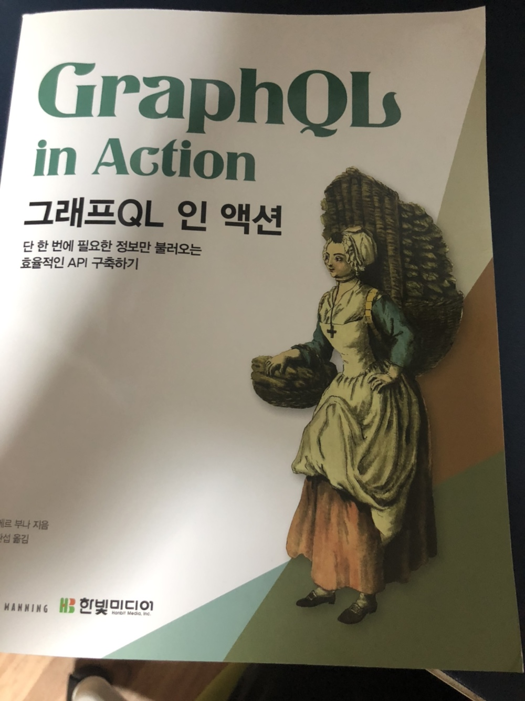

올해 한빛 미디어에서 "나는 리뷰어다" 활동을 하게 되었습니다! 이번달에는 <그래프 QL 인 액션>을 받아 읽어보게 되었는데요.
<!–-break-–>

그동안 거의 관성적으로 사용했었던 REST API가 아닌, 새로운 데이터 스펙이자 쿼리 방식인 그래프 QL에 대해 좀더 이해해볼 수 있는 계기가 되었던 것 같습니다. 책에서는 REST API와의 비교를 통해 기술의 차이점을 잘 알 수있게 설명합니다. 그래프 QL을 실질적으로 직접 접해보지 않았다면 그래프 QL이 무엇인지, 어떤 기술인지 감을 잡기가 좀 어려운 면이 있는데 이 책에서는 사양, 언어, 서비스라는 단어를 통해 다각적으로 그래프 QL이라는 기술이 어떤 기술이고 무슨 문제를 해결하려고 하는지 보여주는 것 같습니다.

그래프 QL은 프론트엔드 개발자에게 데이터 엔드포인트에 의존하지 않고 스키마를 직접 작성해 필요한 데이터를 프론트엔드 개발자의 필요에 의해 가져올 수 있게 하는 기술이라는 사실을 알게 된 것 같습니다. 책의 쿼리 예시들도 실제 있을법한 상황에서의 유스 케이스를 잘 설명하고 있는 듯 합니다. 

>한빛미디어 <나는 리뷰어다> 활동을 위해서 책을 제공받아 작성된 서평입니다.