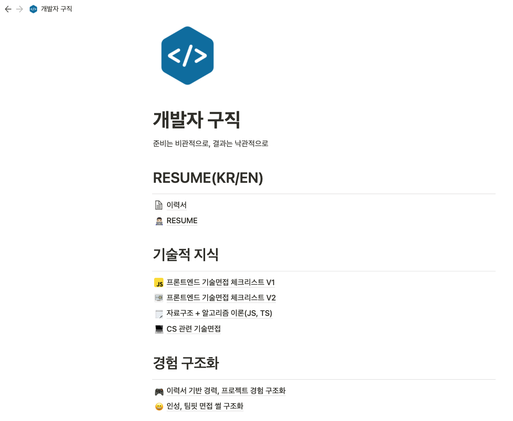
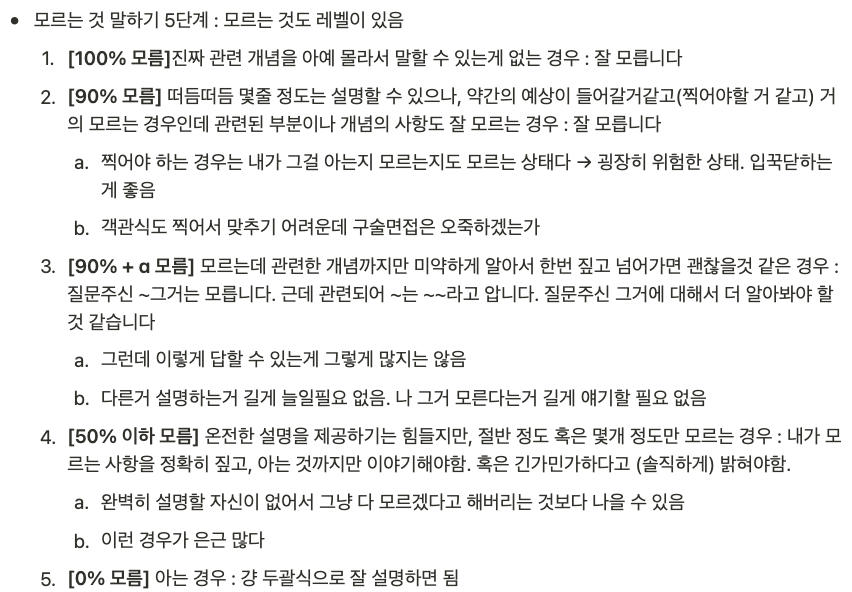

2월 초부터 거의 2달간 진행했던 구직이 끝나고, 입사를 확정한 후 1주일쯤 쉬었습니다. 8개 회사와 채용 프로세스를 진행하며 2번의 온라인 코딩테스트, 4번의 라이브코딩, 5번의 사전과제, **13개 세션의 각종 면접(기술, 팀핏, 임원)** 을 거쳤고 쉽지 않은 여정이었습니다.<!–-break-–>

이번 포스팅에서는 제가 채용 과정 중 느꼈던 특기할만한 사항들을 중심으로 길고 고민도 많이 되었던 구직 과정을 회고해보려고 합니다. 이직, 구직을 준비하시는 분께 도움이 되었으면 좋겠어요!

# 구직 결과

8개 회사에 프론트엔드 개발자 직무로 지원해서 6개 오퍼를 받았습니다. 오퍼를 받지 못한 2개 회사는 각각 서류 전형, 1차 면접에서 탈락했습니다.

# 채용 프로세스

## 진짜 다 해봤다

이번 구직기간을 거치면서 개발자 채용에서 할 수 있는 전형을 진짜 손으로 하는 코딩 빼고는 거의 모두 다 경험해봤습니다. 온라인 코딩테스트, 실시간 코드 공유 툴을 이용한 라이브 코딩, 기술면접, 경험 기반 면접, 팀핏 면접을 경험했습니다.

면접은 시국이 시국인지라 대부분 비대면으로 진행되었습니다.

## 이력서

[이력서\_최종\_최종\_진짜최종.md](https://github.com/MaxKim-J/RESUME)

**해결한 문제**를 서술하는 방식으로 이력서를 작성하며 아쉬웠던 것은 그동안 개발이나 업무를 하면서 성과를 제대로 측정해본 적이 없어 `몇 %의 향상`, `몇 초, 분, 시간 빨라짐` 등의 표현을 제대로 쓸 수 없던 것이었습니다. 평소에 본인의 업무 성과를 적절한 숫자와 지표로 측정해서 갖고 있어야 좋겠다는 생각이 들었습니다.

## 사전 과제

서류 전형을 통과하면 사전 과제를 부여하는 회사가 많습니다. 제가 받았던 5개의 사전 과제들의 데드라인은 굉장히 다양했었는데, 각각 2일, 3일, 7일, 3시간, 4시간이었습니다. 프로젝트를 처음부터 구현해야 하는 과제도 있었고, 이미 구성되어있는 프로젝트에서 기능을 추가, 수정하는 과제도 있었습니다.

사전 과제 진행 중에 **최대한 해매지 않는 것이** 중요함을 느꼈습니다. 사전 과제에서 본인 기준으로 검증이 잘 안 되었거나, 숙련되지 않은 라이브러리나 기술을 사용하면 시간 안에 과제를 수행할 가능성이 떨어집니다.

스스로에게 가장 익숙한 스택들을 가지고 빠르게 요구사항을 충족해나가면서, 조금이라도 더 코드 퀄리티를 생각하면서 구현해야한다는 생각입니다. 정해진 시간 안에 최대한 많은 점수를 얻는게 목표니까요. 특히 시간이 24시간 이내로 주어지는 짧은 타임어택 과제 전형의 경우에는 더더욱 그렇습니다.

그래도 사전과제를 잘 못 해낼 수 있습니다. 이런 경우에는 다음 채용 프로세스로 진행하지 못하거나🥲, 면접을 진행하거나 할텐데요. 사전과제가 망했다고 생각했는데 면접이 진행되는 경우, 기술 면접에서 과제에 대해서 물어보기 때문에 **면접에서 망한 과제를 만회해야 한다는** 생각으로 임하는게 좋은 것 같습니다.

먼저 사전 과제를 **왜 잘 해내지 못했는지** 이유를 복기하고, 구현해내지 못한 요구사항들은 어떻게 구현할지 생각합니다. 코드 퀄리티 측면에서 아쉬운 점들도 생각합니다. 시간이나 멘탈이 허락한다면 과제를 다시 풀어보는 것도 좋은 것 같아요.

## 라이브 코딩

인터뷰어 앞에서 하는 라이브 코딩은 너무 어렵습니다. 실전에 들어오면 긴장도 되고, 인터뷰어분과 소통을 하면서 문제를 해결해나가야 하는데 문제에 집중하면 말을 안하게 되고, 말을 해야겠다는 강박을 가지면 문제가 안 풀리는 딜레마에 빠지기 마련입니다.

이를 극복하기 위해서는 인터뷰어분에게 많은 정보를 사전에 전달하고 답을 얻어야 하는 것 같습니다.

"지금부터 몇분간 생각을 좀 해보겠다."던가, "빨리 문제를 해결해야 하니 변수명은 신경을 안 쓰겠다."거나, "가장 먼저 생각나는 솔루션으로 빨리 풀어보고 후에 다듬겠다." 하는 식으로 생각하는 바를 빨리 전달하는 적극성이 필요하다고 느껴졌습니다. (물론 인터뷰어분이 그렇게 하지 말라고 하면 하면 안 됩니다ㅎㅎ 통보가 아니라 소통이기 때문에...)

문제를 풀면서 말을 자유로이 하기가 힘들다면, **코드를 작성하며 생각한 바를 주석으로 남기는 방법**도 좋은 것 같습니다. 인터뷰어분도 주석을 확인하면서 지원자의 생각의 흐름을 확인할 수 있고, 적당한 코멘트를 남겨주실 수 있습니다.

릿코드에서 라이브 코딩 연습을 하면서 생각하는 바를 주석으로 남기는 연습을 했었는데, 코드 작성을 병행하는 와중에 어떻게 생각을 정리해 말할 것인지에 대한 연습도 되었던 것 같아요.

## 기술 면접

이력서 기반 면접같은 경우는 이력서에 적은 경험을 바탕으로, 인터뷰어분들의 입장에서 무엇을 궁금해하실까 생각하면서 파생 질문들을 생각이 더 나지 않을때까지 정리해나갔습니다. 이 작업을 하면서 특정 질문에 확실하게 대답해야할 포인트들을 추출할 수 있었던 것 같습니다.

이번 구직에서 기술 면접에 들어갈 때에는 `~는 뭔가요? ~에 대해 설명해주세요` 식으로 받은 질문들보다는 이력서 기반 면접 질문들을 더 많이 받았습니다.

이력서에 쓰인 경험들을 바탕으로 `왜 이렇게 했는지`, `어떤 의사결정 과정을 거쳤는지` 같은 질문이 더 많았아요. 저번 구직과는 다르게 미약하게나마 경력이 생겨서 그런가보다 했습니다.

이력서 기반으로 질문이 시작되면 기술과 관련된 질문도 자연스럽게 따라오는 듯한 느낌이었고, 더 나아가서 이를 바탕으로 합당한 추론이 가능한지까지 여쭤보셨던 것 같습니다.

웬만하면 기술 기반 질문에는 답을 잘 했는데, 잘 못한 것들 몇 가지가 기억에 남기도 하네요. ㅎㅎ 복기하면서 계속 정리해 나갔습니다.

- Lazy Evaluation이 무엇인지 설명하고, 관련한 예시를 들어줄 수 있으신가요?
- 브라우저에서 HTTP 요청을 날릴 때 preflight 요청이 발생하지 않는 경우는 어떤 경우인가요?
- `useImperativeHandle` 훅 이름의 의미를 아시나요? (왜 이름이 이건가요)

## 모르는 것도 레벨이 있다.

기술 면접에서 모르는 것을 인정하지 않고 얼버무리면서 틀린 답을 말하면 오히려 더 마이너스 요소가 된 다는 점은 널리 알려진 사실입니다.

질문에 대해 아예 모른다면 모른다고 당당(?)하게 말할 수 있을 것 같은데, 가끔 **일부만 아는** 상황이 있습니다. 이런 경우, 깔끔하게 설명할 자신이 없다고 아예 모른다고 말하는 건 아깝습니다. 저도 몇번 그런 상황이 있어서 아예 대답 프로토콜을 만들었습니다.

그래도 역시 가장 중요한 것은 **메타 인지**입니다. 내가 무엇을 알고, 무엇을 모르는지 정확히 파악해야 일부라도 잘 대답할 수 있는 것이죠.

## 팀핏 면접

팀핏 면접에서는 커뮤니케이션과 의사결정 경험을 많이 물어보셨습니다. 부정적인 상황에 대한 질문도 꽤 받았는데요. `커뮤니케이션이 잘 안되는 동료가 있었을 때 어떻게 했었는지` 같은 질문이 그렇습니다.

면접 준비 중 업무 성과에만 집중하기 보다, 그동안 업무를 진행하면서 좀 안 되었던 상황이나 케이스, 그리고 그 상황에서 어떻게 했고 어떻게 문제를 타계하려고 했는지 같이 정리하면 좋을 것 같다는 생각을 했습니다.

## 역질문

면접이 끝나면, 대부분 지원자가 역으로 인터뷰어분들에게 질문을 할 기회가 주어집니다.

저는 역질문 시간을 면접의 연장선상으로 보지 않았고, 질문으로 뭔가 어필해야겠다는 생각은 별로 없었습니다. 다만 이 회사를 선택지 중 하나로 고려하기 위해서는 **내가 합류해 이 회사에서 일하는 모습을 최대한 선명히 상상할 수 있어야 한다는 생각**을 가지고 정보를 얻는다는 측면에서 접근했습니다.

역질문을 많이 못 했을 때는 최종 합격 이후 같이 일할 분들과의 미팅을 요청하기도 했습니다. 최종 합격 이후 구성원분들과의 캐쥬얼한 미팅자리를 미리 만들어주는 회사도 있었습니다.

다음은 제가 거의 모든 회사에 질문했던 공통 질문들입니다.

- 현재 개발팀이 당면한 문제 중 개발자가 매력을 느낄만한 흥미로운 문제가 있다면 소개해주세요.
- 엔지니어의 제안이나 건의가 어떻게 회사의 태스크로 발전하는지에 대한 전 과정을 자세히 설명해주세요.
- 개발 조직에서는 성과를 어떻게 정의하며, 평가는 어떻게 이루어지나요?

## 처우 협상 + 나의 시장 가격

구직을 시작하기 전에 저는 **기본급 + 성과급에 대한 하한가**를 설정했습니다. 무조건 이정도는 받아야 한다는 기준이었는데요. 그 값을 시작으로, 여러 회사의 오퍼를 받으면서 저에 대한 회사들의 지불 용의, 저의 시장가를 측정하면서 희망 처우의 기준을 잡아갔던 것 같습니다.

저는 주니어라 연봉 협상할 근거가 많이는 없었습니다. 이런 상황에서 타 회사의 오퍼가 확실히 협상에 도움이 되었던 처우 협상도 있었고, 보상이 너무 좋아서 협상을 더 안해도 될 정도의 처우를 먼저 제시해주는 회사도 있었습니다.

## 구직 일정

8개 회사 모두 동시에 채용 과정을 진행하지는 않았습니다. 한 번에 최대 4개정도 진행했습니다. 코딩테스트, 기술면접과 같이 가장 중요한 프로세스가 끝나고 나면 하나 새로 시작하고... 이런식으로 진행했습니다.

전형이 많아서 최종 결과까지 시간이 오래 걸릴 수 있는 회사는 빠르게 시작했고, 전형이 빠르게 끝날 수 있다는 정보가 있는 회사는 조금 느리게 시작하는 방법을 쓰기도 했습니다. 평균적으로 한 회사에서 서류부터 최종까지는 2주에서 3주 정도 걸렸던 것 같습니다.

늦게 지원했는데 일정이 밀리는 회사들이 있어 전체적으로 구직 일정이 길어졌습니다. 그동안 최종 합격을 받은 곳이 있어서 처우 협상을 하고, 이미 받은 오퍼에 대한 최종 결정을 미루기도 했습니다.

꽤 힘들었습니다. 일주일 내내 주말까지 과제를 하거나, 월화수목금 면접을 본 주도 있었습니다. 최종 선택을 앞두고는 좁혀진 선택지 중에서 고민하느라 너무 힘들었습니다.

박살난 멘탈을 부여잡고 [이런 글](https://brunch.co.kr/@hwaseen/24)을 쓰기도 했습니다.

# 최종 선택

고민이 너무 많고 지칠대로 지쳤던 구직 과정을 마치고, 저는 HR Saas를 만드는 [플렉스팀](https://flex.team/)에 합류하기로 결정했습니다.

빠르게 성장하는 비즈니스에서 프로덕트와 팀의 빠른 성장을 지켜볼 수 있고, 유저의 어려운 문제를 해결해나가는 B2B Saas 프로덕트의 복잡성과 어려움을 경험하며 엔지니어로서 성장할 수 있는 좋은 기회라고 생각합니다.

최종 선택까지 굉장히 고민이 많았습니다. 결국 제가 더 얼라인될 수 있는 미션과 비전을 가진 팀, 제가 더 만들어보고 싶은 제품을 만드는 팀으로 결정한 듯 해요.

걱정도 되고 설레기도 합니다. 회사에 열심히 기여하면서, 멋진 소프트웨어를 잘 만들어내고, 기술적 결정을 잘 내릴 수 있는 엔지니어가 되고 싶습니다.

# 감사합니다!

채용 프로세스를 진행하는 와중에 뛰어나신 분을 많이 뵈었습니다. 좋은 비즈니스의 멋지고 뛰어난 구성원분들을 만날 수 있어 행복했습니다. 저 좋게 봐주시고, 배려해주시고, 좋은 말씀 많이 해주셔서 감사합니다. 저보다 경력이 긴 선배 개발자분들의 조언도 큰 힘이 되었습니다. 저도 누군가 도움을 요청할 때 요긴한 도움을 주는 사람이 되도록 노력하겠습니다.

제 찡찡거림과 고민을 받아줬던 많은 친구들과 제 가까이에 있는 개발자분들에게도 감사를 전합니다.

제가 최종 선택 이후 1주일간 쉬고 신변을 정리하느라 연락 못드린 분들이 아직 많은데요, 빠른 시일안에 연락과 감사 인사 드리겠습니다. 너무 감사드립니다!
