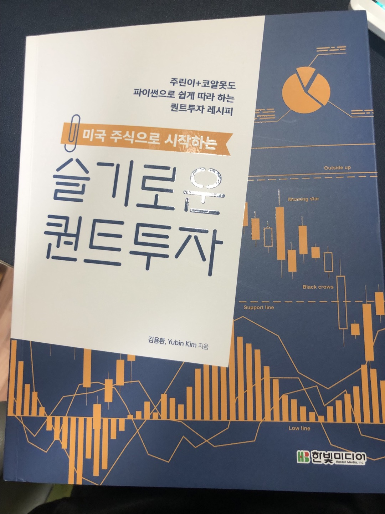

한빛 미디어 "나는 리뷰어다" 활동의 일환으로, 이번달에는 `<미국 주식으로 시작하는 슬기로운 퀀트투자>`를 받아 읽어보게 되었습니다. 책에 대한 간단한 리뷰입니다.
<!–-break-–>

이번에는 제 분야라고 할 수 있는 프론트엔드, 웹과는 다른 분야의 책을 읽게 되었는데요. 퀀트 투자라는 분야에 대해서 제대로 아는 부분이 없었는데, 어떤 방식으로 주식의 많은 지표들을 설정할 수 있고, 이를 실질적인 투자와 연결할 수 있는지 파악할 수 있던 책이었던것 같아 개인적으로 매우 신선했습니다.

전반적인 주식에 대한 설명도 꽤 많이 찾아볼 수 있어, 새로운 투자 관련 지식들을 알 수 있어 재미있었습니다. 그리고 주식의 등락을 주시하고 예측할 수 있게 마련된 여러 지표들이 굉장히 인상적이었는데요. 많은 사람들의 심리와 시장 상황이 복잡하게 결합되어 있는 주식 시장에서 조금이라도 믿을만한 예측을 얻기 위해 참 많은 사람들이 고민해왔다는 것이 느껴졌습니다.

pip환경에서 사용할 수 있는 퀀트 라이브러리도 꽤나 기능이 많아서 신기했습니다. 미국 주식 시장 종목 이름만 입력해도 최근 수치가 나오고 특정 지표를 쉽게 가져올 수 있다는 것이 되게 신기했어요. 코랩 환경에서도 쉽게 그래프와 데이터를 추출해낼 수 있어, 파이썬이 참 코딩 자체에 관심을 두지 않아도 쉽게 데이터와 관련된 로직들을 짤 수 있는, 굉장히 flexible하고 진입장벽이 높지 않은 언어인 것 같다는 생각이 들었습니다. 예제가 억지스럽지 않고 실제로도 이렇게 해볼 수 있다는 생각이 들었습니다.

> 한빛미디어 `<나는 리뷰어다>` 활동을 위해서 책을 제공받아 작성된 서평입니다.
