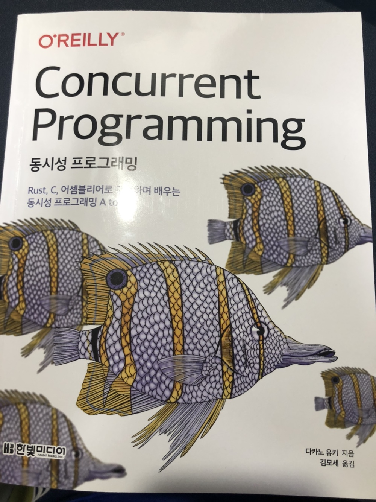

한빛 미디어 "나는 리뷰어다" 활동의 일환으로, 이번달에는 `<동시성 프로그래밍>`을 받아 읽어보게 되었습니다. 책에 대한 간단한 리뷰입니다.
<!–-break-–>

사실 프론트엔드 개발자로서 JS같은 고수준의 언어를 주로 다뤄왔기에, 프로세스나 스레드 수준의 여러 일들에 대해서는 제대로 이해하지 못한 채 개발을 하고있다는 생각이 자주 들었었는데요. 그 와중에 이 책을 읽게 되었습니다.

고수준의 영역에서는 아주 당연하게 비동기, 논블로킹 로직을 작성하면서 너무 당연해 간과하기 쉬웠던 부분이었는데 책을 읽으며 태스크의 동시성과 비동기성을 보장하기 위해 더 낮은 수준 단에서는 무슨 일이 일어나야 하는지 좀 더 이해해보는 계기가 되었던 것 같습니다. 컴퓨터 구조나 운영체제 시간에 배웠었던 CPU 자원의 문제나, 병렬적으로 스레드나 프로세스의 일을 처리할때 고려해야하는 여러 고민들을 흥미롭게 소개하고 있는 책입니다.

C, 어셈블리, Rust언어로 코드 예제가 제시되는데, 이를 위해 책의 앞선 부분에서 자세한 설명이 나오는 부분이 인상깊었습니다. 특히 Rust는 웹 생태계에 점점 들어오고 있는 언어이기도 한데요, 이번에 Rust에 대한 설명을 읽으면서 확실히 관심이 더 깊어진 것 같습니다. 소유권이나 차용 등 엄격한 GC와 메모리 관리를 위한 언어적 장치들이 확실히 인상 깊었던 것 같아요.

> 한빛미디어 `<나는 리뷰어다>` 활동을 위해서 책을 제공받아 작성된 서평입니다.
