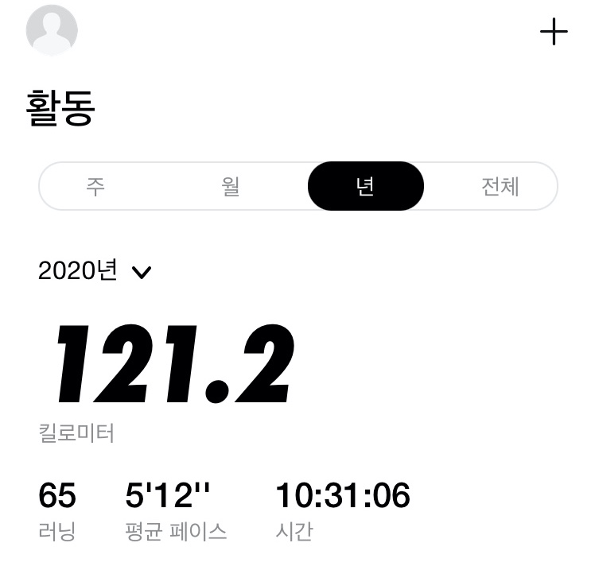

Despite the turmoil, 2020 was a year I'll remember for quite a few reasons, as it was a year of change for me personally. I worked on several personal projects, started a blog, and experienced my first job search and company hire. Here's a quick look back at 2020.

## 😎 Personal projects

I worked on three personal projects this year.

- [Foreign Studies End-of-Course Clock](https://github.com/MaxKim-J/HUFS-Semester-Clock-Extension)
- [Foreign Studies Double Major DB](https://github.com/MaxKim-J/HUFS-Second-Major-Visualize)
- [Case Summary Twitterbot](https://github.com/MaxKim-J/supreme-court-API)

All of them were a great opportunity to try out new technologies. I was able to develop a chrome extension with the foreign university end clock, understand data visualization and SVG with the double major DB, and develop a REST API server using express with the case summary bot.

I think this year's personal project was a bit of a release for me, as none of the outsourcing or projects I've been doing have been what I wanted to create, and it was the first time I was able to experience turning an abstract idea into a product, and do it entirely on my own.

Also, I think I had a lot of fun validating some of the business hypotheses that I had made during the planning phase... some of them were right, some of them were wrong. **Planning seems to be fun** The bell clock at foreign universities is especially well received by users, so we are still steadily updating it. Using my project as a reference, Hanyang University and Aviation University also have bell clock extension apps. (Proud)

I'm not sure if I'll do another personal project next year, but I think it's more urgent to fill in my CS knowledge first... If I do, I think I'll try to make a mobile app using React Native.

## 📝 Start a blog

When I started my blog in March 2020, I set a goal to not use it as a place to organize my TILs. I didn't want it to be a place to post bits and pieces of what I was learning, but rather a place where I would do a lot of research and write about my views on technology and some of my deeper thoughts to give readers insight.

In nine months, I've published 18 posts. I had a goal of 20, but I didn't make it. I spent a lot more time writing each post than I thought I would.

I still find writing difficult. Even though I'm an English literature major who studied writing a lot in college, there are still many points where I hesitate when writing about technology. The biggest one is that I doubt whether I'm doing a good job of explaining things, and I think I'll have to try more to get a feel for it.

The [map object syntax in JavaScript](https://maxkim-j.github.io/posts/js-map) and [analyzing the default webpack settings of CRA](https://maxkim-j.github.io/posts/cra-webpack-config) are the two posts that get the most traffic due to high search exposure, and I think the PV is around 7000. It's a weak figure, but I'd like to keep posting them.

## 👔 First job search and joining a company

In June 2020, after the semester ended, I started looking for a job and was able to land a position as a front-end development intern. I got to experience working with senior developers, which I really wanted to do.

When I joined the company, the senior had been developing on his own (my gunner), so the team itself was pretty much in its infancy, and not much was set in stone.

I suggested and documented conventions and codereview methods to help organize things, created an npm library to make tedious data conversion tasks easier for the team's productivity, and my feedback played a positive role in the company's stack change from Vue to React. I think my coworkers and the company have always been supportive of trying new things as the team builds, so I've been able to try a lot of interesting things.

I think I also gained a lot of soft skills such as how to do code reviews and how to communicate with designers, QA, and planners. I also gained new collaboration experiences by communicating and developing in English with Chinese developers working in China. I was lucky to be able to do the same work as a full-time employee and work as part of the same team, even though I was an intern.

The biggest thing I've gained is confidence. When I started looking for a job, I wasn't very confident in my abilities, so I had a lot of questions like, "Is there a company out there that would hire me?" and I was worried about what if I didn't do well while waiting for a job, but fortunately, that wasn't the case, and I was able to make small and big contributions, which gave me the confidence that I've grown a lot more than before.

## 😐 And regrets

(keyboard stealing)

However, I'm a **business-minded developer**, so working on a project for a company that specializes in solutions was frustrating. Working on projects with clients, I often found myself working in a situation where it wasn't clear how my development impacted the business.

I didn't really understand why certain requirements in the project were being modified or how they were being modified, and the planners at the company explained as much as they could, but... I don't need to convince the subcontractor's developers to work for me, because the client has already decided what I can contribute. I think the lack of influence was the reason for my demotivation.

In fact, it was also because I was tired of outsourcing and just developing solutions... one thing, then another, then another... I was deadline-driven, and I hated not being able to evolve the codebase or think about architecture to keep things maintainable.

But I think I've learned to compromise a bit, like what I care about and what I have to let go of in order to produce good code on time.

## 👋🏻 Postponed graduation and moved on to a new team.

At the end of the year, I moved to a **new company** because I felt unfulfilled at my current company this year, so I moved to a smaller development team where I think I can contribute better to the business. It's a company that primarily runs a fashion crowdfunding service. I'm looking forward to starting my first day in January.

As my internship was coming to an end, I was torn between three main options: go back to school and graduate quickly, work some more and go back to school, or take a year off and just study.

In the end, I decided to go back to work for the following reasons.

1. I wanted to gain experience in a service organization where I have a clear opportunity to contribute to the company's business and where there is a plan to continue maintaining the product for the long term.
2. I'm going to have to go back to school eventually, and I wanted to get a more diverse experience in a limited amount of time.
3. I still have a lot of gaps in my CS knowledge and studies, so I think I need a little more time to study.

## 🔄 Start managing your daily routine

Due to the coronavirus pandemic, my company switched to a full work-from-home system once in August and again in late November. In total, I think I've been working from home for about three months so far.

When I first started working from home, I was excited to not have to commute to work, and I was doing well and waking up in the morning. However, after about two to three weeks, my life started to fall apart. Some days, I was sleeping late and waking up right before my shift started, and I realized that my productivity was dropping, and I felt the need to manage my life.

To start with, I made an hourly plan and tried very hard to stick to it: I tried to go to bed and wake up at the same time, and I tried to be consistent with my time before work and after work.

I also felt like exercise was a must, because I rarely leave the house, I'm so inactive, and I'm sitting at my desk all the time, and I can't digest my food... I realized it was only a matter of time before my health would suffer, so I started working out at home. Before November, when Corona and the cold weren't so bad, I used to run in the schoolyard. I've run a total of 120 kilometers this year.

At this stage, my interest in health naturally grew, so I stopped drinking coffee and now drink tea. I've also started taking protein supplements and nutritional supplements while exercising, and I eat whole foods for one meal a day. I think these efforts are starting to pay off, and I feel less tired and lighter than before.

## 💵 Fun to consume

2020 was the year I spent the most money **over the age of 20**. It was also the first year that I earned money from a full-time job. I've always been very conscious of my living expenses, but for the first time since I was over 20, I had the weird experience of having quite a bit of money left over when I thought I had spent enough.

I think it opened my eyes to the fun of spending money. I didn't spend a lot of money because I bought something big, but I bought a lot of small and big things.

I don't really like having a lot of stuff in my house, so I've always been one to put up with the inconvenience and find ways to replace it as much as possible at home, but now that I have some money, I think I've realized that I can buy that inconvenience with money. It's like I went from running around the playground in my army jammies to buying a windbreaker now that I have money. It's not like I'm going to go back to being like I took the red pill...

Still, it's nice to have a lot of the inconvenience taken care of. I guess I'll have to try not to make too many impulse purchases, and I'll have to pay attention to what I'm being called as my income is slow.

## 🐈 Naive

At the end of November, my girlfriend and I rescued a sick kitten, whom we named Sunshine, and she's now living at my girlfriend's house, thankfully very healthy! I remember the day after we rescued her and took her to the vet, I couldn't go to work because I was so worried about how she was doing.

It made me realize how heavy a decision it is to take a small life and bring it to live with you. Well, actually, my girlfriend had a particularly hard time and I didn't do much... but it's one of the biggest things that happened this year, so I'm writing it down.

## What I want to do in 2021

1. **Study CS-related knowledge, especially algorithms** : These are the knowledge that I think I lack the most right now. In particular, I want to study PS a little deeper. I decided to participate in the algorithm study at school. I would also like to study computer structure and operating system knowledge to deepen my understanding of computers.
2. **Studying Java** : In 2020, while studying design patterns and architecture, I realized that I need to understand Java in order to fully understand object orientation. I also wonder if I will need to use Java someday.
3. **Read blockchain-related books and study lightly** : My interest in blockchain technology has increased as I've been reading books lately, so I'm going to start reading books and studying at a hobby level.
4. **Interact with other developers** : It's not easy because the corona crisis will continue, but... I would like to do more activities to interact with other developers, such as studying and projects.
5. **Be a good developer in a new team** : I want to be a developer who continues to find ways to contribute to the team in my new job and make good choices. I also need to work hard on the knowledge and skills that the team will require (especially React Native and infrastructure).
6. **Wake up faster in the morning**: I've been working on building good habits into my life to stay healthy and productive, so I want to be a really diligent human being.
7. **Take notes** : My boyfriend bought me a fountain pen for the end of the year, and I'm going to make it a habit to keep writing my favorite phrases on good paper to organize my day.
