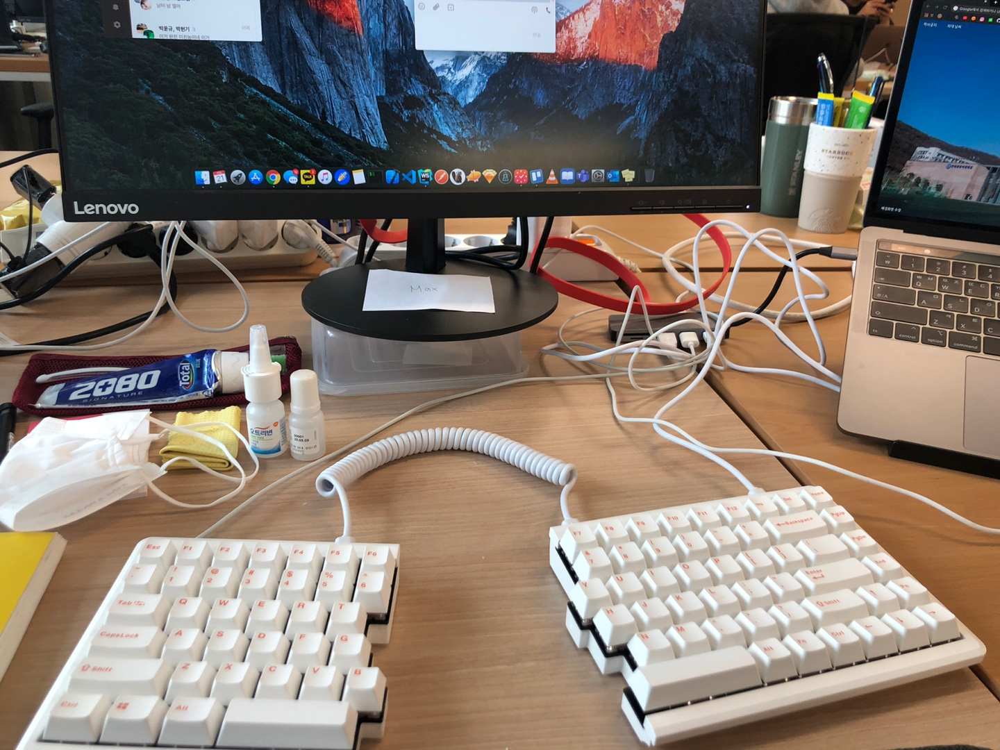

Despite the turmoil, 2020 was a year I'll remember for quite a few reasons. It was a year of change for me personally. I worked on several personal projects, started a blog, and experienced my first job search and company hire. Here's a quick look back at 2020.

## 😎 Personal projects

I worked on three personal projects this year.

- [Foreign Studies End-of-Course Clock](https://github.com/MaxKim-J/HUFS-Semester-Clock-Extension)
- [Foreign Studies Double Major DB](https://github.com/MaxKim-J/HUFS-Second-Major-Visualize)
- [Case Summary Twitterbot](https://github.com/MaxKim-J/supreme-court-API)

All of them were great opportunities to try out new technologies. I made a Chrome extension app called HUFS semester-end clock and understood data visualization and SVG. I also developed a legal case summary bot. I had to create a REST API server using Express to do this.

I think this year's personal project was satisfying for me, as none of the software outsourcing or projects I've been doing have been what I wanted to create. It was the first time I was able to experience turning an abstract idea into software and doing it entirely on my own.

Also, I had a lot of joy in validating some of the business hypotheses I had made during the planning phase. Some were right, some were wrong. **Product development planning seems fun to me.** The HUFS semester-end clock is incredibly well received by users, so I'm still steadily updating it. Using my project as a reference, another university in South Korea, such as Hanyang University or Korea Aerospace University, now has semester-end clock extension apps. (Proud)

I'm not sure if I'll do another personal project next year, but it's more urgent to fill in my CS knowledge first... If I do, I think I'll try to make a mobile app using React Native.

## 📝 Start a blog

When I started my blog in March 2020, I set a goal to not use it as a place to organize my TILs. I didn't want it to be a place to post bits and pieces of what I was learning but rather a place where I would do a lot of research and write about my views on technology and some of my more profound thoughts to give readers insight.

In nine months, I've published 18 posts. I had a goal of 20, but I didn't make it. I spent much more time writing each post than I thought.

Writing is always tricky for me. Even though I'm an English literature major who studied writing a lot in college, there are still many points where I have reservations when writing about technology. The biggest one is that I doubt whether I'm doing an excellent job explaining things, and I'll have to try more to get a feel for it.

The [Map object syntax in JavaScript](https://maxkim-j.github.io/posts/js-map) and [Analyzing the default webpack settings of CRA](https://maxkim-j.github.io/posts/cra-webpack-config) are the two posts that got the most traffic due to high search exposure. The page view is around 7000. It's not much, but I'd like to keep writing tech posts.

## 👔 First job search and joining a company

After the semester ended in June 2020, I started looking for a job and was able to land a position as a front-end development intern. I got to experience working with senior developers, which is what I really wanted to do.

When I joined the company, a senior developer was only part of the team, so the team itself was in its infancy, and more was needed.

I suggested and documented conventions and code review methods to help organize things, created an npm library to make tedious data conversion tasks easier for the team's productivity, and my feedback positively impacted the company's change from Vue to React. My coworkers and the company have always been supportive of trying new things as the team builds, so I've been able to try a lot of interesting things.

I also gained many soft skills, such as how to do code reviews and communicate with designers, QA, and product managers. I also gained new collaboration experiences by communicating and developing in English with Chinese developers working in China. I was lucky to do the same work as a full-time employee and work as part of the same team, even though my position was an intern.

The biggest thing I've gained is confidence. When I started looking for a job, I wasn't very confident in my skills, so I had a lot of questions like, "Is there a company out there that would hire me?" I was worried about what would happen if I didn't do well. But fortunately, that wasn't the case. I made a few significant contributions, which gave me the confidence that I've grown a lot more than before.

## 😐 And regrets

(keyboard stealing)

However, I'm so into how businesses work, so working on a project for a company specializing in outsourcing solutions was frustrating. When working on projects with clients, I often found myself in a situation where it wasn't clear how my development impacted the business.

I didn't really understand why or how specific project requirements were being modified. Despite the product managers explaining as much as possible, clients don't need to convince the subcontractor's developers because the client has already decided what I can contribute. The lack of influence was the reason for my demotivation.

In fact, it was also because I was tired of outsourcing and developing some boring solutions: one thing, then another, then another. I was deadline-driven, and I hated being unable to evolve the codebase or think about the architecture to keep things maintainable.

But I've learned to compromise a bit in this situation, which I'm not fond of. I have to decide what I care about and what I must let go of to produce good code on time.

## 👋🏻 Postponed graduation and moved on to a new team.

At the end of the year, I moved to a new company because I felt unfulfilled at my current company this year, so I moved to a more minor development team where I could contribute better to the business. It's a company that primarily runs a fashion crowdfunding service. I'm looking forward to starting my first day in January.

As my internship ended, I was torn between three main options: returning to school and graduating quickly, working some more and returning to school, or taking a year off and studying.

Ultimately, I decided to return to work for the following reasons.

1. I wanted to gain experience in a service organization where I have a clear opportunity to contribute to the company's business and where there is a plan to continue maintaining the product for the long term.
2. I will have to return to school eventually, and I wanted to get a more diverse experience in a limited time.
3. I still have a lot of gaps in my CS knowledge and studies, so I need more time to study.

## 🔄 Start managing your daily routine

Due to the pandemic, my company switched to a complete work-from-home system once in August and again in late November. I've been working from home for about three months so far.

When I started working from home, I was excited to not have to go to work by subway. However, my life fell apart after about two to three weeks. Some days, I slept late and woke up right before stand-up meetings started, and I realized that my productivity was dropping. I felt the need to manage my life.

First, I made an hourly plan and tried very hard to stick to it: I tried to go to bed and wake up at the same time, and I tried to be consistent with my time before and after work.

I also felt like exercise was a must because I rarely leave the house, I'm so inactive, sitting at my desk all the time, and I can't digest my food... I realized it was only a matter of time before my health would suffer, so I started working out at home. Before November, when Corona and the cold weren't so bad, I used to run in the schoolyard. I've run a total of 120 kilometers this year.

My interest in health naturally grew at this stage, so I stopped drinking coffee and now drink tea. I've also started taking protein and nutritional supplements while exercising, and I eat whole foods for one meal daily. These efforts are beginning to pay off, and I feel less tired and lighter.

## 💵 Fun to consume

2020 was the year I spent the most money **over the age of 20**. It was also the first year I earned money from a full-time job. I've always been very conscious of my living expenses, but for the first time since I was over 20, I had the weird experience of having some money left over when I thought I had spent enough.

It opened my eyes to the joy of spending money. I bought many small and big things.

I don't really like having a lot of stuff in my house, so I've always been one to put up with the inconvenience and find ways to replace it as much as possible at home, but now that I have some money, I think I've realized that I can buy that inconvenience with cash. I went from running around the playground in my air-force jacket to buying a windbreaker now that I have some money. It's not like I'm going to go back to being like I took the red pill in the Matrix movie.

Still, it's nice to have handled much of the inconvenience. I'll have to try not to make too many impulse purchases, and this is a great time to start paying attention to investing or increasing my assets.

## 🐈 Naive

At the end of November, my girlfriend and I rescued a sick kitten whom we named Sunshim(There isn't an excellent word to translate this little kitten's name to English... closely this meaning "soft mind" or something). He's now living at my girlfriend's place, thankfully very healthy! I remember the day after we rescued her and took her to the vet, I couldn't go to work because I was so worried about how she was doing.

It made me realize how difficult it is to take a small life and bring it to life with you. My girlfriend had a tough time, and I didn't do much... but it's one of the biggest things that happened this year, so I'm writing it down.

## What I want to do in 2021

1. **Study CS-related knowledge, especially algorithms** : These are the knowledge I lack the most right now. In particular, I want to study PS deeper. I decided to participate in the algorithm study at school. I would also like to study computer structure and operating system knowledge to deepen my understanding of computers.
2. **Studying Java** : In 2020, while studying design patterns and architecture, I realized that I need to understand Java to fully understand object orientation. I also want to know if I will need to use Java someday.
3. **Read blockchain-related books and study lightly** : My interest in blockchain technology has increased as I've been reading books lately, so I will start reading books and learning at a hobby level.
4. **Interact with other developers** : It's not easy because the coronavirus crisis will continue, but... I want to do more activities to interact with other developers, such as studying and projects.
5. **Be a good developer in a new team** : I want to be a developer who continues to find ways to contribute to the team in my new job and make good choices. I also need to work hard on the knowledge and skills that the team will require (especially React Native and infrastructure).
6. **Wake up faster in the morning**: I've been working on building good habits to stay healthy and productive, so I want to be diligent.
7. **Take notes** : My boyfriend bought me a fountain pen for the end of the year, and I will make it a habit to keep writing my favorite phrases on good paper to organize my day.
