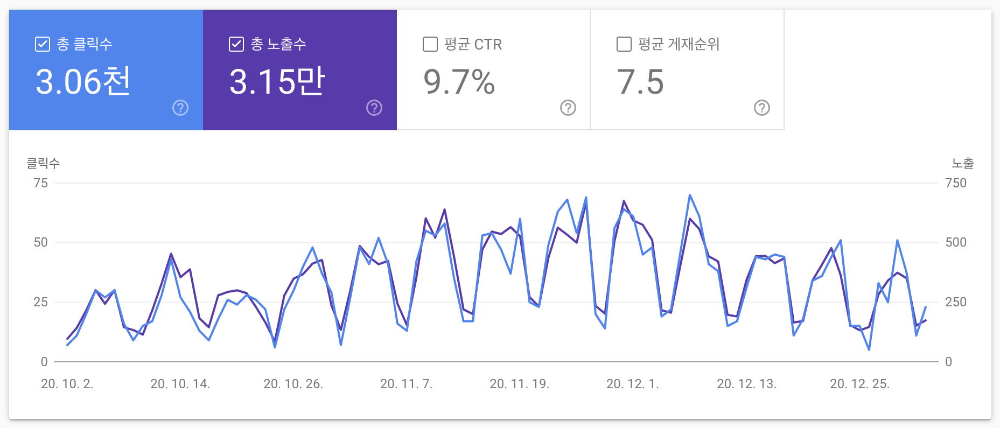
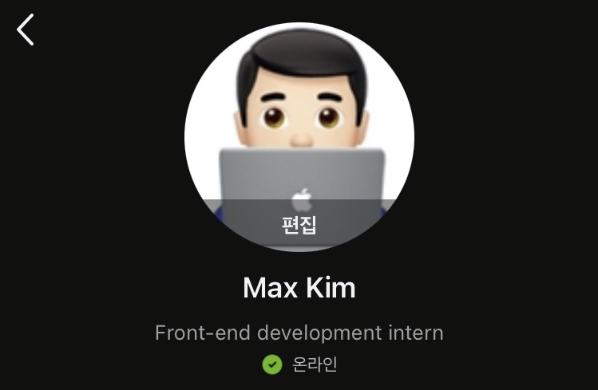
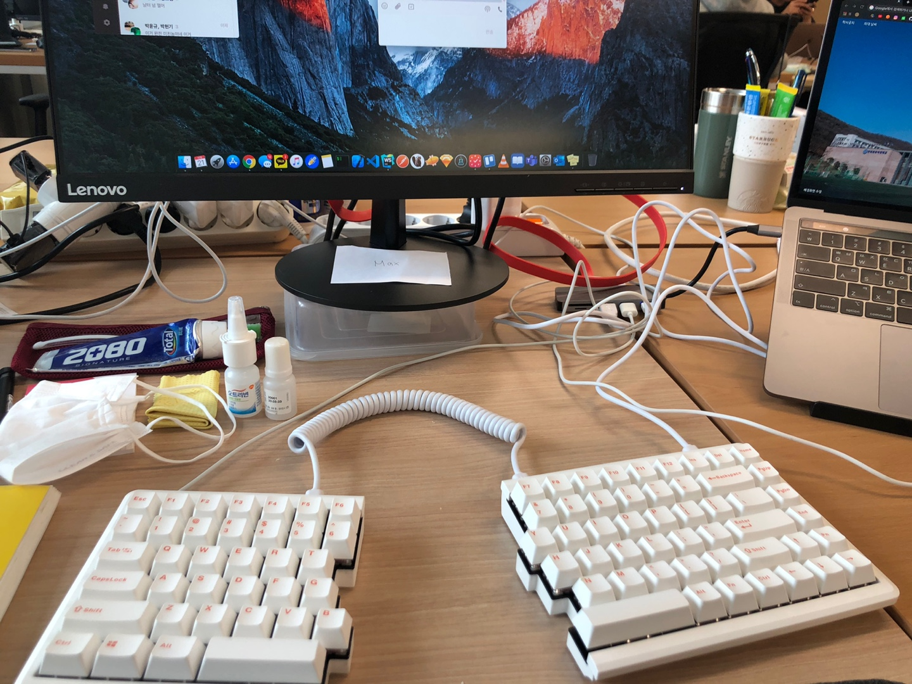
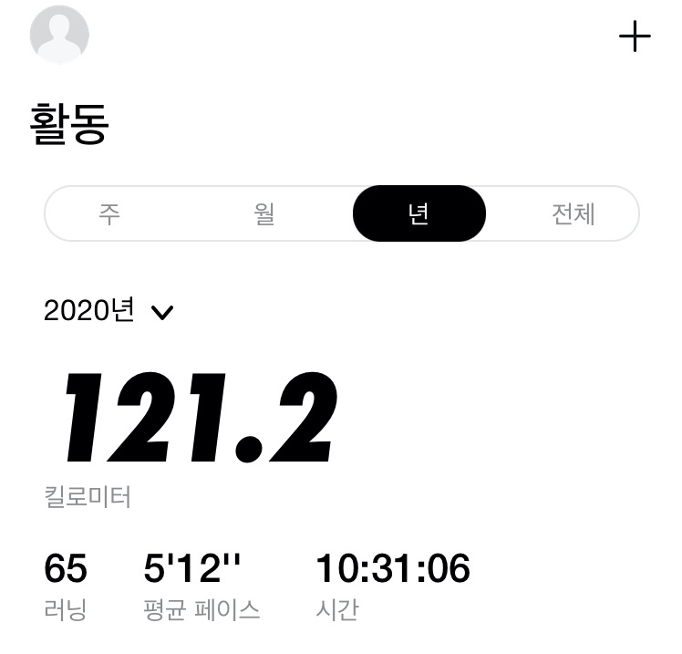
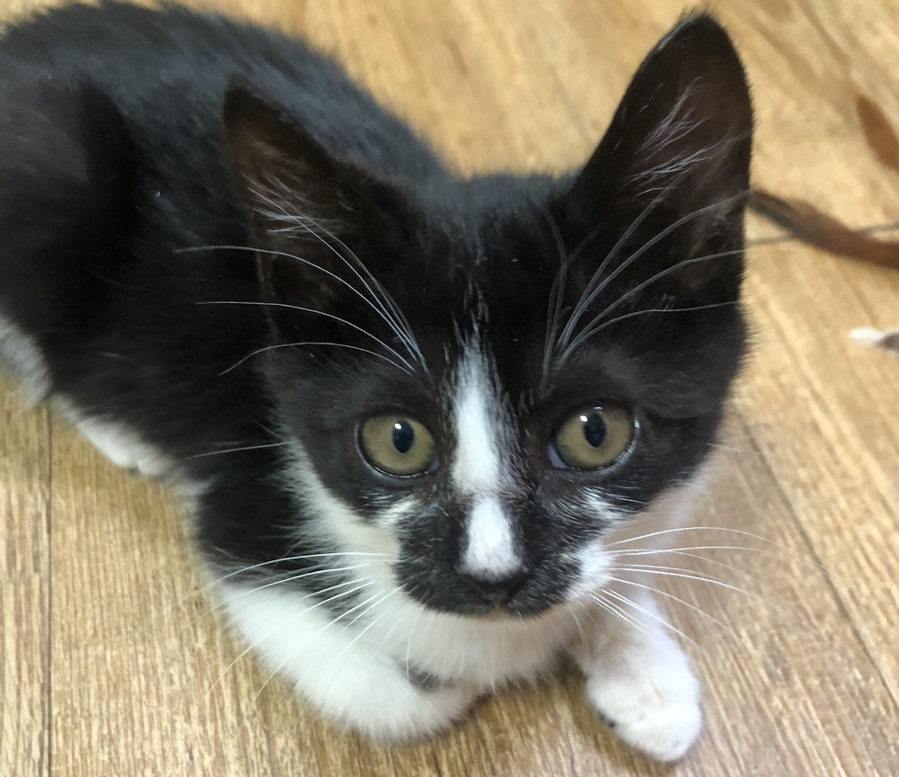

혼란한 시국 속에서도 2020년은 개인적으로 꽤나 많은 변화들이 생겨서 여러모로 기억에 많이 남을 것 같은 한 해가 되었습니다. 개인 프로젝트를 여러개 진행했고, 블로그를 시작했고, 첫 번째 구직과 회사 입사도 경험했습니다. 2020년을 간단히 돌아보려 합니다.

## 😎 개인 프로젝트

올해 3개의 개인 프로젝트를 진행했습니다.

- [외대 종강시계](https://github.com/MaxKim-J/HUFS-Semester-Clock-Extension)
- [외대 이중전공 DB](https://github.com/MaxKim-J/HUFS-Second-Major-Visualize)
- [판례요지 트위터봇](https://github.com/MaxKim-J/supreme-court-API)

모두 새로운 기술을 시도해보는 좋은 기회가 되었습니다. 외대 종강시계로 크롬 익스텐션 개발을, 이중전공 DB로 데이터 시각화와 SVG에 대한 이해를, 판례요지봇으로 express를 이용한 REST API 서버 개발을 시도해볼 수 있었습니다.

저한테 올해의 개인 프로젝트는 뭔가 **한을 푸는** 계기가 되었던 것 같습니다. 그동안 해왔던 외주나 프로젝트는 제가 만들고 싶었던 것들은 아니었거든요. 추상적인 아이디어가 프로덕트로 바뀌는 경험을 처음으로, 온전히 스스로 해볼 수 있었기도 했고요.

또한 기획 단계에서 세웠던 일종의 비즈니스 가설들이 어떤건 맞고 어떤건 틀리고... 그랬는데 그것을 검증하는 과정에서 재미를 많이 느꼈던 것 같습니다. **기획은 재미있는 것 같습니다.** 외대 종강시계는 그 중에서도 특히 유저분들의 호응이 좋아서 지금도 꾸준히 업데이트를 진행하고 있습니다. 제 프로젝트를 참고해서 한양대와 항공대에도 종강시계 익스텐션 앱이 생기기도 했고요.(뿌듯)

내년에 개인 프로젝트를 또 진행할지는 잘 모르겠습니다. 일단 CS 지식을 채우는게 급선무인 것 같다는 생각이 많이 들어서... 만약에 시도해본다면 리액트 네이티브를 이용한 모바일 앱을 만들지 않을까 생각합니다.

## 📝 블로그 시작

2020년 3월부터 블로그를 시작했습니다. 시작할 때, **블로그를 TIL을 정리하는 공간으로 쓰지 말자라는 목표를 정했습니다.** 공부하는 것을 단편적으로 올리는 블로그가 아니라, 리서치도 많이 해보고 기술에 대한 저의 견해나 조금이라도 더 깊은 생각들을 정리해 읽는 사람에게 인사이트를 주는 글을 쓰고 싶었습니다.

9개월동안 18개의 글을 올렸네요. 20개가 목표였는데 지키지는 못했습니다. 생각보다 글 하나를 쓰는데 꽤 시간을 많이 쏟았습니다.

글을 쓰는건 여전히 어려운 것 같습니다. 대학에서도 글쓰는 것을 많이 공부했었던 영문학도지만, 기술 관련 글을 쓸 때 망설여지는 지점은 여전히 많습니다. 제 스스로가 설명을 잘 하고 있는건지 너무 의심이 된다는게 가장 크고요. 더 해봐야 감을 잡을 수 있을 것 같습니다.

자바스크립트의 [map 객체 문법을 정리했던 포스팅](https://maxkim-j.github.io/posts/js-map)과, [CRA의 기본 webpack 설정을 분석하는 글](https://maxkim-j.github.io/posts/cra-webpack-config)이 검색 노출이 많이 되어 트래픽이 제일 많고, 얼추 PV는 7000 정도를 넘은 것 같습니다. 미약한 수치지만 앞으로도 꾸준히 글을 올리고 싶습니다.

## 👔 첫 구직과 회사 입사

2020년 6월에 학기가 끝나고 구직을 했고, 프론트엔드 개발 인턴으로 취직을 할 수 있게 되었습니다. 정말 하고싶었던 시니어 개발자와의 협업도 경험했습니다.

스스로가 팀에 보탬이 되고 싶어하는 개발자라는 것을 알 수 있었습니다. 회사에 입사했을 당시에는 원래 시니어분 혼자서(제 사수) 개발을 계속 해오셔서 팀 자체는 거의 초기 상태라, 정해진 것이 많이 없었습니다.

컨벤션과 코드리뷰 방법을 제안하고 문서화해서 정리해보기도 했고, 팀의 생산성을 위해 귀찮은 데이터 변환 작업을 쉽게 해주는 npm 라이브러리를 만들기도 했습니다. 회사가 기존에 사용하던 Vue에서 React로 스택을 바꾸는 과정에서 제 피드백이 긍정적인 역할을 하기도 했습니다. 팀이 만들어지는 과정에서의 새로운 시도를 동료분들과, 회사가 항상 좋게 봐주셔서 흥미로운 시도들을 많이 할 수 있었던 것 같습니다.

코드리뷰를 어떤 식으로 해야할지, 디자이너, QA, 기획자분들과의 소통은 어떻게 해야 좋은지와 같은 소프트 스킬도 많이 늘었던 것 같아요. 중국에서 일하는 중국인 개발자분들과 영어로 소통하고 개발하면서 새로운 협업 경험을 쌓을 수도 있었고요. 인턴이지만 정규직과 똑같은 일을 하고, 똑같은 팀의 일원으로서 일할 수 있었던 것도 행운이었던 것 같습니다.

가장 크게 얻은건 **자신감**입니다. 구직을 시작했을 때는 스스로 실력에 대한 확신이 부족했던 상태다 보니, **'나한테 일을 시킬 회사가 있을까?'** 하는 의문이 많이 들었었고, 입사 대기를 하면서 너무 못하면 어떡할지...와 같은 걱정이 많았습니다. 하지만 다행히도 그정도는 아니었고, 크고 작은 기여들을 할 수 있어 이전보다 많이 성장했다는 자신감을 얻을 수 있었어요.

## 😐 그리고 아쉬움

(키보드 시선강탈)

다만 저는 **비즈니스에 관심이 많은 개발자라서**, 솔루션을 전문으로 하는 회사의 프로젝트를 진행하면서 답답한 면이 있었습니다. 클라이언트가 있는 프로젝트의 개발을 하다 보니 **내가 하는 개발이 비즈니스에 어떤 영향을 미치는지 명확히 알 수가 없는 상황에서 개발을 하는 경우**가 잦았습니다.

프로젝트의 어떤 요구사항이 왜 수정되는지, 어떤 과정을 통해 수정되는지 잘 몰랐습니다. 회사의 기획자분들이 최대한 설명해주시긴 했지만, 뭐... 클라이언트가 일을 시키는 입장에서 하청업체의 개발자들을 납득시킬 필요는 없으니까요. 제가 기여할 수 있는 부분도 이미 정해져 있고요. 영향력을 발휘할 수 없다는 점이 동기부여가 잘 안되는 이유였던 것 같습니다.

사실 그동안 외주를 해오던 상태에서 또 솔루션 개발만 하니 지쳐있던 것도 컸습니다. 하나 다 만들고 또 다른 하나 만들고... 납기를 중시하다 보니, 코드베이스를 발전시키거나 유지 보수를 원활히 지속하기 위해 아키텍처를 고민할 수 없는 상황이 싫었습니다.

그래도 그나마 타협하는 법은 좀 배웠던 것 같습니다. 정해진 시간 안에 꽤 괜찮은 코드를 만들기 위해서 무엇을 신경쓰고 무엇부터 포기해야 하는지 같은거요.

## 👋🏻 졸업을 미루고 새로운 팀으로

연말에 **새로운 회사로 이직을 했습니다.** 올해 회사에서 느낀 아쉬움 때문에 제가 비즈니스에 좀 더 잘 기여할 수 있다고 생각하는 더 작은 개발팀으로 이직했습니다. 지금은 주로 패션 클라우드 펀딩 서비스를 운영하는 회사입니다. 1월 중 첫 출근을 앞두고 있습니다.

인턴이 끝나가면서 고민이 많았습니다. 복학을 해서 빨리 졸업을 해야할지, 일을 좀 더 하고 학교로 돌아갈지, 아니면 아예 휴학을 하고 공부만 할지 크게 이 3가지 선택지 사이에서 고민했었던 것 같아요.

결국 다시 한번 일을 해보기로 결정한 것에는 다음과 같은 이유가 있는데요.

1. 회사의 비즈니스에 확실히 기여할 수 있는 기회가 있고, 프로덕트를 장기적으로 계속해서 유지 보수할 계획이 있는 서비스 조직에서의 경험을 해보고 싶어서
2. 결국 학교로 돌아가야할 처지인데, 한정된 시간 안에 조금 더 다양한 경험을 해보고 싶어서
3. 아직 CS 지식이라던가 공부가 부족한 부분이 많기 때문에 공부할 시간이 조금은 더 필요하다고 생각해서

## 🔄 생활 루틴 관리 시작

코로나 유행 때문에 회사가 8월에 한번, 그리고 11월 말부터 전면 재택근무 체제로 전환되었었는데요. 합치면 지금까지 한 3달 정도 재택근무했던 것 같습니다.

처음 재택근무를 시작했을 때는 출퇴근을 안 해도 된다는게 너무 좋아서 일도 잘되고 아침에도 잘 일어났었습니다. 그런데 2~3주 정도가 지나고 나서는 생활이 무너지기 시작했습니다. 어떤 날은 새벽에 늦게 자고 근무 시작 직전에 깨기도 하면서 생산성이 떨어지고 있다는 것을 느끼고 생활 관리의 필요성을 강하게 느꼈습니다.

일단 먼저 시간별 계획을 짜고 이행하려고 무지 노력했습니다. 같은 시간에 자고, 일어나려 노력했고 출근 전 시간과 퇴근 후 시간을 일관성있게 보내려 했습니다.

그리고 운동은 무조건 해야할 것 같았습니다. 집을 거의 떠나지를 않으니 활동량이 너무 줄어드는데 책상에 길게 앉아 일은 계속 하고 있으니 소화도 안 되고... 이대로 가다간 건강이 망가지는건 시간문제인 것 같아 홈트레이닝을 시작했습니다. 코로나와 추위가 그렇게 심하지 않았던 11월 이전에는 학교 운동장에서 달리기도 했습니다. 올해 총 120키로를 뛰었네요.

이 단계에서 자연스럽게 건강에 대한 관심이 커져서, 요즘은 커피를 끊고 차를 마시고 있습니다. 운동을 하면서 단백질 보충제나 영양제도 먹기 시작했고, 하루에 한 끼는 자연식만 먹습니다. 이런 노력들이 슬슬 효과를 보기 시작해서, 전보다 피곤이 좀 덜하고 몸이 좀 가벼워지고 있다는 생각이 듭니다.

## 💵 소비의 재미

2020년은 스무살 넘어서 **돈을 가장 많이 쓴 한 해**입니다. 사실 정식으로 직장에서 돈을 번 첫 해이기도 하니까요. 원래 생활비를 많이 의식해서 돈을 썼었습니다. 그런데 스무살 넘어 처음으로 쓸만큼 돈을 썼다고 생각했는데 꽤나 돈이 남아버리는 기묘한 경험을 했습니다.

돈 쓰는 재미에 눈을 뜬 것 같습니다. 돈을 많이 썼다는게 큼직큼직한 걸 구입해서 그런게 아니라 그냥 크고 작은 물건들을 많이 샀습니다.

원래 집에 물건들이 많은 것을 별로 좋아하지 않아서 불편함을 참고 집에서 최대한 대체할 수 있는 방법을 찾는 편이었는데, 여유가 좀 생기니까 그 불편함마저 돈으로 사버릴 수 있다는 것을 깨달아버린 것 같습니다. 군대에서 가지고 나온 깔깔이를 입고 운동장 뛰러 갔던 제가 돈을 벌게 되니 바람막이를 사는 식입니다. 빨간약을 먹은 것처럼 다시 이전으로 돌아갈 수는 없겠죠...

그래도 불편함이 많이 해결되서 좋기는 합니다. 너무 충동구매를 하지 않으려고 노력해야 될 것 같고, 소득이 느는 만큼 좀 불리는데도 관심을 많이 가져야 할 것 같습니다.

## 🐈 순심이

11월 말에 애인과 병든 아기고양이를 구조했습니다. 이름은 순심이라고 지었어요. 지금은 다행히도 너무 건강히 애인 집에서 잘 살고 있어요! 구조하고 병원 데려간 다음날 회사 출근해서 잘 있는지 너무 걱정해서 일을 못했었던 기억이 생생합니다.

작은 생명을 거두어 같이 산다는 결정이 얼마나 무거운 것인지 잘 알게 되었습니다. 뭐 사실 애인이 특히 고생했고 제가 한건 많이 없지만... 그래도 올해 일어난 일 중에선 큰 일중에 하나라서 기록해봅니다.

## 2021에 하고 싶은 것

1. **CS 관련 지식, 특히 알고리즘 공부하기** : 지금 가장 부족하다고 생각하는 지식들입니다. 특히 PS 공부를 좀 더 깊게 해보고 싶습니다. 학교에서 하는 알고리즘 스터디에 참여하기로 했습니다. 컴퓨터 구조와 운영체제 관련 지식들도 공부해서 컴퓨터에 대해 더 깊게 이해하고 싶습니다.
2. **Java 공부하기** : 2020년에 디자인 패턴과 아키텍처를 공부하면서 객체지향을 충실하게 이해하려면 결국 Java에 대한 이해가 필요하지 않나 싶은 생각이 들었습니다. 언젠가 Java를 쓸 일이 생기지 않을까 하는 생각이 들기도 하고요.
3. **블록체인 관련 책 읽고 가볍게 공부해보기** : 최근 책을 읽으면서 블록체인 기술에 대한 관심이 부쩍 늘었습니다. 일단은 가볍게 책을 읽으면서 취미 수준으로 공부해볼까 합니다.
4. **다른 개발자들과 교류하기** : 코로나 시국이 지속될거라 쉽지 않기는 하지만... 스터디나 프로젝트 등 다른 개발자들과 교류할 수 있는 활동을 좀 더 해보고 싶습니다.
5. **새로운 팀에서 좋은 개발자 되기** : 새로운 직장에서 팀에 기여할 수 있는 방법을 계속해서 찾고 좋은 선택을 하는 개발자가 되고 싶습니다. 팀에서 요구할 지식과 기술들도(특히 React Native, 인프라) 열심히 공부해나가야 합니다.
6. **아침에 더 빨리 일어나기** : 건강과 생산성을 유지하기 위해 좋은 습관들을 제 삶에 붙이는 작업을 했으니, 정말 부지런한 인간이 되보고자 합니다.
7. **필사하기** : 애인이 연말 선물로 만년필을 사줬습니다. 좋은 종이에 제가 좋아하는 문구들을 계속 써나가며 하루를 정리하는 습관을 들일 생각입니다.
