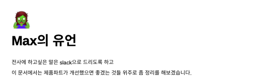
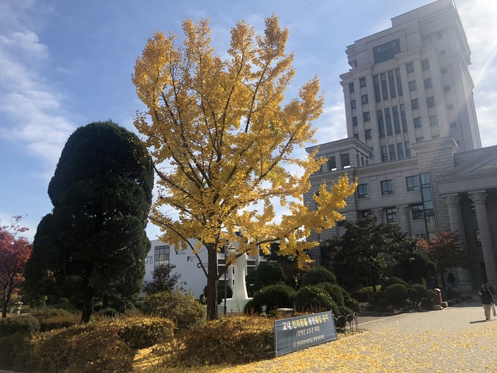
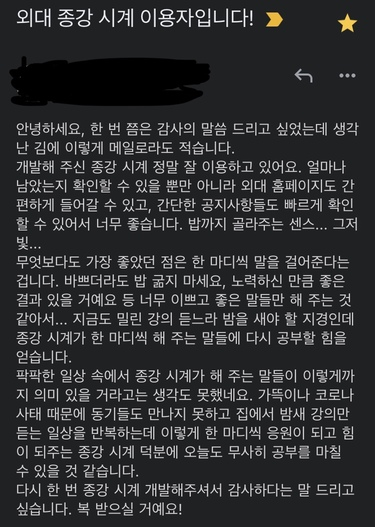
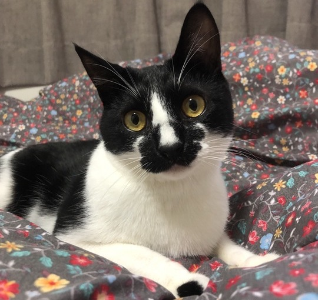

2021년은 정신없었습니다. 다양한 일이 있었고 여러가지 공부를 했고, 직장인이었다가 학생이었다가 했습니다. 올해는 전반적으로 좋았다 나빴다 평을 내리기가 힘듭니다. 후회도 많이 되고, 얻은 것도 많은 한 해였습니다. 불편한 상황에 놓인 적도 많고, 깨지면서 배우는 것도 많았던 것 같습니다.

# 1. 직장

올해 1월부터 9월 되기 전까지는 [모예](https://moye.kr/)라는 회사에 다녔습니다. 패션 프리오더 플랫폼을 서비스하는 초기 스타트업입니다. 입사하고 보니 프론트엔드 팀 리드가 되어 있었는데요.

입사 초기에는 제가 제품을 바라보는 관점에서 어떤게 문제이고, 어떤게 우선적으로 개선이 필요한지 찾는데 어려움을 겪었던 것 같습니다. 이게 진짜 문제인가? 이런거 말해도 되나? 하는 생각 때문에 기술 리드나 다른 팀원들에게 의견 개진하는 것도 망설여졌고요. 하지만 시간이 지날수록 문제와 개선점에 대한 생각을 선명하게 전달할 수 있었습니다. 리서치와 검증을 통해 설득을 할 수 있는 근거를 만들기 위한 노력도 많이 했었고요.

마일스톤을 맞추기 위한 집중을 많이 했던 시기이기도 합니다. 당시 회사는 프로덕트의 빠른 기능 확장을 원했고 태스크는 항상 부족한 인력으로 빠듯한 시간 안에 해결되어야 했습니다. 그래서 어떻게 하면 레거시의 복잡도를 낮추면서 기능을 편하고 빠르게 붙일 수 있을지, 또한 일하는 프로세스를 어떻게 더 효율적으로 바꿀지에 대한 고민을 중점적으로 했던 것 같습니다.

문서화를 좋아해서 여러 사내 문서들을 만들었습니다. 새로운 기술 도입에 대한 리서치 문서, RN 프로젝트를 진행하면서 만났던 생소한 에러들을 아카이빙하는 문서도 있었고 마지막 출근일에도 문서를 쓰고 있었습니다. 앞으로의 남은 과제, 그리고 신경써야 할 것들을 정리한 수 장 짜리 유언(...) 문서를 쓰고 퇴사했습니다.

서로가 정신없고 너무 바빴기 때문에 구두가 아닌 문서를 통해서 오가는 인사이트나 의견들이 꽤 중요하고 오래 남았던 것 같습니다. 그래서 문서를 자율적으로 작성하고 공유하는게 팀에게 도움이 어느정도 되지 않았나 생각합니다.

지나가고 보니 후회가 더 크게 눈에 들어오지만 많이 배웠습니다. 팀원들에게 좋은 리뷰를 달고 싶어 책 읽고 공부하면서 코드의 질도 많이 상승했습니다. 당장 라이브되는 서비스를 운영하는데 필요한 많은 지점들을 알게 되었습니다. Fallback UI나 예외처리, 에러 모니터링이 왜 중요한지도 감을 잡게 되었습니다.

이렇게 우당탕탕하며 얻은 가장 중요한 자산 중에 하나는, **“나는 어디서든지 배우고 성장할 수 있다”** 라는 자신감이었습니다.

물론 주니어가 초기 스타트업에서 스스로 배우는 것은 느리고 때로는 한계가 생기기 마련이라 성장 그래프를 가파르게 만들기 위해서는 좋은 팀과 좋은 시니어가 있어야 할 것입니다.

하지만 모예에서의 시간은 시니어를 비롯한 충분한 팀원 없이 마일스톤에 쫓기는 극한 상황에서도 스스로를 발전시키는 역량을 확인했다는 것에 의미를 두고 싶습니다. 그러면서도 팀과 회사에 일정 부분 기여할 수 있었던 값진 시간이었다고 회고합니다.

# 2. PS

알고리즘을 공부한 한 해였습니다. 많이는 아니지만 1년 내내 백준, 릿코드, 프로그래머스 통틀어 약 300문제정도 푼 것 같습니다. 직장 다니면서도 조금씩 했고, 복학하고 나서도 꽤 난이도가 있는 알고리즘 문제들을 풀면서 PS 역량을 많이 늘린 한 해였습니다.

원래 CS와 알고리즘에 갈증이 있었고, 졸업 전의 기간이 마지막으로 PS를 공부해볼 수 있는 기간이 아닌가 생각해서 올해는 알고리즘 문제를 꾸준히 풀어보았습니다.

원래는 카카오 코테를 비롯한 대기업 공체에 응시하려는 마음으로 알고리즘 공부를 하느라 난이도 있는 문제 위주로 접했었는데, 최근에 구직에 대한 기준이 조금 바뀌면서 요새는 라이브 코딩 연습 위주로 코딩 문제를 풀어보고 있습니다.

PS 푸는건 비유하자면 스타크래프트같은 전략 게임을 하는 것과 비슷해서, 한정된 시간 안에 좋은 판단력으로 명징한 해결책을 내야 하고, 문제 푸는 과정 중의 잘못된 결정 하나가 그 문제를 못 풀게끔 만들기도 합니다. 몇 분 내지는 몇 시간동안 고도의 집중력을 유지하는 피지컬(!)도 꽤나 중요한 부분이고요. 한정된 시간 안에 특정한 문제를 풀어내는 연습이 개발 프로젝트를 진행하는데도 큰 도움이 되었습니다.

PS공부의 은근한 수혜 중에 하나가 사용하는 언어의 면면을 더 잘 이해할 수 있게 된다는 것 같습니다. JS로 문제를 풀면서, 프로덕트 개발에 잘 쓰지 않는 메소드나 문법에 대해서도 많이 연습할 수 있었던 부분도 도움이 많이 되었었던 것 같습니다.

# 3. 복학과 졸업

9월에 복학을 했습니다. 일과 학업을 병행하기에는 학점이 너무 많이 남아있었기에 다시 전업 학생으로 돌아갔습니다. 해야하는 것 미루면서 학교를 방만하게 다닌 탓입니다... 그래도 이번 학기 다니면서 졸업에 한걸음 더 다가갈 수 있게 되었습니다.

이제 영문학이라는 제 전공이 개발이라는 제 업과 별로 상관이 없다 보니 가벼운 마음으로 학교를 다닐 수 있게 된 듯 합니다. 사실 그동안 인문학과 글쓰기가 좋아서 선택한 전공인데 학점 때문에 스트레스 받는게 싫었습니다. 학점을 잘 받는다고 인문학이나 세상, 타인을 잘 이해하는 것도 아니라고 생각해서요.

그래서 이번 학기는 오히려 학점을 신경쓰지 않았어서 영문학이 더 좋아졌습니다. 하지만 학기 말로 갈수록 공부를 하기는 해야하는지라, 개발할 시간이 자꾸 줄어서 스트레스를 받긴 했습니다. 그래서 기말을 거의 던져버렸지만(...)그래도 제가 왜 영문학을 좋아하는지 다시 돌아볼 수 있는 좋은 시간이었습니다.

대학을 거의 7년째 다니고 있는 셈인데... 올해는 빨리 대졸자가 되고 싶습니다.

# 4. 개인프로젝트 유지 보수

2021년 9월부터 [외대 종강시계의 2.0 버전](https://github.com/MaxKim-J/hufs-semester-clock-v2)을 만들고 있습니다. 보일러 플레이트 구성부터 아예 처음부터 만들고 있습니다. 2년 전에 작성한 외대 종강시계의 Vue 코드는 이제 어디 보여주기에 부끄러운 코드가 되어버렸습니다. 졸업 전에 제가 지금까지 배워온 것을 바탕으로 제가 생각하는 이상적인 방향으로, 시간이 좀 걸리더라도 좋은 프로젝트를 만들고 싶다는 염원이 있습니다. 회사 들어가면 또 마일스톤과 저의 생산성을 고려해야 하니까 여유롭게, 내 맘대로 프로젝트를 할 수 있는 시기는 또 이번이 마지막이 아닐까... 하는 마음도 있습니다.

또 최근에는 [판례요지 트위터봇](https://github.com/MaxKim-J/supreme-court-tweet-bot)의 EC2 서버를 Firebase 서버리스로 이관했습니다. CI/CD 파이프라인을 따로 구축해놓지 않아 코드를 수정해서 배포하고 관리하기가 힘이 들고, 거의 1년동안 과금이 한 달에 3만원씩 나와서가 가장 큰 이유였습니다(...) 클라이언트에서는 SSR을 도입해 썸네일을 동적으로 붙이며 화면 로딩 시간을 줄이고, 서비스의 대부분이 모바일 트래픽이라 모바일에 더 맞게 UI를 개선하는 작업 등을 진행했습니다.

이 두 프로젝트를 유지한지 거의 2년여가 되어갑니다. 유저는 트위터 봇의 팔로워 300명, 종강시계 사용자 600명 정도 합쳐서 900명쯤 됩니다. 어떤 기술을 연습하고 싶어서 프로젝트를 시작하는게 아니라, 서비스에 맞는 기술들을 차차 고민해가면서 개인 프로젝트를 유지보수 하는 것이 공부가 많이 됩니다. 적지만 실질적인 유저가 있어서 가능한 부분이 아닌가 생각합니다. 유저 분들의 피드백을 모으면서 유저 중심으로 생각하며 프로젝트를 개선하는 것에 대해 많이 생각해보고도 있고요.

또 올해는 이런 메일을 받기도 해서 마음이 따뜻해졌습니다. 좋은 서비스로 유저분들에게 좋은 경험과 가치를 주는 일에서 보람과 행복을 많이 느낍니다. 종강시계, 판례요지봇 유저분들 너무 감사드리고 언제든지 피드백 해주세요!!!!

# 5. 주간기술동향

2021년 1월부터 [기술 세션 스터디](https://www.notion.so/f10ffc48ee02465593406f349fae1831?v=045095be421b4e17983bfd1abdfdcf70)를 시작했습니다. 스터디의 이름이 주간기술동향입니다. 레트로 감성을 반영한 이름이랄까요...

매주 일요일 아침에 8명이 모여 2명씩 기술 관련 발표를 하고 듣는 스터디입니다. 처음에는 4명으로 시작했는데 이렇게 커졌네요. 매주 프론트, 백엔드 등의 웹 기술뿐 아니라 블록체인, 머신러닝, 데브옵스 등 다양한 백그라운드의 주니어 현업 개발자들이 스터디에 참여하고 있습니다.

저에게는 굉장히 생소한 개념인 온디바이스 머신러닝, 디파이, ML Ops를 다룬 세션이 가장 기억에 남네요. 기술적으로 새로운 것들을 접하며 영감을 얻기도 하고, 최신 기술의 트렌드를 파악하는데도 도움이 많이 되었습니다.

저는 스터디의 최초 제안자로 맨 처음 모임을 꾸렸었습니다. 사실 처음은 그저 제가 사람들 만나고 이런걸 잘 안해서(...) 주에 한 번씩 별 일 없더라도 친구들 얼굴이나 보려고 시작한 스터디입니다. 그런데 벌써 70번이 넘는 기술 세션이 이루어졌고, 커리어 컨텐츠를 기획하는 채용 플랫폼과 협업도 진행하고 있네요. 생각보다 일이 커졌습니다. 스터디 이름만큼이나 거창해져서 감회가 새롭습니다.

세션 자료를 보시고 현업 개발자분이 연락을 주시기도 하고, 올해는 프로그래밍 동아리에서 작은 컨퍼런스도 열 계획입니다. 기술 공유를 좋아해서 앞으로도 좋은 세션을 만들어가고 싶고, 가까운 미래에 규모 있는 컨퍼런스의 연사가 되고 싶습니다. 올해 벌인 일 중에 제일 잘한 일 중 하나라고 생각합니다.

# 6. 취준

작년 말부터 지금까지 저는 본격적으로 취준을 하고 있습니다. 포트폴리오를 리팩토링하고, 코딩 문제를 풀고, 경험을 정리하고, [이력서](https://github.com/MaxKim-J/RESUME)를 다듬고 있습니다.

“내가 직장에 무엇을 원하는가”에 대해 계속 스스로 질문하고 있습니다. 연봉을 많이 받기를 원하는지, 스톡옵션을 받기를 원하는지, 혹은 어떤 업무환경이나 기업문화가 저랑 궁합이 좋을지 꾸준히 저를 탐색하고 있습니다. 점점 어떤 회사를 가야할지에 대한 지향점이나 판단 근거가 뚜렷해지고 있는 중입니다.

처음 개발을 시작할 때는 막연하게 네이버나 카카오 가야지하는 생각만 있었던 것 같아요. 하지만 스타트업을 경험해보았고, 여러 현업 개발자들을 만나서 이야기를 들어보며 단순히 회사의 규모 보다는 꾸준히 잘 성장하는 좋은 팀에서 일하는 것이 개인의 성장과 더 나아가 금전적인 부분에서도 더 보상이 클 수 있다는 사실을 알게 되었습니다.

그래서 정말 어렵긴 하지만 계속 고민하면서, 올해 구직에서 좋은 결과를 낼 수 있게 노력할 것 같습니다.

# 7. 수입과 소비

올해 9월에 퇴사 후 다시 학생으로 돌아오며 수입원이 없어지게 되었습니다(...) 주변엔 하루에 2만원만 써야 한다고 말하며 가난을 어필하고 다녔습니다. 그동안 돈 맛을 많이 보았는데 갑자기 절약하며 살아야 하는 상황이 되서 시무룩해졌습니다. 그래도 2021년 하반기는 공부에 집중하고 싶어서 따로 일하지 않고 계속 공부와 개발하며 살았습니다.

저는 2020년 봄부터 하루에 한끼는 간단히 조리한 자연식만을 먹으려고 하고 있습니다. 아무래도 회사에 다녔을 때는 먹는 것으로 스트레스가 풀리는 경향도 있고, 업무 스케쥴 때문에 지키기가 좀 어려운 편이었습니다. 퇴사하고 다시 자연식을 꼬박꼬박 하니 몸이 가벼워져서 좋습니다. 사먹지 않으니 돈도 절약이 됩니다. 지금도 냉장고에 삶은 고구마, 계란, 방울 토마토밖에 없네요.

돈이 넉넉치 않아서(...) 이것저것 뭔가를 많이 샀었던 작년과는 다르게 소비가 줄었습니다. 옷도 거의 사지 않았습니다. 뭐 시국이 작년보다 더 심각한지라 어디 잘 돌아다니지도 못해서 사고싶은 물건이 많지도 않았던 것 같아요.

# 8. 생산성

직장을 다니던 중간에는 아침 7시 30분에 일어나 9시 쯔음 해서 회사에 도착했었습니다. 원래 빨리 일어나는 것을 좋아하는 편이라서 하루를 아침에 시작하는 것을 좋아합니다.

그런데 복학을 하고 나서 기약 없는 과제나 일정 설정이 자유로운 개인 프로젝트를 위주로 작업하다 보니 점점 늦게 자게 되서, 생활 리듬이 완전히 바뀌고 말았습니다. 전체적인 생산성이 많이 저하가 된 느낌입니다. 빨리 생활 리듬을 아침에 다시 맞추고 싶습니다.

하지만 늦게 자는게 계속되면 생활 리듬을 아침으로 다시 맞추기 위해 어느 날은 빨리 자야만 하는데, 그러면 또 태스크를 진행하는 시간을 희생하기 때문에 잘 하지 못하겠습니다. 이런 악순환 안에서 살고 있습니다...

생산성을 보장하고 태스크를 관리하기 위해 여러가지 방법을 시도했었습니다. 정말 다양한 생산성 앱을 설치하고, 구독하고, 지우고, 구독 취소하고 했었던 것 같습니다. 요새는 앱에서 다시 손으로 쓰는 방식으로 태스크 관리를 하고 있는 중입니다.

# 9. 이문동

2022년이면 학교 근처, 이문동에 산지 벌써 5년째가 됩니다. 지방에서 서울로 올라와 처음으로 산 동네인지라 애착이 많습니다. 요새 맨날 갔었던 가게, 맨날 보았던 풍경이 식상하다고 많이 느껴집니다만 2021년에도 좋은 보금자리가 되어 주었습니다. 대학원을 다니느라 매우 바쁜 애인과도 같이 함께 할 수 있는 동네라서 2021년에도 계속 살기로 결정했고, 지금까지 따로 이사를 가지 않고 살고 있습니다. 아마 애인이 졸업할때 까지 이사는 가지 않을 듯 합니다.

이 동네에서 묘연이 닿아 같이 지내고있는 순심이는 잘 크고 있습니다. 벌써 추정나이로 1살이 넘어가고 있어요. 건강하게 잘 지내고 있어 너무 고맙습니다.

# 10. 2022에 하고싶은 것

작년에는 목표가 많았는데, 역시 다 성취하지 못하여(...) 올해는 실현 가능한 몇 개만 추려 보았습니다.

- 구직, 열심히 일하기 : 좋은 팀의 좋은 팀원이 되고 싶습니다. 늦어도 3-4월 정도면 근무를 하고 있을 것 같습니다.
- 졸업 : 밤에 열리는 수업 하나와 간단한 졸업논문이 남았습니다. 직장과 병행하며 성공적으로 마치고 싶습니다.
- 새로운 것 배우기 : 새로운 프로그래밍 언어로 Rust나 Go를 배우고 싶습니다. 이번에 서버리스 작업을 하면서 서버리스 아키텍처에 대해 관심이 많아져서 좀 더 깊게 배우고 싶습니다. 인프라에 있어서도 서비스에 맞는 처방을 내리는 개발자가 되고 싶습니다.
- 아침에 잘 일어나기 : 빨리 생활 패턴을 돌리고 싶습니다..
- 개발과 관련없는 책 읽기 : 저번학기 학교를 다니면서 여러 인문학 도서들을 읽을 수 있었고 꽤 행복했습니다. 개발과 관련없는 책을 꾸준히 읽고자 합니다.

# 맺는 말

2021년에도 참 많은 일이 있었고, 나름 열심히 살았던 것 같습니다. 2022년은 제가 지금까지 해온 것들이 많이 결실을 이룰 수 있는 한 해입니다. 잘 생각하고 기민하게 움직여서 좋은 결과를 거두는 한 해로 만들고 싶습니다.

2021년에 저와 함께 많은 걸 했던 모예팀의 동료들, 주간기술동향의 스터디원들을 비롯한 많은 지인분과 친구들덕분에 알차고 재미있는 한 해를 보낼 수 있었습니다. 너무 감사드립니다. 마지막으로, 항상 같이 있어주고 응원해주었던 애인에게도 감사를 전합니다. 2022년은 더 행복하고 더 많은걸 이루는 한 해가 되었으면 좋겠습니다.
