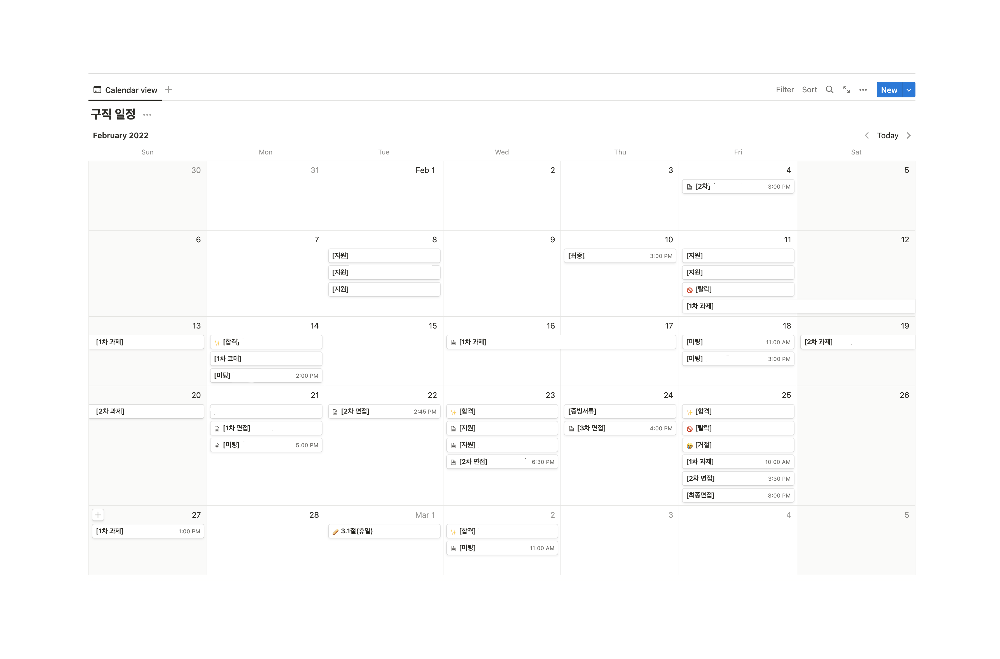
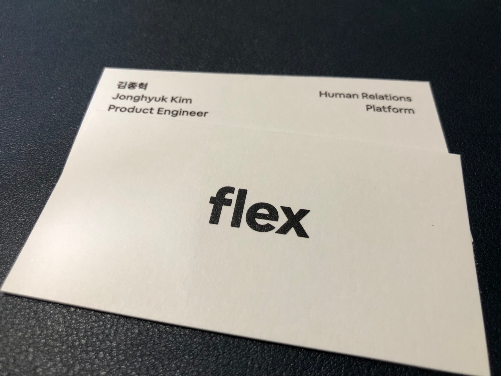
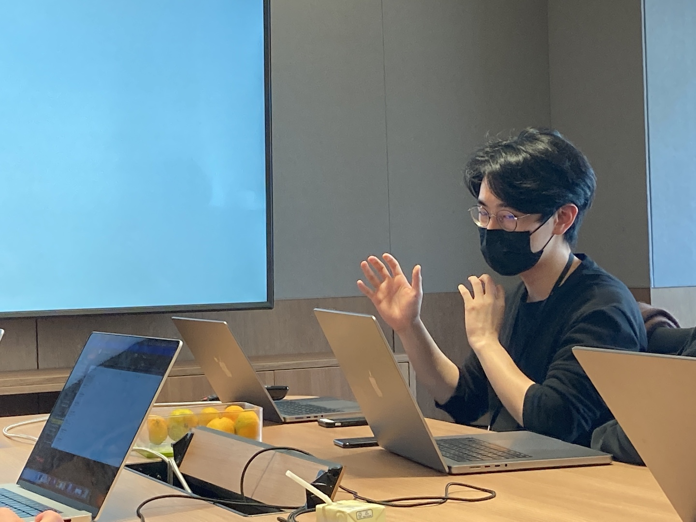
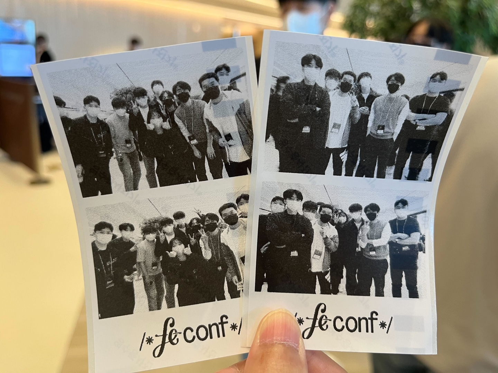

2022 was a pretty rough year and I'm feeling a little better about it now that the year is over. I was faced with some tough choices, it was my first year on the job, and I had some big personal things like moving.

I like my life to be pretty calm, but it's been eventful and I've lost a lot of ground. It wasn't all bad, but it was just a lot of stimulation, and I wasn't living comfortably. It was also draining on my stamina, and I could feel it draining towards the end of the year.

I learned a lot of new things, tried a lot of new things, and felt the need to manage my life, which had become more complicated. But this year, I wish I could be more stable, or at least have the strength to withstand the stimulation and complexity of life.

Let's recap the events of the past year, because it's hard to put into words what really happened.

## 2022.

### Job hunting and getting hired

I searched for a job from January to March and got hired in April. I'm looking at the ridiculous February 25, when the final acceptance/rejection notifications and rejections all happened in one day and I had two interviews after the Time Attack assignment.

The job search took longer than I thought it would. I'd been preparing since December and it was mid-March when I got the job, so by the time it was over, I had very little mental energy left. I wasn't happy, and I was writing [this](https://brunch.co.kr/@hwaseen/24) over brunch at that point.

> I feel like I've become so mentally fragile that I don't even feel joy or reward. I realized that if I want to feel the joy of accomplishing something well, I need to have my mind and body intact at the end of the process.

> Now that my job search is starting to pay off, the anxiety and worry I felt just before I started looking for a job is still there, just in a different form. The anxiety that I felt before I started looking for a job has changed from what if I don't get the job to what if I don't get the job.

Part of his burnout was also due to his worries about choosing a team late in the job search. I stayed up all night thinking about where to go and what would be the best option for me, and I realized that I... I'm not good at saying no. It's hard to tell recruiters who cared about me that I'm not going, but that's just my personality.

I got quite a bit of congratulations from people around me, which was kind of embarrassing, but I was also very grateful to my family, friends, and acquaintances who listened and said good things about me.

I'm so glad I met some amazing recruiters, leads, and senior developers from great businesses during my job search. Coming from a non-developer background where I didn't know any developers around me, I felt so lucky to be able to do that, and I wish I could have been the kind of person who was willing to help.

### Flexteam (1) - Adversity

All of the reasons I wanted to join [Flexteam](https://flex.team/) were realized once I got to work: the web product was as vast and complex as the B2B business and HR domains were complex. There were so many great people, and the company was growing so well.

I joined an organization that was improving the development platform and structure of the web product. After my onboarding period, I felt like the work I was asked to do on the team I joined was so big and unfamiliar that I didn't make any small accomplishments for months.

My proofs of concept failed and I was only documenting my failures, and I felt impatient to prove my worth in a team with so many talented and experienced people.
I think I lived in fear for about six months after joining the team because I didn't have the confidence. I even said this in a 1:1 with the lead at the time.

> **"I came in here wanting to do something difficult and complicated, and I think I was overwhelmed."**

It took me a long time to admit that I was too scared to ask for help in time, and that I had spent the last few months hunkered down and banging my head on my desk. It's only recently that I've realized it, and now I'm talking about it.

It's ironic that I realized this because I was convinced that "we're a really good team" when I was sitting at the bar with my coworkers sulking about something so big and difficult,

> "If there was a problem with what Jonghyuk was doing, the team would have challenged him."

I was told, and it was so true. **If I had been ignorant of what I was doing, the team wouldn't have let it go** They could have helped, taken action, or assigned me to something else, but I was able to continue to do the hard stuff with a relatively large degree of autonomy during that time.

Ah, so I must have been doing something right, a little confidence returns, I could have done a better job if I'd had that confidence a few months ago, why didn't I... and then I think I came to the conclusion that I was scared.

Starting in August, the failed experiments piled up, decisions were made, we started working on a huge product with a huge impact, and it wasn't until near the end of the year that we finally started to see results. It was a long time in the making, but it was impactful, and I feel like I've earned all the recognition I'll ever get at Slack. So it was a pretty rewarding end of the year.

### Flexteam (2) - good team

The achievements at the end of the year, while well-deserved, were not the result of my own thinking and hard work. My team members were invaluable: they imparted valuable wisdom, pointed out my deliverables and designs, and came up with action items when I came to them with unrefined concerns.

Through a series of adversities, I gained a lot of trust in my team. Everyone on my team tries to make the best decisions to accomplish the team's goals, and if we think a decision isn't the best, it's challenged and pointed out to make it better.
At that point, I feel confident that our team will be able to solve big, complex problems.

I've also made a lot of fun memories with the members of the FE chapter, going to workshops and traveling to conferences with them.
I look forward to continuing to have fun.

And just like the help I've always gotten when I've asked for it since joining the team, I'd like to be the kind of coworker who can give the team more of the help they deserve.

### School (nearing graduation)

I spent the first half of the year finishing my last semester of school, which was possible because it was virtual, and luckily I finished it well. In the second half of the year, I wrote my thesis and took the TOEIC to fulfill my graduation requirements.

The thesis was a bit of a struggle because I was working a lot at the time due to my job at the company, and the school was so far away from my main job that I couldn't concentrate well and felt like it was a waste of time on weekends, but I passed.

I tried to complete all of my graduation requirements while working at my job, but it was impossible and I had one exam left. In fact, I found out at the end of the year that I would not be able to graduate in Winter 2023 because I missed the deadline to send my TOEIC scores to the registrar's office. Blackblackblack But I give myself a pat on the back for making it this far while working.

I've been in school for eight years since I enrolled. I've been procrastinating because I thought it didn't matter when I graduated, but now I want to get it over with. This year, I'm going to stop being a student and start being a working adult.

### Director

In early November, I moved to Songpa-gu, leaving the Imun-dong neighborhood where I've lived for six years since I moved to Seoul. I was going to go, but after my company moved to Bundang, I realized I had to go sooner rather than later. The three-hour round-trip commute from Imun-dong to Bundang really takes a toll on your body. The move cut my commute time by almost a third, and I'm feeling better.

This move also has personal significance. **This is the first neighborhood in Seoul that I "chose" to live in **I didn't have to move here because my company is also in Bundang, but that's the point. I visited because I had a nice house, and then came because I liked the neighborhood.

It's quieter than university towns and has good infrastructure. But the best part is...

### running + working out

It turns out that Tanchun is only a 10-minute walk away. Black and White Toojoa

I've always been a runner, but it was just running around the schoolyard like conveyor belt sushi. I lost count after a few laps, but I always wanted to run on a straight, well-paved course like this.

I think I've gone out for a run at least once a week since I moved here. My performance is slowly improving. I've also started strength training to help me run better. This year, I'm hoping to be able to accomplish a lot of things with a healthier body, and I'd like to run a shorter marathon.

## 2023.

Here's what I hope for this year.

### I want to get a better handle on my life

Last year, I had a lot of difficult and time-consuming work at work and a lot of personal stuff going on, and it was very easy for my life rhythm to get disrupted by all that complexity and to-do list. I'll be juggling difficult work and personal stuff for years to come, and it's not sustainable if I keep doing what I've been doing.

I want to find my center in the midst of complexity and to-do lists without rushing to complete tasks. I want to prioritize my many to-dos and get things done effectively while maintaining my mental and physical health.

I want to create better routines and habits to manage my life. Recently, I've been trying a routine of reading as soon as I wake up, and I love the rewarding feeling of doing something productive as soon as I wake up, so it sticks. I want to get better at creating routines and sticking to them.

I'd like to improve my physical abilities. I think I'll be able to handle difficult things better if I'm in better shape. I'll work out consistently and more.

I want to be a ### good influence

I want to be a person who stays kind at all times. I found it hard to be kind to myself last year when I was going through a rough patch because I blacked out. I think I need more self-discipline. I need a way to objectively reflect on what I'm feeling when I'm having a hard time.

I want to be better at sharing what I have, and last year was a year where I got a lot of help from my team, and I'm grateful for that, and I hope I can give back as much as I can.

Outside of the team, I didn't think I was a mentorable person and I wasn't interested in it, because I didn't think I was good at my job, I didn't know much about development, and I didn't think I had anything to give to others, and that's been the same since before I joined the company.

Recently, I've changed my mind a bit, and I've been able to achieve something with the help of many people, and I suddenly realized that it would be a bit selfish to keep those teachings and experiences for myself and not share them.
There are quite a few people like me who need help but don't know where to find it, so I'm going to reach out to them.

### I want to be an active but effective person

Uh... I wish I was less afraid of people. I'm very self-conscious about how I look to others, so being passive is my personality default, and I've been trying to overcome that for quite some time.

I'm still working on it. I'd like to be more active in speaking up and making sure my opinions are more valuable and valid. On a personal level, I'd like to try new things and find and meet new people.

One of the things I've realized in the last year is that I'm more likely to make a better decision if I ask a lot of people and get a lot of different opinions than if I just hold onto things and drive myself crazy.

I want to become a more confident person who can make good decisions about important parts of my job by effectively seeking out and soliciting opinions and making myself known.

### Technical goals

I don't have any specific ones. The blog was originally called the GIMMAX Tech Blog, but I dropped the "tech" to write a lot of ramblings.

Last year, I feel like I didn't do a good job of studying in time to better understand the team's concerns, so I feel a lot of debt, but I think I can do that this year.

I just want the company's long-term projects that I've put time, effort, tears, and coffee into to be completed well. I'm hoping that I can learn things that will be useful for my work in a timely and focused manner, and study for my interests in my spare time.

Oh, and I'd like to give a talk at a development conference. I've been working hard, so I want to let people know what I've been up to. (End)
