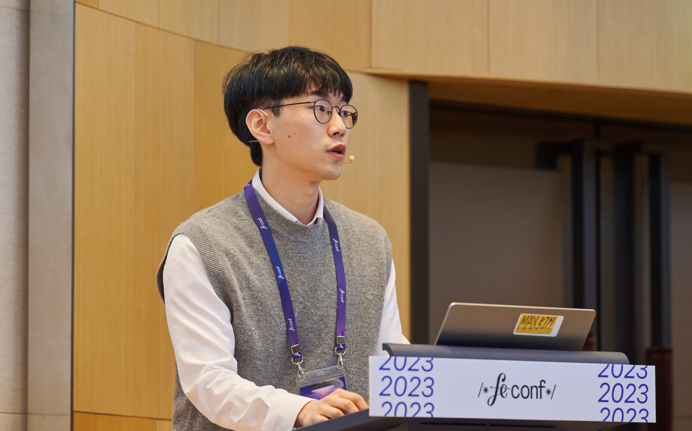
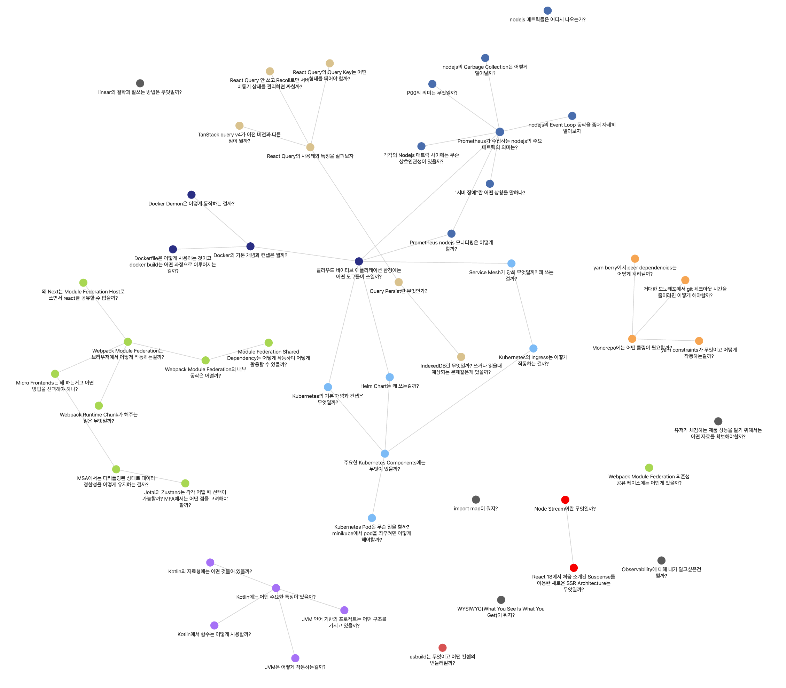

# summarize

This year was a career-high, and I can do better in the future. There are so many challenges and things I still can't do.

Next year will be even more challenging but essential. I want to continue doing things that contribute to the team's and product's long-term vision. I want to be the kind of person who doesn't get cynical or burned out along the way, sees the good in the product, believes in the power of long-term investments, and can inspire the people I work with. I want a sense of "when I see him working, I know it will be something."

This year's achievements are heavily due to the team, and I am very grateful to them. I want to contribute more to the team's development. I want to create a better development culture and team environment where we can improve and feel empowered.

# highlights

## 1. Started participating in the recruitment process (December 2022 ~ )

In December 2022, I started participating as an interviewer in tech interviews for web front-end engineer hires. I have been in about two dozen interviews this year.

I've noticed a lot of variation in the quality of questions and interview experience depending on the candidate's skill set, experience, and the content and density of their resume. I've also noticed a lot of variation in what questions to ask people with more experience than me and how I should validate them.

Through frequent conversations with my coworkers who participate in interviews with me and continuing to refine our process, we've reduced a lot of the variation in the interview experience among candidates. Our efforts to keep coming up with questions and make the interview a time where we could share technical concerns and difficulties with each other rather than testing or feeling compelled to verify everything in a short period were a bit effective.

## 2. Micro Front-ends Architecture Migration and Operation (2023.01 ~ 2023.03)

In March 2023, I finished a 7-month project to convert most flex web product to the Micro front-end architecture. This project was undoubtedly the most challenging project I have ever faced in my career.

When I first drew the end picture of this architecture, it was so difficult that I wondered how on earth I could do this. The uncertainty was so high that it significantly assaulted my psychological well-being. I fought the feeling that if I failed at this, I would haven't accomplished anything at the company in a year and a half. Fortunately, I succeeded with the wisdom, help, mental care, and advice of many of my coworkers.

My biggest personal impression from doing this is that it made me think more about the principles of creating and paying off debt from an engineering platform perspective.

Rather than a rigid platform that doesn't compromise on engineering ideals, I better understand what technical debt we can incur. I should take that debt and when I should take back off of it because our architecture evolves with the product and is always open to modification. When we were migrating architecture, I glanced at the code and thought, "Oh, this is a year's worth of engineering." It never happened in the middle, and when we needed to remove that code exactly a year later, I felt a sense of joy and growth.

## 3. Operating a product that changed to a Micro Front-ends architecture (2023.03 ~)

The migration process was challenging, but the hardest part was the six months after the migration (March-September) when the product went into production. We faced unexpected obstacles and issues, like service downtime, and our realizations were updated in real-time.

I felt a lot of self-blame and responsibility for the failures. A lot of regret when I realized that we hadn't designed for reliability, but after a summer of tinkering, framework improvements, and deployment process improvements, that felt like we were ["losing the cow and still having to fix the barn"(Korean Proverb)](https://youtu.be/V8963uVBrE8?t=423), by the fall, the failures felt like a distant memory.

I felt a lot of our team's technical edge and wisdom building this year as we went where no one else had gone before, hitting issues and problems that no one else had hit and solving them first.

## 4. FE Conf Speaker Engagement (October 2023)

Participating in [a development conference as a speaker](https://www.youtube.com/watch?v=VnJLFwnuLV4) has been on my bucket list for a while now, and I'm glad I was able to do it this year. Exposing my concerns and worries during the former project is highly beneficial.

I kind of desire honor, so it's great to be one of those developers who did something nice publicly. It's also rewarding to provide a reference for one of the few micro front-ends in Korea. But it's more meaningful to me when I can help the team by being a speaker. I publicized the team's technical achievements and capabilities, which raised the market's perception of the team's technical ability. I've also brought in many great people in the hiring process.

Regarding how well I presented, I left a lot to be desired. There were many things in the seven-month migration journey that I didn't get to tell you, like the technical achievements and the story of the choices that you have to know about the original flex product to understand. In fact, I probably had to set aside an hour or two to tell you all of that.

I didn't have the time to absolutely invest in the preparation. If you look at the video on YouTube now, the presentation was embarassing, at least I think so. I don't think I did a very good job, and I think if I could do it again as a speaker at another conference, I think I could do a little bit better based on this feeling that I have now.

## 5. Performance TF Lead (2023.10~)

I've led the flex web product performance improvement TF since October. We've improved the product's performance quite a bit in three months, and I'm contributing to visualizing web performance and establishing performance baselines so that we keep the gains.

I have a bit of a PM role in the TF. I'm responsible for setting the milestones and mid- to a long-term roadmap for the Performance TF, determining which tasks should be prioritized to improve product performance, creating estimates and results on how much performance has been enhanced as a result of the tasks, and sharing them internally. I've also been involved in discussing how we should respond to VoCs and inquiries related to performance.

Even in my original engineering platform role, I was expected to play a PM-like role. I tended to fit myself into that role, like, "I'm an engineer; do I need to do this?" But now that I'm in the Performance TF, I'm thinking of myself as a person who's also a PM. That's giving me the ability to think outside the box and think about what kind of contributions I need to make to make this work, whether writing code, writing documentation, who I need to talk to, and in a broader radius.

I also feel like I'm becoming more of a ["problem solver"](https://www.youtube.com/watch?v=3H4umWD5bwI) and not just a code writer.

# What I liked.

## 1. more or less fulfilled my rising expectations

The intensity and breadth of contributions the team expects from me haven't diminished at all this year—they've only gotten higher. The team's expectations have continued to expand both vertically and horizontally. As a front-end engineer, I was expected to contribute to the product's long-term vision and development culture. Still, I also had responsibilities and roles in infrastructure-related operations and server monitoring. Towards the end of the year, I also took on the PM role, as I already spoke.

Looking back, I realize I did everything but the people management role. The work just kept getting more complicated and complex, which made me more stressed, and my brain kept spinning, but I got some results.

Looking back, I've been sent into the wilderness where the most pressing problems in the product are, and if I'm going to continue to work on these big, time-consuming problems, I'm going to have to be able to handle the rising expectations and excel at seeing and solving the more complex issues.

## 2. Success in changing the environment in which you work

I could keep up with rising expectations because I had made several effective attempts to change my work environment.

I spent as much time working alone this year as I did last year. The more I worked alone and isolated myself, the more I increased my communication to keep my product-related opinions and remarks in the spotlight and to talk about "I'm doing this!" on various channels. In this way, I think I was able to address the issue of loneliness and get input from many people to improve my solo work.

## 3. Continue to improve my work efficiency

This year was the first time I realized "I can't keep working overtime and accomplish all the things that are expected of me." I had to become more efficient at my work because no matter how much I thought about it, I couldn't figure out how to complete my tasks.

The most important thing at the business level was eliminating waste and delegating appropriately. I tried a lot to delegate things appropriately. On a personal level, playing well and having time to not think about work helped me to be more efficient.

This year, I've only learned something that contributes to solving problems for the team, spending my personal time. I've also pursued several hobbies, improving my efficiency quite a bit.

# What I didn't like.

## 1. My life was destroyed

The stress at work and the job's complexity can easily ruin your life. I thought I was managing the complexity at work, but when I got home, I was crushed.

I often got home late and didn't get enough sleep because I was playing and sleeping, exercised when I was tired, and ate sweets and junk food to relieve stress. I tried to make up for my poor lifestyle and lack of sleep with nutritional supplements and lots of exercise.

A more regular routine and lifestyle would help me to be more efficient at work. I want to add more routines to my life and make moderation more of a habit.

## 2. I'm not good at "leading the product to a good place" yet

When it comes to whether I'm contributing as much or having as good an impact as expected, I've met some of the above, but I also need to grow.

The biggest problem is that I still have a short-sighted perspective when choosing what I need to do to contribute to the product roadmap. It's hard to give up my greed for short-term results. Even if this doesn't work, the nature of the engineering platform requires a lot of long-term work. I still feel uneasy about not having any results or impact during that substantial time.

It takes a lot of determination to let go of that greed and prioritize and resource tasks from the perspective of "what's really most urgent for the team and the product." Once you've decided on those things, you must be a little more vocal about it and willing to fight for them.

In the same vein, I also have to be wary of cynicism, which tends to creep in when I'm faced with a task that's still failing or has a lot of uncertainty I can't measure. The "what's the point of doing this?" doubts are things you wouldn't have if the task was really well crafted. It takes conscious practice to stay in the mental and emotional state where you can see the good in the product and contribute to the long-term vision.

## 3. Work better but learn less

I mentioned that I've become more efficient at work, but I need to rethink my efficiency when learning the skills and practices I need to do my job.

Lately, I've noticed that there are fewer and fewer moments than before where I feel like I've spent the same amount of time on something and still feel like I know it inside out. It could be a brain issue, but I need to get more comfortable using my spare time.

There are many moments of mental fatigue, so it's not easy to get a deeper understanding, take the information from one more place, and make it my own. I need to go into my studies with the determination to look at it more seriously. I want to continue to find and apply better ways of learning.

# Goals for next year

Here are my goals for next year.

- Make life less disruptive
- Contribute effectively to the long-term vision of the web product and organization
- Practice intentional discipline to become more technically savvy

# learning

This year, I wanted to make good use of Obsidian. I continued to record my studies and research in Obsidian, and it was very rewarding to populate the graph view and make connections.

One thing that sticks out in my mind from this year's learning is that I tried to understand Webpack down to the source code level. Studying Webpack allowed me to understand the tool from many different perspectives, not just the behavior around Module Federation, which is what I really needed, but also the problems and challenges that bundlers are trying to solve, webpack's approach to them, and the behavior and tools behind the logic that makes up the development server, not just the part that does the bundling.

I also remember learning about cloud-native infrastructure. By gaining a deeper understanding of K8S, Docker, and server monitoring environments, I was able to better understand how the products developed by front-end engineers are served, and I was able to transfer that knowledge to the team.

Next year, I'd like to study more web development fundamentals like TypeScript. When I have more time, I'd also like to learn more about CSS and styling, which I've neglected a lot while working on development platforms.

# What I want to say.

I am a very short-term and short-tempered person. I believe in the power of iteration and repetition, the benefits of doing things that take a long time, and trying to see the good in them. I want to work sustainably, without being cynical and seeing a lot of good.

It's been a year since I understood what my colleague said. He said that when the team looks back on the past at a point where we've accomplished so much, the thing we'll remember most is not "how much we were paid at the time." When we accomplish something this complex and neat, it's this process, these memories, that we'll remember most.

In 2023, I really appreciated and trusted my coworkers on the team, my front-end chapter members, who were with me through this challenging process of this problematic product. This team is incredible. I couldn't have done anything without you guys.

I'm so thankful for the Front End Chapter. Through everything we've been through as a team, each of you has made me feel like the Avengers, the people we've been waiting for. I look forward to supporting you all in the coming year and making your development experience more comfortable and better.

Let's make a better development culture and product together next year. I'm so grateful and happy that I could think with you, share wisdom with you, study with you, drink with you, run with you, and play badminton with you.

[Flexteam is excellent, and I'm waiting for you to come if you're reading this](https://flex.careers.team/job-descriptions/AeGzKWVznQ)

(End)
