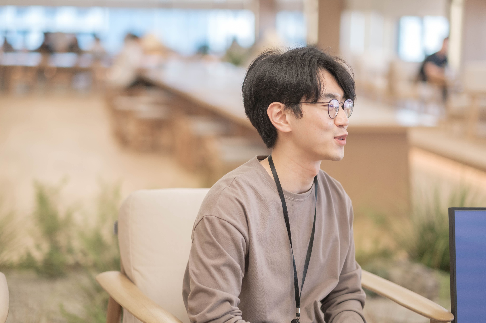

# summarize

This year was a career high, and it's clear that we can do better in the future. There are so many challenges and so many things we still can't do.

Next year will be even more geographical and challenging, but important. I want to continue to do the things that contribute to the long-term vision of the team and the product, and I want to be the kind of person who doesn't get cynical or burned out along the way, who sees the good in the product, who believes in the power of long-term investments, and who is able to inspire the people I work with. **I want there to be a sense of "when I see him working, I know it's going to be something."** I want there to be a sense of "when I see him working, I know it's going to be something.

This year's achievements are due to the team, and I am very grateful to them. I want to contribute more to the team's development. I want to create a better development culture, a better team environment where we can improve and feel empowered.

# highlights

## 1. Started participating in the recruitment process (December 2022 ~ )

In December 2022, I started participating as an interviewer in tech interviews for web front-end engineer hires and have been in about two dozen interviews this year.

I've noticed a lot of variation in the quality of questions and interview experience depending on the candidate's skill set, experience, and the content and density of their resume. I've also noticed a lot of variation in what questions to ask people with more experience than me and how I should validate them.

Through frequent conversations with my coworkers, who were interviewing with me after the weather turned chilly again, and the way we continue to refine our process, I think we've been able to reduce a lot of the variation in the interview experience from candidate to candidate. I also think that our efforts to keep coming up with questions and follow up on them, and to make the interview a time where we could share technical concerns and difficulties with each other rather than testing, rather than feeling compelled to verify everything in a short period of time, were a bit effective.

## 2. Micro Frontends Architecture Migration and Operation (2023.01 ~ 2023.03)

In March 2023, I finished a 7-month project to convert the majority of the flex product to the Micro Frontends architecture. This project was, without a doubt, the most challenging project I have ever faced in my career.

Honestly, when I first drew the end picture of this architecture, it was at a level of difficulty that made me wonder how on earth I could do this. The uncertainty was so high that the mere fact that I was doing this felt like a major psychological assault on my psychological well-being. I fought the feeling that if I failed at this, I would be the one who hadn't accomplished anything at the company in a year and a half. Fortunately, with the wisdom, help, mental care, and advice of many of my coworkers, I was able to succeed.

My biggest personal takeaway from doing this is that it made me think a little bit more about the principles of creating and paying off debt from a platform perspective.

Rather than a rigid platform that doesn't compromise on engineering ideals, I have a better sense of what debt we can and should take on and when we should take it off, because our architecture evolves with the product and is always open to modification. When we were migrating architecture, code that we would write and say, "Oh, this is a year's worth of engineering," and it never happened in the middle, and then when we actually needed to scale a year later, we felt a sense of joy and growth.

## 3. Operating a product that changed to a Micro Frontends architecture (2023.03 ~)

The migration process was hard, but the hardest part was actually the six months or so after the migration (March-September), when the product went into production and we were faced with unexpected obstacles and issues, and our realizations were updated in real time.

I felt a lot of self-blame and responsibility for the failures, and a lot of regret when I realized that we hadn't designed for reliability, but after a summer of tinkering, framework improvements, and deployment process improvements that felt like we were ["losing the cow and still having to fix the barn"](https://youtu.be/V8963uVBrE8?t=423), by the fall, the failures felt like a distant memory.

I felt a lot of our team's technical edge and wisdom building this year as we went where no one else had gone before, hitting issues and problems that no one else had hit and solving them first.

## 4. FE Conf Speaker Engagement (October 2023)

Participating in [a development conference as a speaker](https://www.youtube.com/watch?v=VnJLFwnuLV4) has been on my bucket list for a while now, and I'm glad I was able to do it this year. Just being able to get some of the things I've been struggling with and fretting about out there has been a lot of meat on my bones.

I have a bit of an honor mentality, so it's nice to be one of those developers who wants to "punch that guy". It's also rewarding to be able to provide a reference for one of the few micro frontends in Korea. But it's more meaningful to me when I can help the team by being a speaker. I was able to publicize the team's technical achievements and capabilities, and I think it raised the market's perception of the team's technical capabilities. I've also been able to bring in a lot of great people in the hiring process.

In terms of how well I presented, I think I left a lot to be desired. There were a lot of things in the seven-month migration journey that I didn't get to tell you, like the technical achievements and the story of the choices that you have to know about the original FLEX product to understand, and I didn't get to tell you all of that. In fact, I probably would have had to set aside an hour or two to tell you all of that.

I just didn't have the time to absolutely invest in the preparation, and if you look at the video that's out on YouTube now, the presentation was a little... I don't think I did a very good job, and I think if I could do it again as a speaker at another conference, I think I could do a little bit better based on this feeling that I have now.

## 5. Performance TF Lead (2023.10~)

I've been the lead of the flex web product performance improvement TF since October. We've improved the performance of the product quite a bit in 3 months, and I'm contributing to visualizing web performance and establishing performance baselines so that we don't lose the gains.

I have a bit of a PM role in the TF. I'm responsible for setting the milestones and mid- to long-term roadmap for the Performance TF, determining which tasks should be prioritized to improve product performance, creating estimates and results on how much performance has improved as a result of the tasks, and sharing them internally. I've also been involved in talking about how we should respond to VoCs and inquiries related to performance.

Even in my original platform role, I was expected to play a little bit of a PM-like role, and I tended to fit myself into that role, like, "I'm an engineer, do I need to do this?" But now that I'm in the Performance TF, I'm just thinking of myself as a person who's also a PM, and I think that's giving me the ability to think outside the box and just think about what kind of contributions I need to make to make this work, whether it's writing code, writing documentation, who I need to talk to, and in a broader radius.

I also feel like I'm becoming more of a ["problem solver"](https://www.youtube.com/watch?v=3H4umWD5bwI) and not just a code writer.

# What I liked.

## 1. more or less fulfilled my rising expectations

The intensity and breadth of contributions the team expects from me hasn't diminished at all this year - it's only gotten higher. The team's expectations have continued to expand both vertically and horizontally. As a front-end engineer, I was expected to contribute to the long-term vision and development culture of the product, but I also had responsibilities and roles in infrastructure-related operations and server monitoring, and towards the end of the year, I also took on the role of PM assistant.

Looking back, I realize that I pretty much did everything but the people management role. The work just kept getting harder and harder, which made me more stressed and my brain kept spinning, but I think I got some results.

Looking back, I've been sent into the wilderness where the most pressing problems in the product are, and if I'm going to continue to work on these big, time-consuming problems, I'm going to have to be able to handle the rising expectations and excel at seeing and solving the simpler problems.

## 2. Success in changing the environment in which you work

I wouldn't have been able to keep up with rising expectations if I hadn't made several attempts to change my own work environment.

This year, I spent as much time working alone as I did last year, and the more I worked alone and isolated myself, the more I increased the amount of communication to keep my product-related opinions and remarks in the spotlight, and to talk about "I'm doing this!" on various channels. In this way, I think I was able to address the issue of loneliness and get input from many people to make my solo work better.

## 3. Continue to improve my work efficiency

This year was the first time I realized, "I can't keep working overtime and accomplish all the things that are expected of me." I had to become more efficient at what I do, because no matter how much I thought about it, I couldn't figure out a way to invest my time.

The most important thing at the business level was to eliminate waste and delegate appropriately. I tried a lot to delegate other things appropriately when there were things that needed more time. On a personal level, I found that playing well and having time to not think about work really helped me to be more efficient.

This year, I've made a point of not doing anything in my personal time unless it's development or learning that contributes to solving problems for the team. I've also tried to pursue a number of hobbies, and I think that's improved my efficiency quite a bit.

# What I didn't like.

## 1. My life was destroyed

The stress at work and the complexity of the job can really easily ruin your life. I thought I was managing the complexity at work, but when I got home, I was just crushed.

I often got home late and didn't get enough sleep because I was playing and sleeping, exercised when I was tired, and ate sweets and junk food to relieve stress. I tried to make up for my poor lifestyle and lack of sleep with nutritional supplements and lots of exercise.

I believe that a more regular routine and lifestyle would help me to be more efficient at work. I would like to add more routine to my life and make moderation more of a habit.

## 2. I'm not good at "leading the product to a good place" yet

When it comes to the question of whether I'm contributing as much or having as good an impact as expected, I've met some of the above, but I need to grow.

The biggest thing I feel is that I still have a short-sighted perspective when choosing what I need to do to contribute to the roadmap, and it's hard to give up my greed for short-term results. Even if this doesn't work, the nature of the platform requires a lot of long-term work, and I still feel uneasy about not having any results or impact during that time.

I think it takes a lot of determination to let go of that greed and to prioritize and resource tasks from the perspective of "what's really most urgent for the team and the product," and once you've decided on those things, you have to be a little bit more vocal about it and be willing to fight for them.

In the same vein, you also have to be wary of cynicism, which tends to creep in when you're faced with a task that's still failing, or has a lot of uncertainty that you can't measure. The "what's the point of doing this?" doubts are things you wouldn't have if the task was really well crafted. It takes conscious practice to be able to stay in the mental and emotional state where you can see the good in the product and contribute to the long-term vision.

## 3. You work better but learn less

I mentioned that I've become more efficient at work, but I think I need to rethink my efficiency when it comes to learning the skills and practices I need to do my job.

Lately, I've noticed that there are fewer and fewer moments than before where I feel like I've spent the same amount of time on something and still feel like I know it inside out. Maybe it's a brain degeneration issue, but I feel like I need to get more comfortable with making better use of my spare time.

There are many moments of mental fatigue, so it's not easy to get a deeper understanding and take the information from one more place and make it my own. I need to go into my studies with the determination that I need to look at it more seriously. I want to continue to find and apply better ways of learning.

# goals for next year

Based on what I didn't like, here are my goals for next year.

- Make life less disruptive
- Contribute effectively to the long-term vision of the web product and organization
- Practice intentional discipline to become more technically savvy

# learning

This year, I wanted to make good use of Obsidian. I continued to record my studies and research in Obsidian, and it was very rewarding to populate the graph view and make connections.

One of the things that sticks out in my mind from this year's learning is that I tried to understand webpack down to the source code level. Studying webpack allowed me to understand the tool from many different perspectives, not just the behavior around Module Federation, which is what I really needed, but also the problems and challenges that bundlers are trying to solve, webpack's approach to them, and the behavior and tools behind the logic that makes up the development server, not just the part that does the bundling.

I also remember learning about cloud-native infrastructure. By gaining a deeper understanding of K8S, Docker, and server monitoring environments, I was able to better understand how the products developed by front-end engineers are served, and I was able to transfer that knowledge to the team.

Next year, I'd like to study more web development fundamentals, such as how to better manage the package development and usage environment of a giant monolith, and learn more about TypeScript. When I have more time, I'd also like to learn more about CSS and styling, which I've gotten away from a lot while working on development platforms.

# What I want to say.

I would describe myself as a very short-term and short-tempered person. I believe in the power of iteration and repetition, the benefits of doing things that take a long time and trying to see the good in them. I want to work sustainably, without being cynical and seeing a lot of good.

It's been a year where I understand what my colleague said when he said that when the team looks back on the past at a point where we've accomplished so much, the thing we'll remember most is not "how much we were paid at the time." When we accomplish something this complex and neat, it's this process, these memories, that we'll remember most.

It's been a year where I've been able to really appreciate and trust my coworkers on the team, my front-end chapter members, who are with me through this difficult process of this difficult product. This team is awesome. I couldn't have done anything without you guys.

I'm so thankful for the Front End Chapter. Through everything we've been through as a team, each and every one of you has made me feel like the Avengers, the people we've been waiting for. I look forward to serving you all in the coming year and making your development experience a little more comfortable and better.

Let's make a better development culture and product together next year. I'm so grateful and happy that I was able to think with you, share wisdom with you, study with you, drink with you, run with you, and play badminton with you.

[Flexteam is great, and I'm waiting for you to come if you're reading this](https://flex.careers.team/job-descriptions/AeGzKWVznQ)

(End)
