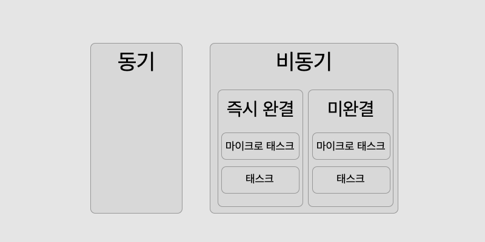

I came across a few console log ordering problems in job interviews this summer. Some of them were easy to solve if you understand what event loops and asynchronous programming are, while others asked for something a little more advanced than that: if I give you a `.js` file and run it, what will it output first?

In this post, I'll try to summarize the concepts of asynchronous programming that were asked in the console log questions in technical interviews, which are not too trivial and can help you in real programming.

## Prerequisite knowledge

I hope this post adds something to the following knowledge of JS asynchronous programming.

- Event loops
- Asynchronous logic processing order
- Execution Context
- Promise
- Async/Await

## Solve the problem - Asynchronous Pikachu

The key to this problem is that the same asynchronous logic can have different processing priorities. In an event loop, there is a concept called a microtask queue in addition to the regular task queue. The callbacks in the microtask queue must all be fulfilled and the queue must be empty before the callbacks in the task queue can be executed. Using axios and the [PokéApi](https://pokeapi.co/), I created a simple problem based on Pikachu going into battle(?).

```javascript
// pikachu.js
async function comeOutPikachu() {
  // 1
  setTimeout(() => {
    console.log(`Pikachu has recovered ${amount} of health from the ${selectedBerry} fruit!)
  }, 2000);

  // 2
  let amount = 0;
  let selectedBerry = '';

  // 3
  axios.get('https://pokeapi.co/api/v2/berry/1/').then((berry) => {
    setTimeout(() => {
      console.log(`Berry ${berry.data.name} arrived via http communication!`);
      selectedBerry = berry.data.name;
    }, 1000);
  });

  // 4
  axios.get('https://pokeapi.co/api/v2/berry/25/').then((berry) => {
    console.log(`Berry ${berry.data.name} arrived via http communication!`);
    selectedBerry = berry.data.name;
  });

  // 5
  for (let i = 0; i < 50; i++) {
    amount += 1;
  }

  // 6
  new Promise((resolve, reject) => {
    resolve('Pikachu Million Volts');
  }).then((data) => {
    setTimeout(() => console.log(`Pikachu~~~~~~~~~~~`));
    setTimeout(() => console.log(`Pikachu's million volt effect was powerful!`), 5000);
    console.log(data);
  });

  // 7
  const otherPromise = await new Promise((resolve, reject) => {
    resolve('Ore all Pikachu');
  });

  // 8
  console.log(otherPromise);

  // 9
  setTimeout(() => console.log('Pikachu is cute'));

  // 10
  Promise.resolve('Pikachu body slam').then((data) => console.log(data));
}

comeOutPikachu();
```

Roughly speaking, the example consists of Pikachu using a bunch of moves and then regaining health from a tree fruit delivered over HTTP. Can you recognize the order of the console log?

It's confusing. There's a mix of synchronous and asynchronous logic, then there's a setTimeout in the callback, and then there's a setTimeout that doesn't have a promise or a time argument that is fulfilled as soon as resolve is used. In order to correctly order the output, we need to make three more distinctions.

> Formally, not all JavaScript statements behave this way, but consider this a pragmatic approach to problem solving.

To summarize, the blocks will probably behave in the following order: synchronous => complete asynchronous microtask => complete asynchronous task => incomplete asynchronous task/microtask.



### 1. Asynchronous/synchronous distinction

To get a good idea of the order in which the output is printed, we can probably distinguish between synchronous and asynchronous logic based on the large blocks (`{}`), since synchronous logic is always processed before asynchronous logic.

> **point : synchronous logic processing precedes asynchronous logic**.

- Synchronous logic: variable declaration (2), for statement (5)
- Asynchronous logic: callbacks (3,4,6,10) inside then that are processed when the promise is fulfilled, Await (7), console.log (8) that depends on Await, setTimeout (1, 9)

### 2. Complete/Incomplete Distinction

However, this distinction is not enough to correctly order the output, because asynchronous logic is not always executed in the order in which it is coded. Next, we need to determine whether the asynchronous logic is complete or not.

Promises have a concept of resolve and reject: if it's either of them, it's complete, not just pending. When a promise is resolved, the callback of the then method is called asynchronously. In the case of setTimeout, the time to resolve is when the time passed to the callback as an argument has elapsed. The callback is invoked asynchronously at the time of completion.

A Promise object is considered to be resolved as soon as it is created, resolved due to resolve or reject, or resolved as soon as it enters the callstack if the time argument for setTimeOut is zero or missing. The associated callback is called immediately.

However, axios asynchronous requests don't know exactly when they will be completed, and even setTimeOut with a time argument doesn't know exactly when the callback will be called because it will only be called when the preceding task queue, the tasks in the callstack, are finished processing.

Furthermore, we cannot say that promises in unfinished asynchronous logic that are unconditional microtasks will be processed before setTimeOut: if a promise takes a long time to fulfill and the microtask queue is empty, setTimeOut may be processed before it.

However, in this particular case, if we saw that http requests were being processed quickly, we might infer that setTimeOut with time factors of 2 and 5 seconds would be processed more slowly.

> **Point: Immediate completion asynchronous logic precedes unfinished asynchronous logic, and the exact order between asynchronous logic is unknown**.

- Immediate: resolved promises (6,7,10), console.log(8) which depends on resolve promises, setTimeOut(9) which has no time argument
- Incomplete: axios(3, 4), setTimeOut(1) with a time argument

### 3. Microtask/Task Distinction

We're not done yet: we need to distinguish between microtasks and just tasks so we know exactly what order to execute our immediate-completion asynchronous logic. A microtask is a task that has a higher priority than a regular task. Even if there are tasks waiting, the microtask will be executed first. In the problem, the callback of Promise belongs to a microtask, while the callback of setTimeOut belongs to a task.

According to [this post](https://jakearchibald.com/2015/tasks-microtasks-queues-and-schedules/), task scheduling aims to schedule JavaScript, DOM-related behaviors so that they can be executed sequentially, while microtask scheduling aims to schedule behaviors so that they can be executed **right after** the current behavior. It's a high prioritization.

From there, it's just my opinion. I think logic that is more likely to make direct changes to the script in a callback as a result of asynchronous behavior, such as http communication, is a better fit for high-priority microtasks than DOM event handling or setTimeOut, which executes a predetermined action after a certain amount of time. That's why I think Promises are classified as microtasks.

> **point : microtasks precede tasks**.

- Microtask: Promise(6,7,8,10)
- Task: setTimeOut(9)

### 4. Asynchronous logic in callbacks

There is also asynchronous logic inside the then method of promises 3 and 6. Let's take a look at it again.

```javascript
// pikachu.js

// 3
axios.get('https://pokeapi.co/api/v2/berry/1/').then((berry) => {
  setTimeout(() => {
    console.log(`Berry ${berry.data.name} arrived via http communication!`);
    berry = berry.data.name;
  }, 1000);
});

// 6
new Promise((resolve, reject) => {
  resolve('Pikachu Million Volts');
}).then((data) => {
  setTimeout(() => console.log(`Pikachu~~~~~~~~~~~`));
  setTimeout(() => console.log(`Pikachu's Million Volt was powerful!`), 5000);
  console.log(data);
});
```

This is where it gets a little confusing, but inside a block, the flow is largely the same as described above. In cases like #6, the promise is completed immediately and the callback is called immediately. At this point, we encounter a completed setTimeOut and an unfinished setTimeOut. These setTimeOuts are queued up in the task queue from the callback with the completion condition, and then executed after all the microtasks outside the block are finished. So in the end, only the synchronization logic, console.log, is executed first, and the setTimeOuts are handled later.

And another tip is that if you have asynchronous logic among the statements in the same execution context, the callbacks of that asynchronous logic are **blown away**. The execution context no longer controls whether or not the callbacks attached to the asynchronous logic are executed. The event loop will fire them when some condition is completed.

In #3, the promise fires when the http request completes. After that, we do one more piece of unfinished asynchronous processing with setTimeOut, where the callback will be called when all the microtasks have been processed, but we don't know exactly when because it's unfinished because it has a time argument.

## Correct answer.

So the correct answer is After Pikachu attacked and recovered his health with a fruit, the effect was powerful...

```shell
Pikachu Million Volt #6
Pikachu All Ore #7
Pikachu Body Slam # 10
Pika~~~chu~~~~~~~~~~~ # 6 promise's then inner callback (immediate completion setTimeOut)
Pikachu cuddles # 9
GREPA fruit has arrived via HTTP communication # 4
The cheri fruit has arrived via HTTP communication # 3
Pikachu has recovered 50 health from the CHERI fruit! # 1
Pikachu's million volts were powerful! # 6 promise's then inner callback (incomplete setTimeOut)
```

With the processing prioritization described above, the output should look like this.

```shell
# Synchronization - for statement, amount becomes 50

# Immediate completion asynchronous microtask (Promise)
Pikachu Million Volts
Ore All Pikachu
Headbutt Pikachu

# Immediately complete asynchronous task(setTimeOut(fn,0))
Pika~~~Choo~~~~~~~~~~~
Pikachu Cute

# Unfinished asynchronous
GREPA fruit has arrived via HTTP communication!
The CHERI fruit has arrived via HTTP communication!
Pikachu has recovered 50 health from the cheri fruit!
The effect of Pikachu's Million Volt was powerful!
```

For asynchronous logic that doesn't complete immediately, the order can change depending on which logic is processed first, but here we see that the http communication is generally processed faster than setTimeOut with time factors of 2 and 5 seconds. Of course, it's impossible to say exactly which of the two HTTP communications will be processed first, but if you run it multiple times, you can see the following results.

```shell
# cheri is sometimes processed before grepa.

CHERI fruit arrived over HTTP!
The grepa fruit has arrived via http!
Pikachu has recovered 50 health from the CHERI fruit!
The effect of Pikachu's Million Volt was powerful!
```

We've solved a complex console.log problem, how did you like it?! I'm sorry if I didn't write too kindly, as I assumed you understood and continued the explanation, but if you want to learn more about the in-depth concepts of event loops, please refer to the reference below. I hope this post will give you a better understanding of the priorities of asynchronous processing...!

## reference

- [JavaScript and Event Loops](https://ui.toast.com/weekly-pick/ko_20160617/)
- [Tasks, microtasks, queues and schedule](https://jakearchibald.com/2015/tasks-microtasks-queues-and-schedules/)
- [Event Loops, Macros, and Microtasks](https://ko.javascript.info/event-loop)
