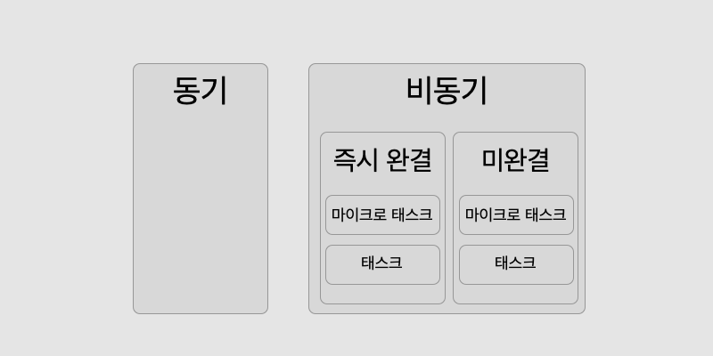

이번 여름 구직 면접에서 콘솔로그 순서 문제 몇 개를 마주쳤습니다. `.js`파일 하나를 주고 실행시키면 어떤 것부터 출력되냐는 문제였는데요. 이벤트 루프와 비동기 프로그래밍이 무엇인지를 이해하면 쉽게 풀 수 있는 문제부터, 거기서 약간 더 나아간 내용을 물어보는 문제도 있었어요.

이번 포스팅에서는 기술면접 콘솔로그 문제들이 물어봤었던 비동기 프로그래밍의 개념 중, 지엽적이지 않고 실제 프로그래밍에 도움이 될 수 있을만한 개념들을 골라 정리해보려고 합니다.

## 선행 지식

이 포스팅은 아래와 같은 JS 비동기 프로그래밍에 대한 지식에 무언가 더 **얹는다**는 느낌으로 보셨으면 합니다.

- 이벤트 루프
- 비동기 로직 처리 순서
- 실행 컨텍스트
- Promise
- Async/Await

## 문제 풀어보기 - 비동기 피카츄

이 문제의 핵심은 **같은 비동기 로직이라도 처리 우선순위가 다를 수 있다는 점**입니다. 이벤트 루프에는 일반적인 태스크 큐와 더불어 **마이크로태스크 큐**라는 개념이 존재합니다. 마이크로태스크 큐의 콜백이 모두 이행되어 큐가 비어있어야만 태스크 큐의 콜백들이 실행될 수 있습니다. axios와 [PokéApi](https://pokeapi.co/)를 사용해 피카츄가 전투(?)에 임하는 상황을 바탕으로 간단한 문제를 만들어 봤습니다.

```javascript
// pikachu.js
async function comeOutPikachu() {
  // 1
  setTimeout(() => {
    console.log(`피카츄가 ${selectedBerry}열매로 ${amount}만큼의 체력을 회복했다!`);
  }, 2000);

  // 2
  let amount = 0;
  let selectedBerry = '';

  // 3
  axios.get('https://pokeapi.co/api/v2/berry/1/').then((berry) => {
    setTimeout(() => {
      console.log(`http 통신을 통해 ${berry.data.name}열매가 도착했다!`);
      selectedBerry = berry.data.name;
    }, 1000);
  });

  // 4
  axios.get('https://pokeapi.co/api/v2/berry/25/').then((berry) => {
    console.log(`http 통신을 통해 ${berry.data.name}열매가 도착했다!`);
    selectedBerry = berry.data.name;
  });

  // 5
  for (let i = 0; i < 50; i++) {
    amount += 1;
  }

  // 6
  new Promise((resolve, reject) => {
    resolve('피카츄 백만볼트');
  }).then((data) => {
    setTimeout(() => console.log(`피카~~~츄~~~~~~~~~~~`));
    setTimeout(() => console.log(`피카츄 백만볼트의 효과는 강력했다!`), 5000);
    console.log(data);
  });

  // 7
  const otherPromise = await new Promise((resolve, reject) => {
    resolve('피카츄 전광석화');
  });

  // 8
  console.log(otherPromise);

  // 9
  setTimeout(() => console.log('피카츄 귀여워'));

  // 10
  Promise.resolve('피카츄 몸통박치기').then((data) => console.log(data));
}

comeOutPikachu();
```

대충 예제는 피카츄가 여러 기술을 쓰다가 무려 http 통신으로 전달받은 나무열매를 통해 체력을 회복하는 내용으로 이루어져 있습니다. 출력되는 콘솔로그의 순서가 파악이 되시나요?

헷갈립니다. 동기 로직과 비동기 로직이 섞여있고, then 콜백에도 setTimeout이 들어가 있고, resolve가 사용된 즉시 이행 Promise나 시간 인자가 없는 setTimeout도 있습니다. 정확하게 출력 순서를 구분하기 위해서는 3가지의 구분을 더 해야합니다.

> 공식적으로 모든 자바스크립트 실행문들의 동작이 이렇게 구분되는 것은 아닙니다. 문제풀이를 위한 실용적인 접근이라고 생각하시면 좋겠습니다.

결론부터 말하자면, 요 블럭들은 크게 `동기 => 완결 비동기 마이크로태스크 => 완결 비동기 태스크 => 미완결 비동기 태스크/마이크로태스크` 이 순서대로 동작할 것입니다.



### 1. 비동기/동기 구분

기본입니다. 출력되는 순서를 제대로 파악하려면, 큰 블록(`{}`)들을 기준으로 일단 동기 로직과 비동기 로직을 구분할 수 있을 것 같습니다. 동기 로직은 비동기 로직에 항상 앞서 처리되기 때문이죠.

> **point : 동기 로직 처리가 비동기 로직에 선행함**

- 동기 로직 : 변수 선언(2), for문(5)
- 비동기 로직 : Promise가 이행되면 처리되는 then 내부의 콜백(3,4,6,10), Await(7), Await의 에 의존하는 console.log(8), setTimeout(1, 9)

### 2. 완결/미완결 구분

하지만 이 구분만으로는 출력 순서를 정확히 구분할 수 없습니다. 비동기 로직들이 코딩된 순서대로 실행되는게 아니기 때문이죠. 그 다음으로는 비동기 로직들의 완결(complete) 여부를 파악해야 합니다.

Promise는 이행(resolve)과 거부(reject)개념이 있죠. 둘 중 뭐 하나라도 되면 완결인겁니다. 대기(pending)만 아니면 됩니다. Promise가 완결될 때 비동기적으로 then 메소드의 콜백이 호출됩니다. setTimeout의 경우에는 콜백과 함께 인자로 넘긴 시간이 지났을 때가 완결 시점입니다. 완결 시점이 되면 비동기적으로 콜백이 호출되죠.

Promise 객체가 만들어짐과 동시에 resolve, reject로 인해 완결되었거나, setTimeOut의 시간 인자가 없거나 0일때는 콜스택에 들어간 즉시 완결된 상태라고 볼 수 있습니다. 바로 연결된 콜백이 호출되죠.

하지만 axios 비동기 요청은 언제 완결이 될지 정확하게 파악할 수 없고, 시간인자가 존재하는 setTimeOut역시 선행되는 태스크 큐, 콜스택의 태스크 처리가 다 끝나야만 콜백이 호출되기 때문에 정확히 어떤 시점에 콜백이 호출되는지 알 수 없습니다.

더불어, 무조건 마이크로태스크인 미완결 비동기 로직의 promise가 setTimeOut보다 먼저 처리된다고 말할 수 없습니다. promise가 이행이 오래 걸려서 마이크로태스크 큐가 다 비워져있을때, setTimeOut이 먼저 처리될 수도 있습니다.

다만 이 문제에 한해서는, http요청이 빠르게 처리되고 있다는 것을 눈으로 확인했다면 2초, 5초의 시간 인자가 있는 setTimeOut이 좀 더 늦게 처리될 것이라 유추할 수 있을 것입니다.

> **point : 즉시 완결 비동기 로직이 미완결 비동기 로직에 선행하고, 비동기 로직 간의 순서는 정확히 알 수 없음**

- 즉시 완결 : resolve된 프로미스(6,7,10), resolve 프로미스에 의존하는 console.log(8), 시간 인자가 없는 setTimeOut(9)
- 미완결 : axios(3, 4), 시간 인자가 있는 setTimeOut(1)

### 3. 마이크로태스크/태스크 구분

아직 끝이 아닙니다. 마이크로태스크인지, 그냥 태스크인지를 구분해야 즉시 완결 비동기 로직들의 실행 순서를 정확히 파악할 수 있습니다. 마이크로태스크는 일반 태스크보다 더 높은 우선순위를 갖는 태스크라고 할 수 있습니다. 태스크 중에 대기중인 태스크가 있더라도, 마이크로 태스크가 먼저 실행됩니다. 문제에서는 `Promise의 콜백`은 마이크로태스크에 속하고, `setTimeOut의 콜백`은 태스크에 속합니다.

왜 이렇게 구분한 것일까요. [이 포스팅](https://jakearchibald.com/2015/tasks-microtasks-queues-and-schedules/)에 따르면 태스크 스케쥴링은 자바스크립트, DOM과 관련된 동작들이 순차적으로 실행될 수 있도록 스케쥴되는데 목적이 있고, 마이크로태스크 스케쥴링은 지금 실행되는 동작의 **바로 뒤에** 실행될 수 있도록 하는데 목적이 있다고 합니다. 우선순위가 높은 겁니다.

여기서부터는 제 생각입니다. DOM 이벤트 핸들링이나 정해진 작업을 일정 시간 후에 실행하는 setTimeOut보다, http통신 등 비동기 동작의 결과로 콜백에서 스크립트에 직접적으로 변화를 줄 가능성이 높은 로직들이 우선순위가 높은 마이크로태스크에 알맞지 않나 싶습니다. 그래서 Promise가 마이크로태스크로 분류되는 것이 아닌가,, 생각했습니다.

> **point : 마이크로태스크가 태스크에 선행함**

- 마이크로태스크: Promise(6,7,8,10)
- 태스크: setTimeOut(9)

### 4. 콜백 안의 비동기 로직들

3번, 6번 프로미스의 then메소드 안에는 또 비동기 로직이 있죠. 다시 한번 볼까요?

```javascript
// pikachu.js

// 3
axios.get('https://pokeapi.co/api/v2/berry/1/').then((berry) => {
  setTimeout(() => {
    console.log(`http 통신을 통해 ${berry.data.name}열매가 도착했다!`);
    berry = berry.data.name;
  }, 1000);
});

// 6
new Promise((resolve, reject) => {
  resolve('피카츄 백만볼트');
}).then((data) => {
  setTimeout(() => console.log(`피카~~~츄~~~~~~~~~~~`));
  setTimeout(() => console.log(`피카츄 백만볼트의 효과는 강력했다!`), 5000);
  console.log(data);
});
```

이게 좀 헷갈리는 포인트인데, 블럭 안에서도 크게는 위에서 설명했던 것과 같은 흐름으로 동작합니다. 6번같은 경우는 promise가 즉시 완결되어 바로 콜백이 호출됩니다. 이때 완결된 setTimeOut과 미완결된 setTimeOut을 만나는데요. 이 setTimeOut들은 완결 조건이 완성된 콜백부터 태스크 큐에 들어갔다가, 블럭 바깥의 마이크로태스크들이 모두 종료된 뒤 그때 실행됩니다. 그래서 결국 동기 로직인 console.log만 먼저 실행되고 setTimeOut들은 나중에 처리됩니다.

그리고 또 하나의 팁이라면, 같은 실행 컨텍스트에 있는 실행문들 중에 비동기 로직이 있다면 그 비동기 로직의 콜백은 **훨훨 날아간다**라고 생각하면 좋을 것 같아요. 비동기 로직에 연결된 콜백의 실행 여부는 더 이상 그 실행 컨텍스트가 관장하지 않습니다. 어떠한 조건이 완성되었을 때 이벤트 루프가 실행시킵니다.

3번은 http요청이 완료되었을때 프로미스가 이행됩니다. 그 이후에 setTimeOut으로 미완결 비동기 처리를 하나 더 수행하죠. 여기 setTimeOut의 콜백은 마이크로태스크가 모두 처리된 시점에 호출되겠지만, 시간 인자가 있어 미완결이기 때문에 정확한 시점은 파악할 수 없습니다.

## 정답

그래서 정답은 다음과 같습니다. 피카츄가 공격을 하고 열매로 체력을 회복한 후 효과가 강력했더라...는 이야기입니다.

```shell
피카츄 백만볼트 # 6번
피카츄 전광석화 # 7번
피카츄 몸통박치기 # 10번
피카~~~츄~~~~~~~~~~~ # 6번 promise의 then 내부 콜백(즉시완결 setTimeOut)
피카츄 귀여워 # 9번
http 통신을 통해 grepa열매가 도착했다! # 4번
http 통신을 통해 cheri열매가 도착했다! # 3번
피카츄가 cheri열매로 50만큼의 체력을 회복했다! # 1번
피카츄 백만볼트의 효과는 강력했다! # 6번 promise의 then 내부 콜백(미완결 setTimeOut)
```

위에서 설명했던 처리 우선순위로 설명하면 다음과 같이 출력이 된 것입니다.

```shell
# 동기 - for문, amount가 50이 됨

# 즉시 완결 비동기 마이크로태스크(Promise)
피카츄 백만볼트
피카츄 전광석화
피카츄 몸통박치기

# 즉시 완결 비동기 태스크(setTimeOut(fn,0))
피카~~~츄~~~~~~~~~~~
피카츄 귀여워

# 미완결 비동기
http 통신을 통해 grepa열매가 도착했다!
http 통신을 통해 cheri열매가 도착했다!
피카츄가 cheri열매로 50만큼의 체력을 회복했다!
피카츄 백만볼트의 효과는 강력했다!
```

즉시 완결되지 않은 비동기 로직의 경우, 어떤 로직이 먼저 처리되느냐에 따라 순서가 바뀔 수 있습니다만 여기에서는 대체적으로 http통신이 2초, 5초라는 시간 인자를 가진 setTimeOut보다 빠르게 처리되는 양상을 띄고 있습니다. 물론 2개의 http통신 중 어떤 것이 먼저 처리될지는 정확하게 말할 수 없겠죠. 여러번 실행해보면 다음과 같은 결과도 볼 수 있습니다.

```shell
# cheri가 grepa보다 먼저 처리되기도 합니다.

http 통신을 통해 cheri열매가 도착했다!
http 통신을 통해 grepa열매가 도착했다!
피카츄가 cheri열매로 50만큼의 체력을 회복했다!
피카츄 백만볼트의 효과는 강력했다!
```

지금까지 복잡한 console.log 문제를 풀어봤습니다. 어떠셨나요?! 이해를 전제하고 설명을 이어가다 보니 너무 친절하지는 못한 글 같다는 생각이 들어 조금 아쉽습니다,,ㅜㅜ 이벤트 루프의 심화 개념을 더 익히고 싶으신 분들은 아래 reference란을 참고해 주시면 좋을 것 같아요. 아무쪼록 이 포스팅을 통해 비동기 처리의 우선순위에 대해서 더 잘 알 수 있는 계기가 되셨음 좋겠습니다..!

## reference

- [자바스크립트와 이벤트 루프](https://ui.toast.com/weekly-pick/ko_20160617/)
- [Tasks, microtasks, queues and schedule](https://jakearchibald.com/2015/tasks-microtasks-queues-and-schedules/)
- [이벤트 루프와 매크로, 마이크로태스크](https://ko.javascript.info/event-loop)
