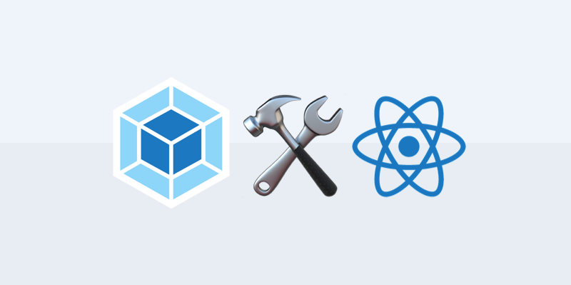
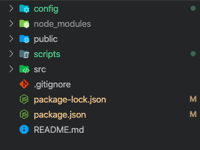

In this post, I'll show you how to run "eject" to see the default webpack configuration of Create-React-App. Of course, the webpack configuration file is very long (about 700 lines, including comments). I can only explain some things with my short knowledge(...), so I'll only point out the overall flow and important configuration properties. I'll only excerpt the code to explain the flow so you can refer to CRA's `webpack.config.js` for the complete code. Also, I won't explain the webpack concept and the configuration file's basic structure, so it would be good if you had some knowledge about it.



## eject

```shell
npm run eject

```

By default, CRA hides the scripts folder, which contains detailed Webpack configuration and the behavior of scripts, to keep the project directory simple. However, you need to customize the hidden configuration details. In that case, you can type `npm run eject` in the console window to make the hidden configuration files visible in the project directory. However, you can't return to the previous state once you eject, so think carefully.

command, your project directory will look like this.

## webpack.config.js

This is the webpack configuration file inside the `config` folder created after eject. At the top of the file, we're calling `paths.js,` which pre-defines variables for the paths we need to build. We've also pre-declared regular expressions to use in the `module.` In this config file, we export an anonymous function by default, which returns a webpack configuration object based on the `webpackEnv` argument.

```javascript
// Pre-declare the regular expressions used in the loader
const cssRegex = /\.css$/;
const cssModuleRegex = /\.module\.css$/;
const sassRegex = /\.(scss|sass)$/;
const sassModuleRegex = /\.module\.(scss|sass)$/;

// apply as an exported module function => return a webpack settings object that varies depending on the environment
module.exports = function (webpackEnv) {
// different webpack settings for development and production mode
  const isEnvDevelopment = webpackEnv === "development";
  const isEnvProduction = webpackEnv === "production";
  ...
  return {
  // mode depends on the webpackEnv argument
  mode: isEnvProduction ? "production": isEnvDevelopment && "development",
  ...
  }
}
```

### entry

Sets `paths.appIndexJs` as the entry point from which the webpack build starts. In the `paths.js` folder in the same folder, this variable points to the `src/index.js` file, which is the starting point for the React component. The `react-dev-utils` is the webpack utilities used by CRA, and the other entries seem to be related to the webpack dev server. Only `src/index.js` is left in the entry array when built in production mode.

```javascript
// Preset the paths needed for the build in paths.js inside the same folder
const paths = require("./paths");

entry: []; }
// only run in development mode
isEnvDevelopment && require.resolve("react-dev-utils/webpackHotDevClient"),
// Set src/index.js as entry point
paths.appIndexJs,
].filter(Boolean), // remove false when built in production mode

```

### output

Output's `path` is set to the `build` folder. Only in production mode will there be a `build` folder. In production mode, the bundled filename `[name]` is appended with `[contenthash:8]` and a hashcode. In development mode, there is no hashcode. The `publicPath` specifies the public URL address of the output file when referenced in a browser.

```javascript
output: {
  // paths.appBuild is 'build', default build folder name is 'build'
  path: isEnvProduction ? paths.appBuild : undefined,

  // Option to mark as a comment with information about the module, not used in production mode
  pathinfo: isEnvDevelopment,

  // In production builds, files and chunks are labeled with a name and hashcode
  filename: isEnvProduction
    ? "static/js/[name].[contenthash:8].js"
    : isEnvDevelopment && "static/js/bundle.js",
  futureEmitAssets: true,
  chunkFilename: isEnvProduction
    ? "static/js/[name].[contenthash:8].chunk.js"
    : isEnvDevelopment && "static/js/[name].chunk.js",

  // Set the public path
  publicPath: paths.publicUrlOrPath,
      ...
}
```

Why hash code the bundling output built-in production mode? Because browsers have caching capabilities, they store parts of bundling files that have been deployed in the past. So when you modify your app and redeploy it, you need to tell the browser that the file's contents have changed because what is being cached should change. The easiest way to tell browsers that a file has changed is to deploy the bundling file with a different name than before, so you can add a hashcode to the bundling output that changes every time you modify and build, making it easy to tell browsers that the file has changed.

In the code above, `[contentHash]` provides a different hash value for each bundled file. If that bundling file is modified, the hash value will change accordingly. The colon and number in `[contentHash:8]` means the hash value is truncated to 8 digits.

### optimization

Optimization specifies options for using the web pack's built-in `SplitChunksPlugin.` If the `minimize` option is true, the plugin objects in the `minimizer` array below will optimize the files during the bundling process. The code below shows that `TerserPlugin` and `OptimizeCSSAssetsPlugin` are used, and `splitChunks` extracts duplicate modules from the app and creates them into different bundling files (chunks). If you set `chunks` to `all,` it extracts and chunks all duplicate modules. Other options exist, such as `initial` or `async.`

```javascript
// plugin options are omitted with ...

optimization: {
    // true when in production mode
    minimize: isEnvProduction,

    // optimize using plugins defined below
    minimizer: [
      new TerserPlugin({
        terserOptions: {
         ...
      }),
      new OptimizeCSSAssetsPlugin({
        cssProcessorOptions: {
          ...
        },
        cssProcessorPluginOptions: {
          ...
        },
      }),
    ],

    // extract duplicate modules and chunk them separately
    splitChunks: {
      chunks: "all",
      name: false,
    },

...
}

```

### resolve

Provide the information needed to interpret the module. Modules provide the folder path to browse for modules, and alias allow you to create an alias for the module. Extension specifies an array ordering of the modules' extensions to be processed first. If modules have the same name but different extensions, the module with the earlier extension will be processed based on the provided extension priority, and the other modules will be skipped.

```javascript
resolve: {
// Provide the path to node_modules to resolve modules in
  modules: ["node_modules", paths.appNodeModules].concat(
    modules.additionalModulePaths || []
  ),

      // provide an array of extension priorities when processing modules
  extensions: paths.moduleFileExtensions
    .map((ext) => `.${ext}`)
    .filter((ext) => useTypeScript || !ext.includes("ts")),

  // Set aliases
  alias: {
    "react-native": "react-native-web",
    ...(isEnvProductionProfile && {
      "react-dom$": "react-dom/profiling",
      "scheduler/tracing": "scheduler/tracing-profiling",
    }),
    ...(modules.webpackAliases || {}),
  },

```

### module

Declares the `loader's needed to process the file. The `loaders are defined in the module's rules array. Test` specifies a regular expression of filename features to apply the loader to. exclude` creates filename rules to exclude from processing. Loaders are loaded from `loader`. Looking at it, CRA uses css, sass, eslint, url, babel, and file loaders by default.

```javascript
module : {
  rules [
    {
      test: /\.(js|mjs)$/,
      exclude: /@babel(?:\/|\\{1,2})runtime/,
      loader: require.resolve("babel-loader"),
      options: {
        ...
      },
    },
  ...
  ]
}
```

### plugins

Apply plugins to the build process. Plugins are implemented as classes, so you can apply them by creating a new anonymous object inside the `plungins` array with the `new` operator.

```javascript
// There are a lot of plugins, so we omitted the option ...

plugins: [ [
  new HtmlWebpackPlugin(
  ...
  ),
  isEnvProduction &&
  shouldInlineRuntimeChunk &&
  new InlineChunkHtmlPlugin(HtmlWebpackPlugin, [/runtime-.+[.]js/]),
  new InterpolateHtmlPlugin(HtmlWebpackPlugin, env.raw),
  new ModuleNotFoundPlugin(paths.appPath),
  new webpack.DefinePlugin(env.stringified),
  isEnvDevelopment && new webpack.HotModuleReplacementPlugin(),
  isEnvDevelopment && new CaseSensitivePathsPlugin(),
  isEnvDevelopment &&
  new WatchMissingNodeModulesPlugin(paths.appNodeModules),
  isEnvProduction &&
  new MiniCssExtractPlugin({
    filename: "static/css/[name].[contenthash:8].css",
    chunkFilename: "static/css/[name].[contenthash:8].chunk.css",
  }),
  new ManifestPlugin({
  ...
  }),
  new webpack.IgnorePlugin(/^\.\/locale$/, /moment$/),
  isEnvProduction &&
  new WorkboxWebpackPlugin.GenerateSW({
  ...
  }),
  ...
].filter(Boolean),
```

There are a lot of plugins in use for each mode; let's highlight a few.

- `HtmlWebpackPlugin`: generates HTML referencing the bundled files together during the build process.
- MiniCssExtractPlugin: Chunks CSS files and generates them in an optional directory.
- ManifestPlugin`: Manages information about the built bundling output by saving it as a `manifest.json` file. This resolves referencing issues that can arise if the bundle file is renamed every time you bundle.

## Scripts folder

According to package.json, the build start command executes the javascript files inside the script folder. Let's see what happens when we run the script command.

```json
// package.json
"scripts": {
  "start": "node scripts/start.js",
  "build": "node scripts/build.js",
  "test": "node scripts/test.js"
},
```

1. Run `build.js,` which will apply the webpack build settings to production and use the fs module to replace the existing build folder with the newly built build folder. ⇒ `npm run build`
2. running `start.js` will apply the webpack build setting to development and declare a new WebpackDevServer object to spin up a webpack devserver with the development build on the specified port (3000). ⇒ `npm run start`

## reference

- [webpack documentation](https://webpack.js.org/guides)
- [about webpack configuration options](https://trustyoo86.github.io/webpack/2018/01/10/webpack-configuration.html)
