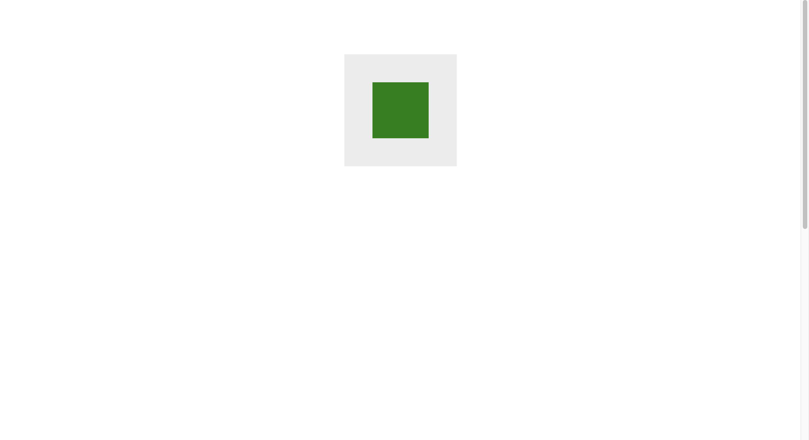
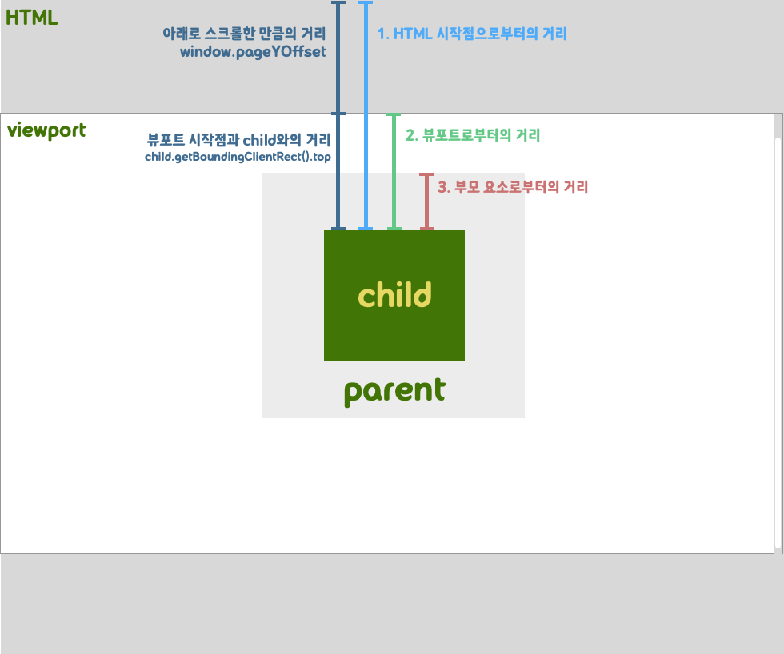
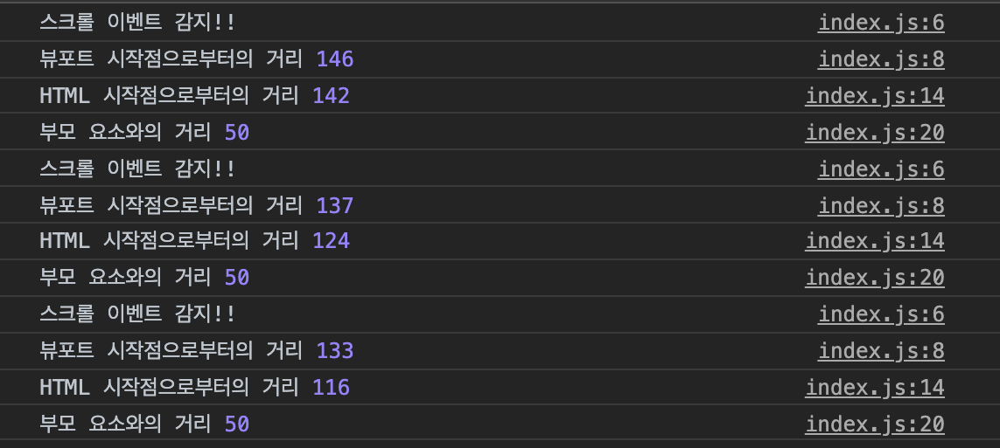

In this post, I'll show you how to get the vertical coordinates of a DOM element. I'm reviewing the DOM because I keep forgetting about it while building apps using frontend libraries. When implementing features in my app, I sometimes need to move the scrollbar to the position of a certain element when a certain event occurs. I don't know how to memorize the coordinates, so I feel like I'm Googling it every time I create a related feature, so I thought I'd write a post about it.

## position on vertical

Horizontal scrolling and an element's x-axis coordinates don't come up a lot in development, as users typically interact with the web by scrolling down the screen. So I'd like to talk about the y-axis coordinates of DOM elements that may or may not change as you scroll down. Let's start with some simple markup.

```html
<!DOCTYPE html>

<html lang="en"><!
  <head>
    <meta charset="UTF-8" />
    <meta name="viewport" content="width=device-width, initial-scale=1.0" />
    <title>Scroll and position</title>
    <style>
      body {
        margin: 0;
        padding: 0;
      }
      .parent {
        background-color: #ececec;
        width: 200px;
        height: 200px;
        margin: 0 auto;
        margin-top: 100px;
        position: relative;
      }

      .child {
        position: absolute;
        top: 25%;
        left: 25%;
        background-color: green;
        width: 100px;
        height: 100px;
      }
      /* We've lengthened the height to create a scroll */.
      .scroll {
        height: 1200px;
      }
    </style>
  </head>
  <body> <div class="parent
    <div class="parent"></div
      <div class="child"></div>
    </div>
    <div class="scroll"></div>
    <script src="./index.js"></script>
  </body>
</html>
```

After writing this, you should get something like this: the green rectangle is the child element, and the gray rectangle is the parent element.


We want to find the y-coordinate of the green rectangle, and the way we do this depends on our criteria. Let's illustrate.

The viewport is the area that the browser shows the user. The entire HTML you show can be larger than the viewport. As you scroll, parts of the webpage disappear out of the viewport, so the child element has multiple coordinate values. You can get the y-coordinate of an element relative to the start of the HTML, relative to the start of the viewport, and relative to the start of the child element.

### Related APIs

There are two DOM APIs to use to get coordinates

- element.getBoundingClientRect()` : This method returns an object that contains information about the bounding edges of the viewport and their distance from the element. The returned object has properties top, bottom, left, and right, which represent the distance in each direction from the viewport.
- window.pageYOffset: A property of the window that tells how far it has scrolled in the vertical direction, in pixels. It has the same value as `window.scrollY`.

## Finding the distance based on the position starting point

### 1. HTML starting point

```javascript
// amount of vertical scrolling + distance from viewport
const distanceFromHtml = child.getBoundingClientRect().top + window.pageYOffset;
```

### 2. Viewport

```javascript
// Distance from viewport
const distanceFromViewport = child.getBoundingClientRect().top;
```

### 3. Parent element

```javascript
// Distance to parent element viewport - distance to child element viewport
// This value is always the same regardless of scrolling.
const distanceBetweenParentAndChild =
  child.getBoundingClientRect().top - parent.getBoundingClientRect().top;
```

### Checking the result

Create an index.js in the same directory, write the following code, and save it.

```javascript
window.onload = () => {
  const parent = document.querySelector('.parent');
  const child = document.querySelector('.child');

  // Create an event listener to detect the scroll event.
  window.addEventListener('scroll', function () {
    console.log('Scroll event detected!!');

    // Distance from the start of the viewport
    const distanceFromHtml = child.getBoundingClientRect().top + window.pageYOffset;

    // distance from HTML start point
    const distanceFromViewport = child.getBoundingClientRect().top;

    // distance from parent element
    const distanceBetweenParentAndChild =
      child.getBoundingClientRect().top - parent.getBoundingClientRect().top;

    console.log('Distance from viewport start point', distanceFromViewport);
    console.log('Distance from HTML start point', distanceFromHtml);
    console.log('Distance from parent element', distanceBetweenParentAndChild);
  });
};
```


You can see the y-coordinate of the child element and its distance from the parent element, which doesn't change as you scroll the scrollbar down, being captured in the console in pixels.

## Scroll API

We've seen how to determine the vertical position of a DOM element, but what if we want to move the scrollbar based on that position? Well, it seems like all we need to do is know the scrollTo and scrollBy.

- window.scrollTo(x,y): scroll to the specified position in the document
- window.scrollBy(xcoordinate, ycoordinate): scroll further x, y from current scroll position

## Refernce

- [Stand Alone as a Developer - Get the absolute coordinates of an element relative to its relative coordinates](https://mommoo.tistory.com/85)
- [MDN - element.getBoundingClientRect()](https://developer.mozilla.org/en-US/docs/Web/API/Element/getBoundingClientRect)
- [MDN - window.scroll()](https://developer.mozilla.org/en-US/docs/Web/API/Element/getBoundingClientRect)
