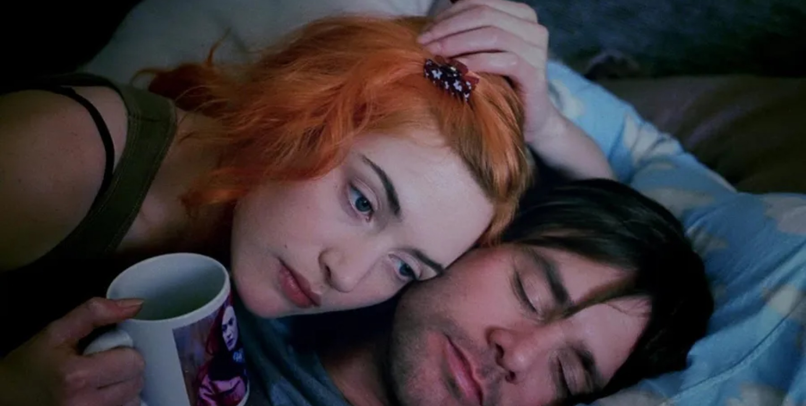

I watched it maybe five times, and I cried the first three times. I cried from the beginning of Joel's dream and then consistently burst into tears during the part where Joel is on the frozen Charles River, wishing he could take it back.

The main sentiment of the movie when I first got to know it was something along the lines of "You can erase your memories, but you can still come back to someone you love." The idea of a couple returning to each other after having all their memories wiped is so emotional that it
is so emotional that it feels unrealistic. I thought that emotion itself was the main theme of the movie, and I cried because of it, and I wouldn't be wrong, but the more I watched it, the more I focused on "what does memory mean in this movie" rather than "love overcoming past memories".

The movie actively expresses the cruelty of erasing memories. Dr. Howard's wife's words, "Don't be a monster, Howard. Tell the girl. You can have him." I think this line sums it up.
There's something monstrous about telling Mary, who has lost her memory, that what happened in the past never happened. Also, in Joel's dreams, he sometimes becomes a little boy, and he can't resist having his memories erased, which makes the Lacuna Clinic's actions very cruel.

It could be said that Joel's fierce resistance to the process of erasing his memories of Clementine makes him realize his love for her again. However, since he has already broken up with her and decided to erase his memories of her, Joel's dream becomes a moment in which he confronts his desire for Clementine: "I want her to be gone from my life, but I want the memories of our time together to remain."

In this way, memory in this movie is subtly treated as something separate and independent from the emotion of love. It's not an inverse relationship, as in the movie's ending, "Even if you lose your memory, your love remains."

It's about the cruelty of erasing memories. To put it a bit more into perspective, Joel's dream in which he says, "Don't erase this memory," suggests that people do a lot with their memories.
If Joel hadn't erased his memories, he might have gotten over the breakup and then relived the memory of Clementine from time to time and thought it was good. Oblivion works in such a way that only the good memories remain.

It's a paradoxical but hopeful way to say, "I don't want you in my life, but I want to keep the memories of our time together." In many breakups, you're trying to protect yourself while simultaneously rushing to remove the other person from your life. This leads to the not-so-easy choice of erasing memories,
like Joel's confused dream. It's like you have to have an epiphany and get hit in the head, or you have to spend a lot of time in that state to get out of it.

But, well... if this was to be the main theme of the movie, the ending would have to change. That would have halved the movie's appeal and I might not have cried three times. Anyway, I've been seeing more of these lately, so I thought I'd give it a try.

(End)

> [Image source](https://wallpapers.com/wallpapers/eternal-sunshine-of-the-spotless-mind-morning-scene-rr9nky69n1oid5ex/download/1920x969), [Netflix](https://www.netflix.com/title/60034545)
