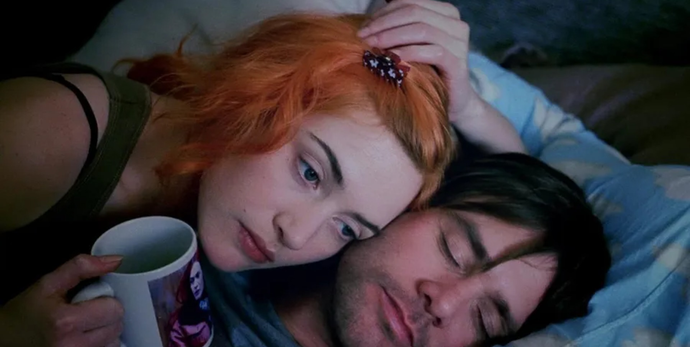

다섯 번인가 봤는데, 처음 세 번 봤을 때까지 울었다. 조엘의 꿈이 시작할 때부터 울먹거리다가 조엘이 얼어버린 찰스 강 위에서 취소하고 싶다며 울부짖는 부분에서 일관성있게 터졌다.

이 영화를 처음 알기 시작했을 때의 주된 감상이라고 한다면, "기억은 지워도 사랑하는 존재에게 다시 돌아오는구나" 쯤으로 일반적이다. 기억을 모든 지운 서로가 다시 서로에게 돌아간다는 설정은
비현실적으로 느껴질만큼 감성적이다. 그 감성 자체가 영화의 메인 주제라고 생각했다. 그것 때문에 울었고 틀린 말은 아닐텐데, 보면 볼수록 "과거의 기억을 이기는 사랑" 보다는 "기억이 이 영화에서 뜻하는 바"에 중점을 두고 영화를 보게 된다.

영화는 기억을 지우는 것이 잔인한 일임을 적극적으로 표현한다. 하워드 박사의 아내의 "Don't be a monster, Howard. Tell the girl. You can have him." 요 대사에서 잘 드러난다고 생각한다.
기억을 잃은 메리에게 과거에 있었던 일을 없었다고 말하는 것에는 괴물성이 있다. 또, 조엘의 꿈에서 그는 가끔 작은 소년이 되기도 하는데 자신의 기억이 지워지는 상황에 저항할 수 없어 라쿠나 클리닉의 행위를 아주 잔인하게 만든다.

클레멘타인에 대한 기억을 지우는 과정에서 격렬히 저항하는 조엘은 다시 그녀에 대한 사랑을 깨닫는다고 말할 수 있겠다. 그게 결말이랑도 이어지기도 하고. 그런데 이미 이별했고 그녀에 대한 기억을 지울 결심을 했다는 점에서, 조엘이 꾸는 꿈은 클레멘타인에 대해 "일상에서는 없었으면 좋겠지만 함께했던 기억은 그대로 있었으면 좋겠다" 라는 자신의 바람을 정면으로 보는 순간이 된다.

이런 식으로 보면 이 영화에서의 **기억**은 사랑이라는 감정과는 별개로, 은근히 독립적으로 다뤄지고 있다는 생각이 든다. 영화 결말처럼 "기억을 잃어도 사랑은 남아있다." 처럼 서로의 관계를 반비례로 보는 게 아니다.

기억을 지우는 것이 몹시 잔인하다는 표현이 그 한 꼭지다. 좀 더 주관을 넣으면 꿈 속에서 "이 기억만은 지우지 말라"고 말하는 조엘의 모습에서 사람은 기억으로 되게 많은 것을 하고 있다는 생각이 든다.
조엘이 기억을 지우지 않았다면 이별을 극복해낸 이후에는 클레멘타인과의 기억을 가끔 되살려 보며 그때 좋았었다고 생각할지도 모른다. 망각이란게 좋은 기억만 남기는 식으로 작동하기도 하고.

"일상에서는 네가 없었으면 좋겠지만 함께했던 기억은 잘 간직하면 좋겠다." 는 역설적이지만 바랄만하다. 숱한 이별의 과정들은 일상에서 상대방을 없애는 일에 급급하면서 동시에 자신을 보호하려고 한다. 그러니 기억을 지워야겠다는 것에 준하는 꽤 쉽지 않은 선택을 하게 되고,
혼란스러운 조엘의 꿈과 같은 사단이 난다. 깨달음의 순간이 와서 머리를 한번 세게 맞거나 시간이 꽤나 지나야만 저 상태로 나아갈 수 있는 거 같기도 하고 그렇다.

하지만 뭐... 이게 영화의 메인 주제가 되려면 결말이 바뀌어야 하겠다. 그렇게 되면 이 영화가 가진 매력이 반감되었을 것이고 세 번 내리 울지도 않았을지도 모르겠다. 하여튼 요새는 요런게 더 눈에 들어와서 한 번 써보고 싶었다.

(끝)

> [이미지 출처](https://wallpapers.com/wallpapers/eternal-sunshine-of-the-spotless-mind-morning-scene-rr9nky69n1oid5ex/download/1920x969), [넷플릭스](https://www.netflix.com/title/60034545)
