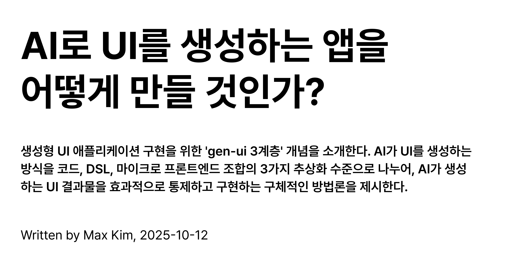
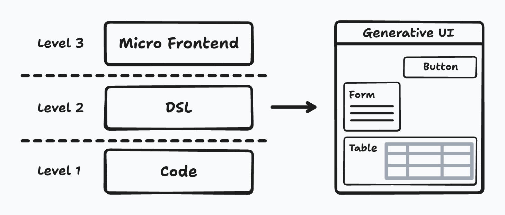
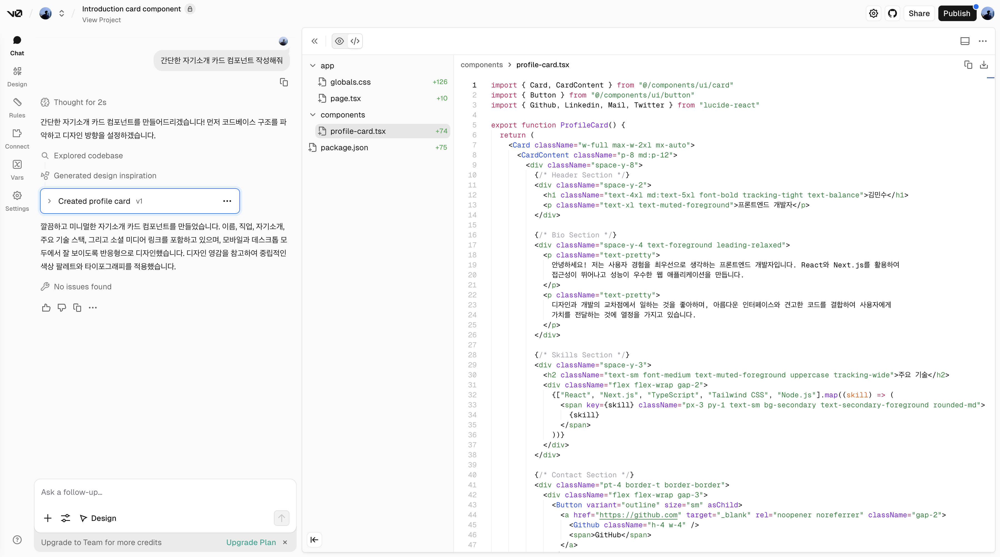
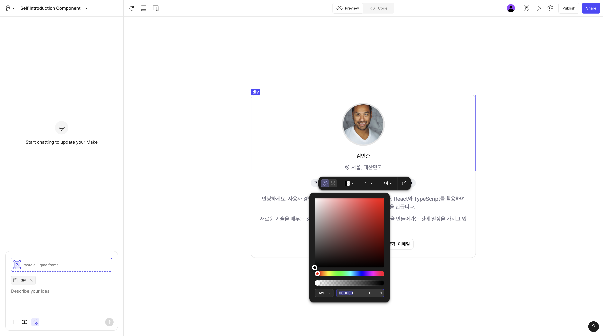
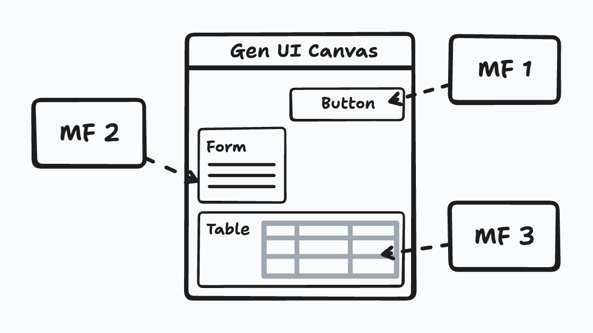

<div style="border:2px solid black;">
  
</div>

이 포스트에서는 생성형 UI 구현을 위해 내가 고안한 'gen-ui 3계층' 개념을 소개한다.

gen-ui 3계층은 생성형 UI를 구현하기 위한 기술적 추상화 수준이다. 애플리케이션이 AI와 어떻게 상호작용하며 UI를 생성할지 이야기해볼 수 있는 생각의 틀이기도 하다. 3계층을 잘 이해하고 활용하여 AI가 생성하는 UI 결과물을 입맛대로 통제할 수 있다. 이전 [AI는 소프트웨어 UI를 어떻게 바꿀까?](https://maxkim-j.github.io/posts/generative-ui) 포스팅이 AI가 UI를 혁신할 수 있는 방식과 그 비전에 대한 이야기였다면, 이 포스팅에서는 어떻게 그 비전을 현실로 만들 것인지에 대해 이야기한다.

3계층의 모든 UI 생성 방식은 사용자의 비정형적인 자연어 쿼리가 UI로 변환되는 큰 흐름을 공유한다. 그러나 AI가 최종적으로 생산하는 결과물이 다르다. 레벨이 올라갈수록 고수준의 결과물을 생산한다고 보면 된다.



## Level 1: 코드 생성

AI가 사용자의 요구에 맞춰 직접 UI 코드를 생성한다. "파란색 확인 버튼을 만들어줘", "회원가입 form을 만들어줘" 와 같은 요청에 대해 LLM이 직접 React 혹은 HTML 코드를 만들어주고 이를 컴파일/렌더링 가능한 샌드박스 위에서 평가하여 사용자에게 UI로 보여준다.

코드를 바닥부터 만들어버리기 때문에 유저의 자유도와 커스텀 가능성이 가장 높은 수준이다. 뒤에서 설명할 Level 2, Level 3의 생성형 UI가 달성하지 못하는 세밀한 커스텀 영역도 지원이 가능하다. 그러나 gen-ui 결과물의 퀄리티를 보장하기가 어렵기 때문에 생산하는 코드 레벨 단에서 최대한의 예측 가능성과 퀄리티를 확보해야만 한다.

v0.app처럼 Chat으로 유저의 요청을 받아 코드와 UI를 생성하는 서비스들이 이 레벨과 관련이 있다. v0는 유저의 별다른 요청이 없다면 shadcn과 tailwind를 기본 코드 작성 방식으로 설정한다. 이 두 도구는 모던한 축에도 속하면서, [추상화 계층이 얇기 때문에 AI가 작성하는 코드 퀄리티 통제에도 도움이 된다.](https://refine.dev/blog/shadcn-blog/#conclusion-a-shift-towards-developer-empowerment-and-ai-synergy)



v0는 커스텀의 상방을 막아놨다. 이것 역시 코드 퀄리티를 통제하기 위함으로 느껴진다. v0에 MCP 연동이 안 된다. 그리고 [shadcn의 레지스트리를 등록하는 방식으로의 커스텀은 지원하지만,](https://v0.app/docs/design-systems) 독스에서 구체적인 예시를 제시하지 않았고 하기 어렵게 해놨다.

제품 개발자 입장에서는 v0처럼 제품 개발자들을 위한 것이 아니라면 개발에 대한 이해도가 없는 일반 유저에게 코드까지 제공해야할 필요는 없다. 좀 더 통제가 쉬우면서 고수준의 결과물을 생성하는 단계로 넘어가는게 올바른 접근일 수 있다.

개발 조직을 AI Transformation하는 입장에서는 이 아이디어가 꽤 유의미하다. 제품개발 조직의 구성원이 챗을 통해 특정 UI를 만들어달라고 요청하고, 결과물로 개발 조직이 사용하는 디자인 언어, 디자인 시스템을 사용한 UI와 Code가 도출될 수 있다면 범용성이 높은 사내 도구로 사용할 수 있다.

PM이나 디자이너가 자신의 아이디어어를 프로토타이핑 할 수 있다. 개발에 대한 지식이 없는 구성원도 챗을 통해 자신이 원하는 애플리케이션을 현재 우리 회사 제품의 깔로 만들 수 있다면 기존의 개발자를 통해 진행했었던 업무를 쉽게 수행 가능하다. 예컨데 이벤트, 프로모션 페이지 개발이나 마케팅 자동화 등의 작업이 그렇다.

AI는 깨지는 코드를 만들 수도 있기 때문에, 컴파일이 안 되거나 에러 발생시 그 피드백을 직접 소화할 수 있는 피드백 루프도 있으면 좋다.

## Level 2: DSL 생성

Level 1의 예측 불가능성과 품질 문제를 해결하기 위해, 한 단계 더 추상화된 접근을 할 수 있다. AI에게 곧바로 코드를 생성하도록 요구하는 대신, UI를 표현하는 약속된 중간 언어, 즉 도메인 특화 언어(DSL, Domain-Specific Language)를 생성하도록 하는 것이다.

예를 들어, 사용자가 "이번 달 신규 가입자 목록을 테이블로 보여줘"라고 요청하면, LLM은 코드 대신 다음과 같은 JSON 형태의 DSL을 생성한다.

```json
{
  "component": "DataTable",
  "props": {
    "columns": ["name", "email", "createdAt"],
    "data_source": "users_this_month"
  }
}
```

AI는 자연어를 미리 정의해놓은 JSON 객체와 같은 정형화된 데이터로 번역하는 역할을 수행하고, 이 DSL을 실제 UI로 렌더링하는 것은 애플리케이션이다. 애플리케이션은 미리 정의된 규칙에 따라 DSL을 해석하여 이미 정해진 방법대로 UI를 만들어낸다.

```ts
// DSL을 UI로 바꾸는 코드 예시
import { DataTable, Card, UserProfile } from './components'; // 미리 정의된 컴포넌트들

// 컴포넌트 이름을 실제 컴포넌트 구현체에 매핑하는 객체
const componentMap = {
  DataTable,
  Card,
  UserProfile,
  // ... DSL로 생성할 수 있는 모든 컴포넌트를 등록
};

/**
 * DSL 객체를 받아 해당하는 React 엘리먼트를 반환하는 함수
 */
function renderFromDsl(dsl) {
  // 1. DSL 객체에서 렌더링할 컴포넌트 타입을 찾습니다.
  const ComponentToRender = componentMap[dsl.component];

  // 2. 맵에 컴포넌트가 없으면 fallback UI를 반환합니다.
  if (!ComponentToRender) {
    return <div>컴포넌트 '{dsl.component}'를 찾을 수 없습니다.</div>;
  }

  // 3. 찾은 컴포넌트에 props를 그대로 전달하여 렌더링합니다.
  return <ComponentToRender {...dsl.props} />;
}
```

쌩 코드를 생성하는 Level 1의 방식보다 품질 관리가 되면서 커스텀되는 영역을 적절히 통제할 수 있다. AI는 DSL 스키마라는 계약을 벗어날 수 없다. 제품 개발자 입장에서는 LLM을 통해 그 어떤 요청도 가능한 유저의 불확실성을 헷지할 수 있다. 어찌됐든 AI는 DSL 밖에 못 바꾸기 때문이고 깨진 코드나 UI를 생성한다면 AI에게 일을 잘 시켰다는 가정 하에 애플리케이션의 버그일 확률이 높아진다. DSL과 피드백 루프, 테스트까지 제약을 빡세개 걸어서 제품 내 코드를 만들어 프로덕션에 적용한 [뱅크샐러드의 "샐러드 게임" 사례도 있다.](https://blog.banksalad.com/tech/banksalad-vibe-coding/)

DSL 스키마는 태생상 커스텀 되는 영역을 모두 정의하고 관리한다. 되는 것, 안 되는 것을 처음부터 모두 정의하면서 제품을 만들어야 하기에 기획과 스펙 합의 과정에 시간을 많이 사용해야 한다. 만들어 보면서 알게 되는 지점도 많을 것이다.

AI가 DSL 문법을 알아야 한다. 코드 생성은 LLM이 워낙 많은 잘 해내지만 이 경우에는 DSL이라는 또 하나의 지식 레이어가 존재한다. DSL이 AI가 기본으로 알고 있는 코드나 데이터 포맷과 너무 상이하지 않아야 AI가 성공적으로 DSL을 이해하고 편집할 수 있을 것이다.

DSL 스펙을 활용하면 커스텀 가능한 영역을 직접 바꿀 수 있는 인풋 형태의 UI도 제공이 가능하다. Figma Make에서는 생성된 코드를 직접 UI에서 편집할 수 있는데 이런 기능을 말하는 것이다. 이것은 채팅의 훌륭한 보조장치가 된다.



## Level 3: Micro Frontend 조합 생성

가장 추상화 레이어가 높은 레벨은 이미 독립적으로 개발되고 배포된, 크고 복잡한 UI 덩어리들을 LLM이 조립하는 것이다. Micro Frontend 아키텍처 위에서 개발되어 적절한 수준으로 디커플링된 마이크로앱들은 그 마이크로앱 자체, 그리고 마이크로앱을 부를 수 있는 URL혹은 다른 형식의 식별자를 가지고 있다.

마법진을 그리면 소환수가 나타나듯 특정 도메인의 마이크로앱들을 Micro Frontend 아키텍처가 유효한 또다른 웹앱에 소환하여 여러 마이크로앱들을 compose하여 유저가 원하는 행위를 하는 웹앱을 조합하여 만들어낸다.

비정형화된 유저의 요청에 LLM은 자신이 꺼낼 수 있는 마이크로앱들의 리스트를 조회하고, 식별자를 선정하여 마이크로앱들을 렌더링한다. 예를 들어, `<MicroAppLoader />` 는 name, module이라는 식별자를 받아 원격지의 마이크로앱을 '소환'할 수 있는 특수한 React Component이다.

```ts
// travel 앱의 "투어 예약 모달" UI 소환
<MicroAppLoader
  name="travel"
  module="TourReservationModal"
/>

// finance 앱의 "내 주식 보기" UI 소환
<MicroAppLoader
  name="finance"
  module="MyStockView"
/>
```

가령 유저가 "이번 주 우리 쇼핑몰의 매출 현황과 가장 많이 팔린 상품 5개를 보여주고, 바로 프로모션 이메일을 보낼 수 있게 해줘" 와 같은 복합적인 요청을 했다고 생각해보자.

이 요청을 받은 LLM은 사전에 등록된 마이크로앱들의 목록과 각 앱이 어떤 능력을 가졌는지 이미 알고 있다. 여기서 name은 원격지 애플리케이션의 고유 식별자이고, module은 그 애플리케이션이 노출하는 특정 기능 컴포넌트를 의미한다. 내 블로그 독자라면 눈치챘을 수도 있는데, 이것은 [Webpack Module Federation의 federated된 앱들 식별하는 방식이다.](https://webpack.js.org/concepts/module-federation/)

`{name}/{module}` 형식으로 LLM이 조합하기로 선택한 앱들을 표현하면 다음과 같다.

1. `sales/Dashboard` - 기간별 매출 현황을 시각화하는 대시보드
2. `products/TopList` - 판매량 순위 상품 목록을 표시하는 리스트
3. `marketing/EmailComposer` - 마케팅 이메일을 작성하고 발송하는 편집기

LLM은 유저의 자연어 요청을 해석하여 '매출 조회', '상품 랭킹', '이메일 발송'이라는 세 가지 핵심 의도를 뽑아낸다. 이에 가장 적합한 마이크로앱을 '소환수'로 간택한다. 아래와 같은 JSON을 만들어낼 수 있다.

```json
{
  "layout": "grid-2x1",
  "apps": [
    {
      "key": "sales-dashboard-weekly",
      "name": "sales",
      "module": "Dashboard",
      "props": { "time_period": "this_week" }
    },
    {
      "key": "top-products-list",
      "name": "products",
      "module": "TopList",
      "props": { "count": 5 }
    },
    {
      "key": "promo-email-composer",
      "name": "marketing",
      "module": "EmailComposer",
      "props": { "template": "new_promotion" }
    }
  ]
}
```

사실 LLM이 마이크로앱들을 조립하는 양상은 2단계인 DSL과 그렇게 상이하진 않다. 굳이 따진다면 이것 자체가 몹시 DSL이라기 보다는 실행 계획(Execution Plan)에 가깝긴 하다.

이제 해당 앱들을 Compose하는 책임이 있는 애플리케이션에서는 이 DSL이라는 설계도를 받아, `<MicroAppLoader />`를 이용해 각 마이크로앱을 런타임에 조립하여 화면을 구성한다.

```tsx
// Host App이 DSL을 받아 MicroApp들을 렌더링하는 코드 예시
function GenerativePage({ dsl }) {
  // dsl.layout에 따라 레이아웃 컴포넌트를 동적으로 선택할 수도 있다.
  return (
    <GridLayout>
      {dsl.apps.map((app) => (
        <MicroAppLoader
          key={app.key}
          name={app.name} // 원격지 앱의 이름
          module={app.module} // 로드할 모듈(컴포넌트)의 이름
          props={app.props}
        />
      ))}
    </GridLayout>
  );
}
```

결과적으로 유저는 단 한 번의 요청으로 매출 그래프, 상품 목록, 이메일 편집기가 한 화면에 유기적으로 조합된 자신만의 맞춤형 페이지를 얻게 되는 것이다. 이 모든 과정은 이미 독립적으로 완벽하게 작동하던 UI 덩어리들을 AI가 유저의 맥락에 맞춰 실시간으로 재조합하기에 가능하다.

현실에서 비슷한 사례를 찾아보면, [Shopify의 Composable Commerce](https://www.shopify.com/enterprise/blog/composable-commerce)가 있다. Shopify는 카탈로그, 장바구니, 결제, 검색 등 독립적인 비즈니스 기능을 '패키지화된 비즈니스 기능(PBC, Packaged Business Capabilities)'이라는 블록으로 정의하는데, 이는 우리가 예시로 든 `sales/Dashboard`나 `products/TopList`와 같은 마이크로앱과 비슷한 개념으로 볼 수 있다.

각각의 도메인이 수평 확장되어 있고, 그것들이 깊고 복잡한 비즈니스를 하는 회사의 애플리케이션들에서 이런 접근이 빛을 볼 수 있다.

어떤 회사가 이제 AI Product를 처음으로 만든다고 치자. AI 애플리케이션을 하나 새로 파서 그 앱 위에 Generative UI의 조각이든 DSL로 구현될 앱이든 API든 만들어놓을 수도 있겠지만, 그러면 새로운 AI 앱에 각각의 도메인들이 너무 쉽게 결합할 수 있고, 각 깊은 도메인 앱에서 이미 만들어진 기능들이 중복되기 쉬운 환경이 조성된다.

우리 회사(flex)만 치더라도 유저가 근무 시작 찍기 위해서 오가는 API 요청과 시퀀스가 이미 수십가지인데 AI 제품 만들겠다고 그 복잡한 로직을 AI 앱에 다시 재구현하거나, 무슨 npm 패키지에 넣어서 빌드타임에 통합하려고 하면 개발자가 몹시 괴롭고 개발 속도도 안 날 것이다. 각각 원래 존재했던 도메인 앱에서 정의한 Micro App들이 AI앱에서 통합되는 것이 응집도와 업무 효율성 면에서 우월하다.

조금 더 상상의 나래를 펼쳐보면, 특정 기능이 어디에 있고 어디서 떠야하고... 이런 기획이 의미없는 세상이 올 수도 있다. 마이크로앱들을 통합할 수 있는 도화지같은 앱을 하나 두고, 각 깊은 도메인 앱에서 개발한 작은 마이크로앱들을 여기에 노출만 한다. 그리고 도화지같은 앱에서는 LLM이, 유저가 직접 그 앱들을 직접 조합해서 사용하는 것이다. 제품 전체는 복잡하고 도메인이 깊지만, URL은 딱 하나고 유저가 자기 맘대로 쓰고 버리는 애플리케이션을 만드는 것이다.



## 3개 다 쓰까서 써보기

사용자의 요청에 따라 이 세 가지 계층을 자유자재로 전환하며 작동한다면 더 유연하고 풍부한 생성형 UI 애플리케이션을 만들 수 있다.

사용자가 핀테크 B2C 앱에서 "이번 달 내 소비 내역 보여줘. 카테고리별로 파이 차트를 그리고, 가장 지출이 큰 5개 항목을 목록으로 보여줘" 라고 요청한다.

1. **Level 3** - AI는 먼저 요청을 분석해 '소비 분석 차트'와 '거래 내역 목록'이라는 크고 독립적인 UI 블록이 필요함을 인지한다. 그리고 이 두 마이크로앱(MFA)을 페이지에 배치하라는 실행 계획(Execution Plan)을 생성한다.
   ```json
   {
     "plan": [
       { "action": "render_mfa", "target": "SpendingChartMFA", "slot": "main_top" },
       { "action": "render_mfa", "target": "TransactionListMFA", "slot": "main_bottom" }
     ]
   }
   ```
2. **Level 2** - '파이 차트', '카테고리별'이라는 구체적인 요구사항을 처리하기 위해, AI는 CategoricalChart 컴포넌트의 DSL을 생성한다. 이 DSL은 어떤 타입의 컴포넌트를 어떤 설정으로 렌더링할지에 대한 명확한 명세가 된다.
   ```json
   {
     "componentType": "CategoricalChart",
     "config": {
       "period": "this_month",
       "chartStyle": "pie",
       "groupBy": "category"
     }
   }
   ```
3. **Level 1** - 잠시 후 사용자가 "파이 차트 위에 '절약 목표까지 ₩50,000 남았어요!'라고 응원하는 메시지 카드를 띄워줘" 라는 요청을 한다. 이 UI는 기존 컴포넌트에 없는 기능이므로, 시스템은 Level 1으로 내려가 이 메시지 카드를 표현하는 Tailwind CSS 기반 ReactNode 코드 조각을 직접 생성하여 동적으로 주입한다.
   ```html
   // 생성된 ReactNode 코드 조각
   <div
     className="my-3 p-4 bg-gradient-to-r from-sky-400 to-emerald-400 text-white rounded-lg shadow-lg flex items-center space-x-3"
   >
     <span className="text-2xl">🎉</span>
     <div>
       <p className="font-bold text-lg">조금만 더 힘내요!</p>
       <p className="text-sm">절약 목표까지 ₩50,000 남았어요!</p>
     </div>
   </div>
   ```

이처럼 AI는 단순한 코드 생성기가 아닌, 요청의 추상화 수준을 실시간으로 판단하여 가장 적절한 전략을 선택하는 지능형 오케스트레이터의 역할을 수행한다.

## 맺는말

이 3개의 레벨을 적절히 조합하여, 생성형 UI를 만드는 애플리케이션을 만들고, 특정 도메인의 기능들을 수월히 통합하여 LLM이 쉽게 알아먹을 수 있는 방식으로 DSL 및 실행 계획 등을 만들고 유지보수하는 것이 Generative UI 애플리케이션을 개발하고 유지보수하는 기술적 역량이 될 수 있다.

그 역량을 지금 내가 쌓고 있는 것 같다. 수없이 만들고 버리고 써보고, 의심하고 고민하는 중
