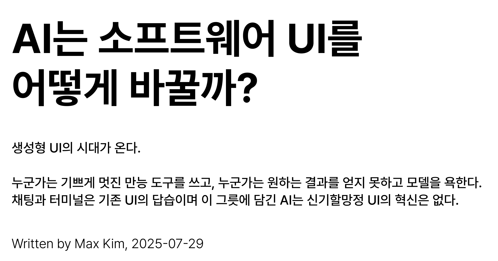
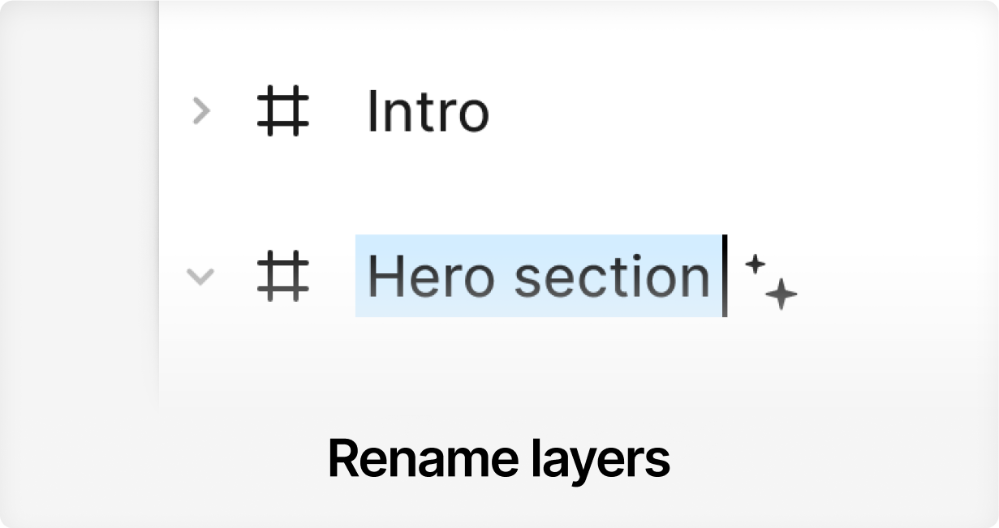
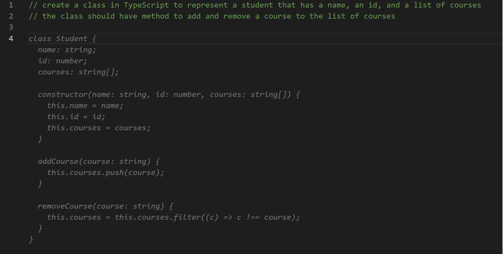

  

과거 컴퓨터와의 유일한 상호작용 방식이 터미널이었던 시절, 인간은 명령어를 입력했다. 컴퓨터는 긴 텍스트로 답했다. 이 방식은 터미널을 사용할 수 있는 사람에게는 강력하고 유연했지만, 검은 화면 위에 깜빡이는 커서는 많은 사람들을 당혹시켰다. 뭘 해야 할지 모르게 만들었다.

> "(Chat GPT의 등장에 대해) 컴퓨터가 터미널이었던 좋은 시절이 돌아온 셈이다. 사용자는 컴퓨터에 타이핑하고 컴퓨터도 긴 문자 목록으로 답을 출력했다. 그것은 매우 놀라웠다. 정말로 강력하고 유연했기 때문이다. 사용자가 무엇을 해야 하는지만 알고 있다면 무엇이든 할 수 있었다. 물론 대부분의 사람들은 무엇을 해야 하는지를 잘 알지 못했지만." 1

채팅을 이용한 AI와의 상호작용이 터미널 쓰는 것과 닮았다. 누군가는 기쁘게 멋진 만능 도구를 쓰고, 누군가는 원하는 결과를 얻지 못하고 모델을 욕한다. 채팅과 터미널은 기존 UI의 답습이며 이 그릇에 담긴 AI는 신기할망정 UI의 혁신은 없다.

AI와의 상호작용에 있어 채팅의 한계는 인간이 의도 표현을 어려워한다는 점에 있다. UX 전문가 Vitaly Friedman은 문제의 핵심을 다음과 같이 지적한다.

> "사람들은 의도를 명확하게 표현하는 것이 매우, 매우 서툴다. 자신이 원하는 것을 표현하는 데도 서툴고, 설령 원하는 것을 말한다 해도 실제로는 그것을 의미하지 않을 수 있다." 2

현재 채팅 기반 상호작용은 의도 표현의 어려움을 인정하기는커녕 상호작용의 모든 부담을 사용자에게 떠넘긴다.

> "왜 내가 프롬프트 작성법을 배워야 하는가? 왜 세상 모든 사람이 프롬프트 작성법을 배워야 하는가? AI가 나를 더 잘 이해해야 하는 것 아닌가? 의도를 표현하는 비용, 상호작용의 비용을 왜 사용자가 떠안아야 하는가?" 3

결국 사용자는 AI가 생성한 결과물을 실제 작업 환경에 수작업으로 통합해야 하고, 채팅 창 밖으로 나가는 순간 AI의 도움은 단절된다.

이런 문제들이 해결되려면 접근 방식을 바꿔야 한다. AI가 이룰 진정한 UI 혁신은 AI가 사용자의 작업 흐름에 자연스럽게 통합될 때 시작된다. 소프트웨어와의 상호작용 방식을 근본적으로 바꾼다. AI는 사용자의 의도와 맥락을 먼저 이해하고 해결책을 제시한다. 위에서 말한 당혹스러움을 해결하고, 사용자는 활용 능력과 관계 없이 AI가 주는 생산성 향상을 가감없이 누린다.

이런 방식의 유저 경험이 기존 애플리케이션 위에서 구현되고 있다. 코드를 작성할 때 다음 줄을 예측해 제안하는 Github Copilot, 컨텐츠의 속성을 참조해 레이어 이름을 한번에 만들어주는 Figma(Rename Layers), Slack에서 바로 티켓을 만들 때 해당 슬랙 스레드의 맥락을 파악하여 바로 티켓 제목을 지어주는 Linear의 경험이 그렇다. 이 기능들을 쓸 때 AI를 쓴다는 감각은 거의 존재하지 않고 알 바도 아니다.

자연스러운 AI 통합의 가장 발전된 형태는 생성형 UI(Generative UI)가 될 것이다. 생성형 UI는 AI가 단순히 기능을 보조하는 것을 넘어, 사용자의 목표 자체에 반응해 작업 환경 전체를 실시간으로 구축하고 재구성한다.

현재 소프트웨어 UI가 가진 가장 큰 문제는 경직성이다. "사고 도구(tools for thought)"의 미래를 탐구하는 독립 연구자 그룹인 Ink & Switch가 지적했듯, 각 앱은 자신만의 데이터와 뷰, 연산을 단단히 묶어둔 사일로(silo)이다. 우리는 여전히 여행 계획을 세우기 위해 항공권, 숙소, 맛집, 지도 앱을 끊임없이 오가며 무엇을 했었는지 잊는다.

> "애플리케이션이 데이터, 연산, 그리고 뷰를 밀접하게 결합해 놓았다는 것이 이런 문제가 발생한 핵심 원인이다." 4

이런 경직된 구조 안에서 AI는 무력하다. AI는 수십 개 브라우저 탭 지옥에서 우리를 구원해줄 수 없다. UCSD의 HCI 연구자 Haijun Xia가 지적하듯, 인간의 정보 활동은 매우 동적이고 혼란스러운 과정이다.

> "인간의 정보 활동은 매우 역동적이며 매우 혼란스러운 과정이다. 나를 포함한 대부분의 사람들이 그렇게 생각할 것이다." 5

점토처럼 유연(malleable)한 소프트웨어에서, UI는 사용자의 필요에 맞춰 실시간으로 생성되고 변화된다.

Ink & Switch는 'Embark'6와 'Potluck'7이라는 프로토타입을 통해 그 가능성을 보여준다. 사용자는 자유로운 텍스트 문서로 작업을 시작해, 필요에 따라 점진적으로 구조와 계산 기능을 추가해 자신만의 소프트웨어를 만든다(Gradual Enrichment). 여행 계획 문서에 `@Aachen`과 `@Friday`를 입력하면, `Weather(in: @Aachen, on: @Friday)`라는 공식을 통해 날씨 정보가 문서 안에 자동으로 삽입되고, 지도 뷰를 추가하면 계획된 모든 장소가 지도 위에 표시된다.

Haijun Xia는 단순히 행동 순서를 생성하는 대신, AI가 작업 환경 자체를 생성하도록 접근 방식을 바꿔야 한다고 주장한다. 그의 연구팀이 개발한 'Jelly' 시스템이 그 예시다.

  <iframe
    style="position: absolute; top: 0; left: 0; width: 100%; height: 100%"
    src="https://www.youtube.com/embed/X3cf1U1dFGQ"
    frameborder="0"
    allowfullscreen
  ></iframe>

> "좋은 작업 환경을 실제로 생성하고 그 위에서 액션이 실행되도록 하는 것이 가능하게 고안했다. … 사용자가 프롬프트를 주면, 먼저 저녁 파티를 준비하기 위해 어떤 조직이 필요할지를 생성하고, 그런 다음 그것을 UI에 매핑한다. 그리고 그 UI가 렌더링되며 작업 환경이 된다." 8

사용자가 '저녁 파티를 준비하고 싶다'고 입력하면, Jelly는 먼저 '활동 명세'를 추론해 필요한 정보 구조(손님, 메뉴, 식단 제한 등)를 정의한다. 그리고 이 구조를 바탕으로 맞춤형 대시보드를 즉시 생성한다. 이 환경은 고정되어 있지 않다. 예를 들어, 특정 손님의 식단에 '견과류 알러지'를 추가하면, Jelly는 이 제약 조건에 맞지 않는 메뉴를 자동으로 감지하고 표시해준다. 사용자가 이사 갈 도시를 '샌프란시스코'에서 '뉴욕'으로 바꾸면, 관련 정보들이 모두 뉴욕에 맞춰 자동으로 업데이트된다. 이는 단순히 정해진 기능을 수행하는 것을 넘어, 작업의 본질과 맥락에 맞춰 환경 자체가 동적으로 진화하는 것을 보여준다.

또다른 HCI 연구자인 Geoffrey Litt는 여기서 더 나아가 LLM을 통해 일반 사용자도 자연어 대화로 소프트웨어를 직접 만드는 'EUP-L(End-User Programming via Language models)' 패러다임을 제안한다. 이 세계에서 프로그램의 소스 코드는 더 이상 복잡한 프로그래밍 언어가 아니다.

> "이러한 방식으로 만들어진 프로그램의 소스 코드는 무엇일까? 대화가 곧 소스 코드이다. 이게 내가 생각하기에 가장 좋은 대답이다." 9

위 프로토타입과 모델들은 소프트웨어의 본질과 개발자의 역할을 완전히 재정의한다. 앱은 더 이상 개발자가 만들어 배포하는 완성품이 아니라, 사용자가 **자신의 필요에 맞게 계속해서 빚어 나가는 살아있는 유기체가 된다.** 데이터는 더 이상 특정 앱에 종속되지 않고, 기능은 고정된 메뉴가 아닌 사용자의 의도에 따라 자유롭게 조합된다.

이런 변화는 Friedman이 강조한 "인간 우선(human-first)" 접근의 구체적 실현이다. 그는 "사용자들은 AI 기능을 찾는 것이 아니라 작동하는 기능을 찾는다. AI인지 아닌지는 중요하지 않다"10고 지적한다. AI가 전면에 나서는 대신 보이지 않는 곳에서 사용자의 의도를 실현하는 도구로 작동하며, 사용자는 보다 자연스러운 상호작용을 경험한다.

J.C.R. 릭라이더는 1960년에 발표한 논문 「인간과 컴퓨터의 공생(Man-Computer Symbiosis)」에서, 인간과 컴퓨터의 파트너십을 꿈꾸며 이렇게 적었다.

> "바라는 것은, 인간의 두뇌와 컴퓨팅 기계가 매우 긴밀하게 결합되고, 그로 인해 탄생한 협력 관계로 인해 인간은 그 어떤 두뇌도 생각해 본 적 없는 방식으로 사고하게 되는 머지 않은 미래다."11

그로부터 2년 뒤, 더글러스 엥겔바트는 1962년 스탠포드 연구소(SRI)에 제출한 보고서 「인간 지성의 증강: 개념적 프레임워크(Augmenting Human Intellect: A Conceptual Framework)」 에서 그 비전을 구체화했다.

> "'인간 지능의 증강'이란, 복잡한 문제 상황에 접근하고, 자신의 특정한 필요에 맞게 이해를 얻으며, 문제의 해법을 도출하는 인간의 능력을 높이는 것을 의미한다." 12

컴퓨터가 인간 지성의 진정한 파트너가 되는 모습, 경직된 앱의 시대를 지나 소프트웨어가 각 개인에게 완벽히 맞춰지는 진정한 의미의 개인화된 컴퓨팅 시대가 AI를 통해 비로소 열리고 있다고 생각된다. HCI 선구자들의 비전의 시작점에 와 있다.

회사에서 AI 관련 이니셔티브에 참여하며 AI가 바꿀 IT 제품의 미래에 대해 골몰하고 있다. AI나 Generative UI, LLM, 지식화와 관련된 주제로 종종 블로그에 글을 써볼 예정이다. 커리어의 새로운 막이 시작됐다. 다행이고 설레면서, 현재의 나는 무지 취약하다.

## References

1. [Post-Chat AI Interfaces (Alan Pike, Forestwalk Labs)](https://allenpike.com/2025/post-chat-llm-ui)
2. [Beyond Chat: What's Next for AI Design Patterns(Vitaly Friedman)](https://www.youtube.com/watch?v=C19H4QimihM)
3. [Beyond Chat: What's Next for AI Design Patterns(Vitaly Friedman)](https://www.youtube.com/watch?v=C19H4QimihM)
4. [Embark: Dynamic documents for making plans (Ink & Switch)](https://www.inkandswitch.com/embark/)
5. [Generative, Malleable, and Personal User Interface (Haijun Xia, UCSD)](https://www.youtube.com/watch?v=MbWgRuM-7X8)
6. [Embark: Dynamic documents for making plans (Ink & Switch)](https://www.inkandswitch.com/embark/)
7. [Potluck: Dynamic documents as personal software (Ink & Switch)](https://www.inkandswitch.com/potluck/)
8. [Generative, Malleable, and Personal User Interface (Haijun Xia, UCSD)](https://www.youtube.com/watch?v=MbWgRuM-7X8)
9. [Malleable software in the age of LLMs (Geoffrey Litt)](https://www.geoffreylitt.com/2023/03/25/llm-end-user-programming.html)
10. [Beyond Chat: What's Next for AI Design Patterns(Vitaly Friedman)](https://www.youtube.com/watch?v=C19H4QimihM)
11. [Man-Computer Symbiosis (J.C.R. Licklider)](https://www.google.com/search?q=http://worrydream.com/refs/Licklider-ManComputerSymbiosis.pdf&authuser=1)
12. [Augmenting Human Intellect: A Conceptual Framework (Douglas Engelbart)](https://www.dougengelbart.org/content/view/138/)
