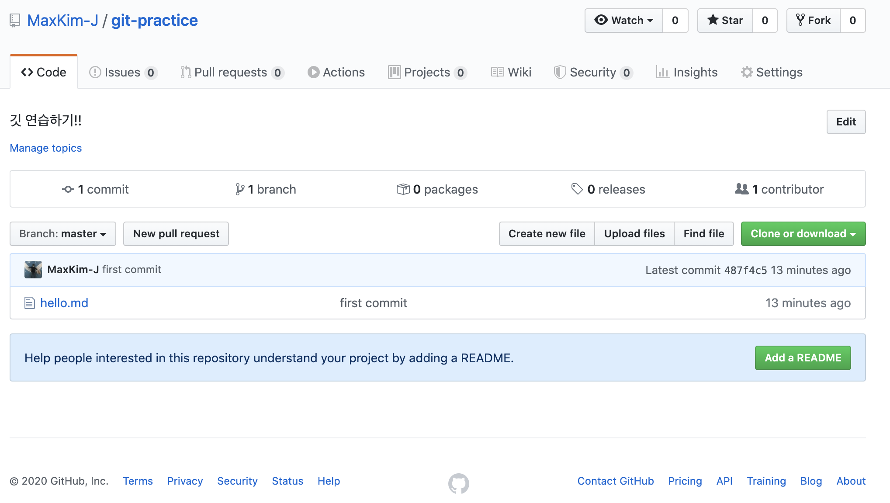

I'm going to try to summarize how to use Git in a nutshell! You don't need to study the Git commands, just follow this post from start to finish and you'll be able to use Git **alone** and manage your GitHub account!


> This post is a supplement to the course material I used to teach a session on Git for the web development club [Pirogramming](https://www.facebook.com/p.rogramming3k/) over the winter break.

## Before we begin (1)

1. your GitHub repository == Remote Repository
2. your project folder == local repository
3. git ≠ GitHub
   - Git: version control software
   - GitHub: a remote repository based on Git. Other examples include GitHub, BitBucket, GitLab, etc.

## Before we start (2)

1. Install Git (+Git Bash) [(link)](https://git-scm.com/downloads)
   - Windows users, please select windows Explorer Integration in the installation setup window
   - [설치 참고링크](https://gabii.tistory.com/entry/Git-Git-Bash-219-%EC%84%A4%EC%B9%98%ED%95%98%EA%B8%B0)
2. Create a GitHub account [(link)](https://github.com/)
3. Create a GitHub repository
   1. log in to GitHub and click the `new` button in the top left corner
      
   2. enter a name and description for your repository and press the `create repository` button
      
   3. the repository is created!
      

After these 3 steps, you're ready to start using Git!

Open GitBash/CMD (Windows) or Terminal (Mac, Linux), create a folder directory for your local repository and navigate to it.


## Start Git (git init)


Git bash, once you've accessed the folder you want to put into your GitHub repository via the terminal,

git init to designate that directory as a local repository. Once you type this command, Git will keep an eye on the directory you've designated as your local repository. Git will detect any modifications, deletions, additions, etc. to the files inside the specified local repository.

## Initial setup (git config)

```shell

# Enter a name for commits (not necessarily your GitHub username)

git config --global user.name "Max Kim"

# Enter your GitHub signup email

git config --global user.email hwaseen@gmail.com
```

Before we get started with Git in earnest, let's install Git and configure a few things that you only need to do **once** per git install (X)

This is to register your GitHub account information, which you can do by running these two commands one after the other with your commit name and GitHub email.

If you write your email in the git settings differently than your GitHub account information, the grass will not get greener on the other side (you won't see a few commits per day), so be sure to write it correctly!!!

```shell

# show git settings

git config --list
```

Enter the above command to view the configuration. Make sure your email and username are entered correctly!!!(Press Q to close)


## Connect to a GitHub repository (git remote)

```shell

# Connect to a remote repository

git remote add origin repository link
```

Now let's link our local repository to a GitHub repository (remote repository)! You can do this when you create a repository and start working with it via GitHub.

You can refer to the URL bar for the repository address, or the address will be listed on the first screen when you create the repository. Please copy this address without quotes and with one space after origin!


What `origin` means here is the **'short name'** of the remote repository. \*\*You can specify multiple remote repositories for a local repository. You can use any other name instead of `origin`, but `origin` is usually used as the name of the first remote repository attached to the local repository. Now we can refer to our remote repositories with `origin`.

## Detecting status changes (git status)


Let's create a `.md' file in our local repository and run the `git status' command.


See the red text? That means Git has detected changes to your local repository! So, `git status` is a command that lets you check if Git has detected any changes to your files. It catches additions, deletions, and even modifications to the file's content.

## stage it (git add)

```shell

# stage all files that have been transformed so far

git add .

# stage only certain files

git add specific filename
```

If Git has detected a state change in your local repository, you can **stage** your changes to this mutated file. Changes that are staged will be reflected in a commit that will be made a short while later. Commits can only be made from the local repository **with the modifications staged**.

After performing `git add`, your terminal bar will change color or appearance like that.

## Commit

```shell

# commit command

git commit -m "commit name"
```

Finally, we're going to commit! A commit is a record of the history of changes from the file before it was modified to the file after it was modified. If putting changes on stage with the `git add` command is like putting items in a shopping cart, commits are like ordering the items in the cart.

The `-m` option of commit tells you to commit with a message, so write `git commit -m` followed by the commit message in double quotes. The commit message usually contains information about what files in the repository you modified and how you modified them.


There is also a command to view the Git commit log for your local repository. Run the command below to see all the commits you've made to your local repository. Press `Q` to exit.

```shell

# View the commit log

git log
```

## Push to the repository

````shell

# push command: git push (remote repository alias) (branch name)

git push origin master
```

Commit, go to GitHub and take a look at the remote repository commit history. Does it reflect the commit?

No, it's not! The commits we made are reflected in the local repository first. They're not reflected in the remote repository yet! To push our commits to the remote repository, we need to use the `push` command, where `origin` is the remote repository alias we set up earlier, and `master` is the default branch of the repository. We'll talk more about branches in the next post.

Run the above command, and when it finishes, look back at your GitHub repository (refresh!) and it should reflect the commit history of your local repository! If this is your first time pushing with a GitHub account, you'll be asked to confirm your GitHub username and password.

That's it for starting, committing, and pushing Git!

## Wrapping up

```shell

## Summarize the whole process from git start => commit => push

git init
git config --global user.name "Name to use for commits"
git config --global user.email "Email
git remote add origin GitHub repository address
--modify your project folder
git add .
git commmmit -m "commit name"
git push origin master
```

You should have learned enough from this post to be able to commit and push to your own repository on your own!!!👏 Good job! When you commit to the `master` branch of your repository, you plant something called grass (if you push to a branch other than `master`, you don't plant grass).


The "**1 commit per day**" mantra among developers these days is also about planting one lawn per day. It's very rewarding to see the grass fill in! I'm trying to practice 1 commit per day by creating a [TIL repo](https://github.com/MaxKim-J/TIL) to summarize what I've learned, and an [ALGO repo](https://github.com/MaxKim-J/Algo) to solve and commit to an algorithmic problem every day.
````
