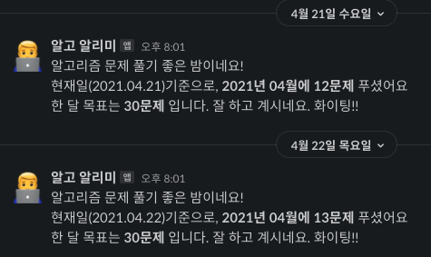
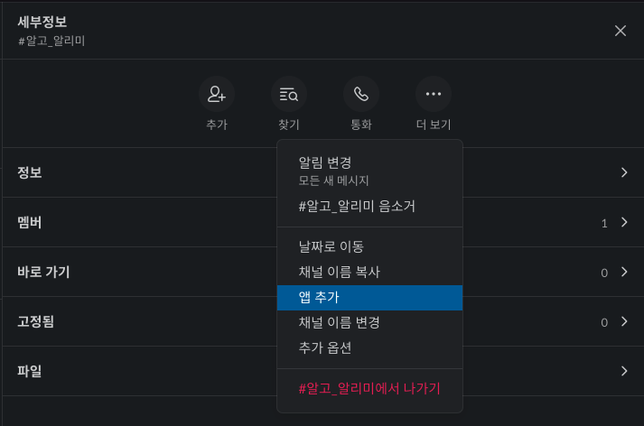
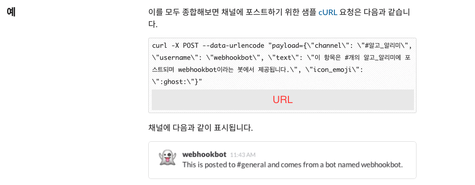
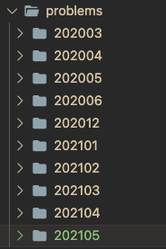

I have a [repository for algorithmic problems](https://github.com/MaxKim-J/Algo) on GitHub that I've been solving. Every month, I create a folder and save the answers to the problems I've solved. I found out that you can set up a cron job in Github Actions, so I tried to automate the repository by integrating it with Slack to send notifications on a daily/weekly basis about algorithmic problems I've solved.



This daily notification tells me at 8pm every night how many algorithmic problems I've solved this month, and how far I am from my goal (30 problems). I used to get so tired of solving algorithmic problems at night after work, but seeing my progress in the notifications has helped motivate me and keep me on track.

It is possible to write such automation scripts in JS by using actions already created in marketplaces such as [github-scripts](https://github.com/actions/github-script), but I thought it would be better to make it faster in the terminal rather than setting up Node in Actions every time I send a notification, so I wrote it as a Bash Shell Script.

## Github Actions and YAML

First, you can use github actions to execute specific logic for different events that happen in the repository (push to a specific branch, create a release, raise a PR, etc.). You can specify specific logic for events that happen in the repository through a YAML file.

The structure of the YAML file looks like this: The action is an action that I'm writing in [my npm library](https://github.com/MaxKim-J/functional-flattener), which allows me to automatically deploy to npm when I create a release in my repository. For more API details, check out the [Docs](https://docs.github.com/en/actions)!

```yaml

name: Name of the Publish # action

# Run the job when the event you specified in the on paragraph happens in the repository.

on:

# when you created the release.

release:
Types: [published].

jobs:
  build: # Name of the job
  runs-on: ubuntu-latest # Set the version of the virtual machine # The steps that make up the job.
  steps: # you can use github actions already created via uses: # checkout to the appropriate repository and set up the node environment. - uses: actions/checkout@v1 - uses: actions/setup-node@v1
  with:
  node-version: 12
  registry-url: https://registry.npmjs.org/ # You can run specific shell commands with run. - run: npm install - run: npm run build - run: npm publish --access public # You can also put environment variables in the command you run: # secrets is a variable that can reference the value of secret specified in the repository.
  env:
  NODE_AUTH_TOKEN: ${{ secrets.NPM_TOKEN }} 
```

## cron job from github action

Daily Github Actions now support job scheduling, which allows you to run jobs at regular intervals using crontab. You can do this by writing an `on:` paragraph in your yaml like this, and adding a cron job. Here, the cron job time is based on UTC time, so we need to subtract 9 hours to convert it to our time.

```yaml
name: algo_daily_alarm

on:
schedule: - cron: "00 11 \* \* \* \*" # Run this Action at 8:20 PM local time.
```

## Integrate Slack Incoming WebHooks

We'll lay the groundwork for sending messages to the Slack channel using Slack's add-on app, `Incoming WebHooks`. Tap Add app to Slack channel to get to the Add app screen, search for `Incoming WebHooks` and add it to the channel.




Once you're done adding and setting up the app and head over to the 'Configuration' screen, you'll find a sample of sending a message request to the Slack channel you added the app to with the `curl` command. If you run that curl command in the terminal, you can forward the message to the corresponding slack channel you registered.



## Run a Bash Shell Script from Github Actions

Running a shell script in Github Actions is easy: since the action itself runs in a Linux virtual machine, you can write the shell script directly in the `run` statement. Specify the shell type as `bash`. The rough structure is as follows

```yaml

name: algo_daily_alarm

on:
schedule: - cron: "00 11 \* \* \* \*"

jobs:
algo_daily_alarm:
runs-on: ubuntu-latest
steps: - name: Checkout
uses: actions/checkout@v2

      - name: POST Algo repo daily alarm to Slack
        shell: bash
        run: |
          ...shell script contents...

```

## Specify the repository secret

Anyone can send a slack notification to my private channel if they know the URL of the slack channel I'm sending the request to. So rather than hardcoding the URL of the slack channel directly into the action, I'll register it as a repository secret so that the action can reference the secret and use it. So the `curl` executable that requests the message could look like this

```yaml
curl -X POST --data-urlencode "payload={\"channel\": \"#algo\_alarm\", \"username\": \"Algo Alerts\", \"text\": \"${DAILY_MESSAGE}\", \"icon_emoji\": \":male-technologist:\"}" ${{ secrets.SLACK_WEBHOOK_URL }}
```

## Create a daily algorithm alert

Here's what your finished daily algorithm alert will look like: Every day at 8pm, roughly when you get home from work, it will tell you how many algorithm problems you've solved this month, and how close you are to your goal of 30 problems.

```yaml

name: algo_daily_alarm

on:
schedule: - cron: "00 11 \* \* \* \*" # 8pm

jobs:
algo_daily_alarm:
runs-on: ubuntu-latest

    steps:
      - name: Checkout
        uses: actions/checkout@v2

      - name: POST Algo repo daily alarm to Slack
        shell: bash
        run:
        # get current time info
          echo slack algo alarm
          NOW_DATE=$(date +%Y.%m.%d)
          NOW_MONTH=$(date +%0m)
          NOW_YEAR=$(date +%Y)

        # Find the algorithmic problem solving folders for the current month and store the number of problems solved in the COUNT variable.
        # Algorithmic problem folders must be created in the directory called problems in the format 'YYYYmm' to be recognized.
          target_file_name="${now_year}${now_month}"
          TARGET_FILE_PATH="problems/${TARGET_FILE_NAME}"
          COUNT=$(ls -al $TARGET_FILE_PATH | grep -E "^-.*\.py$|^-.*\.js" | wc -l | sed 's/ //g')
          SITUATION=""

        # branch for a cheer(?) message based on the number of problems solved by the algorithm
          if [ $COUNT -lt 10 ].
          then
              SITUATION="Keep up the good work!!!"
          elif [ $COUNT -ge 10 -a $COUNT -lt 20 ]
          then
              SITUATION="You're doing great, go for it!!"
          elif [ $COUNT -ge 20 -a $COUNT -lt 30 ]
          then
              SITUATION="You're almost at your goal for this month, great job!!!"
          else
              SITUATION="You've solved over 30 questions!!!! You're so awesome!!!"
          fi

          DAILY_MESSAGE="Great night of algorithmic problem solving!\nAs of today ($NOW_DATE), you've solved *${COUNT} problems in month ${NOW_MONTH} of year ${NOW_YEAR}\nYour goal for the month is *30 problems*. ${SITUATION}"

        # Request a message to the Slack channel
          curl -X POST --data-urlencode "payload={\"channel\": \"#algo_alert\", \"username\": \"algo_alert\", \"text\": \"${DAILY_MESSAGE}\", \"icon_emoji\": \":male-technologist:\"}" ${{ secrets.SLACK_WEBHOOK_URL }}

```

## Create a weekly algorithm alert


To keep the momentum going, I also created a weekly algorithm alert, which tells me every Friday how many algorithm problems I've solved in total this year, and how many problems I've solved in each of the last months of the year.

```yaml
name: algo_weekly_alarm

on:
schedule: - cron: "0 9 \* \* 5"

jobs:
algo_daily_alarm:
runs-on: ubuntu-latest

    steps:
      - name: Checkout
        uses: actions/checkout@v2

      - name: POST Algo repo weekly alarm to Slack
        shell: bash
        run:
        # get current year.
          NOW_YEAR=$(date +%Y)
          TARGET_FILE_PATH="problems"

        # find all folders that record algorithm problems for the current year and put them into an array
          TARGET_DIR=($(find ${TARGET_FILE_PATH} -type d | grep ${NOW_YEAR} | cut -c 38- | sort))

          target_value=()
          LENGTH=0
          TOTAL=0

        # Use a loop to iterate through the folders of this year's algorithm questions and get the number of questions per folder and the total number of questions
          for dir in "${TARGET_DIR[@]}"
          do
              length=$(($length + 1))
              VALUE=$(ls -al "${TARGET_FILE_PATH}/$dir" | grep -E "^-.*\.py$|^-.*\.js" | wc -l | sed 's/ //g')
              target_value+=( $value )
              total=$(( $total + $value ))
          done

          echo $LENGTH
          NOW_DATE=$(date +%Y.%m.%d)
          MESSAGE="*Weekly Algorithm Settlement ($NOW_DATE)*\n\n"

        # Add information about the number of problems solved each month to the message
          for ((i=0;i<$LENGTH;i++)); do
              MESSAGE+="$(echo ${TARGET_DIR[$i]} | cut -c -4)Number of questions solved per month in year $(echo ${TARGET_DIR[$i]} | cut -c 5-): ${TARGET_VALUE[$i]}\n"
          done

          MESSAGE+="--------------------------------\n${NOW_YEAR} Problems solved in year\n*Total $TOTAL problems*\n\n\nI know it's a pain, but it's a PS that will see the light of day. Cheers!!!"

        # Send the message to the channel
          curl -X POST --data-urlencode "payload={\"channel\": \"#algo_alerts\", \"username\": \"algo_alert\", \"text\": \"${MESSAGE}\", \"icon_emoji\": \":male-technologist:\"}"${{ secrets.SLACK_WEBHOOK_URL }}

```

## Finalize



As you can see from the code, the reason the shell script was able to access the directory and count the number of algorithmic problems solved this month, or this year, is because we created a folder under the problems directory with the same format (YYYYmm) to record the algorithmic problems solved each month.

As I was automating, I learned about shell script syntax that I didn't know much about, and I found GitHub actions to be very useful. It's also nice to have simple scheduling without having to go through a cloud computing service!

I also realized that... When I counted the algorithmic problems I solved this year, I realized that I didn't reach the goal I set at the beginning of the year, so I should reflect on it 😭 Even though I set a goal, I'm too tired to do anything after work these days. 30 questions a month... I'll definitely try to regain my stamina and continue solving them 👊.

## Reference

- [Replacing Crontab with the schedule feature added to Github Actions](https://velog.io/@chris/replacing-crontab-with-the-schedule-feature-of-github-actions)
- [Working with scheduling with Github Actions](https://yceffort.kr/2020/07/cron-job-with-github-actions)
- [Workflow syntax for GitHub Actions](https://docs.github.com/en/actions/reference/workflow-syntax-for-github-actions)
