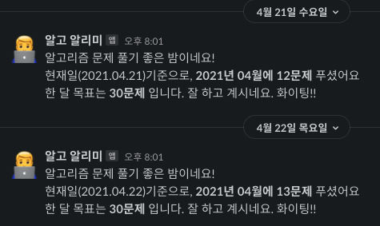
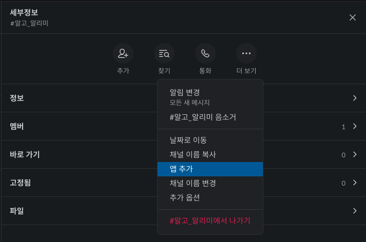
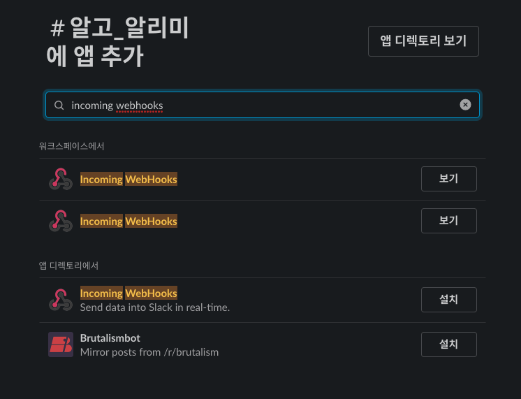
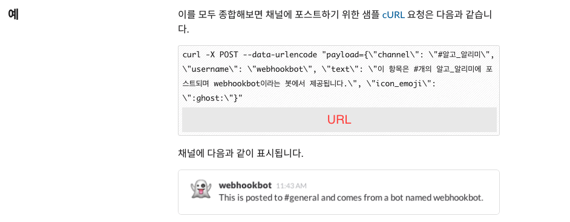
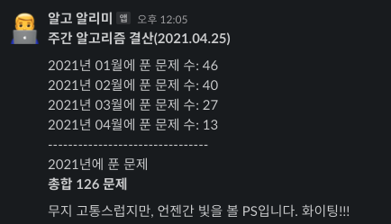
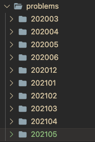

깃헙에 제가 풀었던 [알고리즘 문제들을 기록하는 레포지토리](https://github.com/MaxKim-J/Algo)가 있습니다. 매달 폴더를 만들고 푼 문제의 답안을 저장하는 방식으로 기록하는 레포지토리인데요. Github Actions에서 cron job 설정이 가능하다는 것을 알게 되어, Slack과 연동해 매일/매주 단위로 알고리즘 풀이 관련 알림을 보내는 레포지토리 자동화를 진행해 보았습니다.



이 일일 알림은 매일 밤 8시에 이번달에 푼 알고리즘 문제의 개수와, 목표(30문제) 문제 사이의 차이가 얼마나 되는지 알 수 있게 해줍니다. 퇴근하고 밤 시간에 알고리즘 풀기가 너무 지쳤었는데, 알림을 보면서 누적되는 성과를 눈으로 확인할 수 있어 자극도 되고, 공부 내용에 대한 관리도 용이해졌던 것 같습니다.

[github-scripts](https://github.com/actions/github-script) 같은 마켓플레이스에 이미 만들어져있는 액션을 쓰면 JS로도 이러한 자동화 스크립트를 작성하는게 가능해집니다만, 일일히 알림 보낼때마다 Actions에서 Node를 셋업하기 보다는 아예 터미널에서 더 빠르게 동작할 수 있도록 만들면 좋을 것 같아 Bash Shell Script로 작성했습니다.

## Github Actions와 YAML

먼저 github actions를 통해 레포지토리에서 일어나는 여러 이벤트(특정 branch에 push한다던가, release를 만든다거나, PR을 올린다거나)에 대해 특정 로직을 실행하도록 할 수 있습니다. yaml 파일을 통해 레포지토리에서 발생하는 이벤트에 대한 특정 로직들을 지정할 수 있는데요.

yaml 파일의 구조는 다음과 같습니다. 해당 action은 [제가 만든 npm 라이브러리](https://github.com/MaxKim-J/functional-flattener)에서 쓰고 있는, 레포지토리에서 릴리즈를 만들 때 npm에 자동으로 배포할 수 있게 하는 action입니다. 자세한 API는 [Docs](https://docs.github.com/en/actions)를 참고하시면 좋을 것 같습니다!

```yaml

name: Publish # action의 이름

# on 단락에서 지정해준 이벤트가 레포지토리에서 일어나면 job을 실행합니다.

on:

# release를 만들었을 때

release:
types: [published]

jobs:
  build: # 작업의 이름
  runs-on: ubuntu-latest # 가상머신의 버전 설정 # 작업을 이루는 단계들입니다.
  steps: # uses를 통해 이미 만들어진 github actions를 사용할 수 있습니다. # 해당 레포지토리로 체크아웃 한 후, node 환경을 셋업합니다. - uses: actions/checkout@v1 - uses: actions/setup-node@v1
  with:
  node-version: 12
  registry-url: https://registry.npmjs.org/ # run으로 특정 shell 명령어를 실행시킬 수 있습니다. - run: npm install - run: npm run build - run: npm publish --access public # 실행시키는 명령어에 환경변수를 넣어줄 수도 있습니다. # secrets는 레포지토리에 지정한 secret값을 참조할 수 있는 변수입니다.
  env:
  NODE_AUTH_TOKEN: ${{ secrets.NPM_TOKEN }} 
```

## github action에서 하는 cron job

이제 일일 Github Actions에서는 crontab을 사용해 일정한 주기를 가지고 작업을 실행할 수 있게 하는 job 스케쥴링을 지원합니다. yaml의 `on:` 단락을 다음과 같이 작성하고, cron job을 추가하면 됩니다. 여기서 cron job 시간의 기준은 UTC 시간이라서, 한국 시간으로 변환하려면 9시간을 빼줘야 합니다.

```yaml
name: algo_daily_alarm

on:
schedule: - cron: "00 11 \* \* \*" # 한국시간 기준 오후 8시(20시)에 해당 Action 실행
```

## Slack Incoming WebHooks 연동

Slack의 추가 앱인 `Incoming WebHooks`를 사용해 슬랙 채널로 메시지를 보낼 수 있게 밑작업을 합니다. 슬랙 채널에 앱 추가를 눌러 앱 추가 화면을 누르고, `Incoming WebHooks`를 검색해서 채널에 추가합니다.




앱 추가 및 설정을 완료해 '구성' 화면으로 넘어가면, `curl` 명령어로 앱을 추가한 슬랙 채널에 메시지 요청을 보내는 샘플을 찾을 수 있습니다. 터미널에서 해당 curl 명령어를 실행시키면 등록한 해당 slack의 채널로 메시지를 전달할 수 있습니다.



## Github Actions에서 Bash Shell Script 실행시키기

Github Actions에서 쉘 스크립트를 실행시키는 것은 어렵지 않습니다. 액션 자체가 리눅스 가상머신에서 돌아가기 때문에, `run`문에 쉘 스크립트를 바로 작성하면 됩니다. 이때 shell의 종류를 `bash`로 지정합니다. 대략의 구조는 다음과 같습니다.

```yaml

name: algo_daily_alarm

on:
schedule: - cron: "00 11 \* \* \*"

jobs:
algo_daily_alarm:
runs-on: ubuntu-latest
steps: - name: Checkout
uses: actions/checkout@v2

      - name: POST Algo repo daily alarm to Slack
        shell: bash
        run: |
          ...쉘 스크립트 내용...

```

## 레포지토리 secret 지정해주기

요청을 보내는 slack 채널 URL을 알면 누구나 제 개인 채널로 슬랙 알림을 보낼 수 있습니다. 따라서 action에 직접 slack 채널의 URL을 하드코딩하기 보다는 레포지토리 secret으로 등록하여 action에서는 secrets를 참조하여 사용할 수 있도록 합니다. 그렇다면 메시지 요청을 하는 `curl` 실행문은 아래와 같이 쓸 수 있습니다.

```yaml
curl -X POST --data-urlencode "payload={\"channel\": \"#알고\_알리미\", \"username\": \"알고 알리미\", \"text\": \"${DAILY_MESSAGE}\", \"icon_emoji\": \":male-technologist:\"}" ${{ secrets.SLACK_WEBHOOK_URL }}
```

## 일일 알고리즘 알림 만들기

완성된 일일 알고리즘 알림은 이렇습니다. 일일 알고리즘 알림은 퇴근하고 얼추 집에 오는 시간인 매일 오후 8시에, 이번달에 푼 알고리즘 문제가 총 몇 문제인지 알려주고, 목표로 설정한 30문제에 얼마나 근접했는지 알려줍니다.

```yaml

name: algo_daily_alarm

on:
schedule: - cron: "00 11 \* \* \*" # 오후 8시

jobs:
algo_daily_alarm:
runs-on: ubuntu-latest

    steps:
      - name: Checkout
        uses: actions/checkout@v2

      - name: POST Algo repo daily alarm to Slack
        shell: bash
        run:
        # 현재 시간 정보 가져오기
          echo slack algo alarm
          NOW_DATE=$(date +%Y.%m.%d)
          NOW_MONTH=$(date +%0m)
          NOW_YEAR=$(date +%Y)

        # 이번 달에 해당하는 알고리즘 문제 풀이 폴더 찾고 푼 문제 개수 COUNT 변수에 저장
        # 알고리즘 문제 풀이 폴더들은 problems라는 디렉토리 안에 'YYYYmm'의 형식으로 만들어져야 인식됩니다.
          TARGET_FILE_NAME="${NOW_YEAR}${NOW_MONTH}"
          TARGET_FILE_PATH="problems/${TARGET_FILE_NAME}"
          COUNT=$(ls -al $TARGET_FILE_PATH | grep -E "^-.*\.py$|^-.*\.js" | wc -l | sed 's/ //g')
          SITUATION=""

        # 알고리즘 푼 문제 개수에 따른 응원(?)메시지 분기문
          if [ $COUNT -lt 10 ]
          then
              SITUATION="더 분발하세요!!!"
          elif [ $COUNT -ge 10 -a $COUNT -lt 20 ]
          then
              SITUATION="잘 하고 계시네요. 화이팅!!"
          elif [ $COUNT -ge 20 -a $COUNT -lt 30 ]
          then
              SITUATION="이번달 목표를 거의 다 달성하셨네요. 대단해요!!"
          else
              SITUATION="30문제 넘게 푸셨네요!!!! 대박대박 너무 짱짱맨입니다!!"
          fi

          DAILY_MESSAGE="알고리즘 문제 풀기 좋은 밤이네요!\n현재일($NOW_DATE)기준으로, *${NOW_YEAR}년 ${NOW_MONTH}월에 ${COUNT}문제* 푸셨어요\n한 달 목표는 *30문제* 입니다. ${SITUATION}"

        # 슬랙 채널로 메시지 요청
          curl -X POST --data-urlencode "payload={\"channel\": \"#알고_알리미\", \"username\": \"알고 알리미\", \"text\": \"${DAILY_MESSAGE}\", \"icon_emoji\": \":male-technologist:\"}" ${{ secrets.SLACK_WEBHOOK_URL }}

```

## 주간 알고리즘 알림 만들기



기세를 몰아 주간 알고리즘 알림도 만들어 봤습니다. 주간 알고리즘 알림은 매주 금요일에 올해에는 알고리즘을 총 몇 문제 풀었는지, 올해의 지난 달 각각 알고리즘을 몇 문제 풀었는지도 알려줍니다.

```yaml
name: algo_weekly_alarm

on:
schedule: - cron: "0 9 \* \* 5"

jobs:
algo_daily_alarm:
runs-on: ubuntu-latest

    steps:
      - name: Checkout
        uses: actions/checkout@v2

      - name: POST Algo repo weekly alarm to Slack
        shell: bash
        run:
        # 올해 년도 구하기
          NOW_YEAR=$(date +%Y)
          TARGET_FILE_PATH="problems"

        # 올해 알고리즘 문제를 기록하는 폴더를 모두 찾아 배열에 넣기
          TARGET_DIR=($(find ${TARGET_FILE_PATH} -type d | grep ${NOW_YEAR} | cut -c 38- | sort))

          TARGET_VALUE=()
          LENGTH=0
          TOTAL=0

        # 반복문을 이용해 올해 알고리즘 문제 폴더를 순회하면서 폴더당 문제 개수, 문제 개수 총합 구하기
          for dir in "${TARGET_DIR[@]}"
          do
              LENGTH=$(($LENGTH + 1))
              VALUE=$(ls -al "${TARGET_FILE_PATH}/$dir" | grep -E "^-.*\.py$|^-.*\.js" | wc -l | sed 's/ //g')
              TARGET_VALUE+=( $VALUE )
              TOTAL=$(( $TOTAL + $VALUE ))
          done

          echo $LENGTH
          NOW_DATE=$(date +%Y.%m.%d)
          MESSAGE="*주간 알고리즘 결산($NOW_DATE)*\n\n"

        # 메시지에 매달 푼 문제 개수 정보 추가하기
          for ((i=0;i<$LENGTH;i++)); do
              MESSAGE+="$(echo ${TARGET_DIR[$i]} | cut -c -4)년 $(echo ${TARGET_DIR[$i]} | cut -c 5-)월에 푼 문제 수: ${TARGET_VALUE[$i]}\n"
          done

          MESSAGE+="--------------------------------\n${NOW_YEAR}년에 푼 문제\n*총합 $TOTAL 문제*\n\n무지 고통스럽지만, 언젠간 빛을 볼 PS입니다. 화이팅!!!"

        # 채널로 메시지 보내기
          curl -X POST --data-urlencode "payload={\"channel\": \"#알고_알리미\", \"username\": \"알고 알리미\", \"text\": \"${MESSAGE}\", \"icon_emoji\": \":male-technologist:\"}"${{ secrets.SLACK_WEBHOOK_URL }}

```

## 마무리



코드를 보셨다면 아시겠지만, 쉘 스크립트가 디렉토리에 접근해서 이번달, 혹은 올해 풀었던 알고리즘 문제의 개수를 셀 수 있었던 이유는 problems 디렉토리 하위에 같은 포맷(YYYYmm)을 가진 이름으로 매달 푼 알고리즘 문제를 기록하는 폴더를 만들었기 때문입니다.

자동화를 진행하면서 잘 몰랐던 쉘 스크립트 문법에 대해 배울 수 있었고, 깃헙 액션은 참 유용하다는 생각이 들었습니다. 클라우드 컴퓨팅 서비스를 경유하지 않고도 간단하게 스케쥴링을 이용할 수 있다는 것도 참 좋은 것 같아요!

또한 느낀 것은... 올해 푼 알고리즘 문제를 저렇게 세어보니 제가 올해 초 설정했던 목표치에는 도달하지 못해 반성해야 할 것 같습니다😭 목표를 세워 놓고도 요즘은 퇴근하면 너무 지쳐서 아무것도 못하고 있습니다. 한 달에 30문제... 다시 체력을 회복해서 꼭 계속 풀어내도록 하겠습니다.👊

## Reference

- [Github Actions에 추가된 schedule 기능으로 Crontab 대체하기](https://velog.io/@chris/replacing-crontab-with-the-schedule-feature-of-github-actions)
- [Github 액션으로 스케쥴링 작업하기](https://yceffort.kr/2020/07/cron-job-with-github-actions)
- [Workflow syntax for GitHub Actions](https://docs.github.com/en/actions/reference/workflow-syntax-for-github-actions)
