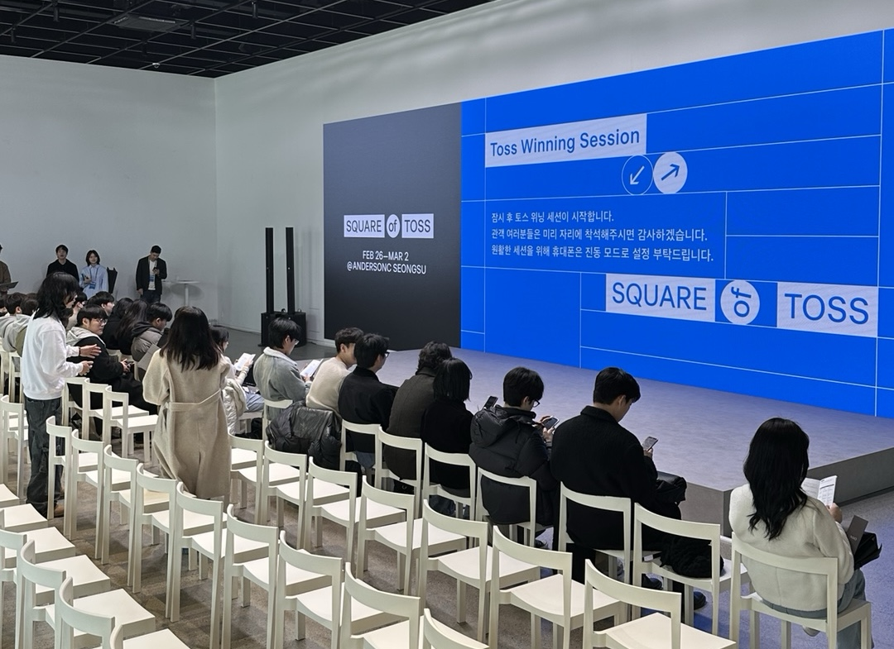

On March 1st, I was invited to the Toss "10 to 100" event and attended a session by Seo-jin Park, Head of Frontend at Toss. I found her story fascinating—how she began her career at Toss, and how she has developed the frontend chapter, products, and culture to where they are today.

One part that really struck me was when she said, ["Doing work without craftsmanship means you're just repeating your first year of experience over and over."](https://youtu.be/RzVABPt9f-g?t=991) The phrase on the slide read ["Repeating year one six times vs. growing every year"](https://youtu.be/RzVABPt9f-g?t=1037). It was a strong reminder that some developers may end up just looping through a "year one" experience throughout their career.

Great engineering opportunities are unequally distributed. Not every developer can naturally grow and become a well-experienced engineer simply by working at any company over time. The density of the experience really matters. Seo-jin emphasized this and explained how Toss creates an environment that offers such dense engineering experiences. I came away feeling that Toss is truly a strong engineering team.

Personally, I also wanted to reflect on what I believe matters when it comes to building dense engineering experience. Since the definition of a “great engineer” is very subjective, let me start by describing my ideal: _an engineer who contributes to the product and team’s growth through appropriate engineering decisions, regardless of what stage the product or business is at._ For others, this might mean “an engineer who can 100x revenue,” or “an engineer who builds a team that grows together.” All are wonderful goals.

The aspects of a good engineering experience are deeply interconnected. So I’ll begin with a summary line:

> When a product succeeds, it needs to be operated. This leads to scaling demands, then hiring. More people work on the same codebase, requiring more advanced technologies. The problems become harder, the code lives longer, and if you can fully go through and reflect on that process, you’ll gain a solid understanding of what engineering choices were right or wrong.

You need multiple cycles of **feedback loops in decision-making**. While working, you should get a sense of whether your engineering choices led to good outcomes or not. Some choices take months or even years to reveal results. So if your **tenure** is short, it’s hard to build that intuition about what worked and what didn’t.

But just staying long doesn’t guarantee that experience. The **organizational culture** must delegate to those most capable, allow them to own the process fully, tolerate failures, and encourage reflection. In such a culture, tech debt is reviewed thoroughly. People don’t lazily say “It made sense then, but not anymore.” Instead, they’re allowed to say, “That decision was wrong even back then.”

You absolutely need to **operate the product**. Engineers who only build things from scratch and move on won’t easily learn about the realities of maintaining mature, long-lasting software. They don’t assume their code will live inside a product for years. One thing I’ve always wanted to check in interviews is whether the candidate has **operated a product for a substantial period**. Without this experience, they’re more likely to create too much implicit knowledge in the code, use magic tricks too freely, and unknowingly write more dangerous code.

But failed products don’t get operated, so to experience product operation, **the product needs to succeed.** Without a strong business, there are limits to what kinds of engineering experiences you can have. I have a rough internal compass for identifying successful products, but I’ve never started a business or been a CEO—so I wouldn’t claim any real authority on the matter.

When the product does succeed, **scaling demands** arise. VoC must be reflected in the product, and you pursue better business opportunities. You hire more engineers. The speed of development increases, and complexity multiplies. At some stages, you might even need technologies that seemed like over-engineering earlier. What once felt excessive becomes just right.

As the organization and product scale, you need to **solve increasingly harder problems**. There are teams for whom micro frontends would seem like absurd over-engineering. But for the Flex team’s web product, it’s the appropriate level of engineering.

The team I work in—Flex—meets many of these conditions. That’s why I can continue to enjoy working here, spending my time and energy solving problems and feeling fulfilled by it. I also contribute to making it easier and more enjoyable for other engineers to gain dense engineering experiences.

Except for tenure, most of these elements are **beyond my control**. Whether I can have these experiences depends heavily on luck and timing. So I don’t think it’s fair to give out advice or claim someone’s doing it wrong. If you ever hear advice like that—just bounce it off like a rainbow-reflecting shield.

If the company suddenly collapses, or the organization turns sour, or if I end up in a situation where I simply can’t do what I want despite my best efforts—then none of what I said matters. If I find myself unable to gain these dense experiences, I’ll move on to a different job or another field.
