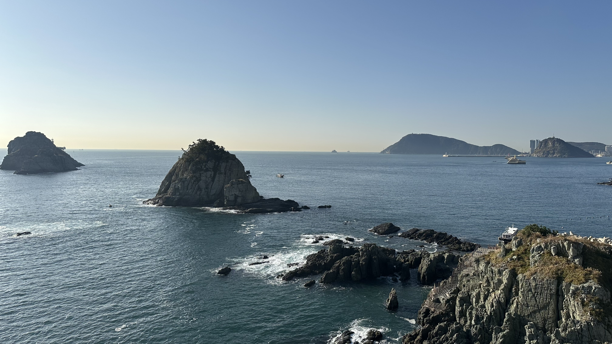
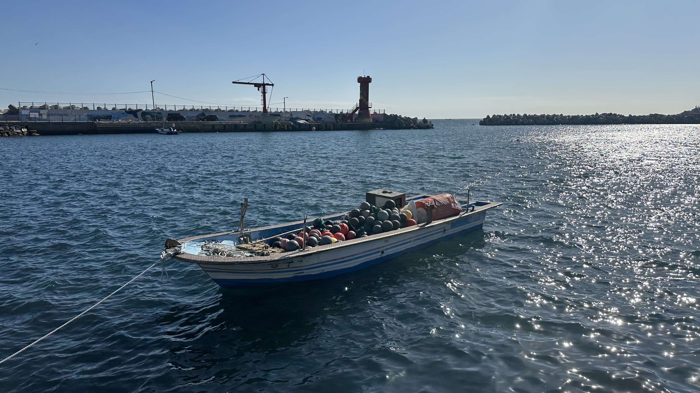
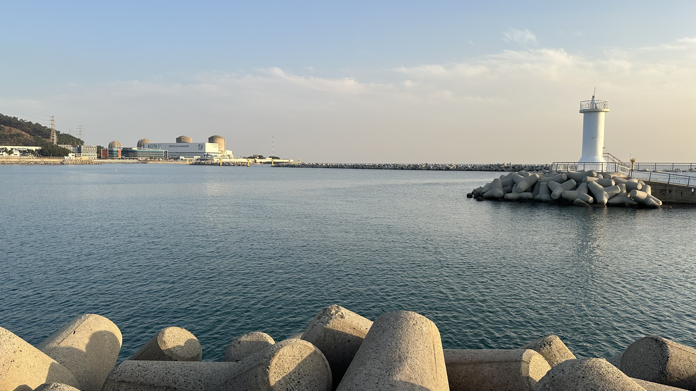
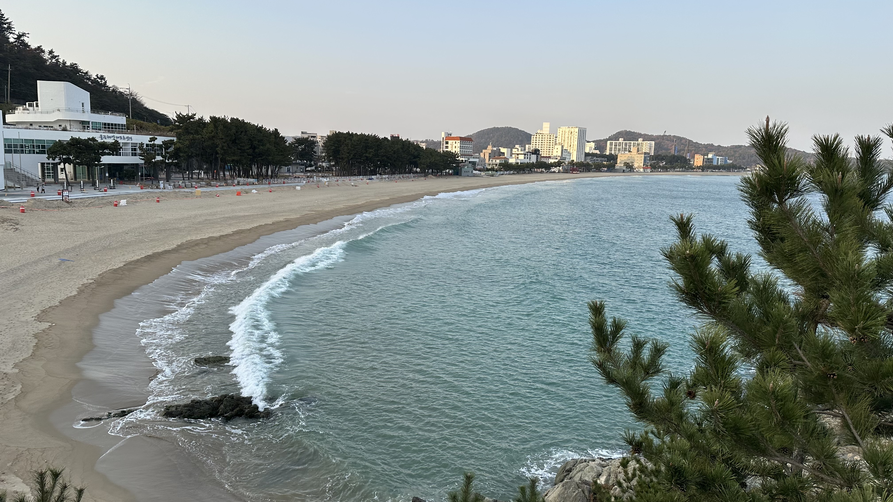
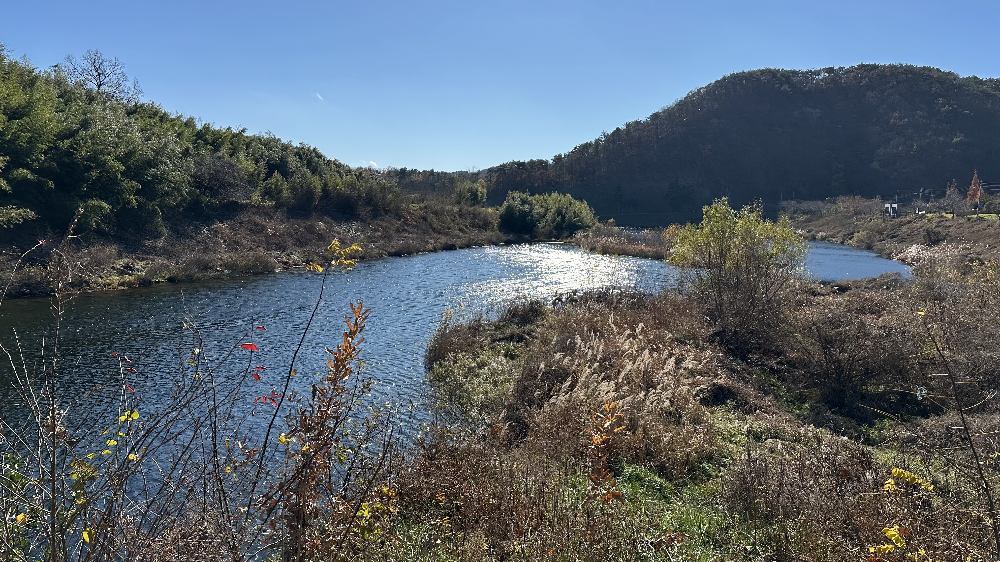
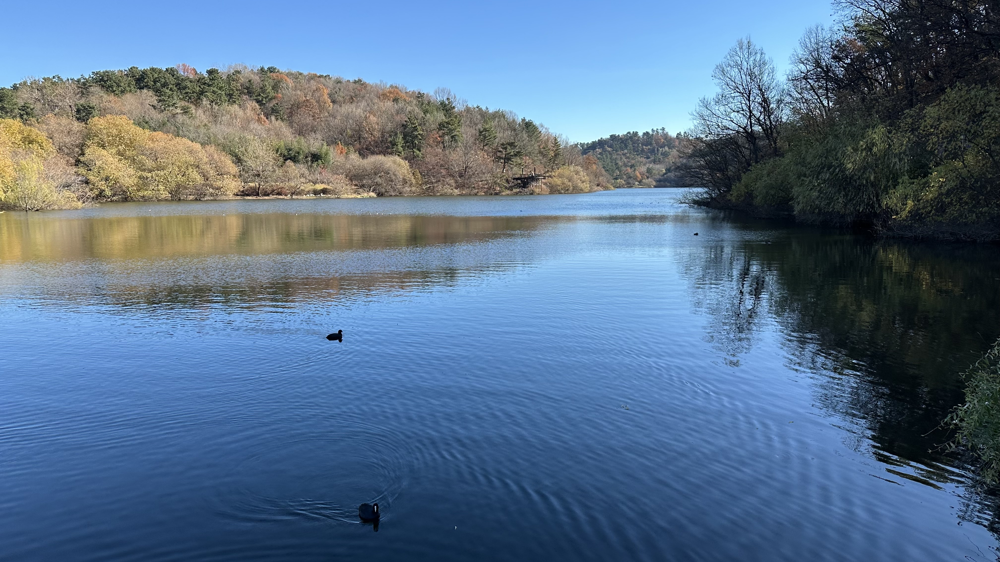
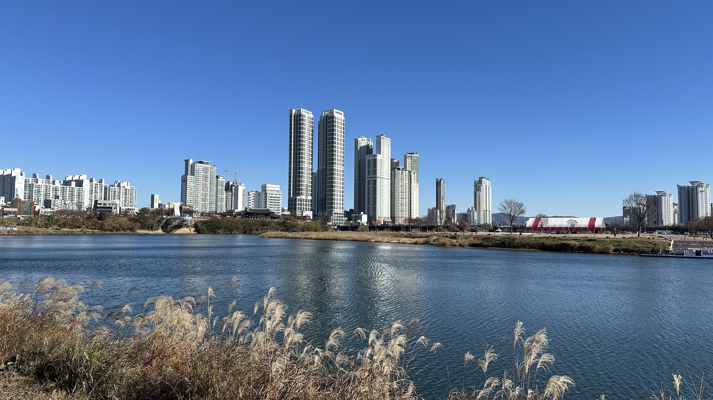
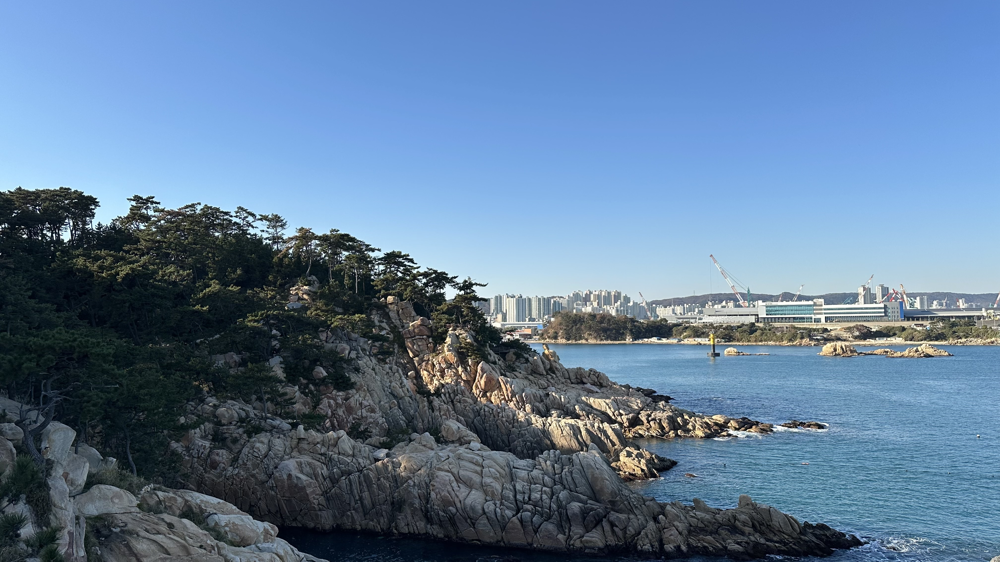
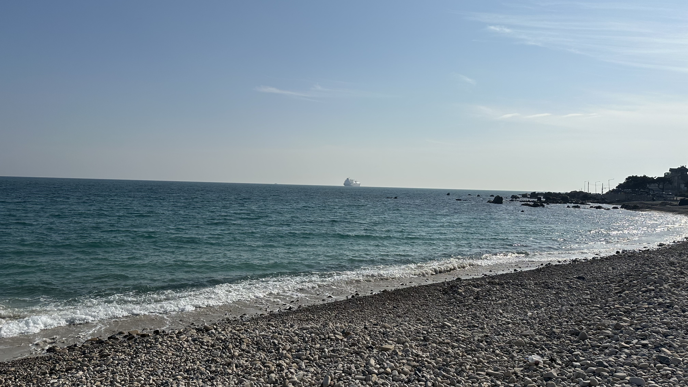
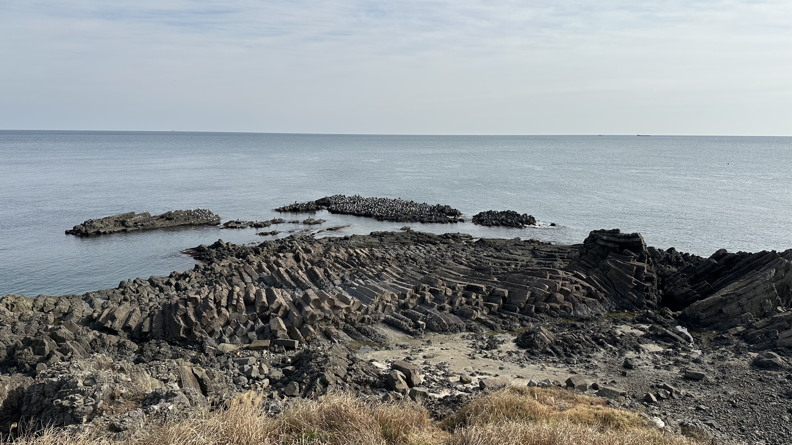

[3년 근속으로 회사에서 2주 휴가가 나왔다](https://flex.careers.team/). 그동안 해보고 싶었던 해파랑길 트래킹을 해보기로 했다. [해파랑길](https://www.durunubi.kr/haeparang-introduction.do)은 부산부터 강원도 고성까지 동해안을 따라 이어지는 750km의 도보여행 코스다. 1코스에서 10코스를 10일 동안 혼자 하루에 하나씩 걸어보기로 했다.

2주짜리 휴가는 곤란하다. 회사를 10영업일 쉬는게 가능한가? 아닌 것 같았다. 올해 회사 일정 그리고 업무들이 무게는 무겁고 밀도가 빽빽해서, 모든 시기가 나에게는 아주 중요했고 회사에게도 중요했다. 도저히 2주 동안 시간을 낼 수가 없었다. 그렇다고 확신하던 와중에 가기는 가는 시기를 정했다. 정하고 돌아보니 어느때든 이 휴가를 쓸만한 시기는 없었다. 그냥 써야 하고 그냥 가야 하는 거였다.

3년에 한번씩 오는 이 휴가를 많은 돈과 시간을 사용해 가능한 멀리 떠나 할 수 있는 모든 것을 해야 할 것 처럼 여겼다. 그러나 정신 상태가 영 아니었다. 세상의 변화들을 쉴틈없이 소화하느라 체한 상태로, 겨우 감당할 수 있는 양과 크기의 일들을 짊어지며 지치고 접힌 마음들이 툭툭 고였다. 그것들을 고르고 펼치고 다림질하고 싶었다. 가능한 아무하고도 말을 하지 않고 아무것도 듣지 않고 보지 않으며, 생각을 많이 하고 평소의 생활과 전혀 다른 루틴을 만드는 것이 좋겠다. 바다로 가서 오래 걷기로 했다.

# 해파랑길 1코스(부산 남구, 16.9km)

이기대 공원 해안에서 마음은 안정을 찾지 못한다. 내리쬐는 태양 거대한 암석을 깎아내려는 파도의 우락부락한 기세를 느꼈다. 광안리 바다를 보며 모래밭에 앉아 있었다. 수많은 바다들을 보며 바닥에 앉아 멍때리는 것이 습관이 된다.

첫날 숙소 때문에 2코스 절반까지 가느라 23km를 걸었는데, 발바닥이 아프고 물집이 잡혔다. 이날 이후부터 물집 테이프 등으로 관리를 철저히 하기 시작했다. 물집 테이프를 붙인 채 그대로 양말을 신는 방법을 익힐 수 있었다.

# 해파랑길 2코스(부산 해운대구, 14km)

송정해수욕장 앞에서 하루를 시작했다. 해운대, 광안리를 벗어난 부산 바다는 처음이었다. 어제부터 하루종일 바다를 보고 있다. 길마다 해파랑길 표시가 너무 잘 되어 있어서 이것은 누가 어떻게 한 것일까 생각했다.

이틀동안 3끼를 돼지국밥으로 먹었다. 그간 맑은 국물에 돼지고기 저민 것만 들어간 관광용 돼지국밥만 먹어봤던지라, 노포식 로컬 돼지국밥이 몹시 궁금했다. 약간은 노란 빛의 찐득한 국물, 돼지냄새를 경험해볼 수 있었다. 내장은 거의 오소리 감투 위주인 것 같았는데 이것은 내가 가장 많이 경험했던 전라도식과 꽤 달라 신선했다.

대변항은 해녀촌이 크고 회가 아니라 전복, 소라, 해삼같은 해물만을 취급하는 수산시장 가판대 같은 곳이 있다. 전복죽, 멸치회무침, 멸치쌈밥 중에 하나는 먹고싶었는데 2인분이 국룰이라 아쉬웠다.

# 해파랑길 3코스(부산 기장군, 16.7km)

아침부터 해파랑길은 나를 산으로 보냈다. 표식은 계속된 산비탈로 이어져 있어 살려달라고 말하고 싶었다. 봉대산에는 봉분이 엄청 많았는데, 그동안 마을 사람들의 묏자리로 많이 여겨진 곳이리라 싶었다. 진짜 묘로 쓰이는 곳인지 가묘인지 이장된 묘인지 구분하기가 몹시 어려웠다.

매일 걸으니 걷고난 뒤 회복하는 과정이 몹시 중요했다. 걷기를 마친 후 최대한 걷지 않기 위해 저녁을 먹고, 모텔에 체크인을 하고, 손빨래를 하고, 전해질을 공급하고, 책읽다가 그대로 8시간 이상 자는 루틴을 확립했다. 하루에 1000칼로리 이상을 소모하니 체력의 소모와 회복되는 감각에 민감해진다. 마치 RPG 게임 캐릭터처럼 체력 바가 머리 위에 떠나니는 느낌으로, 걸으면 소모되고 가만히 있거나 뭘 먹으면 채워지는 감각이 몸에서 생생하다.

# 해파랑길 4코스(울산 울주군, 18.8km)

부산에서 울산 경계를 넘어갔다. 간절곶에 들렸다. "간절곶"이라고 크게 적힌 비석 뒤편에는 "이곳을 찾은 분과 그 후손은 새 천년에 영원히 번성할 것이다" 라고 쓰여있었다. 다른 비석에는 "이곳 울주군 서생면 간절곶은 새 천년의 첫날 한반도와 유라시아 대륙에서 가장 먼저 해가 뜬 곳입니다." 라고 적혀있었다. 일출 보러온 사람들의 강려크한 기운이 되는 것은 이러한 서사이겠다.

세재를 통에 담아가 3일째 손빨래를 하고 있었다. 진하해수욕장 근처에 코인빨래방이 있어서 빨래를 세탁기로 돌렸는데 너무 편했다. 세탁기로 빨래를 한다는 것은 행복한 일이다.

진하해수욕장 부근은 관광객을 위한 여러 횟집들과 모텔들 그리고 몇백세대 아파트를 짓느라 현장 근처에서 숙식하시는 현장 근무자들이 많았다. 저녁 식당은 아주 함바집같은 느낌이었는데 아저씨들과 섞여 밥을 먹었다. 계속 머무르는 사람들보다는 어느정도 머무르다 떠날 사람들이 더 많아 보이는 동네에 정이 잘 가진 않는 것 같았다.

# 해파랑길 5코스(울산 울주군, 17.6km)

울산 국가산단의 시작점이라고도 할 수 있는 온산읍에 들려서 밥을 먹었는데, 그동안 보았던 농어촌 사이에서 갑자기 아파트, 학교, 큰 식당들이 들어선 시가지가 들어서 있었다. 사람들의 삶을 떠받칠 수 있는 산단의 힘을 처음으로 느낀 곳이었다.

울주군을 가로지르는 회야강은 트래킹 전체 코스 중에 가장 아름다운 풍경 중 하나였다. 사람 손이 잘 닿지 않아 자연 환경이 잘 보존되어 있는 느낌이 강하다. 이렇게 아름다운 광경을 혼자 보고 있으니 아쉬웠다. 이제 재미있는 것을 혼자 하기 싫다는 생각에 이르렀다. 혼자만 행복하기 싫고 이런건 이제 누군가와 같이 하고 싶다.

이때쯤 서울에 한파와 눈이 왔다는 소식을 접하게 되었다. 경상도도 추워지긴 했지만 영상을 유지하고 있었다. 트래킹 중에 기온이 영상 18도까지 올라갔던 날도 있고 남쪽이 따뜻하긴 하다.

# 해파랑길 6코스(울산 남구, 15.7km)

10코스 중 가장 힘든 코스였다. 해발 200m정도 되는 산을 3개 넘어가야 한다. 울산대공원에는 돌고래 모양의 등산로 전등 겸 표지판이 있는데 나중엔 보기만 해도 토나올것 같았다. 해파랑길 화살표 무시하고 반대편의 평탄한 길로 가고 싶어 어쩔 줄을 몰랐다. 이날 1600칼로리를 태웠다.

걷는 와중에 음악이든 뭐든 아무것도 듣지 않고 있다. 서울에서는 이동간에 무엇이든 듣기 때문에 이어폰을 꽂고 걷는다면 기존의 루틴에서 벗어날 수 없다. 아무것도 듣지 않아서 걷는 나에게서 일어나는 몸의 변화와 생각들에 더 집중할 수 있었다.

가끔 걷다가 뒤를 돌아보면 사방이 너무 조용하면 내가 여기 있는 것 자체가 너무 이질적이다. 튕겨나가버릴 것 같다. 서울에선 내가 출근하고 퇴근하고 어디에 있든 그래야 하는 필연 속 이지만 여긴 아니다. 그 속에 사는 것은 받아들여질 수 있을 것 같고 어쩌면 안락하다. 여기서는 배경에서 튀어나온 나를 어떻게 할지 몹시 생각하며 지낼 뿐이다. 그래서 언젠가는 반드시 돌아가야 하는 것일 테고, 지금 약간 자유로운 것일 테고.

# 해파랑길 7코스(울산 남구, 17.9km)

강과 몹시 가깝게 가능한 모든 면에 다리와 도로를 만들어 사람과 차의 이동에 필요한 모든 것들을 만들어놓은 한강과는 다르게, 태화강은 강 주변의 자연을 보존하여 사람이 만든 모든 것들이 강과 그 주변을 둘러싼 녹지에 반해 한 발짝 물러난 형상이다. 탁 트여있고 고층 건물도 먼 것이, 여기서 러닝하면 기분이 정말 좋겠다고 생각했다.

따뜻한 남쪽을 찾아온 겨울 철새들이 많았다. 이마에 하얀 수직 줄무늬가 있는 오리가 있길래 퍼플렉시티한테 물어보니 오리가 아니라 물닭이라는 겨울 철새란다.

모든 루틴이 안정기에 접어들었다. 생활이 일주기에 자연스럽게 맞춰지게 된다. 해가 짧고 해가 진 뒤에는 추워서 더 그런 것 같다. 아침에 걷기 시작하고, 해가 지기 전에 트래킹을 끝낸다. 거의 약속한듯 11시에 자고 7시에 일어난다. 하루가 너무 고단해서 잠도 거의 3분안에 든다. 잠을 끝내주게 잘 자서 인격이 좋아진 느낌까지 든다.

새로운 루틴이 익숙해져서 약간의 권태로움까지 느끼고 만다. 급격히 재미가 없어져서 내가 11코스부터는 또 트래킹을 할 수 있을까? 싶었다.

# 해파랑길 8코스(울산 동구, 11.8km)

어제 코스에서 울산 북구에서 동구로 넘어갈 때, 현대자동차 울산 공장을 지나치게 되었는데 위압감이 상당했다. 100대도 넘는 완성차 펠리세이드가 거대한 컨테이너선에 선적되기 위해 종대로 줄을 맞춰 부두에 서 있었다.

울산 지도를 보면 한국은 정말 제조업 중심의 국가라는 생각이 든다. 울산 남구와 울주군에는 온산읍과 울산항 근처의 석유화학 공장들과 고려아연 온산제련소, 북구의 현대자동차 울산공장, 동구의 미포조선과 현대중공업이 있다는 것을 알게 되었다. 아파트 단지 그리고 시가지들은 이 넓은 공업 지구를 따라 생겨났다. 산단 근처의 교통이 좋은 대형 아파트 단지는 매매가가 꽤 높은 가격에 형성되어 있었는데, 사람들이 일을 하고 집을 사고 할 수 있는 모든 인프라를 온전히 제공하며 삶을 떠받치는 산업에 대해서 깊게 생각하게 되었다.

# 해파랑길 9코스(울산 동구, 19.2km)

울산 동구는 사실상 현대중공업이 만들었다고 해도 과언이 아니다. 현대중공업은 조선소가 있는 미포와 현대중공업 본사가 있는 방어진 근처에 도로, 학교, 10000세대의 아파트와 백화점과 호텔까지 지었다. 오늘 다시 해안가로 나올 수 있었는데 사실 해파랑길 6, 7, 8코스는 통째로 울산 국가산단을 우회하는 코스라서 동해안을 볼 수 없었기 때문이다. 거대한 공업도시의 면모에 인상을 받는 것도 오늘이 마지막이다. 인상적이었지만 이제 그만 하고 싶은 느낌이었다.

여행 내내 읽었던 알베르 카뮈의 《시지프 신화》를 완독했다. 이 책은 끝없이 바위를 밀어 올리는 형벌을 받은 신화 속 인물 시지포스의 이야기를 통해 인간의 삶이 근본적으로 부조리하다는 점을 생각하는 책이다. 어떻게 살아야 행복해지는지 알려주는 안내서도, “이렇게 사는 게 옳다”는 규범적 지침도 아니다. 카뮈가 독자들에게 이 책처럼 살라고 요구하지는 않고 사실 책의 논리대로라면 이 책도 모두의 삶에서 크게 의미는 없다.

책을 읽다가 알았는데, ‘반항하며 사는 것이 멋지고 옳다’ 여기며 읽은 것이 아니라, 그 반항이라는 태도를 유지하면서 과연 일상을 살아가는 것이 가능한지, “너 그렇게 해서 정말 잘 살 수 있나 보자”라는 불손한 의문을 품고 책을 봤던 것 같다. 이제 부조리한 세계 속에서 산다는 것과 그 안에서 ‘반항한다’는 태도가 남기는 실존적 과제를 그저 생각해 볼 것 같다.

트래킹을 시작하면서 샀던 물집 방지 테이프를 다 썼다. 발바닥 마찰을 줄여줘서 물집 자체가 잡히는 것을 막기도 하지만, 물집이 이미 잡힌 상태로도 그 위에 테이프를 붙이면 걸을 수 있게 되어 아주 유용한 아이템이었다. 이번 트래킹에서 없으면 안될 아이템을 꼽자면 이 [물집 방지 테이프](https://www.oliveyoung.co.kr/store/goods/getGoodsDetail.do?goodsNo=A000000146342)와 [가민 570 워치(하이킹 경로 기능)](https://www.garmin.com/ko-KR/p/1463821/), [나루마스크 x5 기능성 운동 마스크](https://www.naroomask.kr/shop_view/?idx=21), [파타고니아 토렌트쉘 3L 재킷(정말 인생 최고의 바람막이)](https://www.patagonia.co.kr/shop/goodsView/1326) 정도 꼽을 것 같다.

# 해파랑길 10코스(경주 양남면, 12.9km)

울산에서 경주 경계를 넘었다. 트래킹을 마친 후 문무대왕릉을 구경하고 싶어서 경주 150번 버스를 타야 했다. 배차간격이 60분이고 4역 전에 오지 않으면 어디있는지 추적도 되지 않는다. 서울에서 버스를 탔다면 7분쯤 남았다고 생각하면 너무 길게 남았다고 생각했을 텐데, 부쩍 느려진 삶에 대해 생각하게 됐다.

경주시 양남면은 지금까지 보았던 어촌 마을 중 가장 규모가 작고 편의 시설이 아주 없다. 이곳에서 배 띄워 고기 잡고 횟집 대구탕집을 하며 해풍에 가자미를 말리는 사람들은 어떤 사람들일까? 싶다. 이 사람들은 AI가 세상을 바꾸는 것과 어느정도의 관련이 있는 것일까? 생각한다. 느린 삶, 이러한 삶을 보는 이런 내 관점은 몹시 편협하고 그 자체로 위에서 아래를 보듯 하기 때문에 유쾌하지도 않다. 그러나 그 어쩔 수 없는 한계가 내 삶 자체로 느껴진다.

양남면 주상절리는 신생대 화산활동으로 만들어진 지형으로, 경주시부터 포항, 영덕, 울진군까지 이러한 검은 돌로 이루어진 화산지형이 길게 분포되어 있다. 이를 묶은 것이 경북동해안지질공원이다. 10코스의 시작이었던 강동몽돌해변, 마지막 종착지인 나아해변은 검은 돌들로 이루어져 백사장 위주의 해변과 큰 대조를 이룬다. 11코스부터 다시 트래킹을 시작한다면 이 지질공원을 따라 위로 갈 것이다.
