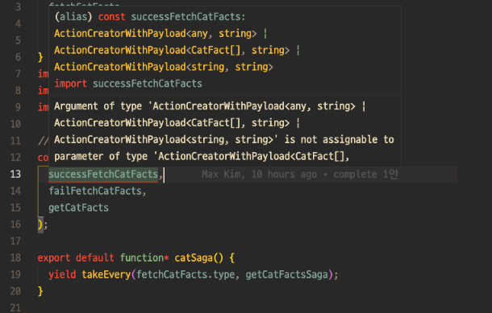

[앞선 글](https://maxkim-j.github.io/posts/how-to-use-redux-saga)에 이어 Redux Toolkit을 이용하여 Redux+Saga의 타이핑을 줄이는 방법을 탐구해봅니다. 무료 API인 [Cat Facts API](https://catfact.ninja/)로 비동기 요청을 해야 하는 상황을 설정했습니다. 예제 전체는 [이 레포지토리](https://github.com/max-kim-tutorial/redux-saga-minimize)에서 보실 수 있습니다.

## 동기

회사에서 Saga를 도입해 프로젝트를 진행 중에, 반복되는 Saga 타이핑과 빠듯했던 데드라인 때문에 Saga를 사용하다 말고 async/await를 사용해 컴포넌트 단에서 API를 호출하는 방법으로 개발이 진행되는 상황이 빈번해졌습니다.

그러다보니 어떤 API와 비즈니스 로직은 Saga를 통해 실행되고, 어떤 API는 컴포넌트 단에서 바로 요청되는 등 비즈니스 로직을 작성하는 방법에 일관성이 없어지고, 비즈니스 로직과 UI로직이 섞여 추후 유지보수가 상당히 불편한 상황이 만들어졌습니다.

따라서 Saga를 제대로 쓰려면 타이핑을 줄이고, 비즈니스 로직을 효과적으로 Saga를 통해 정리할 수 있는 설계를 먼저 제대로 가져가야만 Saga의 장점을 제대로 누릴 수 있다는 결론에 도달했습니다.

Redux Toolkit의 `createSlice`를 사용하면 Redux+Saga의 타이핑을 많이 줄일 수 있습니다. 하지만 이 포스팅에서는 자체 유틸 함수를 이용해 '더' 줄일 수 있는지 타진합니다.

## 최소 요구 사항

아래에서 보여드릴 practice를 작성하기 전에, 최소한으로 만족해야할 요구사항을 설정했습니다.

1. 타입 오류가 발생하지 않아야 합니다. (TypeScript를 사용합니다)
2. 타입 오류 없이 잘 돌아가더라도, 개발자들의 원할한 협업을 위해 타입을 노출시키는게 좋다고 판단 될 경우 명시적으로 타입을 작성합니다. 맹목적으로 타이핑을 줄이는 것만이 목적이 되어서는 안 됩니다. **타입을 명시해야 좋은 부분**도 명백히 존재함을 인지하고 팀의 생산성과 프로덕트의 유지보수에 기여할 수 있는 방향으로 생각하려 노력합니다.
3. 프로젝트에 실제로 적용될 수 있음을 인지하며, **쓸만한 practice**를 만듭니다.
4. 액션과 리듀서 선언을 한꺼번에 할 수 있는 Redux Toolkit의 기능인 `Slice`는 Redux+Saga를 효과적으로 간결하게 만드는데 꼭 필요한 기능이라고 보고, 무조건 사용할 생각으로 코드를 작성했습니다.

이쯤해서 서론은 끝났고, 이제 어떤 시도를 해보았는지 코드와 함께 보여드리겠습니다.

## 1. initialState 명시적 타입 지정

`createSlice`를 사용하면 초기 state를 선언할때도 타입 지정이 딱히 필요 없습니다. 바로 `initialState` 프로퍼티에 초기 상태값을 적어주면 되기 때문입니다. 아래는 [redux-toolkit docs의 createSlice example](https://redux-toolkit.js.org/api/createSlice#examples)입니다.

```typescript
const user = createSlice({
  name: 'user',
  initialState: { name: '', age: 20 },
  reducers: {
    setUserName: (state, action) => {
      state.name = action.payload
    },
  },
}
```

하지만 state의 초기값에 명시적으로 타입을 지정하면 개발 과정에서 store의 초기 상태를 파악하기 더 편합니다. 따라서 아래와 같은 식으로 명시적인 타입 지정을 했습니다.

```typescript
interface CatState {
  catFact: AsyncEntity<CatFact[], string>;
}

const initialState: CatState = {
  catFact: {
    data: null,
    status: "idle",
    error: null
  }
};

export const catSlice = createSlice({
  name: "cats",
  initialState,
  reducers: {
  ...
  }
});
```

## 2. AsyncEntity 타입

위 코드에서 `AsyncEntity`라는 미리 정의한 타입을 제네릭과 함께 사용했습니다. AsyncAction에 필요한 프로퍼티라고 할 수 있는 `status`, `data`, `error` 속성을 포함합니다. 제네릭을 이용해 성공시 data의 타입과 실패시 error의 타입을 지정해줄 수 있습니다.

```typescript
export type AsyncEntity<T, R> = {
  data: T | null; // 데이터 없는 경우에는 명시적으로 null
  status: 'idle' | 'loading' | 'success' | 'fail'; // 초기|로딩|성공|실패
  error: R | null;
};
```

`AsyncEntity`는 용례에 따라 다양한 모습이 될 수 있습니다. 가령 http method에 따라 프로퍼티를 다르게 할 수도 있고, 백엔드의 상태나 개발 진척도에 따라 다른 프로퍼티를 가지게 할 수도 있습니다. 여러 개의 AsyncEntity를 만들고 상황에 맞는 AsyncEntity를 선택해 사용할 수도 있습니다.

## 3. createAsyncReducers 유틸 함수로 reducer 함수들 한번에 리턴하기

하나의 API 요청에 대하여 start, success, fail 동작에 해당하는 3개의 reducer 함수로 이루어진 객체를 한꺼번에 만드는 유틸 함수를 작성합니다.

`createAsyncReducers`는 고차함수인데, 그 이유가 reducers 객체의 함수는 딱히 함수에 제네릭을 선언하지 않아도 첫번째 제네릭 타입으로 `WritableDraft<특정State>`를 받기 때문입니다.

그런데 redux toolkit이 `WritableDraft` 타입을 은닉해서 import로 제공하지 않기 때문에 첫번째 단계의 함수에서는 `WritableDraft`를, 두번째 단계의 함수에서는 reducer와 action을 만드는데 필요한 start/success/fail 타입들을 받습니다.

```typescript
interface CreateAsyncReducersParams {
  name: string;
  entity: string;
  cleanDataWhenStart?: boolean; // fetch가 시작되기 전 data 초기화
}

// reducer 함수의 이름을 camelCase로 만드는데 필요합니다.
const capitalize = (str: string) => {
  return str[0].toUpperCase() + str.slice(1);
};

const createAsyncReducers =
  <State extends { [key: string]: any }>({
    name,
    entity,
    cleanDataWhenStart = false,
  }: CreateAsyncReducersParams) =>
  <Start, Success, Fail>() => {
    const result: {
      [key: string]:
        | ((state: State, action: PayloadAction<Start>) => void)
        | ((state: State, action: PayloadAction<Success>) => void)
        | ((state: State, action: PayloadAction<Fail>) => void);
    } = {
      // start reducer 함수
      [`${name}`]: (state: State, action: PayloadAction<Start>) => {
        if (cleanDataWhenStart) {
          (state[entity] as AsyncEntity<Success, Fail>).data = null;
        }
        (state[entity] as AsyncEntity<Success, Fail>).status = 'loading';
      },

      // success reducer 함수
      [`success${capitalize(name)}`]: (state: State, action: PayloadAction<Success>) => {
        (state[entity] as AsyncEntity<Success, Fail>).data = action.payload;
        (state[entity] as AsyncEntity<Success, Fail>).status = 'success';
      },

      // fail reducer 함수
      [`fail${capitalize(name)}`]: (state: State, action: PayloadAction<Fail>) => {
        (state[entity] as AsyncEntity<Success, Fail>).error = action.payload;
        (state[entity] as AsyncEntity<Success, Fail>).status = 'fail';
      },
    };

    return result;
  };
```

reducers에 함수를 호출하고 전개 연산자로 뿌려줍니다.

```typescript
import { createSlice } from '@reduxjs/toolkit';
import { CatState, CatFact } from './types';
import { createAsyncReducers } from '../utils';

const initialState: CatState = {
  catFact: {
    data: null,
    status: 'idle',
    error: null,
  },
};

export const catSlice = createSlice({
  name: 'cats',
  initialState,
  reducers: {
    ...createAsyncReducers({
      name: 'fetchCatFacts',
      entity: 'catFact',
    })<any, CatFact[], string>(),
  },
});

export const { fetchCatFacts, successFetchCatFacts, failFetchCatFacts } = catSlice.actions;

export default catSlice.reducer;
```

컴포넌트에서는 이렇게 action dispatch를 합니다.

```typescript
// createAsyncReducers에서는 action.payload를 다 가지고 있는 함수 시그니처를 가진 함수를
// 리턴하기 때문에 reducer에서 활용하는 action.payload가 따로 없더라도 빈 객체를 인자로 넣어줍니다.
dispatch(fetchCatFacts({}));
```

`createAsyncReducers`는 [typesafe-actions](https://github.com/piotrwitek/typesafe-actions)의 `createAsyncAction`과 비슷한 모양입니다. typesafe-actions도 request, success, failure 액션 페이로드의 타입을 제네릭으로 넘겨서 비동기 액션에 필요한 액션 객체 리턴 함수 여러 개를 한꺼번에 만들 수 있게 합니다.

```typescript
const getSomething = createAsyncAction(
  requestType, successType, failureType, cancelType?
)<TRequestPayload, TSuccessPayload, TFailurePayload, TCancelPayload?>()
```

`createAsyncAction`은 액션 객체를 리턴하는 함수들을 만들고, `createAsyncReducers`는 `createSlice`의 reducer 함수들을 만든다는 것이 차이점이겠습니다.

`createAsyncAction`의 리턴값은 request, success, failure 프로퍼티를 통해 접근할 수 있는 함수를 포함한 객체입니다. 컴포넌트에서 dispatch, 혹은 saga에서 put을 사용해 action을 발생시킬때 다음과 같은 방법을 사용합니다.

```typescript
const getCats = createAsyncAction(GET_CATS, GET_CATS_SUCCESS, GET_CATS_FAILURE)<
  { id: number },
  Cat[],
  AxiosError
>();

// component
dispatch(getCats.request({ id: 1 }));

// saga
yield put(getCats.success(cat));
```

혹시 reducer에서도 이러한 방식을 사용하면 action을 발생시키는 구문이 좀 더 간결해질 것 같아 비슷한 방식을 시도해 봤습니다. 하지만 slice의 reducers에 객체를 넣는 행위는 허용되지 않습니다. 즉 이렇게 만들수 없는데요.

```typescript
// 컴포넌트에서 이렇게 하려고
dispatch(fecthCatFacts.request());

// slice 안에다가 이렇게 하면 error가 납니다
export const catSlice = createSlice({
  name: "cats",
  initialState,
  reducers: {
    fetchCatFacts: {
      request: (state, action) => {};
      success: (state, action) => {};
      failure: (state, action) => {};
    },
})

```

reducer 함수들은 reducers 객체 내부의 최상위에 존재해야 합니다. 그래서 위의 `createAsyncReducers` 사용례에서도 전개 연산자를 쓴 것이죠.

Redux Toolkit은 slice의 reducer 속성 내부의 객체 네스팅을 할 수 있는 경우로 다음과 같은 경우만 허용합니다. 네스팅을 [Action Creator을 커스텀하는 일종의 API로 사용](https://redux-toolkit.js.org/api/createSlice#customizing-generated-action-creators)하는 것입니다.

```typescript
const todosSlice = createSlice({
  name: 'todos',
  initialState: [] as Item[],
  reducers: {
    addTodo: {
      reducer: (state, action: PayloadAction<Item>) => {
        state.push(action.payload);
      },
      prepare: (text: string) => {
        const id = nanoid();
        return { payload: { id, text } };
      },
    },
  },
});
```

뇌피셜이지만, 네스팅하여 reducer 함수를 배치할 수 있다면 모든 깊이의 함수들을 모아서 action, reducer을 모두 만들어내기 위한 로직은 꽤 복잡할 것입니다. 그렇기 때문에 최상위에 리듀서 함수, 혹은 위와 같은 Custom Action Creator 객체가 아닌 다른 타입의 무언가가 있으면 에러를 뿜도록 규칙을 정한것이 아닌가 생각됩니다.

## 4. CreateSaga 유틸 함수로 반복되는 Saga 타이핑 방지하기

[Saga Entity Pattern](https://github.com/redux-saga/redux-saga/blob/master/examples/real-world/sagas/index.js)을 사용하여 Saga 내부에서의 비동기 요청 동작을 사가마다 반복해서 작성할 필요가 없도록 만들 수 있습니다.

typesafe-action을 이용하거나 [한재엽님이 작성한 createFetchAction 함수](https://jbee.io/react/react-2-redux-architecture/#%EC%9E%90%EC%B2%B4-util-%EC%A0%9C%EC%9E%91---redux-saga-util)를 사용하면 하나의 비동기 로직에 대한 여러개의 액션 함수를 한 객체에 깔끔하게 정리할 수 있어 Saga를 만들기도 편합니다. 아래와 같은 방식으로 하면 되기 때문입니다. 아래는 [한재엽님이 작성한 createSaga 함수입니다.](https://jbee.io/react/react-2-redux-architecture/#%EC%9E%90%EC%B2%B4-util-%EC%A0%9C%EC%9E%91---redux-saga-util)

```typescript
export function createSaga<P>(actions: IFetchActionGroup, req: any) {
  // actions 객체 하나로 각 상황에 맞는 액션들에 대한 참조가 가능하다
  return function (action: Action<P>) {
    const payload = oc(action).payload(); // oc가 뭐지

    yield put(startLoading(actions.TYPE));
    try {
      const res = yield call(req, payload);
      yield put(actions.success(res));
    } catch (e) {
      yield put(actions.failure(e));
    } finally {
      yield put(finishLoading(actions.TYPE));
    }
  };
}
```

하지만 slice를 사용하면 저렇게 관련된 action들을 객체로 감싸지 못하기 때문에, 일일히 인자로 넣어줘야 합니다. 이 프로젝트에서 사용하는 `createSaga`함수는 이렇게 생겼습니다. 사실 인자로 넘겨야 하는 상황이 마음에 들지 않네요. Slice에서 Reducer 네스팅이 되었으면 좋았을텐데......

```typescript
export const createSaga = <Start, Success, Fail>(
  success: ActionCreatorWithPayload<Success>, // 성공액션
  fail: ActionCreatorWithPayload<Fail>, // 실패액션
  req: any // request 함수, 혹은 배열
  ) => {
    return function\* (action: PayloadAction<Start>) {
      try {
        const response: Success = yield call(req, action.payload);
        yield put(success(response));
      } catch (error) {
        yield put(fail(error.toString() as Fail));
      }
    };
});
```

이런 식으로 사용합니다.

```typescript
//saga.ts

const getCatFactsSaga = createSaga<any, CatFact[], string>(
  successFetchCatFacts,
  failFetchCatFacts,
  getCatFacts
);

export default function\* catSaga() {
  yield takeEvery(fetchCatFacts.type, getCatFactsSaga);
}

```

문제는 `createAsyncActions`를 쓸 경우 `createAsyncActions`가 반환하는 값의 타입이 유니언 타입인 `요청액션|성공액션|실패액션 함수 시그니처`로 추론되기 때문에 createSaga의 인자에 지정된 타입과 달라 타입 에러를 뿜는다는 것입니다.



이때 `createAsyncActions`의 반환값 타이핑을 제대로 정의하기 위해 삽질을 해봤습니다. 문제가 뭐냐면 이 함수의 인자 중 하나인 `name`을 받아 그걸 토대로 객체 프로퍼티를 동적으로 만들어내기 때문에 타입을 사전적으로 정의하기가 어려웠습니다. 아래 코드는 컴파일되지 않겠지만, 대강 이런 식의 타입이 필요한 것입니다.

```typescript
// Name인자에 따라 다른 프로퍼티 이름을 반환
// Name은 "FetchCatInfo" 이런식으로 추론되었을 경우 가능
type AsyncReducers<Name, Start, Success, Fail> = {
  [`${Name}`]: (state: State, action: PayloadAction<Start>) => void;
  [`success${Name}`]: (state: State, action: PayloadAction<Success>) => void;
  [`fail${Name}`]: (state: State, action: PayloadAction<Fail>) => void;
};
```

구글링 하던 도중 올해 7월 중에 [Template Literal Type을 interface나 types의 key로 선언할 수 있는 문법이 Typescript 4.4부터 추가되었다](https://github.com/microsoft/TypeScript/pull/44512)는 사실을 최근에 발견해서, 연습용 레포지토리 타입스크립트 버전을 올려 다시 시도해보았지만, 제네릭이랑 동작하지는 않는 것으로 보여 단념했습니다.

```typescript
// 이렇게는 동작하는데
type AsyncReducers<Start, Success, Fail> = {
  [key: `${string}`]: (state: State, action: PayloadAction<Start>) => void;
  [key: `success${string}`]: (state: State, action: PayloadAction<Success>) => void;
  [key: `fail${string}`]: (state: State, action: PayloadAction<Fail>) => void;
};

// 이렇게는 동작하지 않았습니다...
type AsyncReducers<Name, Start, Success, Fail> = {
  [key: `${Name}`]: (state: State, action: PayloadAction<Start>) => void;
  [key: `success${Name}`]: (state: State, action: PayloadAction<Success>) => void;
  [key: `fail${Name}`]: (state: State, action: PayloadAction<Fail>) => void;
};
```

사실 이쯤 해보고 나니 `createAsyncActions`을 쓰고싶다는 생각이 사라진게, 이렇게 Reducer를 자동으로 생성하면 리듀서 함수와 dispatch할 액션의 이름을 코드에서 찾아볼 수 없어 **가독성을 해치는 과한 추상화**가 되는 것이 아닐까 하는 생각이 들었던 것 같습니다.

하나의 유틸 함수로 비동기 요청에 필요한 모든 액션과 리듀서를 생성하니 개발시 타이핑은 줄어들긴 하겠지만, 온보딩중인 개발자의 경우 이 코드를 보고 제대로 액션을 디스패치할 수 없을 것 같았달까요. 결국 타이핑 비용이 준 만큼 커뮤니케이션 비용이 발생할 것 같았습니다. 그래서 단념하고 아래와 같은 방법을 시도해보게 되었습니다.

## 5. 보완) slice.reducers에 명시적으로 reducer 선언하기

reducers에 선언된 각 액션들마다 고유한 타입을 가지려면, 전개연산자를 사용하지 않고 정석대로 reducers 객체에 직접 프로퍼티 이름을 선언하여 reducers 함수를 선언해야 합니다. 그러기 위해서 먼저 `createAsyncActions`를 다음과 같은 함수들로 분리했습니다.

```typescript
// 3등분 합니다
export const createStartReducer =
  <State extends { [key: string]: any }>(entity: string) =>
  <PayloadType>() => {
    return (state: State, action: PayloadAction<PayloadType>) => {
      state[entity].status = 'loading';
    };
  };

export const createSuccessReducer =
  <State extends { [key: string]: any }>(entity: string) =>
  <PayloadType>() => {
    return (state: State, action: PayloadAction<PayloadType>) => {
      state[entity].data = action.payload;
      state[entity].status = 'success';
    };
  };

export const createFailReducer =
  <State extends { [key: string]: any }>(entity: string) =>
  <PayloadType>() => {
    return (state: State, action: PayloadAction<PayloadType>) => {
      state[entity].error = action.payload;
      state[entity].status = 'fail';
    };
  };
```

그리고 이 함수들을 사용하여 slice.reducers에는 함수들을 명시적으로 선언해줍니다.

```typescript
export const catSlice = createSlice({
  name: 'cats',
  initialState,
  reducers: {
    fetchCatFacts: createStartReducer('catFact')<any>(),
    successFetchCatFacts: createSuccessReducer('catFact')<CatFact[]>(),
    failFetchCatFacts: createFailReducer('catFact')<string>(),
  },
});
```

이렇게 하면 각 액션마다 독립적으로 타입 추론이 가능해져서 createSaga를 사용할때 에러가 발생하지 않습니다.

다만 reducer함수를 위처럼 분리했을 때 좀 불만족스러운 것은, `AsyncEntity`의 타입추론을 제대로 해줄 수 없다는 것인데요.

```typescript
// createAsyncReducers에서는 Start, Success, Fail의 모든 action.payload 타입을 받으므로
// 함수 안에서도 AsyncEntity와 제네릭을 사용하여 추론이 가능했다.
(state[entity] as AsyncEntity<Success, Fail>).data = action.payload;

// 함수를 분리하면(createStartReducer, createSuccessReducer, createFailReducer)
// action.payload 타입 전체의 일부만 받으므로
// AsyncEntity와 제네릭을 사용하여 추론이 불가능해서 그냥 any로 추론된다.
state[entity].status = 'loading';
```

그렇다고 `createSuccessReducer` 만들자고 Start와 Fail 액션의 페이로드 타입까지 넘기자니 좀 과한 듯 합니다. 그렇게 되면 Start, Success, Fail 액션 타입 적는걸 리듀서에서 3번 사가에서 1번 하게되는 것이라 반복되는 타이핑이 많아지고 직관적이지 않게 됩니다.

## 맺음말 & 들었던 생각

이렇게 Redux+Saga를 사용하는 프로젝트에서 Redux toolkit과 자체 유틸 함수를 활용해 타이핑을 줄이는 용례를 만들어 보았습니다. 작업의 흐름을 글에 그대로 정리해서 꽤 긴 글이 된 듯 합니다. 코드를 작성하면서 느낀점이 몇 가지가 있는데요.

먼저 TypeScript를 좀 더 파볼 때가 된 것 같다는 생각이었습니다. 이렇게 하면 되겠지 싶어서 코드를 작성했는데, 타입 에러가 나는 경우가 발생해서 그렇습니다. 타입 시스템에 대한 이해도 더 필요한 것 같습니다.

사실 이렇게 타이핑을 줄이고 유틸을 만든다고 해서 **Redux + Saga에 작성하는 비즈니스 로직의 모든 케이스가 커버될 수는 없다**는 생각도 들었습니다. 가장 일반적인 비동기 케이스에 대해 반복을 줄이기 위해 유틸 함수를 만든거고, 특이한 케이스나 다른 로직이 Saga나 reducer 안에서 필요할 때는 처음부터 작성해야 할 것입니다.

이 practice에서 해본 것은 `createSlice`를 사용하면서도 반복되는 Redux + Saga 작성 케이스에 대한 타이핑을 최대한 줄이기 위한 시도입니다. 이외의 케이스에 대해 미리 케이스를 상정하고 유틸 함수를 작성하는 것은 이른 추상화가 될 수도 있겠습니다. 이외 케이스가 발생했을 때 상황에 맞는 방식으로 로직을 계속 추가해나가야 할 것 같아요.

또한 회사 프로젝트에 적용해볼 수도 있겠다! 는 생각을 가지고 작성한 practice지만, 다른 개발자와의 논의와 보강을 통해 더 좋은, 개발팀의 현재 상황에 맞는 방법으로 더 보강이 되어야 할 것 같습니다. 그렇게 미래를 기약하며... 포스팅은 여기서 마치겠습니다. 긴 글 읽어주셔서 감사합니다!
