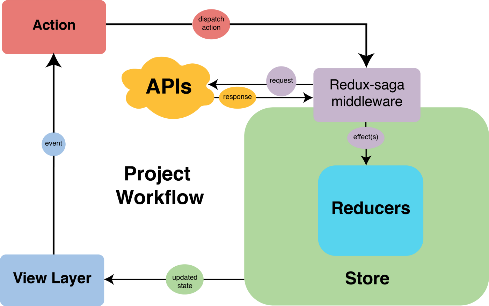

Redux에서의 비동기 로직 작성을 가능하게 해주는 Redux Saga가 **참 잘 쓰기 힘든** 기술이라는 생각을 많이 합니다. Saga에 대한 생각도 자주 바뀌었습니다. Saga를 배우고 조금 사용해본 시점에서는 비동기로 불러온 값들을 지금 쓸 것도 아닌데 왜 굳이 다 저장하고, 상태를 하나하나 매겨야 하나 이해를 하지 못하고 Saga를 쓰기 위한 타이핑이 쓸데없이 많다는 생각을 가지고 있었습니다.

프로덕션 레벨의 제품을 만져보고 나서 Saga가 좋은 구조를 가진, 예측 가능한 웹앱을 만드는데 도움을 줄 수 있다는 깨달음을 얻었습니다. 그 이후에 Saga를 잘 활용해보고 싶었지만 예기치 않은 난관에 부닥치는 경우가 많아 잘 사용하는데 실패한 경험이 많은 것 같습니다.

이번 포스팅에서는 Saga를 잘 쓰는 법에 대한 고민과 생각의 결과를 정리합니다. Saga와 관련해 몇가지 생각할 거리들을 놓고 글을 써볼 예정입니다.

> Redux+Saga가 무엇인지 설명하는 글은 아닙니다. Redux+Saga를 프로젝트에 적용해보셨거나, 지식이 있는 상태로 읽으시면 좋습니다!

## Saga를 쓰는/쓰지 않는 이유

> `store 만들기` => `action 선언하기` => `action, payload 리턴하는 함수 만들기` => `reducer 함수 만들기`
> => `비동기 로직이라면 이 과정 3번 반복(fetch,success,failure)` => `store에 비동기 데이터 저장하는 Saga 작성하기`
> => `컴포넌트에서 사용하기`

솔직히 말하면 이 과정이 쓸데없는 낭비라고 생각했던 적이 있습니다. **꼭 나중에 또 쓸 것도 아닌데 비동기 데이터를 전부 redux store에 모아두는 거지?** 그냥 컴포넌트단에서 async await 하면 되는데... 타이핑은 왜 이렇게 많지?

### 비즈니스 로직과 UI 로직의 분리

비즈니스 로직과 UI로직은 분리할수록 좋고, Redux + Saga를 사용하는 것은 한 가지 방법입니다. 컴포넌트에서 직접 async/await 문법을 통해 서버에 요청을 날리는게 가장 간편한 방법으로 보이긴 합니다. 하지만 많이 쓸수록 컴포넌트에 비즈니스 로직이 직접 의존하는 경우가 많아지고, 얽히고 섥혀서 UI를 수정하기 위해 비즈니스 로직을 같이 건드려야 하거나 그 반대의 경우도 생길 수 있습니다.

앱의 크기가 작다면 로직이 섞여서 발생하는 복잡성을 충분히 처리할 수도 있겠지만, 꽤 큰 앱의 경우에는 이렇게 로직이 섞였을 경우 유지보수가 점점 힘들어집니다.

소프트웨어 아키텍처의 고전인, [클린 아키텍처](http://www.yes24.com/Product/Goods/77283734) 에서도 주장하는 것이 웹앱인지 모바일 앱인지, UI에 데이터가 어떤 모양으로 뿌려지는지는 크게 중요하지 않다는 것입니다. 클라이언트의 형태는 관련된 의사결정을 미룰 수도 있는 **부수사항**일 뿐입니다.

UI를 실질적으로 채우는 데이터를 다루는 로직들은 앱의 **중심, 즉 코어를 이룹니다**. 데이터와 관련된 로직인 이 코어를 그대로 둔 채, 클라이언트는 얼마든지 바꿔 끼울 수 있습니다. 그리고 Redux + Saga는 이러한 앱의 코어가 아래 그림처럼 UI로직과는 확실히 분리된 채로 작동할 수 있도록 만드는 도구입니다. React로 앱을 만들 때 비즈니스 로직을 모두 Saga에 몰아넣고 컴포넌트 단에서는 dispatch만 하는 식의 구현도 가능합니다.



### 비즈니스 로직을 더 믿을만하게 만드는 제네레이터 문법

Saga를 사용하게 되는 또 하나의 이유이기도 합니다. Saga의 아이덴티티라고도 할 수 있는 제네레이터 문법은 필요한 로직들이 순차적이고 엄밀하게 작동할 수 있도록 돕습니다. `yield`를 사용하면 비동기 로직 뿐 아니라, 새로운 액션 발행(`put`), 동기적인 함수 호출(`call`) 까지 모두 차례대로 수행할 수 있도록 보장하여 예상치 못한 사이드 이펙트 발생을 줄입니다.

앱이 복잡해지면 컴포넌트 단에서 특정 함수 호출이 완료된 직후에 수행해야만 하는 로직이 생길 수 있는데요. 컴포넌트 단에서 순차적인 동작을 구현하려면 async/await과 더불어 useEffect로 특정 값을 구독해 변화를 관찰해야할 수도 있어 로직이 복잡해지거나, 불필요한 재랜더링이 발생할 여지도 충분히 존재합니다. Saga를 사용하면 컴포넌트 내부의 로직이 복잡해지는 것을 막고, `dispatch` 한 번으로 비즈니스 로직을 성공적으로 수행할 수 있습니다.

### 비동기 API 호출의 재사용성 극대화

프론트엔드 개발을 진행하다보면 초기 계획과는 완전 다르게, 주로 백엔드 API의 생김새 때문에 정말 생각지도 못한 곳에서 생각지도 못한 데이터가 필요할 수도 있습니다. 이때 async await로 비동기를 컴포넌트 단에 붙여서 처리하고 있었다면 똑같은 로직을 다른 컴포넌트에 한 번 더 써야하죠.

서버도 처음부터 완성되있는 것은 아니기 때문에 어떤 response에서 UI에 필요한 모든 데이터를 보내주지는 못하는 경우도 종종 생깁니다. 작은 팀일수록 그런 상황에 부닥치기 쉬운데요.

백엔드가 수정되기 전까지 프론트엔드에서는 다른 비동기 로직 호출을 통해 UI가 필요한 데이터를 적당히 때워(?) 줘야 하는 상황도 충분히 가능합니다. 웹앱의 여러 곳에서 특정한 데이터 패칭이 필요하면 필요할수록 Saga를 사용하기 위해 지출했던 비용에 상회하는 이득을 얻을 수 있다고 봅니다.

물론 모든 API 호출 함수를 util을 모아놓듯 한 곳에 정리하는 방식으로 재사용하기 쉽게 만들수도 있어 Redux+Saga만의 장점이라고 말하기엔 좀 애매하긴 합니다. 더 좋은 점이 있다면, Saga에서는 앱의 UI를 바꿀 수 있는 store의 상태까지 건드릴 수 있다는 것 정도겠습니다.

### 캐싱을 활용할 수 있는 여지

유저가 앱을 사용하는 흐름 안에서 store에 이미 데이터가 이미 있는 경우 굳이 fetch를 하지 않아도 되는 상황이 있습니다. store에 이런 식으로 데이터를 저장해 놓는다면, 불필요한 패칭을 하지 않는 방향으로 앱을 최적화할 수 있습니다.

### 쓰지 않는 이유

당연히 장점만 있는 것은 아닙니다.

간단하게 먼저 하나 들자면 위에서 언급했던 많은 타이핑, 비대한 보일러 플레이트 때문에 사용하지 않을 수도 있겠구요.

Saga는 결국 Redux의 미들웨어이기 때문에 변화를 줄 수 있는 것은 store에 선언된 변수들에 한정됩니다. 컴포넌트에서 Saga를 통해 변경된 프로퍼티들의 변화를 구독하기 위해서는 **그 값들이 모두 store에 저장된 형태로 존재해야 합니다.** 그래서 비동기 요청의 결과값들과 loading, success, fail과 같은 요청 상태까지 모두 store에 저장해야 합니다.

순차적으로 작동하는 로직을 작성하기 위해 비즈니스 로직이라고 하기에는 앱에 의존성이 있거나, 충분히 컴포넌트 단에 존재하면서 UI를 바꿔도 되는 상태값까지 store에 올려서 저장해야 하는 비효율이 발생할 수 있습니다.

가령 비동기 호출이 끝난 후 alert를 띄우고 싶다면 alert를 관리하는 상태값을 또 store에 만들어서, saga에서 데이터 패칭이 끝났을 때 맞춰 상태값을 토글해줘야 할 필요가 생깁니다.

```typescript
function\* getDataAndAlertSaga(action) {
  try {
  const { data } = yield call(fetchData)
    yield put(getDataSuccess({ data }));
    yield put(showAlert()); // store의 alert 변수를 토글해주고, 컴포넌트에서 구독해야 합니다
  } catch(error) {
    yield put(getDataFail({ error }));
  }
}
```

또한 store에 저장된 서버 데이터들이 컴포넌트가 지금 당장 필요한 최신의 데이터라는 보장이 없습니다. 서버에서 받아온 같은 데이터가 필요하지만 UI가 다른 두 컴포넌트가 하나의 부모 컴포넌트에서 렌더링 되야 한다고 생각해봅시다.

```typescript
function DataRendering1() {
  const { data } = useSelector((state) => state.data);

  useEffect(() => {
    dispatch(getData({}));
  }, []);

  return (
    <div>
      <h2>데이터 리스트 1</h2>
      {data.map((d) => {
        <ul key={d.id}>
          <li>{d.time}</li>
          <li>{d.person}</li>
        </ul>;
      })}
    </div>
  );
}

function DataRendering2() {
  const { data } = useSelector((state: RootState) => state.data);

  useEffect(() => {
    dispatch(getData({}));
  }, []);

  return (
    <div>
      <h2>데이터 리스트 1</h2>
      {data.map((d) => {
        <ul key={d.id}>
          <li>{d.content}</li>
          <li>{d.time}</li>
        </ul>;
      })}
    </div>
  );
}

function DataPage() {
  return (
    <>
      <DataRendering1 />
      <DataRendering2 />
    </>
  );
}
```

이런 상황일 때 두 자식 컴포넌트들 각각에서 최신 데이터를 확보하기 위해 한 번씩 액션을 디스패치하기 때문에 서버에는 2번의 비동기 요청이 발생하여 낭비가 생깁니다. 한 컴포넌트만 데이터를 패치하고 다른 컴포넌트는 그렇지 않는다면, 렌더링 시점에 따라서 데이터를 패치하지 않은 컴포넌트에서는 최신 데이터를 확보할 수 없고 이전에 다른 컴포넌트에서 패칭한 데이터를 사용해야 하는 일이 발생하게 됩니다.

이러한 상황을 타파하기 위해 두 컴포넌트를 하나의 컴포넌트로 만들어 dispatch를 한번만 해줄 수도 있습니다. [상태 끌어올리기](https://ko.reactjs.org/docs/lifting-state-up.html)를 이용하는 것이죠.

```typescript
function DataRenderings() {
  const { data } = useSelector((state: RootState) => state.data);

  useEffect(() => {
    dispatch(getData({}));
  }, []);

  return (
    <>
      <DataRendering1 data={data} />
      <DataRendering2 data={data} />
    </>
  );
}

function DataPage() {
  return <DataRenderings />;
}
```

하지만 상태 끌어올리기를 활용하는 경우에도, store에 있는 하나의 데이터가 필요한 하위 컴포넌트들이 여러 개라면 재랜더링을 해야 하는 컴포넌트들이 너무 많아지는 상황이 발생할 수 있습니다.

이런 문제를 해결하기 위해 [SWR](https://swr.vercel.app/), [React Query](https://react-query.tanstack.com/)와 같은 비동기 요청 처리에 특화된 라이브러리들이 나왔습니다. 앞에서 열거한 전역 상태 관리를 통해 비동기 요청을 관리하는 데 발생하는 불편함을 이해하고, 캐싱/리패칭 등의 기능을 제공해 서버에서 가져온 데이터를 최신으로 유지하는데 도움을 줍니다. React Query같은 경우는 [이전 포스팅](https://maxkim-j.github.io/posts/how-to-use-redux-saga)에서도 살펴봤습니다.

[React Query Docs의 overview 부분](https://react-query.tanstack.com/overview)을 살펴보면 다음과 같은 말이 있는데요,

> While most traditional state management libraries are great for working with client state, they are **not so great at working with async or server state.** This is because server state is totally different.

서버 상태값과 앱 전역 상태값의 특성이 다르니, 분리되서 관리되어야 한다는 말입니다. Saga를 써서 비동기 로직들을 관리하는 것은 "전역 상태 관리"의 형태를 빌려 서버 상태를 관리하려는 관점을 견지하기 때문에, 위에 열거한 비효율이 발생할 수 있는 구조라고도 볼 수 있는 거죠.

## 쓴다면, 더 생각해봐야 할 것들

### 너무나 많은 타이핑 줄이기

하나의 Saga 작성을 위해, 별다른 헬퍼 라이브러리를 쓰지 않는다면 대충 이 정도의 타이핑이 필요합니다.

```typescript
// 1. redux module

// 액션 문자열
export const GET_DATA = 'data/GET_DATA' as const;
export const GET_DATA_SUCCESS = 'data/GET_DATA_SUCCESS' as const;
export const GET_DATA_FAIL = 'data/GET_DATA_FAIL' as const;

// 액션 반환 함수
export const getData = () => ({ type: GET_DATA });
export const getDataSuccess = (data: Data) => ({ type: GET_DATA_SUCCESS, payload: data });
export const getDataFAIL = (error: Error) => ({ type: GET_DATA, payload: error });

// 초기 상태
const initialState: DataState = {
  userData: Data,
  status: 'success' | 'loading' | 'fail',
  error: Error,
};

type DataAction =
  | ReturnType<typeof getData>
  | ReturnType<typeof getDataSuccess>
  | ReturnType<typeof getDataFail>;

// 리듀서
export const dataReducer = (state: DataState = initalState, action: DataAction) => {
  switch (action.type) {
    case GET_DATA:
      return { ...state, status: 'loading' };
    case GET_DATA_SUCCESS:
      return { ...state, userData: action.payload, status: 'success' };
    case GET_DATA_FAIL:
      return { ...state, error: action.payload, status: 'fail' };
    default:
      return state;
  }
};

export default dataReducer;
```

```typescript
// 2. saga

function getDataSaga(action) {
  try {
    const { data } = fetchData();
    yield put(getDataSuccess({ data }));
  } catch (error) {
    yield put(getDataFail({ error }));
  }
}

export function dataSaga() {
  yield takeEvery(GET_DATA, getDataSaga);
}
```

위 예제에서는 타입 선언까지 모두 해주지는 않았고 대충 있는 타입을 이렇게 활용한다 정도 보여드렸습니다. TypeScript까지 하려면 여러개의 타입 선언도 더 필요하고요.

Saga + Redux는 타이핑이 정-말 많습니다. Saga의 존재감이 빛날 수 있을 정도의 규모를 가진 앱을 만든다고 해도, 어마무시한 타이핑 때문에 개발 과정에서 상당히 지칠 수 있습니다.

나름의 변호?를 하자면, 많은 타이핑은 Redux + Saga가 엄밀하고 정확하게 작동하는 데 기여합니다.

- Redux state의 변화는 오로지 action의 발행으로 일어납니다. 모든 액션은 사전에 정의되어야 하고, dispatch에 사용되는 action 리턴 함수 역시 사전에 정의되어야 해서 액션 관련한 타이핑이 많습니다. ⇒ **장점)모든 state 변화의 양상을 사전에 정의하여 예측 가능하며 부수효과 없는 상태관리를 가능하게 합니다**
- reducer는 모두 순수함수여야 하므로 불변성을 고려해서 작성되어야 하기 때문에 reducer 타이핑이 귀찮습니다. ⇒ **장점) state를 수정하는 reducer가 순수함수면 부수효과에서 자유롭고 테스트를 작성하기가 쉽습니다.**
- Saga는 Redux와는 별개인 미들웨어로 동작하기 때문에 추가적인 보일러 플레이트를 필요로 합니다. ⇒ **장점) Redux의 모든 상태변경은 순수해야하기 때문에 비동기 요청과 같은 불순한 로직들은 미들웨어단에서 따로 처리하는 것입니다. 부수효과를 불러일으킬 수 있는 불순한 비동기 로직이 Redux와 분리되므로 Redux의 상태를 더 믿을만하게 만듭니다.**

하지만...백번 양보해도 Redux+Saga 타이핑이 진짜 너무 많습니다. 개발 시작 단계에서 Saga와 Redux의 타이핑을 줄일 수 있는 계획을 가지고 있지 못하면, saga마다 반복되는 try/catch문 작성과 SUCCESS, FAILURE 액션 작성에 지친 나머지 컴포넌트에다가 직접 async/await를 갈기는 본인과 동료 개발자들의 모습을 볼 수 있을지도 모를 일입니다ㅜㅜ

Redux + Saga 타이핑을 줄일 수 있는 전략을 생각해보면 다음과 같습니다.

- [Redux Toolkit](https://redux-toolkit.js.org/) : slice를 사용하면 action과 액션 반환 함수를 하나하나 선언해야하는 엄청난 타이핑에 압박에서 자유로울 수 있습니다.
- [Saga Entity Pattern](https://github.com/redux-saga/redux-saga/blob/master/examples/real-world/sagas/index.js) : Saga 제네레이터 함수에 반복적으로 try/catch문과 비동기 로직의 각 상태를 토글해주는 작업이 계속 반복되는데, 반복되는 작업을 쉽게 해주는 fetchEntity함수를 선언하여 타이핑을 줄일 수 있습니다.

Saga 타이핑 줄이는 방법을 적용하는 실제 예제는 포스팅이 길어질 것 같아 [다른 포스팅](https://maxkim-j.github.io/posts/how-to-minimize-redux-saga-typing)에 정리해보았습니다.

### Saga에 어떤 로직까지 넣을 수 있는가?

```typescript
// 비동기 요청 관련 로직만 모여있는 Saga
// fetchEntity 패턴 등 패턴화하여 사용하기도 좋습니다
function getDataPureSaga(action) {
  try {
    const { data } = fetchData();
    yield put(getDataSuccess({ data }));
  } catch (error) {
    yield put(getDataFail({ error }));
  }
}

// 비동기 요청 로직과 더불어 여러 다른 로직들이 포함되어있는 Saga
function getDataImpureSaga(action) {
  try {
    const { data } = fetchData();
    Cookie.set(data.id); // 쿠키를 건든다던가
    const processedData = nomalizeData(data); // 데이터를 가공한다거나
    yield put(getDataSuccess({ data: processedData }));
  } catch (error) {
    yield put(getDataFail({ error }));
  }
}
```

Redux의 Reducer는 순수함수여야 합니다. 하지만 Saga는 Side Effect Manager로 다양한 불순 로직들을 처리하기 위해 존재하는 라이브러리입니다. 따라서 비동기 요청 말고도 다양한 양상의 로직들을 넣어 프로그래밍이 가능합니다.

Saga에 비동기 요청 로직 이외에 다른 로직을 넣어서 생기는 치명적인 문제는 없습니다. 게다가 Saga에 비즈니스 로직을 다 모아놓는 설계를 한다면 그렇게 만들 수 밖에 없을 것입니다.

특수한 예시일 수는 있지만 특정 앱의 형태에 의존하는 Saga가 문제를 일으키는 지점이 있을 수 있습니다. React로 만든 프로젝트에서 사용하는 Redux+Saga를 그대로 뜯어 React Native 프로젝트에서 쓴다거나 하는 상황에서 웹이 의존하는(Cookie 관련 로직이라던가... window 전역 객체라던가...) 로직들이 Saga 함수에 존재한다면 에러를 뿜을 것입니다.

Redux+Saga를 UI와 분리될 수 있는 Core의 일부로 볼 것인지에 대한 판단이 필요합니다. 기존 Saga의 로직들이 그대로 필요한 새로운 웹 프로젝트나 모바일 앱 프로젝트를 시작할 가능성이 있다면 Redux+Saga를 부수사항과 관련없는 core의 일부로 보고 프로덕트에 의존하는 로직들이 Saga에 들어가지 못하게 하는 것이 바람직하겠죠. 이건 정말 상황에 따라 다를 수 있을 듯 합니다.

(저는 한 프로젝트의 Redux+Saga를 통째로 다른 프로젝트로 옮겨 개발을 해본 적이 있습니다. 새롭게 시작하는 프로젝트에서 Redux+Saga 로직이 기존의 프로젝트와 겹치는게 많아서 다시 일일히 작성하기가 몹시 부담스러워서 그랬던 것인데요, 아예 Redux가 아닌 가벼운 상태 관리 도구를 사용했다면 그렇게 하지 않았을지도 모르겠습니다..)

또 다른 맥락으로, 서버에서 가져오는 데이터를 클라이언트의 입맛에 맞게 변형해서 쓰고 싶을 수 있습니다. 그래서 Store에 저장하기 직전에 Saga에서 SUCCESS되었을 경우 서버의 데이터를 적당히 바꾸는 함수로 데이터를 가공해 store에 저장할 수도 있을 것입니다. 옛날엔 저도 별 생각 없이 클라이언트에서 쓰기 좋은 형태로 가공해서 store에 저장했었는데 그렇게 좋은 방식은 아닌 것 같습니다.

클라이언트에서 임의로 데이터를 바꿔쓰면 서버 개발자랑 소통이 잘 안 될 수 있습니다. 서로 말하는 데이터, 프로퍼티의 의미가 엇갈릴 수 있습니다. 이런 경우에 스펙 문서의 형태로 서버-클라이언트간의 합의가 있다면 일단 합의된 데이터의 구조를 그대로 Store에 저장한 후에, 후가공이 필요한 경우에만 Reselect 같은 도구를 사용하거나 컴포넌트에서 데이터를 적절히 바꿔 사용하는 방법이 더 좋은 것 같습니다.

### Store 프로퍼티 설정

비동기 로직들의 상태를 컴포넌트단에서 잘 파악할 수 있게끔 프로퍼티를 설정하는것이 중요합니다.

SUCCESS, FAIL, LOADING 정도로 비동기 로직의 상태를 표현하는 것이 일반적인 유스케이스입니다. Redux Docs에서도 다음과 같은 예제가 있습니다.

```typescript
{
  status: 'idle' | 'loading' | 'succeeded' | 'failed', // 초기 | 로딩 | 성공 | 실패
  error: string | null
}
```

하지만 가끔 SUCCESS, FAIL, LOADING 이렇게 대표적인 3개의 상태로만 모든 비동기 상태가 설명되지 않을 수도 있다고도 생각합니다. 특히 GET이 아닌 서버의 데이터를 수정을 시도하여 이에 대한 응답을 받는 POST나 PUT, DELETE 메소드의 요청일 경우, 또는 error의 응답코드에 따라 예외처리를 해줘야 한다면 다른 방식의 상태 기록이 필요할 수 있습니다.

```typescript
{
  // 실패하거나 성공하는 방식이 여러가지일 경우
  status: 'idle' | 'loading' | 'succeeded1' | 'succeeded2' | 'failed1' | 'failed2',
  error: string | null
}

```

모든 Store 프로퍼티가 모두 똑같아야할 필요는 없다고 생각합니다. 복수의 상태 타입을 설정해두고 필요하면 돌아가면서 써도 괜찮을 것 같습니다. 대신에 문서화나 타입선언을 통해 개발자 모두가 잘 이해하고, 타입들이 관리될 수 있도록 하는게 좋을 듯 합니다. 아래와 같은 방식으로 store 타입 지정에 적용할 수 있습니다.

```typescript
type DefaultEntity<T> = {
  data: T;
  status: 'loading' | 'success' | 'fail';
  error: Error;
};

type ParticularEntity<T> = {
  data: T;
  status: 'loading' | 'success' | 'fail1' | 'fail2';
  error: Error;
};

type initialState = {
  data1: DefaultEntity<Data1>;
  data2: ParticularEntity<Data2>;
};
```

### Store와 UI 변수

컴포넌트의 useEffect에서 useSelector로 연결한 프로퍼티의 변화를 체크하는 방식으로 Redux와 컴포넌트를 연결합니다. 만약에 비동기 요청이 실패했을 때 alert 같은 것을 띄워야 한다면 컴포넌트단에서는 대략 이렇게 처리해줄 수 있습니다.

```typescript
function SomeComponent() {
  const dipatch = useDispatch()
  const { data, status, error } = useSelector((state:RootState) => (state.dataReducer), shallowEqual)
  const [showAlert, setShowAlert] = useState(false);

  useEffect(() => {
    dispatch(getData())
  }, [])

  useEffect(()=> {
    if (status === 'fail') {
      setShowAlert(true);
    }
  },[status])

...
}

```

만약 Saga 단에서 UI 에러처리 로직까지 처리하고 싶다면, Saga 함수 안에서 store의 프로퍼티를 변화시키고 이 store의 프로퍼티를 컴포넌트단에서 구독하게 하여 alert가 보여지도록 할 수도 있습니다.

```typescript
// saga
function\* getDataSaga(action) {
try {
    const { data } = fetchData()
    yield put(getDataSuccess({ data }));
    yield put(showAlert()); // store의 alert state를 true로 바꿈
  } catch(error) {
    yield put(getDatafail({ error }));
  }
}

// component
function SomeComponent() {
  const dipatch = useDispatch()
  const { data, status, error } = useSelector((state:RootState) => (state.dataReducer), shallowEqual)
  const showAlert = useSelector((state:RootState) => (state.alertReducer.showAlert))
  const [showAlert, setShowAlert] = useState(false);

  useEffect(() => {
    dispatch(getData())
  }, [])

  return (
  <div>
    {showAlert ? <Alert/> : null}
    ...
  </div>
  )
}
```

이러한 방법으로 비동기 로직의 완결과, 완결에 따른 UI 처리까지 Saga에서 처리할 수 있습니다. Saga에서 모든게 한꺼번에 처리되는 로직이 된 셈이지만 고려해봐야 하는 것이 있습니다.

과연 Store가 UI 로직과 관련된 변수까지 알아야 하냐는 것인데요. 물론 Store에는 비동기 데이터뿐 아니라 전역 상태 관리가 필요한 상태값들이 자리할 수 있기는 합니다. 어떤 값을 전역 상태로 보느냐는 것은 개발자의 관점에 따라 좀 다르겠지만요.

위에서 보여드린 대로, `showAlert` 값을 Store에 저장해놓고 컴포넌트 트리 상위에서만 Alert를 관리한다면 다른 하위의 컴포넌트에서 상태값을 낭비하지 않고 Alert 처리가 가능할 것입니다. 하지만 개인적으로는 이런 경우에 ContextAPI를 사용해 Alert를 제어해야하는 컴포넌트의 경우에만 값을 주입해 사용하는 것이 더 좋아 보입니다. 모든 컴포넌트에서 Alert를 제어할 필요는 없을 테니까요.

사실 이런 식으로 생각하면 Redux Store의 비동기 데이터들도 모든 컴포넌트에서 접근하는 것이 아니니 Store에 전부 저장하는게 타당한가 하는 생각도 살짝 들긴 합니다...

## 맺는말

Redux + Saga가 정말 많은 타이핑과 가파른 러닝커브를 가지고 있지만, 방법을 잘 선택해 사용하면 앱의 Core을 단단하게 만드는 멋진 도구가 될 수 있다고 생각합니다. 이제 이렇게 정리를 했으니 남은 일은 잘 쓰는 일 뿐이겠네요ㅜ 물론 아직도 온갖 상황에서 가장 좋은 방법으로 Saga를 사용할 수 있다는 자신감이 들지는 않습니다.

회사에서 Saga를 사용하고 있고 비동기 관련 로직을 모두 Saga에서 처리하고 있습니다. 코드가 엄청 거대하고 다른 개발 팀원들이 이에 피로감을 많이 느끼고 있어서 이를 리팩토링하기 위해 React Query와 같은 다른 라이브러리들도 리서치해봤었습니다. 하지만 한 번에 모두 개선할 수는 없어서 아마 Saga를 사용하는 것을 유지한채로 Saga를 좀 더 효율적으로 사용하는 방법을 앞으로도 탐구해봐야 할 것 같습니다.

Saga를 고민한대로 잘 사용하고 유스 케이스를 더 발전시키며, 결과적으로는 서비스에 기여하는 경험을 하고 싶습니다. 짧은 식견으로 쓴 긴 글 읽어주셔서 감사합니다.

## reference

- [Erşah Ihlamur - Scalable Redux architecture for React Projects with Redux-Saga and Typescript](https://itnext.io/scalable-redux-architecture-for-react-projects-with-redux-saga-and-typescript-f6afe1dece9b)
- [jBee - 전역 상태관리에 대한 단상(stale-while-revalidate)](https://jbee.io/react/thinking-about-global-state/)
