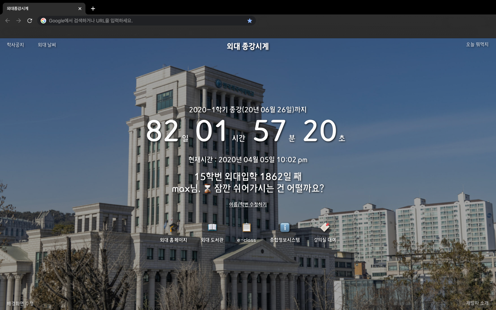
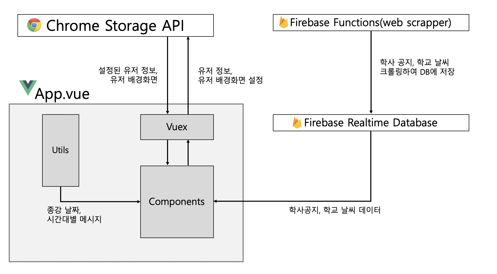
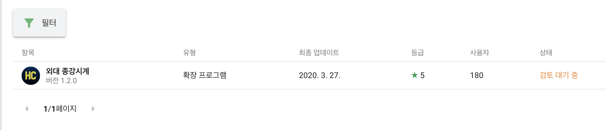
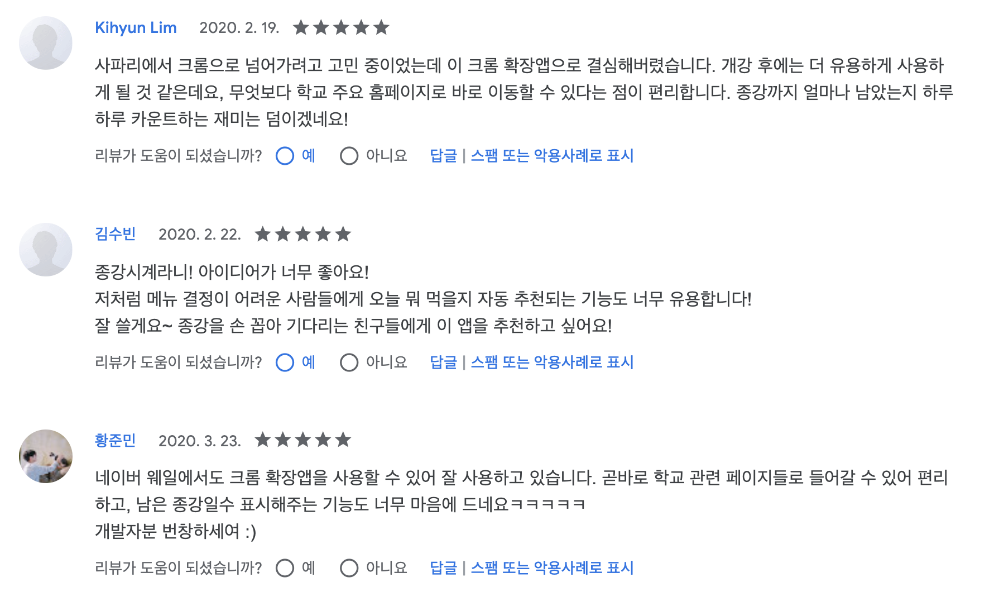

I created a chrome extension web app called **HUFS Semester Clock** as a personal project for about a month from December last year. I released it in mid-March in time for the delayed start date due to the coronavirus, and promoted it to the campus community. I was surprised that more people downloaded it than I thought!🙏 I hope that it will become a favorite school app for more people as I continue to maintain and maintain the app. This article will be a review of the development of Overseas School Clocks.

## Introduction of the app "School Clocks"

[You can download it here!](https://chrome.google.com/webstore/detail/%EC%99%B8%EB%8C%80-%EC%A2%85%EA%B0%95%EC%8B%9C%EA%B3%84/jadlpknbgnmmelikpcaogikohieafaem?hl=ko)

The HUFS Semester Clock is a new tab extension app available for the Chrome browser. Each time you open a new tab, you will see a page like the image above, showing the time remaining until the end of the current semester (or the beginning of the next semester if you are on vacation). Based on the user's name and semester number, it will also show how many days they have been in school so far, along with a greeting. That's the basic functionality!

Additional features include

- Hotlinks to school-related sites: Hotlinks to your school's homepage, library, this class, etc.
- Random Lunch/Dinner Menu Generator: Click the button and a random food menu (maratang, tteokbokki, etc.) will appear.
- Wallpaper customization feature: Two cool school photos are provided by default, and you can customize your own wallpaper.
- Academic announcement and weather search function: You can search for academic announcements and weather information on the school homepage.

## Project Structure & Stack

1. **User's student number/name and wallpaper information** are fetched from `locals storage` through the `local storage` API provided by chrome.
2. end date data and timezone-specific greeting message are fetched from the `.js` file in the `utils` folder located inside the project. The components calculate and display the time remaining until the end of the semester.
3. The **Announcement, weather information** are fetched and displayed in the app by a crawler deployed in `firebase functions` that stores the information in the DB.

### Vue.js + vue-web-extension

When I started this project, I had just finished an outsourced project using Vue.js, so I thought it would be a good idea to develop with Vue.js since it was the only front-end framework I was comfortable with. I also thought I should finish the project quickly before my final exams (it was early December), so I wanted to get it done before the exams (although I didn't finish the project until almost February...😹 )

There is also a Vue.js-based [Chrome Extension Boilerplate](https://github.com/Kocal/vue-web-extension). This was perfect for me, as I was new to Chrome extension development and wanted to get up to speed quickly... I referenced [this article](https://wormwlrm.github.io/2019/07/21/Military-Service-Calculator-Development-Story.html) by Jagzig!

### Firebase functions + realtime database

Using firebase, I was able to easily put the crawler on the server and set up the scheduling to run at regular intervals. The billing was also within my credit limit, so I didn't have to spend any extra money! Implementing a web crawler with firebase is a topic for another post. I referenced the [firebase YouTube channel](https://www.youtube.com/user/Firebase) and [The Net Ninja YouTube channel's firebase course](https://www.youtube.com/watch?v=gYF32BrHVlA) for firebase setup!

## What I learned.

When I structured the app at the end of November last year, I thought it would be pretty quick. I thought it would be a simple app without many features, but as I was developing, I got too greedy... ✨ Plus the inevitable shoveling... It took a while, but I learned a lot.

### ⛑ The importance of initial design

I can't say it enough... it's just the truth. I've probably redesigned and redesigned and redesigned a hundred times from the beginning to the end of a project; that's why my early commits are a mess 😭. I tried it and it didn't work, so I deleted the module and rebuilt it...

In particular, it should go without saying, but I thought a lot about the **component structure**, and realized that I should have thought about it a lot more, and made sure that I had a solid framework. I thought that I should have properly separated the reusable components from the non-reusable components when I made the component structure. Of course, not everything will go according to plan, but you want to avoid the unexpected as much as possible. I found myself recreating components that I could have easily reused, and it caused me a lot of ~~string~ despair as I went through the process of rebuilding the app over and over again. In the future, I'll have to spend more time on design when working on projects.

### 📦 statusman

This project was my first experience with **status management** in a front-end framework. I used Vuex. In the app, I manage the user's set class number and name information, as well as the URL of the user's specified wallpaper with Vuex's `store.js`. It looks great to manage a bundle of user information data all at once, and it also makes the component code less complicated because it can be sent to the component all at once without `props` or `event bus`.

Vuex made it easy for me to integrate data from the store into my components without having to pay a lot of money for it. My prejudice that creating state management logic would be complicated and time-consuming was shattered. (And when I learned redux a month or so later, I was even more surprised by the simplicity of Vuex...) I think I'll be able to adopt state management in my apps in the future!

### 😭 Help me Google...lol

I experienced the highs and lows of deploying my app on the Google Web Store. After filling in all the app information and publishing, the app starts to be reviewed. Your app will be placed in a "pending review" status, and only after this process is complete will it be approved for the webstore. There's no notification of how long it's taking, so I have to keep checking in the webstore from time to time, and the time it takes to get approved varies. The 1.0.0 version took two days to publish. Since then, the last few updates have been done well within 3 days, but an update from mid-March hasn't been approved yet😨.

It was the first update I did after releasing the app, and I wanted to get it approved quickly so that the inconvenience of the users could be improved, but it's frustrating for me that it hasn't been approved for more than two weeks. I realized this time that no matter how good I am at development, there will be some things that I can't control even as a developer. I think it's important to predict such things in advance and take countermeasures, because in the future, I may develop such apps where even a day's delay in updating will cause a lot of damage.

## Conclusion

Last week, I received an email from Google Web Store saying that the web review of Google Web Store was delayed due to the coronavirus, and I felt even sadder 😭. But these are the times. I guess I'll have to wait a little longer.

This was my first personal project that was lacking in many ways, but it was very rewarding thanks to the active support of users 피드백🙋🏻. Some of you suggested additional features for the app, some of you reported typos, some of you left reviews like photos, and some of you commented to the school community that `Work less and earn more!`, which I think is the best compliment ever. Thank you😭(I wish it was true...⭐️). I think the best reward for a developer is to have users who find the app useful, and I hope to make an app that many users will be satisfied with the next time I work on a project.

> You can find the release notes, source code, and commits for the Foreign Chiming Clock project in the [GitHub repo]()!
