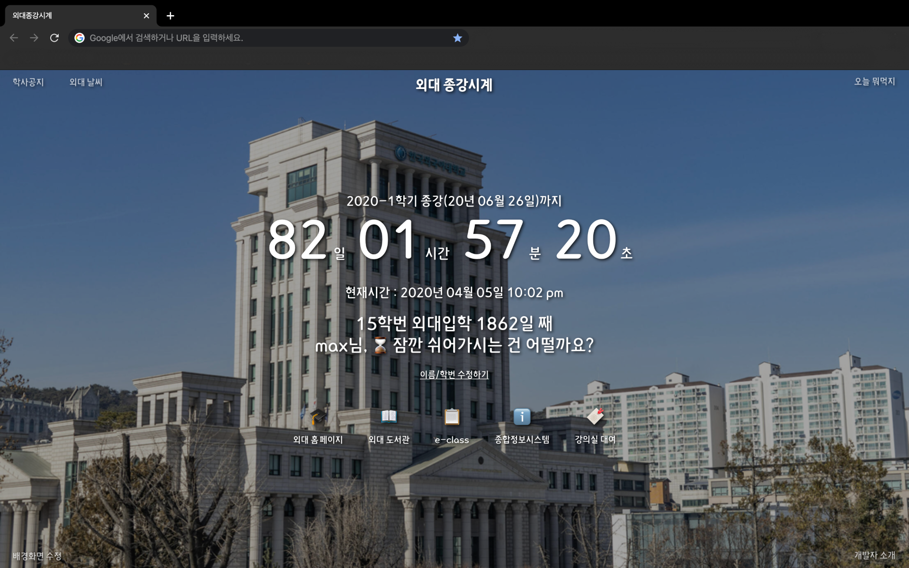
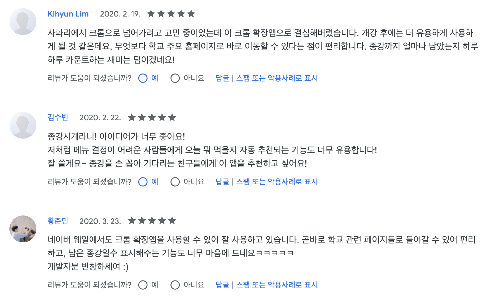

작년 12월부터 약 한달간 개인 프로젝트로 **외대 종강시계**라는 크롬 익스텐션 웹 앱을 만들었어요. 코로나 바이러스 때문에 늦춰진 개강날짜에 맞춰 3월 중순쯤에 릴리즈를 하고, 교내 커뮤니티에 홍보를 했습니다. 생각보다 많은 분들이 다운받아 주셔서 놀랐어요!🙏 계속 앱을 유지, 보수해나가면서 더 많은 분들의 마음에 드는 학교 앱이 되었으면 좋겠다는 생각을 해봅니다. 그리고 이 글은 외대 종강시계 개발에 대한 후기가 되겠습니다.

## "외대 종강시계" 앱 소개

  
[여기서 다운 받을 수 있어요!](https://chrome.google.com/webstore/detail/%EC%99%B8%EB%8C%80-%EC%A2%85%EA%B0%95%EC%8B%9C%EA%B3%84/jadlpknbgnmmelikpcaogikohieafaem?hl=ko)

외대 종강시계는 크롬 브라우저에서 사용할 수 있는 new tab 확장기능 앱입니다. 새로운 탭을 생성할때마다 위의 이미지와 같은 페이지가 나오게 되고, **이번 학기 종강까지(방학 중에는 다음 학기 개강까지) 남은 시간**을 보여줍니다. 유저가 입력한 학번과 이름 정보를 바탕으로 **지금까지 학교를 몇 일이나 다녔는지와 함께 인삿말**도 출력됩니다. 이게 기본 기능이에요!

추가적인 기능들은 다음과 같습니다.

- **학교 관련 사이트 핫링크** : 학교 홈페이지, 도서관, 이클래스 등으로 이동 가능한 핫링크입니다.
- **점심/저녁 메뉴 랜덤 생성기** : 버튼을 클릭하면 랜덤으로 음식 메뉴(마라탕, 떡볶이 등등)가 하나 나옵니다.
- **배경화면 커스텀 기능** : 멋진 학교 사진 두 장을 기본으로 제공하고, 사용자가 직접 배경화면을 커스텀할 수 있어요.
- **학사공지, 날씨 조회 기능** : 학교 홈페이지의 학사 공지와 외대 날씨 정보를 조회할 수 있습니다.

## 프로젝트 구조 & 스택

1. **유저 학번/이름과 배경화면 정보**는 chrome이 제공하는 `local storage` API를 통해 `locals storage`에서 가져옵니다.
2. **종강 날짜 데이터**와 **시간대별로 달라지는 인사 메시지**는 프로젝트 내부에 위치한 `utils`폴더의 `.js` 파일에서 가져옵니다. 컴포넌트들은 종강까지 남은 시간을 계산해서 표시합니다.
3. **학사공지, 날씨 정보**는 `firebase functions`에 배포된 크롤러가 DB에 저장한 정보를 앱으로 가져와 보여줍니다.

### Vue.js + vue-web-extension

프로젝트를 시작할 무렵 Vue.js를 사용한 외주 프로젝트를 막 끝내서 프론트엔드 프레임워크중에 '그나마' Vue.js에 자신이 있었던지라 Vue.js로 개발하는게 좋을거라 생각했습니다. 기말고사가 코앞(당시 12월 초)이라 시험 전까지 빨리 다 만들어야겠다는 생각도 했었죠(결국 2월에 가까워져서야 프로젝트가 끝났지만...😹)

Vue.js기반의 [크롬 익스텐션 보일러 플레이트](https://github.com/Kocal/vue-web-extension)도 존재합니다. 크롬 익스텐션 개발을 처음 해보는데다 속도를 붙여 빨리 진행하고 싶었던 저에게는 안성맞춤이었습니다. 재그지그님의 [이 글](https://wormwlrm.github.io/2019/07/21/Military-Service-Calculator-Development-Story.html)을 참고했어요!

### Firebase functions + realtime database

firebase를 사용해 쉽게 크롤러를 서버에 올려놓을 수 있었고, 일정한 주기로 크롤러가 실행되게끔 스케쥴링도 간단하게 설정할 수 있었습니다. 게다가 과금 역시 크레딧 범위 안에서 해결되어서 추가적인 지출도 없었어요! firebase로 웹 크롤러를 구현하는 내용은 다음에 따로 포스팅해봐도 좋을 것 같네요. firebase 세팅에는 [firebase 유튜브 채널](https://www.youtube.com/user/Firebase)과 [The Net Ninja 유튜브 채널의 firebase강의](https://www.youtube.com/watch?v=gYF32BrHVlA)를 참고했습니다!

## 배운 점들

작년 11월 말쯤에 앱 구조를 짤 때는 꽤 금방 만들 수 있을 줄 알았습니다. 기능도 별로 없는 단순한 앱이라고 생각했거든요. 그런데 개발을 진행하다보니 욕심이 너무 많이 나더군요...✨ 게다가 피할 수 없었던 삽질까지... 시간은 꽤 걸렸지만 이것저것 배웠습니다.

### ⛑ 초기 설계의 중요성

억번 강조해도 틀린말이 없는... 그저 진리입니다. 처음에 설계를 잘해야 합니다. 저는 프로젝트 시작부터 끝날때까지 설계와 디자인을 갈아엎고 다시 만드는걸 한 백번쯤 했던 것 같아요; 그래서 프로젝트 초반 커밋들이 엉망입니다😭. 적용해보니까 안 되겠고 모듈 지우고 다시 깔고...

특히 너무 당연해서 말할 필요도 없지만, **컴포넌트 구조**에 대해서는 샅샅이 고민해서 틀을 확실히 잡고 가야할 것 같다는 생각을 많이 했어요. 컴포넌트 구조를 짤 때, 재사용 가능한 컴포넌트와 그렇지 않은 컴포넌트를 제대로 구분했어야 했다는 생각을 했습니다. 물론 모든 일이 계획대로 되지는 않겠지만, 예상할 수 없었던 일이 생기는건 최대한 막아야 하니깐요. 충분히 재사용할 수 있었던 컴포넌트를 다시 만들고 있는 저를 발견하고 주섬주섬 앱을 갈아엎는 일을 반복해보면서 무수한 ~~현타~~절망에 빠졌습니다. 앞으로는 프로젝트를 진행할 때 설계에 더 많은 시간을 쏟아야겠어요.

### 📦 상태관리 짱짱맨

처음으로 프론트엔드 프레임워크의 **상태 관리**를 경험해봤던 프로젝트였습니다. Vuex를 사용했고요. <종강시계>앱에서는 사용자가 설정한 학번과 이름 정보, 사용자가 지정한 배경화면의 url을 Vuex의 `store.js`로 관리합니다. 사용자 정보 데이터 묶음을 한꺼번에 관리하니 보기도 좋고, `props`나 `event bus`없이 한 번에 컴포넌트로 보낼 수 있어 컴포넌트 코드도 덜 복잡해졌습니다.

Vuex는 큰 비용을 지불하지 않고도 스토어의 데이터를 컴포넌트에 쉽게 연동시킬 수 있더군요. 상태 관리 로직을 만드는 것이 복잡하고 시간이 많이 들 것이라 생각했었던 저의 편견이 깨졌습니다. (그리고 한 달쯤 뒤에 redux를 배우면서 Vuex의 간결함에 더 놀라게 되었습니다..) 앞으로는 앱을 개발할때 상태관리를 적극적으로 도입할 수 있으리라 생각합니다!

### 😭 살려줘요 구글...ㅜㅜ

구글 웹스토어에 만들어진 앱을 배포해보면서 인생의 희노애락을 다 느꼈습니다. 앱 정보를 다 입력하고 게시를 진행하면, 앱 검토가 시작됩니다. 앱은 '검토 대기 중' 상태가 되는데, 이 과정이 끝나야 웹스토어에 승인됩니다. 걸리는 시간에 대한 알림이 없기 때문에 수시로 웹스토어에 들어가 확인을 해봐야 해요. 그런데 승인까지 걸리는 시간이 천차만별입니다. 1.0.0 버전은 게시까지 이틀이 걸렸습니다. 아, 금방 되는구나, 기분이 너무 좋았죠. 그 이후로 몇 번의 업데이트는 3일 안에 잘 수행이 되었는데, 3월 중순쯤부터 올린 업데이트가 아직까지도 승인이 나지 않았네요😨.

앱을 릴리즈하고 나서 처음으로 유저분들의 피드백을 받아 진행하는 업데이트였어요. 빨리 승인이 되서 유저분들의 불편이 개선되어야 하는데, 2주가 넘게 승인이 안 되고 있으니 저로썬 애가 타네요. 아무리 개발을 잘 할 수 있다 한들, 개발자로써도 **어쩔 수 없는 부분**이 생길 수 있다는 걸 이번 기회에 깨달았습니다. 그런 부분들을 사전에 예측하고, 대책을 세우는 태도가 중요할 것 같아요. 훗날에 업데이트가 하루 늦어지기만 해도 손해가 막심해지는 그런 앱들을 개발할 수도 있으니까요.

## 마무리

저번주 쯤에 구글 웹스토어에서 메일을 받았습니다. 코로나 바이러스 때문에 구글 웹스토어의 웹 검토가 늦어지고 있다고요. 저는 더 슬퍼졌습니다😭. 하지만 시국이 시국인지라.. 좀 더 기다려봐야 할 것 같습니다.

여러모로 부족한 첫 개인 프로젝트였는데, 유저분들의 적극적인 피드백🙋🏻 덕분에 보람을 많이 느꼈습니다. 앱의 추가 기능을 건의해주신 분도 계셨고, 오타를 제보해주신 분도 계셨습니다. 사진처럼 리뷰를 남겨주신 분들도 계셨네요. 학교 커뮤니티에 `적게 일하고 많이 버세요!`라고 댓글 달아주신 분이 계신데, 정말 최고의 칭찬이라고 생각합니다. 감사합니다😭(정말 그렇게 되었으면...⭐️). 개발자가 느끼는 최고의 보람은 만든 앱을 유용하게 써주는 유저들에게서 오는 것이라는 생각이 많이 들었네요. 다음에 프로젝트를 진행할 때도 많은 유저들이 만족하며 쓸 수 있는 앱을 만들고 싶은 바람입니다.

> 외대 종강시계 프로젝트의 릴리즈 노트, 소스 코드, 커밋은 [깃헙 레포]()에서 보실 수 있어요!
