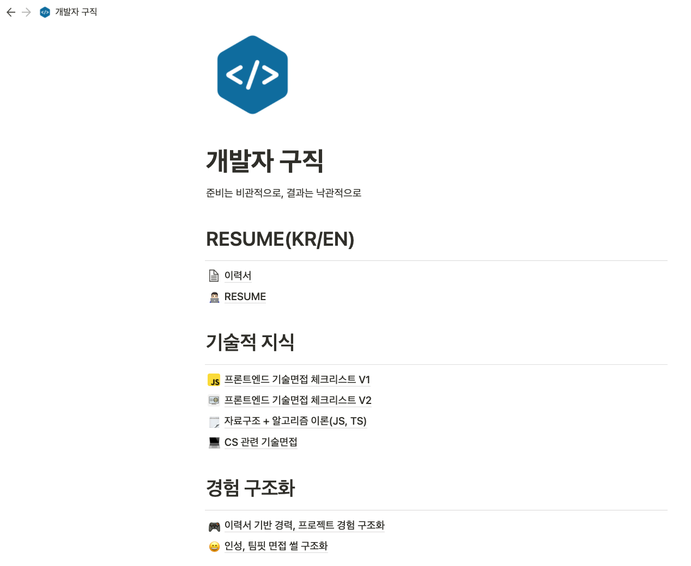
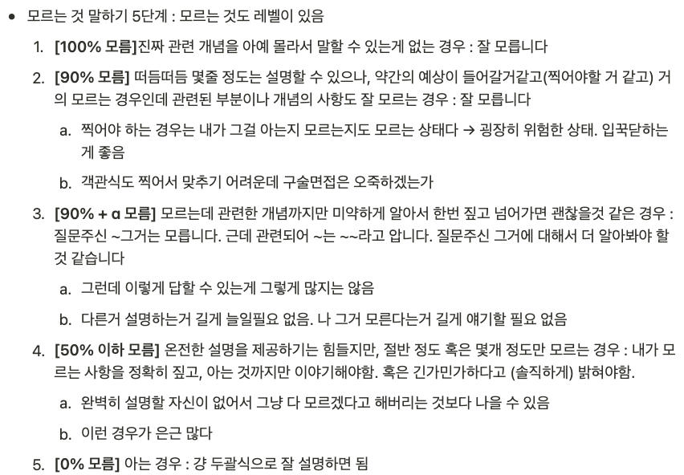

After almost 2 months of job hunting since the beginning of February, I took about a week off after securing a job. I went through the hiring process with 8 companies, 2 online coding tests, 4 livecasts, 5 pre-tasks, **13 sessions of various interviews (technical, team fit, executive)** and it was not an easy journey.

In this post, I'm going to recap my long and stressful job search process, highlighting some of the highlights of the hiring process. I hope you find it helpful if you're looking for a new job or are in the process of changing jobs!

# job search results

> **I applied to 8 companies for front-end developer positions and received 6 offers** \*\*The 2 companies I didn't receive offers from were each eliminated at the paper screening and first round interviews.

[I mentioned in my last post,](https://maxkim-j.github.io/posts/2021-retrospect#6-%EC%B7%A8%EC%A4%80) I was targeting only startups from the beginning. In terms of investment stage, the earliest companies I applied to were Series B. I applied to startups of all sizes, from unicorns to IPO-ready teams.

I also tried to only apply to companies that were in a domain that I was interested in and whose mission resonated with me. I think that's really important if you want to be immersed in a startup, so you have more to say in an interview.

#hiringprocess

## I've done it all

During this job search, I've done just about every archetype of developer hiring you can think of, except for actual hand coding. I've done online coding tests, live coding with live code sharing tools, technical interviews, experience-based interviews, and team fit interviews.

The interviews were mostly virtual due to the pandemic.

## Resume

[resume_final_final_realfinal.md](https://github.com/MaxKim-J/RESUME)

One of my regrets about writing my resume in a way that describes **problems solved** was that I had never really measured my performance in development or work before, so I couldn't use phrases like "improved by a few percent" or "saved seconds, minutes, or hours" properly. I realized that it would be nice to have proper numbers and metrics to measure my work performance.

## Pre-Assignment

Many companies give pre-assignments after you pass the screening process. The five pre-assignments I received had varying deadlines: 2 days, 3 days, 7 days, 3 hours, and 4 hours. Some assignments required me to implement a project from scratch, while others required me to add or modify features to an already existing project.

I found it important to **not maximize** during the pre-assignments - if you use libraries or technologies that are not well validated by your standards, or that you are not familiar with, you are less likely to complete the assignment on time.

The idea is that you should use the stacks you're most familiar with to quickly fulfill the requirements, while also thinking about the quality of your code. The goal is to get as many points as possible in the time allotted, especially in short time attack challenges where you have 24 hours or less to complete the task.

Still, you may not do well on the pre-test. In that case, you either don't move on to the next round of the hiring process 🥲 or you move on to an interview. If you think you did badly on the pretest and you get an interview, it's better to go in with the mindset that you need to **make up for it in the interview** because they'll ask you about it in the technical interview.

First, I would review the reasons why I didn't do well on the pre-task and think about how to implement the requirements that I couldn't implement. I would also think about what I didn't do well in terms of code quality. If time or mentality permits, I think it's good to try to solve the task again.

## Live coding

Live coding in front of an interviewer is very difficult. When you enter the room, you get nervous, and you have to solve the problem while communicating with the interviewer, but if you focus on the problem, you won't talk, and if you feel compelled to talk, you will get stuck in a dilemma.

To overcome this, I think you need to give the interviewer a lot of information in advance and get answers.

I felt that I needed to be proactive in communicating my thoughts quickly, such as "I'll think about it for a few minutes from now," "I don't care about the variable names because I need to solve the problem quickly," or "I'll solve it quickly with the first solution that comes to mind and refine it later." (Of course, if the interviewer tells me not to do that, I shouldn't do it, because it's communication, not notification...)

If you find it difficult to speak freely while solving a problem, I think it's a good idea to **comment on your thoughts as you write code**. The interviewer can check the comments and see the flow of your thoughts, and leave appropriate comments.

I practiced commenting my thoughts while doing live coding exercises on Litecode, and I think it was a good way to practice how to organize my thoughts while writing code.

## Technical Interview

For resume-based interviews, I would think about what the interviewer would want to know based on the experience I have on my resume, and organize the derivative questions until I ran out of ideas. I think this helped me to extract the points I needed to answer certain questions with confidence.

In this job search, I was asked more resume-based interview questions than technical interview questions, such as, "What is ~? Tell me about ~".

I was asked more questions like `why did you do this` and `what was your decision-making process` based on the experiences written on my resume. Unlike my last job search, I thought it was because I had a little bit of experience.

Once they started asking questions based on my resume, the technical questions seemed to follow naturally, and they even asked if they could make reasonable inferences based on it.

I think I answered the technical questions pretty well, but I can remember a few things that I didn't do so well, so I just kept reviewing them.

- Can you explain what Lazy Evaluation is and give an example of it?
- When a browser makes an HTTP request, what is the case where the preflight request is not made?
- Do you know the meaning of the `useImperativeHandle` hook name (why is it named this way)?

## There are levels of ignorance.

It's a well-known fact that in technical interviews, it's a negative factor if you don't admit what you don't know, but instead stumble and give a wrong answer.

If you don't know the question at all, you should feel comfortable saying you don't know, but sometimes there are situations where you know **something**. In this case, it's a waste to say you don't know if you don't have a good explanation. I've been in this situation a few times, so I created a protocol for answering.

Still, the most important thing is **meta-awareness**. I need to know exactly what I know and what I don't know in order to be able to answer even part of it well.

## teamfit interview

In the Teamfit interview, they asked me a lot about my communication and decision-making experience. I was also asked about negative situations. Like, what did you do when you had a coworker who didn't communicate well?

When I was preparing for the interview, I thought it would be good to summarize a situation or case where things didn't go well, and what I did and how I tried to resolve the issue, rather than just focusing on my work performance.

## Reverse question.

At the end of the interview, most candidates are given the opportunity to ask the interviewer questions in reverse.

I didn't view the reverse question time as an extension of the interview, and I didn't feel like I had to sell anything with my questions. Instead, I approached it from the perspective of getting information with the idea that in order to consider this company as one of my options, I need to be able to **imagine myself working for this company as vividly as possible**.

If I wasn't able to ask a lot of backwards questions, I would ask for a meeting with the people I would be working with after I was hired, and some companies would set up a casual meeting with the team members beforehand.

Here are some common questions I asked at almost every company.

- Tell me about an interesting problem that your development team is currently facing that would appeal to a developer.
- Describe in detail the entire process of how an engineer's suggestion or recommendation evolves into a task for the company.
- How does your development organization define performance, and how is it evaluated?

## Negotiated salary + my market rate

Before I started looking for a job, I set a **base salary + a floor for performance pay** that I knew I had to be paid at least this much. From there, as I received offers from different companies, I gauged what they were willing to pay for me, my market value, and I think that was the baseline for my desired treatment.

I was a junior, so I didn't have a lot of leverage to negotiate my salary. In some of these situations, the other company's offer definitely helped me negotiate, and in others, the compensation was so good that I didn't have to negotiate further.

## Job Search Timeline

Not all eight companies had hiring processes going on at the same time, with a maximum of four at a time. After the most important processes like coding tests, technical interviews, etc. were finished, I would start another one... It went like this.

Sometimes companies that had a lot of screening and could take a long time to get to the final result would start fast, and sometimes companies that had information that the process could be quick would start a little slower. On average, I think it took about two to three weeks from paperwork to finalization at a company.

There were some companies where I applied late and they pushed back their timelines, which lengthened my overall job search timeline. In the meantime, I had offers in hand, so I negotiated my compensation and delayed making a final decision on offers I had already received.

Some weeks I was working on assignments all week and into the weekend, and some weeks I was interviewing Monday through Friday. When it came time to make my final choice, it was very difficult to narrow down my options.

I even wrote an article [like this one](https://brunch.co.kr/@hwaseen/24) to help me get my mind right.

# finalchoice

After a very troubling and exhausting job search process, I decided to join a [flexteam](https://flex.team/) building HR Saas.

I think it's a great opportunity to grow as an engineer in a fast-growing business, where I can watch the product and team grow rapidly, and experience the complexity and challenges of a B2B Saas product solving tough problems for users.

It was a very tough decision to make, and I think I finally settled on a team with a mission and vision that I can align myself with more, and a team that builds products that I want to build more.

I'm nervous and excited, and I want to be an engineer who can contribute to the company, build great software, and make good technical decisions.

# thankyou!

I've met a lot of great people during the hiring process, and I've been fortunate to meet some amazing people in a great business, so thank you for your kind words, consideration, and support. The advice from senior developers with more experience than me was also very helpful. I will try to be a helpful person when someone asks for help.

I'm also grateful to my many friends and developers close to me who have accepted my rants and raves.

There are still a lot of people I haven't reached out to since I took a week off after my final choice to get my life in order, but I'll be sure to reach out and say thank you soon, thank you so much!
