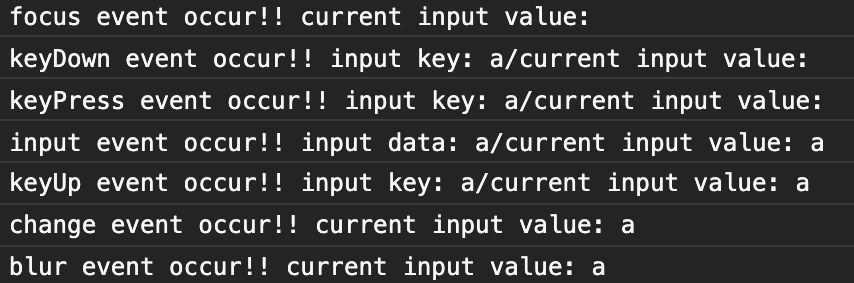
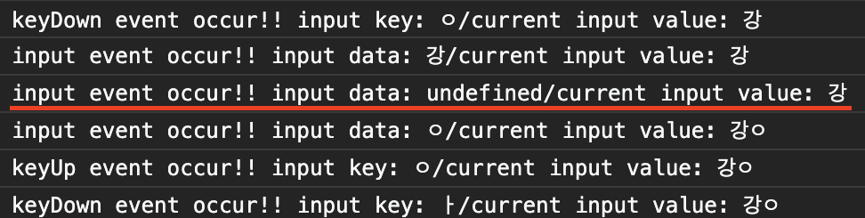

Recently, I had to implement an input element at work that had the ability to prevent certain keystrokes from being entered and clear the `value` attribute immediately upon entry. I looked up all the event elements associated with `<input/>` and thought it would be nice to organize the events and the order in which they occur. It's a concept that you shouldn't have to know while working on front-end development, but at the same time, I think it's easy to miss because you often only use the events you actually use. Let's get started!!!😎

## Events related to `<input/>`

There are 7 main events that happen with the `<input/>` tag.

- `focus`: Fired when the element becomes the focus and the cursor is raised, making it available for input. This is the starting point from which subsequent input-related events can occur and be detected.
- blur`: Fired when the element is defocused.
- change`: Fired after the blur event if a change has occurred compared to the original input value before focus occurred.
- input` : This event is fired whenever the value of the value attribute changes. Typically, an input event is fired when the value property changes immediately after a keyPress. The data property of the input event object has the most recently added letter to the value property (one letter of the alphabet in English, one letter of initial/neutral/terminal in Korean).
- keyDown`: Fired when a key is pressed. Fired before the input event.
- keyPress`: Fired when a key is pressed, after the keyDown event. **Does not occur when typing text or function keys**. [MDN says it's deprecated](https://developer.mozilla.org/en-US/docs/Web/API/Document/keypress_event), so if you want to control input before the input event, the keyDown event seems preferable. This event has similar characteristics to`keyDown` in many ways, but I think it can be confusing with unexpected behavior, such as not firing on certain keys.
- keyUp: This event is fired when you release the keyboard after the input event has occurred and the value has been updated. Naturally, it doesn't fire when you hold down a key to repeat the input.

Other than that, the only other event that seems to fire is the `paste` event, which can detect pasting.

## Order of occurrence of events

I did a little experiment with `Vue.js` to see if and in what order events related to `<input/>` are fired. The code looks like this: I've made sure to log to the console all events that occur when something changes the state of the input tag. For the handler functions for the `keyPress`, `keyDown`, `keyUp`, and `input` events, we've made sure to log to the console the value of the currently typed key, which can be accessed by the event object.

```javascript

<template>
  <div id="app">
    <input
      v-model="inputValue"
      @focus="onFocus"
      @blur="onBlur"
      @keydown="onKeyDown"
      @keypress="onKeyPress"
      @keyup="onKeyUp"
      @input="onInput"
      @change="onChange"
    />.
  </div>
</template>

<script> </script
export default {
  name: "App",
  data: () => ({
    inputValue: "",
  }),
  methods: {
    onFocus(e) {
      console.log("focus event occur!!", `current input value: ${e.target.value}`);
    },
    onBlur(e) {
      console.log("blur event occur!!", `current input value: ${e.target.value}`);
    },
    onKeyPress(e) {
      console.log("keyPress event occur!!", `input key: ${e.key}/current input value: ${e.target.value}`);
    },
    onKeyDown(e) {
      console.log("keyDown event occur!!", `input key: ${e.key}/current input value: ${e.target.value}`);
    },
    onBeforeInput(e) {
      console.log("input event occur!!", `input key: ${e.data}/current input value: ${e.target.value}`);
    },
    onInput(e) {
      console.log("input event occur!!", `input data: ${e.data}/current input value: ${e.target.value}`);
    },
    onKeyUp(e) {
      console.log("keyUp event occur!!", `input key: ${e.key}/current input value: ${e.target.value}`);
    },
    onChange(e) {
      console.log("change event occur!!", `current input value: ${e.target.value}`);
    },
    onPaste(e) {
      console.log("paste event occur!!", `current input value: ${e.target.value}`);
    },
  },
};
</script>

```

After experimenting, we found that the keys that can be typed typically follow the following sequence. The following image is a capture of the console window.



> focus => keyDown => (keyPress) => input => keyUp => blur => change

However, this order doesn't always work: as mentioned earlier, the keyPress event doesn't fire on Korean or function key input. It also depends on the type of element. On an input element, typing enter does not fire an `input` event, only `keyDown` and `keyUp`, but on a textArea, typing enter also fires an `input` event. This is because it's a line break.

There's also an unusual situation that's only seen in Korean input. This is true when using Vue's v-model: while the English alphabet has each letter as a standalone letter, the Korean alphabet is made up of a combination of consonants and vowels. Because of this, Korean input fires one more `input` event at the beginning of a new letter. The key being entered is undefined. If you don't pay attention to Korean input when dealing with the `input` event, it is possible that the handler function will be called unexpectedly.



As an aside, if you fire the `paste` event via paste, which we touched on a bit earlier, this is what happens. Immediately after `paste`, the `input` event is fired.

> keyDown (only fired when pasting with ctrl+v) => paste => input => keyUp (only fired when pasting with ctrl+v)

## Simple input control example

Let's use the concepts described above to implement a simple input control for the input tag. Let's implement an input element that only accepts numbers, but not English or Korean, and clears the input element as soon as it is entered, like an account number field on an internet banking site! You can see the example here via the [code sandbox](https://codesandbox.io/s/numeric-only-input-5e8ji?file=/src/App.vue).

### 1. Specify the allowed key value

Let's specify the key values that are allowed to be entered in `data()' as an array of strings. We'll allow only numbers and backspace.

```javascript
export default {
  name: 'NumericInput',
  data: () => ({
    inputValue: '',
    allowKey: ['0', '1', '2', '3', '4', '5', '6', '7', '8', '9', 'Backspace'],
  }),
};
```

### 2. Evaluating input before the `input` event in the `keyDown` event handler

In the `keyDown` event object, you can access the key entered via the `key` property. The `keyDown` event is a good event to evaluate the input to determine if it should reflect the value of the value, because it has not yet been fired by the `input` event, which changes the value of the input element. Write a keyDown event handler function to the Vue instance `method` property, and bind the event to the input element.

```javascript
<template>

  <div id="app">
    <input
      @keydown="onKeyDown"
    />.
  </div>
</template>

<script> <script
export default {
  name: "NumericInput",,
  data: () => ({
    inputValue: "",
    allowKey: ['0','1','2','3','4','5','6','7','8','9', 'Backspace']
  }),
  methods: {
    onKeyDown(e) {
      if(!this.allowKey.includes(e.key)) {
        e.preventDefault()
      }
    },
  },
};
</script>

```

The event handler function uses the `Array.prototype.includes` method to determine if the key just entered is an element in the allowed key array, and if it is not, it fires `preventDefault()` to prevent the `input` event from occurring. This creates an input element that only accepts numbers and backspace.

### 3. Canceling the `input` event in the `paste` event handler

But input isn't limited to the keyboard, you may also want to paste a string copied to the clipboard by pressing the right mouse button. In this case, you should utilize the `paste` event to detect pasting, evaluate the input, and cancel the `input` event based on the result. Add a `paste` event handler and bind the event to the input element as follows.

```javascript

<template> <div id="app
  <div id="app"> <input
    <input
      @keydown="onKeyDown"
      @paste="onPaste"
    />.
  </div>
</template>

<script> </script
export default {
  name: "NumericInput",,
  data: () => ({
    inputValue: "",
    allowKey: ['0','1','2','3','4','5','6','7','8','9', 'Backspace']
  }),
  methods: {
    onKeyDown(e) {
      if(!this.allowKey.includes(e.key)) {
        e.preventDefault()
      }
    },
    onPaste(e) {
      const pasteData = e.clipboardData.getData('text')
      for (const data of pasteData.split('')) { }, onPaste
         if(!this.allowKey.includes(data)) {
          e.preventDefault()
          break
        }
      }
    },
  },
};
</script>

```

The `clipboardData` property of the `paste` event object allows us to get the string data in the clipboard. The logic uses a for statement to iterate through the string data, turning it into a character-by-character array, canceling the `input` event and exiting the for statement if any unacceptable input is encountered. Now we have an input element that can't even be pasted unless it's a string of all numbers!


### 4. Move the value of the input element's value attribute to the Vue instance

If you've made it this far, it's visually perfect. The input element doesn't accept any non-numeric input, but we need to move its input to a variable in our Vue instance so we can do some processing with the input data. There are a few ways to move the value property to a JavaScript variable, but in this post, we'll add an `input` event handler to move the value property to a Vue instance variable in the `data()` property. Create an `input` event handler.

```javascript
<template>

  <div id="app">
    <input
      @keydown="onKeyDown"
      @paste="onPaste"
      @input="onInput"
    />.
  </div>
</template>

<script> </script
export default {
  name: "NumericInput",
  data: () => ({
    inputValue: "",
    allowKey: ['0','1','2','3','4','5','6','7','8','9', 'Backspace']
  }),
  methods: {
    onKeyDown(e) {
      if(!this.allowKey.includes(e.key)) {
        e.preventDefault()
      }
    },
    onPaste(e) {
      const pasteData = e.clipboardData.getData('text')
      for (const data of pasteData.split('')) { }, onPaste
         if(!this.allowKey.includes(data)) {
          e.preventDefault()
          break
        }
      }
    },
    onInput(e) {
      this.inputValue = e.target.value
    },
  },
};
</script>

```

Whenever an `input` event is fired, the handler substitutes the value of the input element's value attribute into a Vue instance variable called `inputValue`. Of course, this could also be handled with `v-model`, Vue's well-known template syntax. In fact, `v-model` is pretty much the same thing as the code above: binding a variable of a Vue instance to the value property of the input (v-bind) and binding the `input` event to it (v-on). If you want to learn more about `v-model`, check out [this post](https://joshua1988.github.io/web-development/vuejs/v-model-usage/) by Vue master Captain Pan!

## Wrapping Up

So far, we've explored the firing of events related to input elements and created a simple example of input control. Even though it's basic knowledge, I've been noticing a lot of differences between what I know and can explain and what I can't. I want to be a developer who thinks about things and explores them until I can understand and explain exactly how they work. I think this post was part of that effort.🧐

## reference

- [mdn - keyboard event](https://developer.mozilla.org/en-US/docs/Web/API/KeyboardEvent)
- [mdn - input event](https://developer.mozilla.org/ko/docs/Web/API/HTMLElement/input_event)
- [mdn - change event](https://developer.mozilla.org/en-US/docs/Web/API/HTMLElement/change_event)
