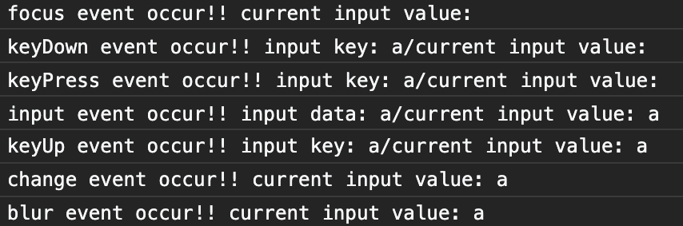
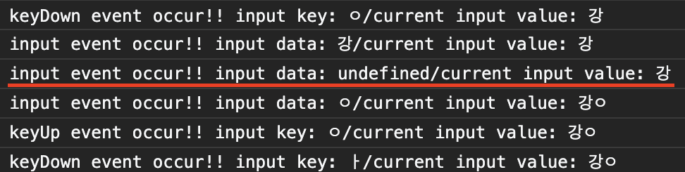
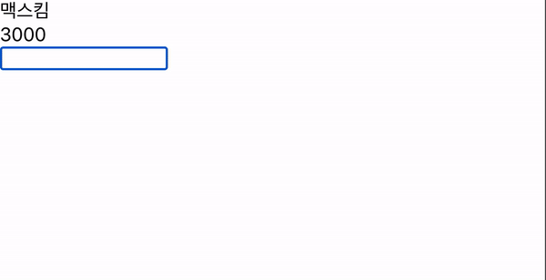

최근에 회사에서 특정 키 입력이 안되게 입력과 동시에 바로 `value` 속성값에서 지워야 하는 기능을 지닌 input element를 구현해야 할 일이 있었습니다. `<input/>`과 관련한 모든 이벤트 요소들을 찾아보면서, 이벤트들의 발생 여부와 순서들을 정리해보면 어떨까 생각했습니다. 프론트엔드 개발을 하면서 모르면 안되는 개념이긴 하지만, 사실 쓰던 이벤트들만 쓰는 경우가 많아 동시에 놓치기 쉬운 개념이라는 생각이 들기도 해서요. 시작해보겠습니다!!😎

## `<input/>`과 관련된 이벤트들

주요하게는 총 7가지의 이벤트가 `<input/>` 태그와 관련하여 발생합니다.

- `focus` : 요소가 포커스가 되고 커서가 발생하여 입력이 가능해졌을 때 발생하는 이벤트입니다. 이후 진행되는 인풋 관련 이벤트들이 발생하고 감지될 수 있는 시작점이 됩니다.
- `blur` : 요소의 포커스가 해제되었을 때 발생하는 이벤트입니다.
- `change` : focus가 발생하기 전의 원래 입력값과 비교하여 변화가 일어났을 경우 blur 이벤트 이후에 발생하는 이벤트입니다.
- `input` : value 속성의 값이 바뀔 때마다 발생하는 이벤트입니다. 일반적으로 keyPress 직후에 value 속성이 바뀌면서 input 이벤트가 발생합니다. input 이벤트 객체의 data 프로퍼티는 value 속성에 가장 최근 추가된 한 글자를 가지고 있습니다.(영어의 경우 알파벳 한 글자, 한국어의 경우 초성/중성/종성으로 이루어진 한 글자)
- `keyDown` : 키가 눌렸을 때 발생합니다. input 이벤트 전에 발생됩니다.
- `keyPress` : 키가 눌렸을 때 발생하며, keyDown 이벤트 이후에 발생합니다. **한글 입력이나 기능키 입력시에는 발생하지 않습니다**. [MDN에서 찾아보면 deprecated 되었다고 나오니](https://developer.mozilla.org/en-US/docs/Web/API/Document/keypress_event), input 이벤트 전에 입력을 제어하고 싶다면 keyDown 이벤트를 사용하는게 바람직해 보입니다. `keyDown`과 여러모로 비슷한 특성을 가지지만 특정 키에는 발생하지 않는 등의 예기치 않은 동작으로 혼란을 줄 수 있는 이벤트가 아닐까 생각합니다.
- `keyUp` : input 이벤트 발생 후 value가 업데이트 된 이후에 키보드에서 손을 떼면 발생하는 이벤트입니다. 당연하게도 키를 꾹 눌러서 입력을 반복하거나 할때는 발생하지 않습니다.

이외에는 붙여넣기를 감지할 수 있는 `paste`이벤트 정도가 발생하는 것 같습니다.

## 이벤트의 발생 순서

`<input/>`과 관련된 이벤트의 발생 여부와 순서를 알아보기 위해 `Vue.js`를 이용한 간단한 실험을 해봤습니다. 코드는 다음과 같아요. input태그의 상태에 무언가 변화를 주었을 때 발생하는 모든 이벤트를 콘솔에 기록할 수 있도록 했습니다. `keyPress`, `keyDown`, `keyUp`, `input` 이벤트의 핸들러 함수의 경우, 이벤트 객체로 접근할 수 있는 현재 입력되는 key값까지 콘솔에 기록할 수 있도록 했습니다.

```javascript

<template>
  <div id="app">
    <input
      v-model="inputValue"
      @focus="onFocus"
      @blur="onBlur"
      @keydown="onKeyDown"
      @keypress="onKeyPress"
      @keyup="onKeyUp"
      @input="onInput"
      @change="onChange"
    />
  </div>
</template>

<script>
export default {
  name: "App",
  data: () => ({
    inputValue: "",
  }),
  methods: {
    onFocus(e) {
      console.log("focus event occur!!", `current input value: ${e.target.value}`);
    },
    onBlur(e) {
      console.log("blur event occur!!", `current input value: ${e.target.value}`);
    },
    onKeyPress(e) {
      console.log("keyPress event occur!!", `input key: ${e.key}/current input value: ${e.target.value}`);
    },
    onKeyDown(e) {
      console.log("keyDown event occur!!", `input key: ${e.key}/current input value: ${e.target.value}`);
    },
    onBeforeInput(e) {
      console.log("input event occur!!", `input key: ${e.data}/current input value: ${e.target.value}`);
    },
    onInput(e) {
      console.log("input event occur!!", `input data: ${e.data}/current input value: ${e.target.value}`);
    },
    onKeyUp(e) {
      console.log("keyUp event occur!!", `input key: ${e.key}/current input value: ${e.target.value}`);
    },
    onChange(e) {
      console.log("change event occur!!", `current input value: ${e.target.value}`);
    },
    onPaste(e) {
      console.log("paste event occur!!", `current input value: ${e.target.value}`);
    },
  },
};
</script>

```

실험 결과, 일반적으로 입력할 수 있는 키들은 다음과 같은 순서를 따른다는 것을 알 수 있었습니다. 다음 이미지는 콘솔 창을 캡쳐한 것입니다.



> focus => keyDown => (keyPress) => input => keyUp => blur => change

하지만 무조건 이 순서를 따르는 것은 아닙니다. 앞에서 설명했듯 keyPress 이벤트는 한국어나 기능키 입력시에는 발생하지 않습니다. 또한 element의 종류에 따라서도 다릅니다. input 요소에는 엔터를 입력하면 `input` 이벤트가 발생하지 않고 `keyDown`과 `keyUp`만 일어나지만, textArea에서는 엔터키 입력도 `input` 이벤트를 발생시킵니다. 줄바꿈이 되니까요.

그리고 한국어 입력에서만 볼 수 있는 특이한 상황도 존재합니다. Vue의 v-model을 사용할때 해당되는 이야기인데요. 영어 알파벳은 각 글자가 독립된 한 글자이지만 한국어는 자음과 모음이 조합되어 글자가 만들어집니다. 이런 특성 때문에, 한국어 입력은 새로운 글자가 시작되는 시점에 **`input` 이벤트가 한번 더 발생** 합니다. 입력되는 key는 undefined 입니다. `input` 이벤트를 다뤄야 할때 한국어 입력에 신경쓰지 않으면 예기치 않게 핸들러 함수가 호출될 가능성이 있습니다.



여담으로, 앞에서 살짝 언급했었던 붙여넣기를 통해 `paste` 이벤트를 발생시키면 이런 순서로 진행됩니다. `paste` 직후 바로 `input` 이벤트가 발생합니다.

> keyDown(ctrl+v를 사용해서 붙여넣기 했을때만 발생) => paste => input => keyUp(ctrl+v를 사용해서 붙여넣기 했을때만 발생)

## 간단한 입력 제어 예제

위에서 설명한 개념들을 활용해서 간단한 input 태그의 입력 제어를 구현해보기로 하겠습니다. 인터넷 뱅킹 사이트의 계좌번호 입력란처럼 숫자만 입력되고, 영어나 한글은 입력되지 않고 입력하는 동시에 지워지는 input element를 구현해볼까 합니다! 예제는 여기 [code sandbox](https://codesandbox.io/s/numeric-only-input-5e8ji?file=/src/App.vue)를 통해 올려놨습니다.

### 1. 입력 허용되는 key value 명시하기

`data()` 에 입력이 허용되는 key값들을 문자열 배열로 명시해줍니다. 숫자 입력과 백스페이스 정도의 입력을 허용하는 것으로 하겠습니다.

```javascript
export default {
  name: 'NumericInput',
  data: () => ({
    inputValue: '',
    allowKey: ['0', '1', '2', '3', '4', '5', '6', '7', '8', '9', 'Backspace'],
  }),
};
```

### 2. `keyDown` 이벤트 핸들러에서 `input`이벤트 발생 전 입력 평가하기

`keyDown` 이벤트 객체에서 `key` 프로퍼티를 통해 입력한 key에 접근할 수 있습니다. `keyDown` 이벤트는 아직 `input`이벤트가 발생하여 input 요소의 value 값이 바뀌기 전이므로, 입력을 평가해 value 값 반영 여부를 결정하기에 좋은 이벤트입니다. keyDown 이벤트 핸들러 함수를 Vue 인스턴스 `method` 프로퍼티에 작성해주고, input 요소에 이벤트를 바인딩해줍니다.

```javascript
<template>

  <div id="app">
    <input
      @keydown="onKeyDown"
    />
  </div>
</template>

<script>
export default {
  name: "NumericInput",,
  data: () => ({
    inputValue: "",
    allowKey: ['0','1','2','3','4','5','6','7','8','9', 'Backspace']
  }),
  methods: {
    onKeyDown(e) {
      if(!this.allowKey.includes(e.key)) {
        e.preventDefault()
      }
    },
  },
};
</script>

```

이벤트 핸들러 함수는 방금 막 입력한 key가 허용 키배열에 포함된 요소인지를 `Array.prototype.includes` 메소드로 파악하고, 포함되어있지 않으면 `preventDefault()` 를 발생시켜 `input` 이벤트 발생을 막습니다. 이렇게 작성하면 숫자와 백스페이스만 입력이 가능한 인풋 요소가 만들어집니다.

### 3. `paste` 이벤트 핸들러에서 `input` 이벤트 취소하기

그런데 입력은 키보드로만 하는것이 아닙니다. 마우스 오른쪽 버튼을 눌러서 클립보드에 복사한 문자열을 붙여넣기 할수도 있겠죠. 이런 경우에 붙여넣기를 감지하는 `paste` 이벤트를 활용해 입력을 평가하고 결과에 따라 `input` 이벤트를 취소해야 합니다. 다음과 같이 `paste` 이벤트 핸들러를 추가해주고, input 요소에 이벤트를 바인딩합니다.

```javascript

<template>
  <div id="app">
    <input
      @keydown="onKeyDown"
      @paste="onPaste"
    />
  </div>
</template>

<script>
export default {
  name: "NumericInput",,
  data: () => ({
    inputValue: "",
    allowKey: ['0','1','2','3','4','5','6','7','8','9', 'Backspace']
  }),
  methods: {
    onKeyDown(e) {
      if(!this.allowKey.includes(e.key)) {
        e.preventDefault()
      }
    },
    onPaste(e) {
      const pasteData = e.clipboardData.getData('text')
      for (const data of pasteData.split('')) {
         if(!this.allowKey.includes(data)) {
          e.preventDefault()
          break
        }
      }
    },
  },
};
</script>

```

`paste` 이벤트 객체의 `clipboardData` 프로퍼티로 클립보드에 있는 문자열 데이터를 얻을 수 있습니다. for문을 이용해 문자열 데이터를 한글자씩 배열로 바꿔 순회하며 허용되지 않는 입력이 발생하는 경우 `input` 이벤트를 취소하고 for문을 빠져나오는 로직입니다. 이제 모두 숫자로 이루어진 문자열이 아니라면 붙여넣기도 안되는 인풋 요소가 되었네요!



### 4. input 요소의 value 속성값을 Vue 인스턴스로 옮기기

여기까지 진행했다면 시각적으로는 완벽합니다. 인풋 요소는 숫자가 아닌 입력을 하나도 허용하지 않습니다. 하지만 input 요소의 입력을 Vue 인스턴스의 변수로 옮겨야 입력 데이터를 가지고 여러가지 처리를 할 수 있습니다. value 속성값을 자바스크립트 변수로 옮기는 방법은 몇 가지가 있지만 이번 포스팅에서는 `input` 이벤트 핸들러를 추가하여 `data()` 속성의 Vue 인스턴스 변수로 value 속성값을 옮겨보도록 하겠습니다. `input` 이벤트 핸들러를 작성해줍니다.

```javascript
<template>

  <div id="app">
    <input
      @keydown="onKeyDown"
      @paste="onPaste"
      @input="onInput"
    />
  </div>
</template>

<script>
export default {
  name: "NumericInput",
  data: () => ({
    inputValue: "",
    allowKey: ['0','1','2','3','4','5','6','7','8','9', 'Backspace']
  }),
  methods: {
    onKeyDown(e) {
      if(!this.allowKey.includes(e.key)) {
        e.preventDefault()
      }
    },
    onPaste(e) {
      const pasteData = e.clipboardData.getData('text')
      for (const data of pasteData.split('')) {
         if(!this.allowKey.includes(data)) {
          e.preventDefault()
          break
        }
      }
    },
    onInput(e) {
      this.inputValue = e.target.value
    },
  },
};
</script>

```

`input` 이벤트가 발생할 때마다, 핸들러는 `inputValue` 라는 Vue 인스턴스 변수로 input 요소의 value 속성값을 대입합니다. 물론 흔히 알려져 있는 Vue의 템플릿 문법인 `v-model`로도 처리가 가능합니다. 사실 `v-model` 은 인풋의 value 속성에 Vue 인스턴스의 변수를 바인딩하고(v-bind), `input` 이벤트를 바인딩한(v-on) 것으로 위의 코드와 거의 비슷한 원리를 가지고 있습니다. `v-model`에 대해 더 알아보시고 싶으시다면 뷰장인 캡틴판교님의 [이 포스팅](https://joshua1988.github.io/web-development/vuejs/v-model-usage/)을 참고해 주세요!

## 마무리

지금까지 input 요소와 관련된 이벤트의 발생을 탐구해보고, 간단한 입력 제어 예제를 만들어 봤습니다. 기본적인 지식임에도 정확히 알고 설명할 수 있는 것과 그렇지 않은 것의 차이를 많이 느끼는 요즘입니다. 얼추 알고 있다고 해도 스스로 곱씹어보고, 정확히 원리를 이해하고 설명할 수 있을 때까지 탐구하는 개발자가 되고 싶습니다. 이 포스팅은 그런 노력의 일환이었던 것 같아요.🧐

## reference

- [mdn - keyboard event](https://developer.mozilla.org/en-US/docs/Web/API/KeyboardEvent)
- [mdn - input event](https://developer.mozilla.org/ko/docs/Web/API/HTMLElement/input_event)
- [mdn - change event](https://developer.mozilla.org/en-US/docs/Web/API/HTMLElement/change_event)
