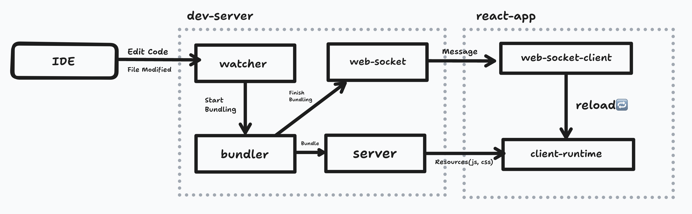
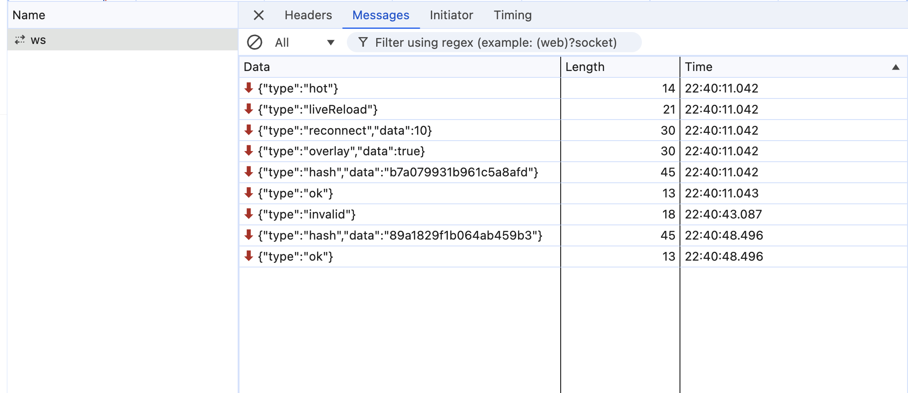

Generally, bundlers provide a local development server. `webpack` comes with `webpack-dev-server`, and `vite` has `plugin-react`. Developers don't usually need to worry about what happens when they execute `dev` or `serve` commands because of the high level of abstraction.

However, in the Micro Frontend framework podojs, which I maintain at work, using a compatible development server from the bundler was quite painful, even after significant modifications. I'll discuss the exact issues at another time. To solve these problems better, I decided to study local development servers.

In this post, we'll create a very basic local development server that supports [live-reload](https://webpack.js.org/configuration/dev-server/#devserverlivereload) and explore the fundamental workings and components of a local development server.

# Overview

Refer to the [example code](https://github.com/MaxKim-J/simple-dev-server) for the actual operations of each implementation.



1. Modify code in an IDE (e.g., vscode).
2. A watcher monitoring a specific directory triggers the bundler.
3. Once the bundler successfully builds, it sends a message to the React app running in the web browser via a web socket.
4. The React app, upon receiving the web socket message, refreshes the browser.
5. After the refresh, the dev-server requests the bundled output to redraw the app.

# Components

In this section, I will explain each component in the diagram. I'll also summarize what I know from open-source bundlers (mostly `webpack`).

## 1. Watcher

Monitors changes, additions, and deletions in all files under a specific directory to trigger bundling by the bundler.

Typically, you can watch the entire file tree that depends on the client's bundle entry point ([webpack.entry](https://webpack.js.org/concepts/entry-points/)), but in a monorepo setup, you might expand the watch scope to include all internal packages the application depends on.

[watchpack](https://github.com/webpack/watchpack), a lower-level library of webpack, detects directories involved in bundling and attaches [`fs.watch`](https://nodejs.org/docs/latest/api/fs.html#fswatchfilename-options-listener) to them. Depending on the scale of files being watched, there's an algorithm that decides whether to attach a watcher to the directory or to each file individually. 

I used to think that attaching watchers before bundling was delegated to webpack-dev-middleware or webpack-dev-server, but after checking the code, I found that [webpack uses watchpack directly in its default plugin operations](https://github.com/webpack/webpack/blob/main/lib/node/NodeEnvironmentPlugin.js).

In the webpack config file, you can control this webpack.watch through the [watchOptions](https://webpack.js.org/configuration/watch/#watchoptions) property. The [ignored](https://webpack.js.org/configuration/watch/#watchoptionsignored) property is particularly useful, as it allows you to pass glob patterns of directories or files not to watch. Too many watchers can cause performance issues or prevent proper watching and rebundling.

[parcel](https://github.com/parcel-bundler/parcel) provides its watcher as an independent library, [@parcel/watcher](https://github.com/parcel-bundler/watcher). The [example code](https://github.com/MaxKim-J/simple-dev-server/blob/main/dev-server/src/server/dev/watcher.ts) uses this.

## 2. Bundler

Bundling is sometimes roughly referred to as building or compiling. Internally, webpack refers to a bundler instance as a [Compiler](https://webpack.js.org/api/compiler-hooks/). However, since building and compiling are different processes than bundling, I prefer the term bundling.

Intuitively, when you run a development server and modify code, the bundling results would continue to accumulate, which would be inefficient.

In a typical local development server, an in-memory file system like [memfs](https://github.com/streamich/memfs) is used to create files in memory without actual read/write operations on the node.fs file system. In webpack, you can set this behavior through the [outputFileSystem](https://webpack.js.org/api/node/#custom-file-systems) option.

When the watcher detects valid file changes, it calls the bundler instance to create a new build output matching the latest code state. [webpack-dev-middleware](https://github.com/webpack/webpack-dev-middleware) aims to integrate these operations in a node server.

Alternatively, as shown in the [example code](https://github.com/MaxKim-J/simple-dev-server/blob/4ce287b772284132508ecbab8f7dcc6fc710dd81/dev-server/src/server/dev/runDevServer.ts#L42), if you can programmatically control the creation and invocation of the bundler instance, you can integrate it directly with the watcher as follows:

```ts
  watcher.subscribe(async (eventLogs) => {
    await bundler.run();
  });
```

## 3. Server

This refers to the server that serves the bundled output to the browser. Typically, it uses the same host and port as the localhost used by the browser. This ensures that when resources are requested with relative paths in the browser, they correctly reach the local development server's resources.

```html
<!-- Request resources from localhost:3000/main.js -->
<script src="main.js" /> 
```

If you use webpack-dev-server, it also supports [specific path settings](https://webpack.js.org/configuration/dev-server/#devserver).

Using [html-webpack-plugin](https://github.com/jantimon/html-webpack-plugin) automatically adds `script` tags to serve the entry bundle in `index.html`, making good use of the exposed server endpoints. Other bundlers support similar operations.

In the [example code](https://github.com/MaxKim-J/simple-dev-server/blob/4ce287b772284132508ecbab8f7dcc6fc710dd81/dev-server/src/server/dev/bundler.ts#L49), memfs is used to access the bundled output, allowing all resources to be requested directly under the `/` endpoint.

## 4. Web-Socket

In a local development environment, the server and browser need to synchronize actions like code changes and reloading the newly bundled output. Therefore, the browser must be aware of some server states in real-time. Upon initial connection to the localhost, the browser establishes a web socket connection with the local development server.

In the [example code](https://github.com/MaxKim-J/simple-dev-server/blob/4ce287b772284132508ecbab8f7dcc6fc710dd81/dev-server/src/server/dev/runDevServer.ts#L42), after code changes and the completion of rebundling, the server sends a socket message to the browser, which then refreshes the page.

The following code summarizes the core actions of a local development server:

```ts
 // Detect file changes
  watcher.subscribe(async (eventLogs) => {
  
    // Send a socket message to the browser indicating file changes
    socket.send({
      type: 'changeDetected',
      name,
      files: eventLogs,
    });
    
    // Re-invoke the bundler instance
    await bundler.run();
    
    // After bundling, send a success message to the browser
    socket.send({
      type: 'compileSuccess',
      name,
    });
  });
```

webpack-dev-server also uses web sockets. It has [options related to web sockets](https://webpack.js.org/api/hot-module-replacement/#status), and the browser and server synchronize states via web sockets as shown below.



## 5. Client-Runtime

To support [live-reload](https://webpack.js.org/configuration/dev-server/#devserverlivereload), the browser must refresh when bundling is complete. As seen above, the browser should refresh upon receiving a socket message indicating bundling completion.

Such behavior must be evaluated in the browser when connecting to the localhost. The browser in a local development environment requires client runtime code to initialize and set up necessary operations.

An example of this is code that performs specific actions upon receiving certain web socket messages, as shown in the [example code](https://github.com/MaxKim-J/simple-dev-server/blob/4ce287b772284132508ecbab8f7dcc6fc710dd81/dev-server/src/server/dev/socket/socket.ts#L65). Here, the script code was included in the initially served HTML.

When setting up a local development server using webpack-dev-middleware, which is one level of abstraction lower than webpack-dev-server, you need to add [client bundles as entry points](https://webpack.js.org/guides/hot-module-replacement/#enabling-hmr) in the webpack config to be evaluated in the browser.

[Fast-refresh](https://github.com/vitejs/vite-plugin-react), which allows continuous evaluation of changed bundles while maintaining state, requires additional runtime code for operation. In vite's react-plugin that supports fast-refresh, you can see that certain runtime code is added before and after the newly bundled module code when it's evaluated in the browser.

# Conclusion

Although I briefly mentioned it in this post, I'll cover the implementation levels of local development servers (Live Reload, Hot Module Replacement, fast-refresh) in the next post.

# References

-  [webpack-dev-server](https://github.com/webpack/webpack-dev-server)
-  [webpack-dev-middleware](https://github.com/webpack/webpack-dev-middleware)
-  [@vitejs/plugin-react](https://github.com/vitejs/vite-plugin-react)
-  [# Mental model for the new dev flow 🧠 - Pedro Cattori](https://www.youtube.com/watch?v=zTrjaUt9hLo)

(End)
