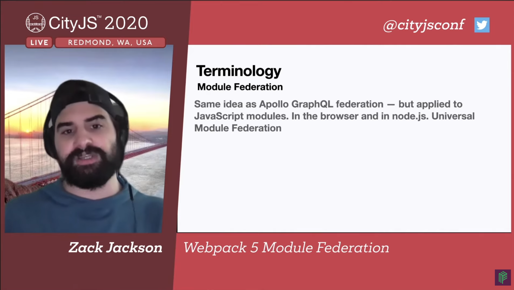
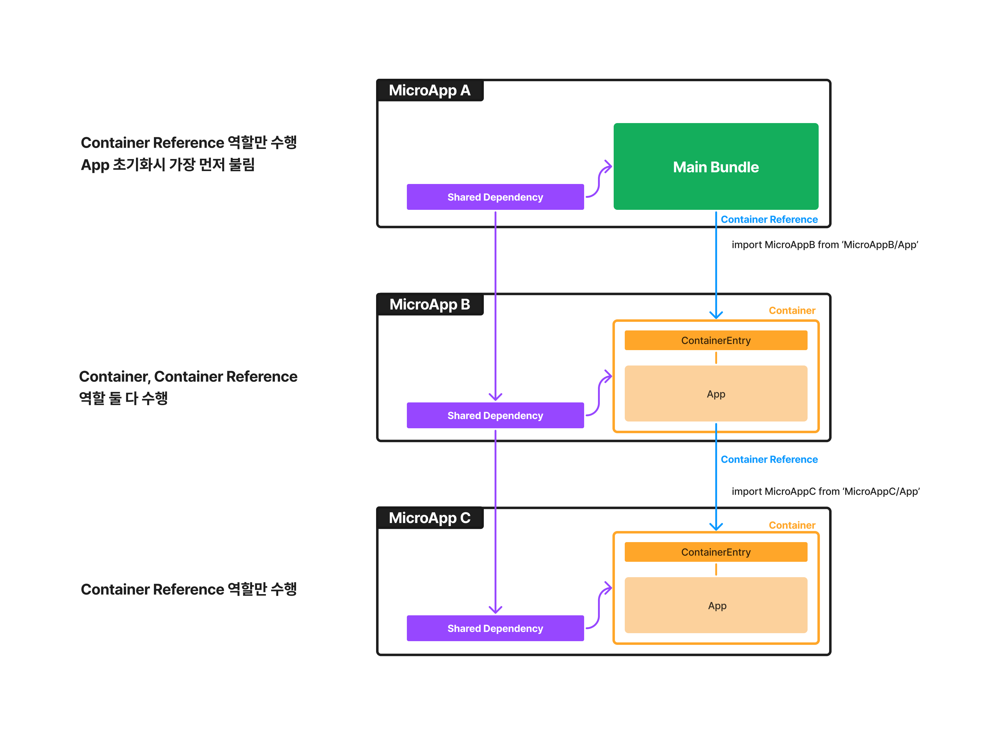
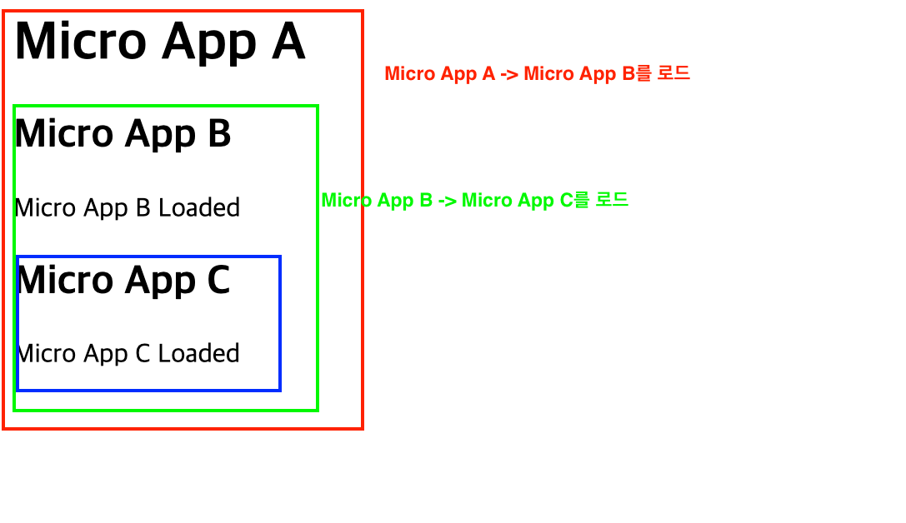
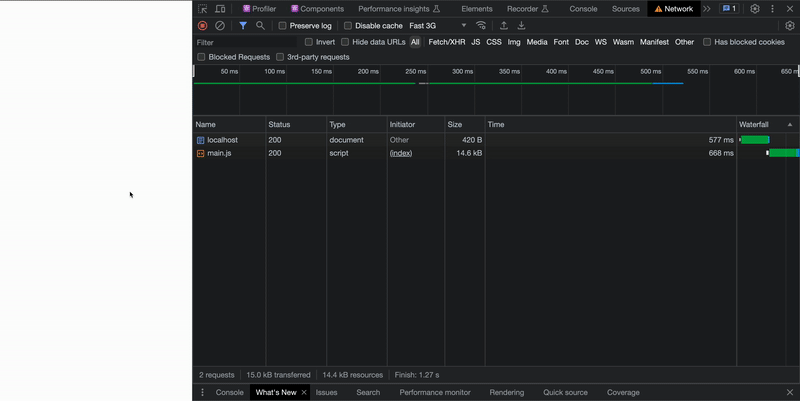
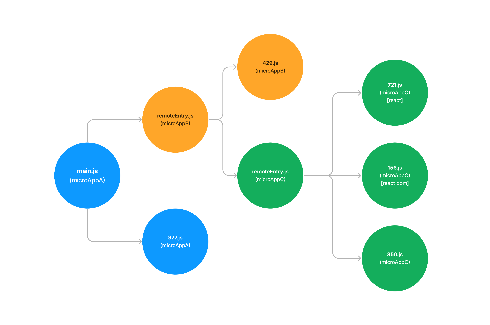
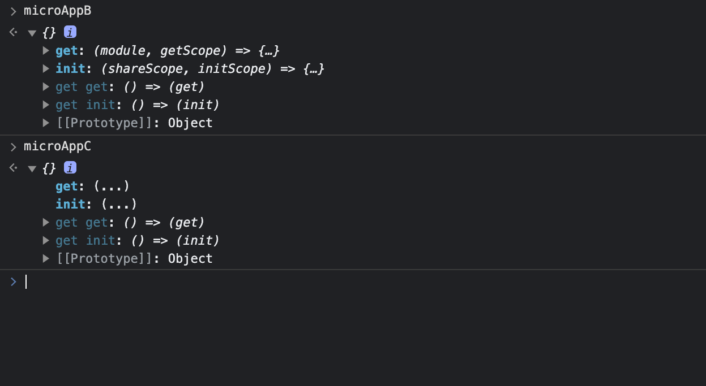

I'm going to compile a few articles related to Module Federation. I've been studying it and have a good idea of how it works, but I felt the need to organize it. I also wanted to increase local references.

This is the first post, which tries to understand the basic concepts and features of Module Federation.

# Module Federation

## What is Module Federation?

> [Micro at buildtime, Monolith at runtime](https://youtu.be/XpeD4FtlMg4?t=2) - Zack Jackson

The concept of breaking up a single app into independently deployable modules ([Chunks in Webpack](https://webpack.kr/guides/code-splitting/)) and combining them at browser runtime.

It's not the conceptual equivalent of Micro Frontends, but can be seen as one implementation. This is because it provides a way to take one app and tear it into specific units that can be deployed.

[Zack Jackson](https://twitter.com/ScriptedAlchemy) is the originator of this concept. [Apollo graphQL Federation is said to be an application of the concept to JS modules](https://youtu.be/-ei6RqZilYI?t=655)



In [Webpack 5 Module Federation - Zack Jackson - CityJS Conf 2020 video](https://www.youtube.com/watch?v=-ei6RqZilYI), the creator of Module Federation himself gives an overview of the concept.

What Zack hopes to solve with Module Federation is [https://youtu.be/-ei6RqZilYI?t=444](https://youtu.be/-ei6RqZilYI?t=444) mainly the shortcomings of trying to integrate parts of existing fragmented apps into a single app.

- **Sharing code is hard**: Build-time integration is slow, inefficient, and not scalable
- Nothing Feels Smooth: The popular runtime integration method (iframe) doesn't end up looking like a single app.
- Native ESM is still slow in the browser, Monolith gets bigger and slower the more you scale, and bundling specific modules separately using webpack external is a pain.

Module Federation is not a webpack-specific implementation. [It's more of an implementation concept, an interface](https://youtu.be/-ei6RqZilYI?t=1062) Different build tools (vite, rollup) have different implementations.

- [vite-plugin-federation](https://github.com/originjs/vite-plugin-federation)
- [rollup-federation](https://github.com/originjs/vite-plugin-federation)

However, the implementation using the [Webpack Plugin](https://webpack.kr/plugins/module-federation-plugin/), which is more than just a conceptual implementation and is being maintained, seems to be the most accessible implementation at the moment.

## Webpack 5 Module Federation Plugin

This is the Webpack version of the Module Federation concept, added in [Webpack 5](https://webpack.js.org/blog/2020-10-10-webpack-5-release/#module-federation), released in 2020.

This plugin ensures that runtime loading of JS modules that are chunked according to the concept of Module Federation works properly.

The plugin handles chunked output by modifying and adding code directly at build time, splitting chunks, or changing dependencies between chunks.

In this post, we'll focus on the functionality provided by the Yo plugin. You can see several examples in the [module-federation-example](https://github.com/module-federation/module-federation-examples) repository. You can see examples of different technology stacks being handled by the plugin, including React, Vue, Angular, and more.

## Understanding how the Module Federation Plugin works



The example I'm going to show you is a monolithic web app that has three "Micro Apps" that depend on each other. Each app is implemented as a simple SPA, all built with React. We'll use this example to demonstrate the following things

- Key concepts
- Chunk loading order and behavior
- What the entry point chunks (main, remoteEntry) do
- How the plugin works

I've pre-written the code for you, but I encourage you to run it through the README, take a look at the code, and then read the rest of the post.

> [Module Federation code example repository](https://github.com/MaxKim-J/module-federation-example)

## 3 key concepts of the Module Federation Plugin

Let's start by explaining the three most important concepts in explaining Module Federation.


### Container

A unit that can be loaded by other micro apps. If app A can be loaded and used by other micro-apps like B and C, we can say "app A contains a Container".

- A unit in the Module Federation Plugin that has one or more Exposed Modules.
- It is also known as a Remote Container and can also be referred to as a Remote App.
- A micro app has a Container if it has the following settings in the Module Federation Plugin

```javascript
new ModuleFederationPlugin({
    name: 'microApp',
    filename: 'remoteEntry.js',
    // Include a conatiner if you have an exposes setting.
    exposes: {
      './AppA': './src/AppA.tsx',
      './AppB': './src/AppB.tsx',
    },
  }),
```

```javascript
// In another micro app with a conatiner reference, which I'll explain below, we'll use
// load the microapp in the following way

import implementor from '{container name}/{key of exposesetting}';

// Static import
import MicroAppA from 'microApp/AppA';

// Dynamic import
const MicroAppB = React.lazy(() => import('microApp/AppB'));
```

### Container References

This is a reference relationship created when a specific app imports another micro app. If app A is importing and using app B, we can say "app A has Container Refrences to app B".

- The unit of a Module Federation Plugin that is importing one or more containers.
- You can also call it a Host App in terms of importing a Remote App.
- A micro app will have Container References if it has the following settings in the Module Federation Plugin

```javascript
new ModuleFederationPlugin({
    name: 'microAppA',
    // Include a conatiner reference if it has the remotes setting.
    remotes: { name
       microAppB: 'microAppB@http://localhost:3002/remoteEntry.js',
    },
  }),
```

### Share Scope

The one scope in which the shared dependency is valid. When sharing a dependency between micro apps, it serves as a way to check the settings, version, and determine how each micro app should load and use the shared dependency based on the settings.

- You can share dependencies between micro apps at runtime by passing specific dependencies and versions with the `shared` setting. For example, if you paste the following code into all your micro apps, you can share only one instance of React across all your micro apps.
- If you pass the `shareScope` setting, you can only share dependencies between containers and container references that have the same scope. Normally, the default value is `default`.

```javascript
new ModuleFederationPlugin({
    shared: {
      // Add react as a shared module in the default shared scope.
      react: {
        requiredVersion: deps.react,
        singleton: true,
        shareScope: 'default'
      },
    },
  }),
```

It's pretty complicated, but it's enough to know that you can share dependencies - that's all you need to know.

## Webapp structure with Module Federation Plugin

Now that we've covered the core concepts, let's take a look at the schematic of the example again.


Notice that app B in the middle is both a Container and has a Container Reference.

The `remotes` and `exposes` properties of the Module Federation Plugin's configuration values are not exclusive, so a micro-app can be a Container and also have a Container Reference. App B would have the following configuration values

```javascript
new ModuleFederationPlugin({
  name: 'microAppB',
  filename: 'remoteEntry.js',
  remotes: {
    microAppC: 'microAppC@http://localhost:3002/remoteEntry.js',
  },
  exposes: {
    './App': './src/App.tsx',
  },
  shared: {
    react: {
      singleton: true,
      version: '18.2.0',
    },
    'react-dom': {
      singleton: true,
      version: '18.2.0',
    },
  },
}),
```

This is one of the important characteristics of the Module Federation Plugin: it is [**Omnidirectional**](https://medium.com/swlh/webpack-5-module-federation-a-game-changer-to-javascript-architecture-bcdd30e02669).

In the browser, it looks like this You can see that after the initial load, MicroApp A calls Micro App B, which calls Micro App C, which calls Micro App B, etc.





## App initialization and chunk loading order

Now let's open up the developer tools and take a closer look at the order in which the chunks are loaded. By looking at the point where each chunk is loaded (the intiator), we can see which chunk called which other chunk.



We can see that there are three main types of JS resources here. The runtime processing of the `main.js` and `remoteEntry.js` chunks shows that the appropriate chunks are being loaded to complete the app at runtime.

- main.js\*\*: This is responsible for initializing the app initially. It is also the first chunk to be loaded from Micro App A's HTML at the top. It's the chunk that has the Container Reference of Micro App A and does the processing for it. In addition to this, it also has the code needed to initialize the app for the first time in the browser, such as createRoot.
- remoteEntry.js: This is the chunk that initializes the Micro App with the Container. It is also the first chunk called when importing other Micro Apps from one Micro App. This is the chunk that has the Containers of Micro Apps B and C, and does the corresponding processing.
- Chunks other than **XXX.js** :. These are the shared dependency chunks and the chunks for the body of the Micro App. Load is controlled by runtime processing inside `main.js`, `remoteEntry.js`.

Chunks that are shared dependencies have a single chunk name based on the shared option and the dependency name, so they can be loaded only once across multiple Micro Apps that share the dependency.

## Container Reference, Container runtime processing

We mentioned earlier that the `main.js` and `remoteEntry.js` chunks each have runtime processing code for Container, Container Reference, and Container Reference, respectively.

This is because they are entry point chunks.

- **localhost:3000/main.js**: Container Reference for Micro App A
- **localhost:3001/remoteEntry.js**: Container for Micro App B, Container Reference
- **localhost:3002/remoteEntry.js** : Container for Micro App C, Container Reference

Although the chunks are separate, what we do is slightly different depending on whether a particular chunk has a Container Reference, Container, or shared dependencies.

In this example, I'm going to go through the code for webpack's runtime chunks in each of these chunks and give you a general idea of what each one does. I'll quote the code where necessary, but you can focus on the commented sections.
I'd love for you to open up the devtools in the example, and read along as we find the code snippets in the chunk!!!

### Container Reference, Container Chunk Common

First of all, both Container Reference and Container have an action that fetches another chunk that we need.

The `remoteEntry.js` chunk fetches the chunk needed by the importing Micro App, the `main.js` chunk fetches another `remoteEntry.js` chunk, the chunk needed by the code in the app's entry point, and so on. This behavior of fetching external chunks and performing the necessary actions is very similar to the behavior of typical code splitting.

We also have runtime functions to appropriately handle the chunks to be fetched. The module federation plugin extends `__webpack_require__.f`, which helps the webpack runtime find specific modules, and allows us to find and access remote modules handled by the module federation plugin.

```js
/* webpack/runtime/ensure chunk */
(() => {
  __webpack_require__.f = {};
  // webpack_require.f is an object, and we can attach code to it to do some post-processing when the chunk is loaded.
  // webpack_require.e calls the module load method attached to f via reduce, and returns an array of promises for the output.
  __webpack_require__.e = (chunkId) => {
    return Promise.all(
      Object.keys(__webpack_require__.f).reduce((promises, key) => {
        __webpack_require__.f[key](chunkId, promises);
        return promises;
      }, [])
    );
  };
})();
```

If you have the shared option, the `webpack_require.f.consumes` function will determine which chunks of shared dependencies are required and actually fetch them, with appropriate validation based on their attribute values.

```js
// check version and specify chunk number for shared dependency chunks
// load~ blah blah blah functions perform the role of versioning + providing fallbacks + loading for shared dependencies provided by the module federation plugin
var moduleToHandlerMapping = {
  966: () =>
    loadSingletonVersionCheckFallback('default', 'react', [1, 18, 2, 0], () =>
      __webpack_require__.e(721).then(() => () => __webpack_require__(721))
    ),
  239: () =>
    loadSingletonFallback('default', 'react', () =>
      __webpack_require__.e(721).then(() => () => __webpack_require__(721))
    ),
};

// specify the chunkId required to load a specific chunk
var chunkMapping = {
  239: [239],
  966: [966],
};

__webpack_require__.f.consumes = (chunkId, promises) => {
  if (__webpack_require__.o(chunkMapping, chunkId)) {
    chunkMapping[chunkId].forEach((id) => {

      // If it's an already loaded chunk, push it to the Promise array that came with it as an argument
      if (__webpack_require__.o(installedModules, id)) return promises.push(installedModules[id]);

      var onFactory = (factory) => {
        // log the chunk load and call the factory function received as an argument
        ...
      };
      var onError = (error) => {
        // Handle errors on shared dependency chunk loading
        ...
      };
      try {
        // Try to load the chunk and treat it as a promise, and if it can be loaded, push it to the Promise array that came in as an argument
        var promise = moduleToHandlerMapping[id]();
        if (promise.then) {
          promises.push((installedModules[id] = promise.then(onFactory)['catch'](onError)));
        } else onFactory(promise);
      } catch (e) {
        onError(e);
      }
    });
  }
};
```

In the code above, the `moduleToHandlerMapping` object already has information about the shared chunk and the chunkId it needs to load. These mapping objects allow us to distinguish when we load a particular chunk, whether it is part of a shared dependency or part of another Micro App.

### What does a chunk with a Container Reference do?

It loads the chunks needed to render the body of the app. If this chunk requires shared chunks or other chunks, the runtime chunk described earlier will handle the appropriate processing. Load the entry point chunk for the live referenced Micro Apps, namely `remoteEntry.js`. We already know which URL to fetch this chunk from, as specified in the `ModuleFederationPlugin` setting we saw earlier.

```js
module.exports = new Promise((resolve, reject) => {
  // do nothing if we've already loaded the script and registered it with a global object
  if(typeof microAppC !== "undefined") return resolve();

  // specify where to fetch the remoteEntry.js file in advance and call `__wepback_reuire__.l`
  __webpack_require__.l("http://localhost:3002/remoteEntry.js", (event) => {
    if(typeof microAppC !== "undefined") return resolve();
    ...
  }, "microAppC");

}).then(() => (microAppC));
```

Create your own script tag using the `__webpack_require__.l` function and paste it into your HTML to load it.

```js
/* webpack/runtime/load script */
(() => {
  var inProgress = {};
  var dataWebpackPrefix = '@module-federation-example/micro-app-b:';
  // loadScript function to load a script via script tag
  __webpack_require__.l = (url, done, key, chunkId) => {
    ...
    if (key !== undefined) {
      // Don't load it again if it's already loaded.
      var scripts = document.getElementsByTagName('script');
      for (var i = 0; i < scripts.length; i++) {
        var s = scripts[i];
        if (
          s.getAttribute('src') == url ||
          s.getAttribute('data-webpack') == dataWebpackPrefix + key
        ) {
          script = s;
          break;
        }
      }
    }

    if (!script) {
      needAttach = true;
      // Create and attach the script tag directly to load it into the browser.
      script = document.createElement('script');
      script.charset = 'utf-8';
      script.timeout = 120;
      ...
      script.src = url;
    }

    inProgress[url] = [done];

    // callbacks called after the script loads
    var onScriptComplete = (prev, event) => {
      ...
      clearTimeout(timeout);
      ...

      // Delete the script tag after it has finished loading.
      script.parentNode && script.parentNode.removeChild(script);
      doneFns && doneFns.forEach((fn) => fn(event));
      if (prev) return prev(event);
    };

    // If it hasn't loaded after 120 seconds, we'll just call the onScriptComplete function and throw an error.
    var timeout = setTimeout(
      onScriptComplete.bind(null, undefined, { type: 'timeout', target: script }),
      120000
    );
    ...
    needAttach && document.head.appendChild(script);
  };
})();
```

With the `__webpack_require__.f.remotes` function call, when the remote chunk is loaded, we call get to get the code we init from the container entry point chunk and load it into the browser. We already have the chunk number, scope, and exposed identifier in an object called `idToExternalAndNameMapping`.
We'll explain the `get` and `init` functions directly below!

```js
/* webpack/runtime/remotes loading */
(() => {
  var chunkMapping = {
    706: [706],
  };
  // mapping objects for information about the container
  var idToExternalAndNameMapping = {
    706: ['default', './App', 296],
  };

  // Role to load the container
  __webpack_require__.f.remotes = (chunkId, promises) => {
    if (__webpack_require__.o(chunkMapping, chunkId)) {
      // try to load all required chunks when loading the micro app
      chunkMapping[chunkId].forEach((id) => {
        var getScope = __webpack_require__.R;
        if (!getScope) getScope = [];
        // Data for the chunk to load
        var data = idToExternalAndNameMapping[id];
        if (getScope.indexOf(data) >= 0) return;
        getScope.push(data);
        // If the chunk to be loaded has been preprocessed, push it into the promise array received as an argument and return it
        if (data.p) return promises.push(data.p);
        var onError = (error) => {
         // error callback on load failure
         ...
        };
        var handleFunction = (fn, arg1, arg2, d, next, first) => {
          // Function to handle loading conatiner chunks. Executes the function received as the first argument to handle the chunk of the mapping object (like calling the get function)
          try {
            var promise = fn(arg1, arg2);
            if (promise && promise.then) {
              var p = promise.then((result) => next(result, d), onError);
              // return after processing
              if (first) promises.push((data.p = p));
              else return p;
            } else {
              return next(promise, d, first);
            }
          } catch (error) {
            onError(error);
          }
        };
        var onExternal = (external, _, first) =>
          external
            ? handleFunction(__webpack_require__.I, data[0], 0, external, onInitialized, first)
            : onError();
        var onInitialized = (_, external, first) =>
          handleFunction(external.get, data[1], getScope, 0, onFactory, first); // getCall
        var onFactory = (factory) => {
          data.p = 1;
          __webpack_require__.m[id] = (module) => {
            module.exports = factory();
          };
        };

        // Inserted as a callback Recursively call handleFunction in the onExternal function, allowing it to handle all chunks corresponding to the container
        handleFunction(__webpack_require__, data[2], 0, 0, onExternal, 1);
      });
    }
  };
})();
```

### What a chunk with a Container does

When loading a particular module exposed in a container, we have information about which chunks should be loaded together.

```javascript
var moduleMap = {
  './App': () => {
    return Promise.all([
      __webpack_require__.e(966),
      __webpack_require__.e(239),
      __webpack_require__.e(429),
    ]).then(() => () => __webpack_require__(429));
  },
};
```

We declare a global variable corresponding to the container identifier, and from there we declare the `get` and `init` functions, which are needed to initialize the container and get the code inside, respectively.

```js
// Declare a global variable
var microAppB;
...
var get = (module, getScope) => {
  __webpack_require__.R = getScope;
  getScope = __webpack_require__.o(moduleMap, module)
    ? moduleMap[module]()
    : Promise.resolve().then(() => {
        throw new Error('Module "' + module + '" does not exist in container.');
      });
  __webpack_require__.R = undefined;
  return getScope;
};
var init = (shareScope, initScope) => {
  if (!__webpack_require__.S) return;
  var name = 'default';
  var oldScope = __webpack_require__.S[name];
  if (oldScope && oldScope !== shareScope)
    throw new Error(
      'Container initialization failed as it has already been initialized with a different share scope'
    );
  __webpack_require__.S[name] = shareScope;
  // Check and load shared dependency chunks from __webpack_require__.I, registering get and init functions in global variables
  return __webpack_require__.I(name, initScope);
}

// code to be registered in the global object
__webpack_require__.d(exports, {
  get: () => get,
  init: () => init,
});
```

- init()\*\*: Initializes the container on top of the browser, fetching the shared dependency chunks needed for the app to load, and checking the scope.
- get()\*\*: Given the container's scope information, find and return the chunk load of the module name in moduleMap. In plain English, this is the code that gives you direct access to the code exposed by the remote container. init must happen first.

When the remoteEntry chunk is loaded, `init` is called along with it, as well as any dependency chunks needed by that remote app. get is called on the chunk with the container reference, as mentioned above. After initialization, you'll be able to see the code of your micro app based on the global variables you declared in the global object. You can also see it in the console tab.



Module Federation also takes the necessary actions based on the runtime chunks that already exist in your webpack.

Webpack runtime chunk APIs such as `self`, `__wepback_require__.l` , `__wepback_require__.e` , and `__wepback_require__.f` are also used for general code splitting via dynamic imports.

Chunk splitting with dynamic imports only splits the code within the app, but in a module federation environment, it splits and handles chunks for shared dependencies, chunks for different containers, and even chunks for different containers.

Zack also explains this with a simple mental model in his [Webpack 5 Module Federation - A look at the source code and how it works video](https://youtu.be/HDRIvks0yyk?t=2448).

```javascript
// Get the chunk from the remote, override the shared dependency, and complete the app at runtime.
require(remoteApp).override({ ...sharedDependency });
```

## Understanding the inner workings of the Module Federation Plugin

So what is the plugin actually doing? It's a bit complicated to look directly into the code, but we'll break it down so you can understand the parts you need.

Basically, the Module Federation Plugin uses Webpack's various [tappable plugin api](https://webpack.js.org/api/plugins/) to create bundles that can be integrated at runtime and share dependencies, either by generating code as part of the normal bundle creation process, or by replacing existing dependencies.

The functionality of webpack plugins can be roughly summarized as follows.

- Use [Module Factory](https://webpack.js.org/api/normalmodulefactory-hooks/) to change the dependency structure of your code. For dependencies that are shared, this means that instead of looking for the dependency in the directories (like node_modules) that the traditional package manager has in place, it will look at the other chunks that are bundled.
- [directly modify the source property of the module](https://webpack.js.org/api/normalmodulefactory-hooks/#generator) to generate and put in the code needed to initialize the Module Federation app.
- Use an [external plugin](https://webpack.kr/configuration/externals/) to prevent a specific Micro App from including bundles from other Micro Apps, and change the import code to import chunks instead of direct code.

The Module Federation Plugin consists of three sub-plugins called `ContainerPlugin`, `ContainerReferencePlugin`, and `SharePlugin`.

```js
compiler.hooks.afterPlugins.tap('ModuleFederationPlugin', () => {
  if (
    options.exposes &&
    (Array.isArray(options.exposes)
      ? options.exposes.length > 0
      : Object.keys(options.exposes).length > 0)
  ) {
    // 1. ContainerPlugin: Called if the expose setting exists in the ModuleFederationPlugin settings object
    new ContainerPlugin({
      name: options.name,
      library,
      filename: options.filename,
      runtime: options.runtime,
      shareScope: options.shareScope,
      exposes: options.exposes,
    }).apply(compiler);
  }

  if (
    options.remotes &&
    (Array.isArray(options.remotes)
      ? options.remotes.length > 0
      : Object.keys(options.remotes).length > 0)
  ) {
    // 2. ContainerReferencePlugin: Called if remotes setting exists in ModuleFederationPlugin settings object
    new ContainerReferencePlugin({
      remoteType,
      shareScope: options.shareScope,
      remotes: options.remotes,
    }).apply(compiler);
  }

  if (options.shared) {
    // 3. SharePlugin: Called if shared setting exists in ModuleFederationPlugin settings object
    new SharePlugin({
      shared: options.shared,
      shareScope: options.shareScope,
    }).apply(compiler);
  }
});
```

A Micro App can contain Containers, Container References, and require shared dependencies at the same time, so depending on your settings, all or only a few plugins may be involved.

### ContainerPlugin

Plugins that are involved in Container behavior and create Containers that can be consumed by a specific Micro App. Parses the `exposes` option.

- Adds the file paths that are the value of the `exposes` setting defined by the Module Federation Plugin as new file entries when webpack bundling, i.e. creates as many chunks as the number of paths set by `exposes`.
- We also create a module entry chunk (`remoteEntry.js`), one for each Container in the app.
- For each chunk created with a path in the `exposes` setting as an entry, have a map of what other chunks need to be loaded to load that chunk. (`moduleMap`)
- If the dependency received in the shared chunk has already been loaded by an app with a Container Reference, it will not be loaded again; if not, it will be loaded from a chunk bundled with that Container and pulled out.

### ContainerReferencePlugin

This plugin is involved in Container Reference behavior, initializing and fetching consumable Containers and making them available for use. Parses the `remotes` option.

- Unbundles dependencies that are resolved in the syntax of directly importing a Container using an external plugin.
- To import a Container from a Container Reference, you would write an import statement like the one below,
  ```jsx
  import App from '${containerName}/${exposePathName}';
  ```
  This import statement is handled during the bundling process. It handles the import statement so that it can look at separate chunks at runtime, while providing the remoteEntry bundle with a map called `idToExternalAndNameMapping` that tells it which chunks to fetch.

### SharePlugin

This plugin bundles the shared dependencies you set up into independent chunks so that each Micro App can reference the shared dependencies it needs. Parses the `shared` option.

- Define a fallback if the dependencies provided in shared chunks are not available in the Container Reference, or in the Container.
- Generates runtime code to override the shared chunks in the Container Reference with the fetched Container. After overriding, the Container Chunk with the dependencies satisfied is loaded into the browser.
- When we create the chunk, we make sure that dependencies registered as shared are not bundled, and that we look at the separately bundled shared chunk rather than resolving to the normal dependency path (node_modules).
- Provide APIs for version-related validation of shared in runtime chunks, including the `__webpack_require__.f.consumes` function described above.

I don't understand all of the code, and I've been following the code snippets generated by the plugin and focusing on the parts that seem to be doing something specific, so there may be some things that are a bit vague or inaccurate in my understanding.

For reference, Zack does a great job of explaining the flow of the Module Federation Plugin in this video [Webpack 5 Module Federation - A look at the source code and how it works](https://www.youtube.com/watch?v=HDRIvks0yyk&t=1s). It's 3 years old, so the code is outdated, but it helps you understand the overall logic.

# Closing thoughts

From a writing perspective, it was a bit difficult to organize the unfamiliar terminology into a coherent way... I realized that I was using a lot of different terms myself.

I hope it's easy to understand to some extent, but I think it's too much and complicated to explain effectively in writing, and it's also long... It's better to see it like a code example, so please refer to it.

If there's anything you don't understand, please let me know in the comments or email me and I'll try to answer! I'm also open to correcting any misinformation. I'm off to organize an in-house session based on this post, and I'll be back with my next post on sharing dependencies in Module Federation.

(end)
