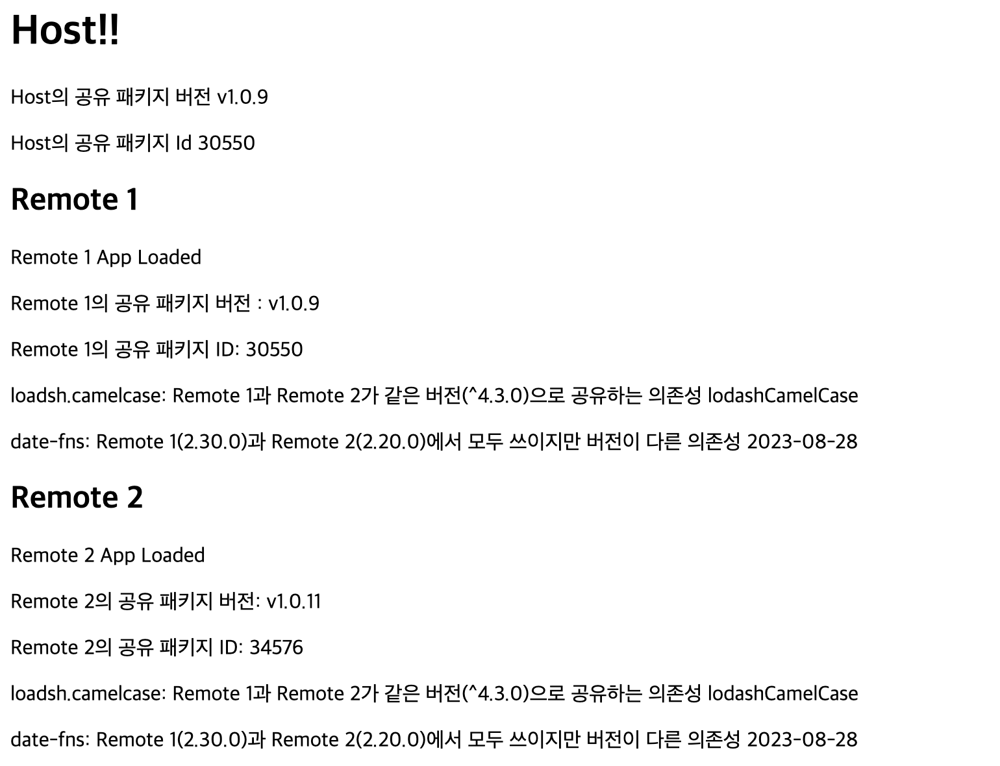
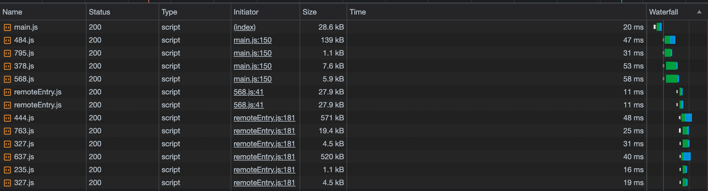
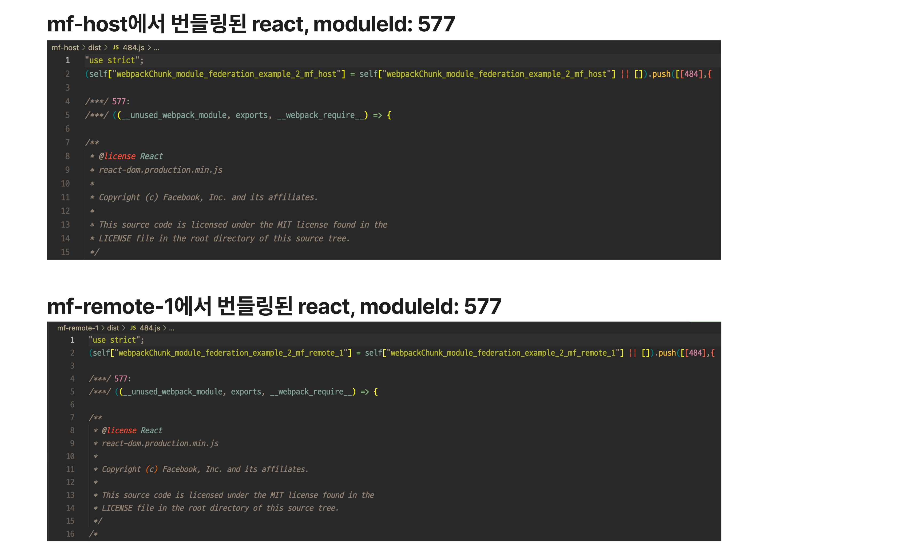
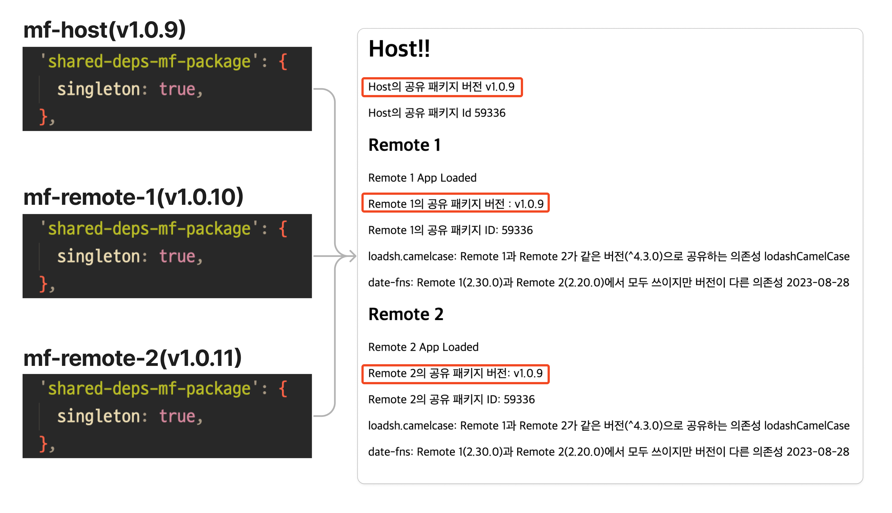

Following on from the last post [where we learned what Module Federation is](/posts/module-federation-concepts), this post will provide an understanding of one of Module Federation's most important features, Shared Dependency, with an example.

## Shared Modules

These are dependency modules that are separated into separate chunks and loaded at runtime in your app. You can specify the name, version, and additional options of the dependency with the shared option of the Webpack Module Federation Plugin. The following code is an [example taken from the webpack docs](https://webpack.js.org/plugins/module-federation-plugin/#additional-examples).

```js
module.exports = {
  plugins: [
    new ModuleFederationPlugin({
      shared: {
        'my-vue': {
          // can be referenced by import "my-vue"
          import: 'vue', // the "vue" package will be used as a provided and fallback module
          shareKey: 'shared-vue', // under this name the shared module will be placed in the share scope
          shareScope: 'default', // share scope with this name will be used
          singleton: true, // only a single version of the shared module is allowed
          strictVersion: true, // don't use shared version when version isn't valid. Singleton or modules without fallback will throw, otherwise fallback is used
          version: '1.2.3', // the version of the shared module
          requiredVersion: '^1.0.0', // the required version of the shared module
        },
      },
    }),
  ],
};
```

Here's how it works, in a nutshell.

1. at build time for the Micro App that is loaded at runtime, we isolate and bundle the shared dependency's module (Webpack Module) into separate chunks.
2. When the Micro App is loaded at runtime, it uses that shared dependency by loading the pre-separated chunk at runtime in the first app that is loaded to use the dependency.
3. The next Micro App that loads, that uses that shared dependency, will not load the shared dependency that was loaded first, but will make the dependency available in the already loaded chunk.
4. If the shared dependency that is loaded first doesn't have the same version and share scope as the dependency that the loaded Micro App defines as being used, the Micro App pulls the bundle for the shared dependency out of its build bundle and writes it.

I see this feature being useful from two perspectives.

1. from an optimization perspective: For dependencies that are heavily used across Micro Apps at runtime, we can load and rewrite them once at runtime, eliminating the need for all Micro Apps to have the dependency at buildtime, and eliminating the need to load the dependency multiple times at runtime.
2. Instance matching perspective: The shared dependencies that will be loaded at runtime in each micro app will fine-tune which instance to reference within the app based on the version and the shared option in the Module Federation Plugin. Because of this, it is possible to have all runtime dependencies in the global app use only one instance, or to have the same dependency have multiple instances depending on the version and options.

## Example overview

Once again, we've prepared an [example](https://github.com/MaxKim-J/module-federation-example-2), and if you open it in your browser, you should see something like this



We have 3 micro apps, and the host app is loading 2 remote apps (remote1, remote2) at runtime. Each app has slightly different shared settings.

There are four dependencies that share, and I'll show you how each of them behaves slightly differently depending on your setup.

- React: This is the shared dependency used by all Micro Apps (host, remote1, remote2), and we've turned on the singleton option to lock the instance to a single version in the global app. Only one instance will exist across the app.
- **`lodash.camelcase`**: A shared dependency used by the remote1, remote2 apps. The version specified in package.json is the same in each app.
- **`date-fns`**: A shared dependency used by remote1 and remote2 apps, with different versions specified in the package.json. (`2.30,0`, `2.20.0`)
- **`shared-deps-mf-package`**: This is a shared dependency used by all Micro Apps, but the versions of host and remote1 used by the runtime are the same (`1.0.9`), and only remote2 has a different version (`1.0.11`).
  - To check the instance aspect in the browser, the implementation of this package has a function to check the version of the package (`getVersion`) and a function to check the instance conformance of the package (`getId`).

Let's take a look at the bundle loading behavior at runtime in our micro app, which looks like this




- Load the entire app entry point chunk: (`main.js`, localhost:3000)
- Load the chunk containing the modules for react that host also uses.(`484.js`, `378.js`)
- Load the chunk containing the `shared-deps-mf-package` module, version 1.0.9, which is also used by host.(`869.js`)
- Load the chunk with the code for the body of the host app (`568.js`)
- Load the remoteEntry entry point chunk for remote1: (`remoteEntry.js`, localhost:3001)
- Load the remoteEntry entry point chunk for remote2:(`remoteEntry.js`, localhost:3002)
- Load the chunk containing the 2.20.0 version of the `date-fns` module used by remote2.(`637.js`)
- Load the chunk containing the `shared-deps-mf-package` module, version 1.0.11, used by remote2.(`235.js`)
- Load the chunk containing the `lodash.camelcase` module used by remote2.(`763.js`)
  - We don't load `react`, which is used by remote2, because it was loaded first when host was loaded.
- Load the chunk with the code for the body of the remote2 app (`327.js`, localhost:3002)
- Load the chunk containing the 2.30.0 version of the `date-fns` module used by remote1 (`444.js`)
- Load the chunk with the code for the body of the remote1 app (`327.js`, localhost:3001)
  - Note that the `lodash.camelcase` used by remote1 is loaded from remote2, and the `react` and `shared-deps-mf-package` modules are not loaded separately from remote1 because they were each loaded first when host was loaded.

Because of the dynamic module loading, not all modules will be loaded in the same order every time, and since we'll be calling the apps on remote1 and remote2 at the same time after host is loaded, the order of the modules required by each app may be out of order.

## Bundling Shared Modules

Let's start by looking at how registering a shared dependency with the Shared option affects the app build.

> Shared modules are modules that are both overridable and provided as overrides to nested containers. They usually point to the same module in each build, e.g., the same library.

Webpack has [the concept of a module](https://webpack.js.org/concepts/modules/).

A module is a part of a web application that consists of multiple files; modules can be not only JS, but also images, CSS, or HTML. When Webpack parses imports during bundling, it first resolves dependencies, and then assembles them into meaningful units called Modules. Modules are identified by an id, and a chunk resulting from bundling can contain multiple modules.


When you set up a shared dependency, the dependency is bundled into a single Module and put inside a Chunk that can be loaded at runtime. The ID of the breakaway Module corresponds 1:1 to the name and version of the corresponding shared Module. This allows other micro-apps to know which Module to look at when fetching a particular dependency at runtime.



The version of a shared dependency will default to the version defined in the package.json in that app. If you look at your Micro App's entry point bundle, you can see which shared dependencies you want to use and in which version.


Interestingly, even if there is no definition of the shared dependency in the package.json, if it is specified in the shared setting, the plugin will resolve the shared dependency and include it in the build output without throwing a build error.

One of the main concepts involved in bundling shared dependencies is "We don't know which microapp will load first. Maybe it will load, maybe it won't." Whether you load a chunk or an app, everything is decided at runtime.

So shared dependency modules aren't even triskeyed: each Micro App will have the entire module in its build output. There's an [issue in webpack](https://github.com/webpack/webpack/discussions/12532) about why we don't plan to support trisketing, and the maintainer's answer is that we don't know what modules and their implementations will be used by the micro apps that will be deployed separately, so how can we trisket them?

As a side note, the Module Federation Plugin doesn't care about naming attributes like id and name of the chunks that shared modules are bundled into, so the chunk names in the build output will be indistinguishable from other code splitting chunks because they have the same naming convention.

I just noticed that in my development environment, chunks with shared modules are named vendor or something, so I thought, "Are chunks with shared modules named separately?" But no.

They are just like regular chunks, so if you set the optimization.splitChunks option, the chunks with shared modules are affected.

## Load Shared Module runtime

Above, we saw how shared dependency modules are included in the build output during the bundling process.

It is up to the runtime of your application to decide which shared dependency modules to use in your Micro App. Depending on the version and preset values, it decides whether to use a module already loaded from another app or pull it out of the same build output.

There are three main variables that determine shared dependency modules at runtime. Let's take a look at them.

### 1. Version as specified in package.json

```js
// No options given
new ModuleFederationPlugin({
  name: 'host',
  ...
  shared: {
    'shared-deps-mf-package': {},
  },
}),


// or something like this
new ModuleFederationPlugin({
  name: 'host',
  ...
  shared: ['shared-deps-mf-package'],
}),
```

If no other options are given, the version of package.json is registered as the version of the shared dependency used by the app. If you use Semver symbols like carrot (`^`) in `package.json`, the highest version that matches the semantic version will be registered.

### 2. Share Scope

The same shared dependency, even if shared with the same version, will use different dependency modules if the [share scope](https://maxkim-j.github.io/posts/module-federation-concepts#share-scope) is different.

The shared scope is the one scope in which the shared dependency is valid. You can specify a specific string with the `shareScope` option in the Module Federation Plugin's settings. If you don't give any option, it uses the default shareScope, `default`.

```js
new ModuleFederationPlugin({
  name: 'host',
  ...
  shared: {
    'shared-deps-mf-package': {
        shareScope: 'default', // default share scope
    },
    'date-fns': {
        shareScope: 'A', // Get shared dependencies from a shared scope named A.
    },
  },
}),
```

### 3. Shared Hint

There are several settings in the Module Federation Plugin's configuration that affect versioning, called Shared Hints in the Webpack Docs. Let's take a look at the three main ones.

- singleton
- requiredVersion
- strictVersion

```js
new ModuleFederationPlugin({
  name: 'host',
    ...
  shared: {
    'shared-deps-mf-package': {
      singleton: true, // the version of the shared dependency module loaded first is
      requiredVersion: '>=1.0.8 <1.0.11', // if not within this semver version range
      strictVersion: true, // raise an error at runtime.
    },
  },
}),
```

To demonstrate the behavior associated with this option, we've dug a branch into the example repository. You can swtich the branch with [`shared-hint-example`](https://github.com/MaxKim-J/module-federation-example-2/tree/shared-hint-example) and take a look.

#### singleton

singleton allows only one version of one of the shared modules inside the share scope: (only loaded once)

When you set the singleton option on a micro app, it will always follow the version of the dependency that was loaded first, and ignore the version of the shared dependency module that the micro app originally tried to use. It will be overwritten.

In our example, host, remote1, and remote2 all have the `shared-deps-mf-package` shared setting of the Micro App set to sigleton, and they all have different versions of package.json (`1.0.9`, `1.0.10`, and `1.0.11`). In the browser runtime, they are all loaded once, with the 1.0.9 version of host loaded first.



#### requiredVersion, strictVersion

This version bumping behavior of singletons can cause problems at runtime.

So we can use the requiredVersion and strictVersion options to actually define a semantic version of the scope of the shared dependency to be used by that Micro App, and have the runtime throw an error when the versions don't match.

If you set requiredVersion to `strictVersion:true`, then if the version of the preloaded dependency is in semver, it will write the instance. If you also specify the `strictVersion:true` option, the runtime will throw a mismatched version error.


If you only use requiredVersion and not strictVersion, the version bump will still happen. The image below is another example.

If we leave requiredVersion on remote1 and remove the singleton setting on remote2, then remote1's package version will be 1.0.9, which is host's, and remote2 will use the 1.0.11 version specified in package.json because it is not a singleton. In app-wide terms, that dependency is loaded twice (`1.0.9`, `1.0.11`).


There's a [good article](https://www.angulararchitects.io/en/aktuelles/getting-out-of-version-mismatch-hell-with-module-federation/) about determining runtime shared module instances. The examples I've described are also taken from that article, so you might want to check it out.

## How to use this in production?

In this section, I'll share some thoughts on what I've learned from running shared dependencies in real apps.

### Managing shared dependencies with multiple versions is difficult without much utility

We've seen some pretty complicated options above, and the reason for all of these options is to allow the browser runtime to specify multiple versions or shared scopes of shared dependencies per app, so that each app can use different dependencies in a safe and optimized way.

To break it down into an example, we want to be able to do the following

- Use Vue in one micro app and React in another micro app and still have it work well at runtime.
- Use version 3.X.X of React Query in some micro-apps and version 4.X.X of React Query in other micro-apps so that new features work well at runtime. And the instance per version is only loaded once throughout the app.

But I don't think this is very useful in production, because there aren't that many libraries that can do this, and I don't think it's as useful as it sounds.

First of all, I don't think there's much reason for teams to have different core library stacks unless there's a special case. I mean, it's not common to use React and Vue or React Query and SWR together in an app. Unless you're integrating a legacy app with a newly built app... with a new app.

Also, setting up shared dependencies is pretty complicated, and managing these individual settings for each app can be difficult and mistake-prone as you have more apps. When developing a single Micro App, you may need to think through scenarios to ensure that a particular app gets its runtime dependencies fed in a timely and optimized manner.

If there is a need for different apps to use different versions of the same dependency, it might be better from a management perspective to just not use a shared configuration and just combine them at build time. The optimization benefits at runtime might not be as great, because you don't have to think about complex rules, and you don't get trisketing when you make it a shared dependency.

### Managing shared dependencies to ensure a single instance across the app is a good idea

On the micro-frontend, where apps are assembled at runtime, such as in Module Federation, deployment and development are eventually separate, but in the browser they are one app. Unlike microservices on the backend, each micro app doesn't run in a completely isolated environment, which is an interesting feature of micro frontends.

If you want all parts of an app to behave consistently, you're going to need to align dependency instances across the app.

This can only be solved by runtime dependency sharing, because if these dependencies are only declared in package.json and only bundled at build time, you'll have independent dependency instances per micro app.

These dependencies can be of the following types

1. libraries that use global variables like var, window, etc.
   - Reassigning variables with let at runtime within the library, using global variables like var. If there are more than one instance, there may be concurrency issues.
2. **Parts of the library related to styles**.
   - If you have multiple instances of a css-in-js library, styling may not work as intended due to issues such as the same style being applied twice.
   - Even if there are no issues at runtime, you may need to align instances of styling-related libraries throughout your app to ensure consistent behavior.
3. Libraries like Context Provider that need to be at the top of your app
   - Only by having a single instance throughout the app will the provider and consumer match and have the intended behavior throughout the app.

So in conclusion, I think this is the way to cover the most cases and reduce the cost when running an app like this.

1. only have the dependencies that need to be the same across the app as shared dependencies and force a single instance of them
2. don't use shared dependencies for all other dependencies, and bundle them at build time.

## Closing thoughts

Setting up shared dependencies in Module Federation can lead to a lot of different cases, depending on the version of your app's package.json and the hints shared, so I initially felt like there was too much to fit into a post, and I spent a fair amount of time refining it. If I have more time, I'd like to write another post analyzing the different cases of dependency sharing.

I'm very worried about whether I've explained it well this time. If you have any clarifications, questions, or feedback, I'd love to hear them in the comments or via email. 🙇
