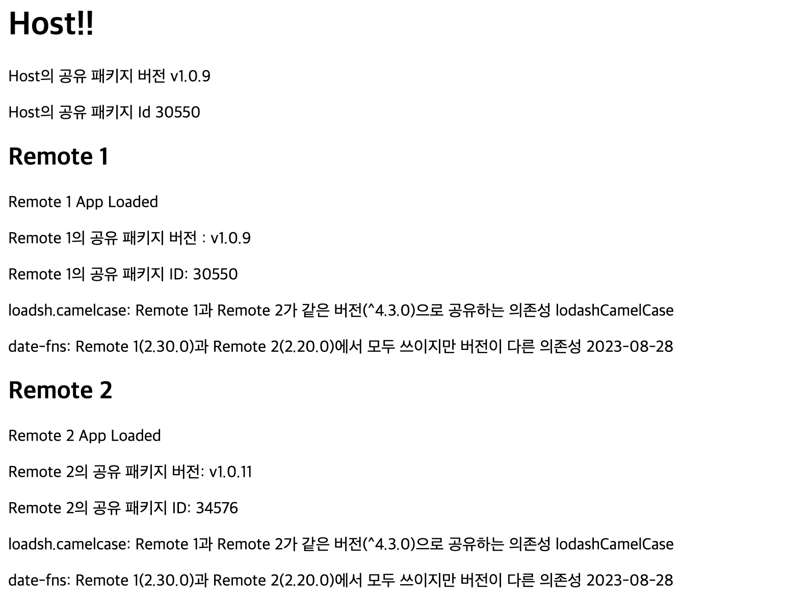
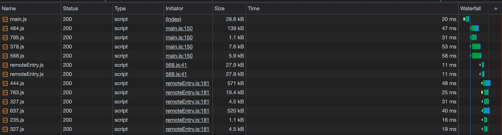
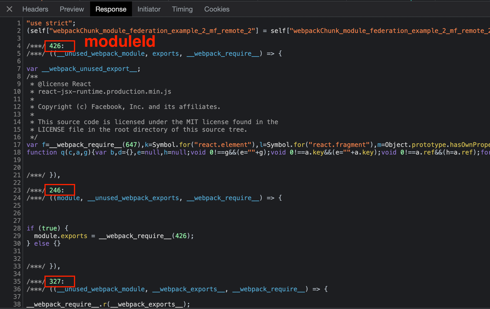
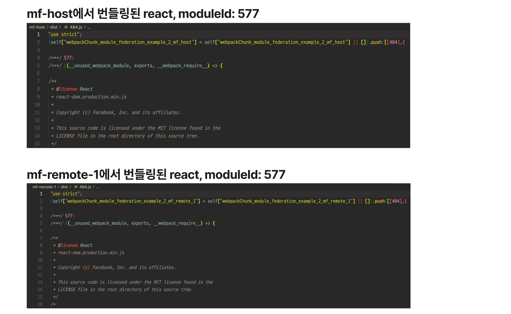
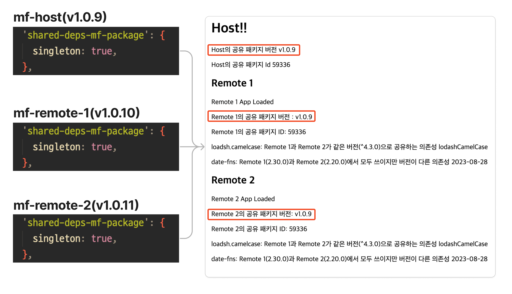
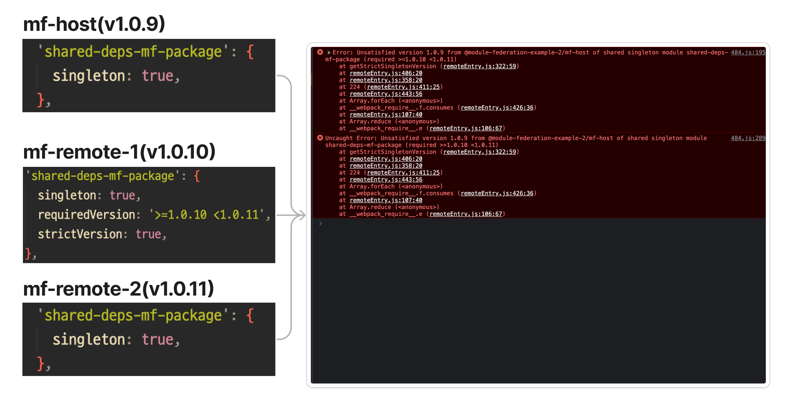
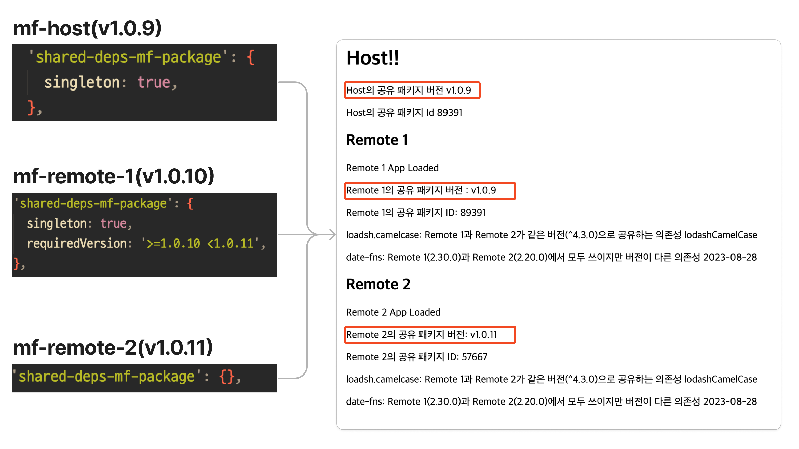

[Module Federation이 무엇인지 알아본 지난번 포스트](/posts/module-federation-concepts)에 이어, 이번에는 Module Federation의 중요한 기능 중에 하나이면서, 난해한 면이 있는 공유 의존성(Shared Dependency)에 대해 예제와 함께 이해해봅니다.

## Shared Modules

별도의 청크로 분리하여 앱의 런타임에 로드해 사용하는 의존성 모듈입니다. Webpack Module Federation Plugin의 shared 옵션으로 해당 의존성의 이름과 버전, 부가적인 옵션 등을 지정 가능합니다. 다음 코드는 [webpack docs에서 가져온 예제](https://webpack.js.org/plugins/module-federation-plugin/#additional-examples)입니다.

```js
module.exports = {
  plugins: [
    new ModuleFederationPlugin({
      shared: {
        'my-vue': {
          // can be referenced by import "my-vue"
          import: 'vue', // the "vue" package will be used as a provided and fallback module
          shareKey: 'shared-vue', // under this name the shared module will be placed in the share scope
          shareScope: 'default', // share scope with this name will be used
          singleton: true, // only a single version of the shared module is allowed
          strictVersion: true, // don't use shared version when version isn't valid. Singleton or modules without fallback will throw, otherwise fallback is used
          version: '1.2.3', // the version of the shared module
          requiredVersion: '^1.0.0', // the required version of the shared module
        },
      },
    }),
  ],
};
```

작동 방식을 좀 더 풀어 설명하자면 이렇습니다.

1. 런타임에 로드되는 Micro App의 빌드타임에 공유 의존성의 모듈(Webpack Module)을 별도 청크로 분리해 번들링합니다.
2. 런타임에서 Micro App이 로드될 때, 해당 공유 의존성을 사용하면서 먼저 로드되는 앱의 런타임에 미리 분리된 청크를 로드해서 의존성을 사용하게 합니다.
3. 이어 로드되는, 해당 공유 의존성을 사용하는 다른 Micro App에서 먼저 불러온 공유 의존성은 따로 로드하지 않고 이미 로드된 청크에서 의존성을 사용할 수 있게 합니다.
4. 만약에 먼저 불러온 공유 의존성이 로드된 Micro App에서 사용한다고 정의한 의존성과 버전, share scope가 일치하지 않는 경우 해당 Micro App은 자신의 빌드 번들에서 공유 의존성에 대한 번들을 꺼내서 씁니다.

이 기능은 크게 2가지 관점에서 효용이 있다고 봅니다.

1. **최적화 관점**: 런타임에서 Micro App간 많이 쓰이는 의존성에 대해 해당 의존성을 런타임에서 한번만 로드하고 돌려쓸 수 있게 되니 모든 마이크로 앱에서 빌드타임에 해당 의존성을 가질 필요가 없어지고, 의존성을 런타임에서 여러번 로드할 필요도 없어집니다.
2. **인스턴스 정합성 관점** : 각 Micro App의 런타임에 불러올 공유 의존성들은 버전과 Module Federation Plugin의 shared 옵션에 따라 앱 내에서 참조할 인스턴스를 섬세하게 지정하게 됩니다. 이 때문에 전역 앱에서 모든 런타임 의존성이 하나의 인스턴스만을 사용하게 하거나, 같은 의존성이라도 버전과 옵션에 따라 여러개 인스턴스를 갖게 하는 것도 가능합니다.

## 예제 오버뷰

이번에도 [예제를 준비했습니다.](https://github.com/MaxKim-J/module-federation-example-2) 예제를 브라우저에 띄우면 이런 화면이 나와요



Micro App은 3개이고, Host앱이 2개의 Remote App(remote1, remote2)을 런타임에 로드하고 있는 구조입니다. 각 앱마다 조금씩 다른 shared 설정을 가지고 있는데요.

공유하는 의존성은 가짓수로 따지면 크게 4개인데, 각각의 의존성들을 통해 설정에 따라 약간씩 다른 작동 방식을 보여드리려 합니다.

- **`React`**: 모든 Micro App(host, remote1, remote2)에서 사용하는 공유 의존성으로, singleton 옵션을 켜서 전역 앱에서 인스턴스를 단일버전으로 고정했습니다. 앱 전역에서 하나의 인스턴스만 존재하게 됩니다.
- **`lodash.camelcase`**: remote1, remote2 App에서 쓰이는 공유 의존성입니다. 각 앱에서 package.json에 명시된 버전이 같습니다.
- **`date-fns`** : remote1, remote2 App에서 쓰이는 공유 의존성인데요, package.json에 명시된 버전이 다릅니다. (`2.30,0`, `2.20.0`)
- **`shared-deps-mf-package`**: 모든 Micro App에서 사용하는 공유 의존성인데 런타임에서 사용하는 host와 remote1의 버전이 같고(`1.0.9`), remote2만 버전이 다릅니다(`1.0.11`)
  - 브라우저에서 인스턴스 양상을 확인하기 위해 이 패키지의 구현체에는 패키지의 버전을 확인하는 함수(`getVersion`), 패키지의 인스턴스 정합성을 확인하는 함수(`getId`)가 있습니다.

요 마이크로 앱에서도 런타임에서의 번들 로드 양상을 한번 보고 가겠습니다. 다음 그림과 같습니다.




- 전체 앱 진입점 청크를 로드합니다. (`main.js`, localhost:3000)
- host에서도 사용하는 react에 대한 모듈이 담긴 청크를 로드합니다.(`484.js`, `378.js`)
- host에서 사용하는 1.0.9 버전의 `shared-deps-mf-package` 모듈이 담긴 청크를 로드합니다.(`869.js`)
- host 앱 본문에 해당하는 코드를 가진 청크를 로드합니다(`568.js`)
- remote1의 remoteEntry 진입점 청크를 로드합니다.(`remoteEntry.js`, localhost:3001)
- remote2의 remoteEntry 진입점 청크를 로드합니다.(`remoteEntry.js`, localhost:3002)
- remote2에서 사용하는 2.20.0 버전의 `date-fns` 모듈이 담긴 청크를 로드합니다.(`637.js`)
- remote2에서 사용하는 1.0.11 버전의 `shared-deps-mf-package` 모듈이 담긴 청크를 로드합니다.(`235.js`)
- remote2에서 사용하는 `lodash.camelcase` 모듈을 포함한 청크를 로드합니다.(`763.js`)
  - remote2에서 사용하는 `react` 는 host가 로드되었을 때 먼저 로드되었으니 remote2에서는 로드하지 않습니다.
- remote2 앱 본문에 해당하는 코드를 가진 청크를 로드합니다(`327.js`, localhost:3002)
- remote1에서 사용하는 2.30.0 버전의 `date-fns` 모듈이 담긴 청크를 로드합니다.(`444.js`)
- remote1 앱 본문에 해당하는 코드를 가진 청크를 로드합니다(`327.js`, localhost:3001)
  - remote1에서 사용하는 `lodash.camelcase` 는 remote2에서, `react`와 `shared-deps-mf-package` 모듈은 각각 host가 로드되었을 때 먼저 로드되었으니 remote1에서는 따로 로드하지 않습니다.

아무래도 동적 모듈 로드이다 보니 모든 로드 순서가 매번 같지는 않고, host 로드 이후 remote1과 remote2에 해당하는 앱을 동시에 부르니 각 앱에 필요한 모듈들의 로드 순서는 엎치락 뒤치락일 수도 있다는 것을 감안해주시면 좋습니다.

## Shared Module 번들링

Shared 옵션에서 공유 의존성을 등록하면, 앱 빌드에 어떤 영향을 미치는지부터 보겠습니다.

> Shared modules are modules that are both overridable and provided as overrides to nested containers. They usually point to the same module in each build, e.g., the same library.

Webpack에는 [Module이라는 개념](https://webpack.js.org/concepts/modules/)이 있습니다.

Module은 여러개의 파일로 구성된 웹 애플리케이션의 한 부분으로, JS뿐 아니라 이미지, CSS나 HTML도 모듈이 될 수 있습니다. Webpack은 번들링 과정에서 import문을 파싱하면서 의존성(dependency)을 먼저 리졸브하고, 해당 의존성들을 의미있는 단위로 모아다가 Module로 만듭니다. Module은 id로 식별되고, 번들링 결과물인 chunk에는 여러개의 Module이 들어갈 수 있습니다.



공유 의존성을 설정했다면, 의존성이 하나의 Module로 번들링되어서 런타임에 로드할 수 있는 Chunk안에 들어갑니다. 이때 분리되는 Module의 ID는 해당 Shared Module의 이름과 버전에 1:1로 대응됩니다. 이것 덕분에 다른 마이크로 앱에서도 특정 의존성을 런타임에서 가져올 때 어떤 Module을 봐라봐야 하는지 알 수 있게 됩니다.



공유 의존성의 버전은 해당 앱에서 package.json에 정의된 버전을 기본적으로 따라갑니다. Micro App의 진입점 번들을 보면, 어떤 공유 의존성을 어떤 버전으로 사용하려 하는지 확인할 수 있습니다.


신기한 것은, package.json에 공유 의존성에 대한 정의가 없어도 shared 설정에 명시되어 있다면 빌드 에러를 내지 않고 해당 공유 의존성을 플러그인에서 리졸브해 빌드 결과물에 포함시킨다는 것입니다.

공유 의존성 번들링에 관여하는 주요한 컨셉 중 하나는 "어떤 마이크로 앱이 먼저 로드될지 모른다. 로드 될지 안 될지도 모른다."는 것입니다. 청크를 로드하든 앱을 로드하든 모든 것이 런타임에 결정되니까요.

그래서 공유 의존성 모듈은 트리쉐이킹도 안 됩니다. 각 Micro App은 모듈 전체를 빌드 결과물에 가지고 있게 됩니다. 트리쉐이킹 지원할 계획이 없느냐는 [webpack의 이슈](https://github.com/webpack/webpack/discussions/12532)에, 개별 분리 배포될 Micro App에서 사용할 모듈과 모듈의 구현체가 뭔지 모르는데 어떻게 트리쉐이킹 하겠냐는 취지의 메인테이너의 답이 달려있습니다.

곁다리로 알면 좋은 사실 한 가지로, Module Federation Plugin은 shared 모듈이 번들링되는 청크의 id, name과 같은 네이밍 속성에 관여하지 않습니다. 따라서 빌드 결과물의 청크 이름은 다른 Code Splitting으로 발생한 청크들과 명명 규칙이 같아서 빌드 결과물 이름만 봐서는 구분이 안됩니다.

저는 막 개발 환경에서 shared 모듈이 들어간 chunk 이름에 vendor 이런거 붙길래 뭔가 shared 모듈이 포함된 청크들은 따로 명명되는건가? 했는데 아니었습니다.

일반적인 청크들과 똑같기 때문에 optimization.splitChunks 옵션을 설정했다면 shared module이 포함된 청크들도 영향을 받습니다.

## Shared Module 런타임 로드

위에서 번들 과정에서 공유 의존성 모듈이 어떻게 빌드 결과물에 포함되는지 알아봤습니다.

Micro App에서 어떤 공유 의존성 모듈을 쓸지는 애플리케이션의 런타임에 결정됩니다. 버전과 미리 설정놓은 값에 따라 다른 앱에서 이미 로드된 모듈을 사용할 것인지, 같은 빌드 결과물에서 꺼내 쓸지를 결정합니다.

런타임에 공유 의존성 모듈을 결정하는 변수는 크게 3개입니다. 살펴보도록 하겠습니다.

### 1. package.json에 명시된 버전

```js
// 따로 옵션을 주지 않음
new ModuleFederationPlugin({
  name: 'host',
  ...
  shared: {
    'shared-deps-mf-package': {},
  },
}),


// 이런 형태도 가능
new ModuleFederationPlugin({
  name: 'host',
  ...
  shared: ['shared-deps-mf-package'],
}),
```

따로 옵션을 주지 않으면 package.json의 버전이 앱에서 사용하는 공유 의존성의 버전으로 등록 됩니다. 이때 `package.json`에 carrot(`^`) 과 같은 Semver 기호를 사용했을 때는, 해당 시맨틱 버전에 맞는 가장 높은 버전이 등록됩니다.

### 2. Share Scope

같은 공유 의존성, 같은 버전으로 공유하더라도 [share scope](https://maxkim-j.github.io/posts/module-federation-concepts#share-scope)가 다르면 다른 의존성 모듈을 사용합니다.

shared scope는 공유 의존성이 유효한 하나의 scope입니다. Module Federation Plugin의 설정값에 `shareScope` 옵션으로 특정 문자열을 명시할 수 있습니다. 아무 옵션을 주지 않는 경우 기본 shareScope인 `default`를 사용합니다.

```js
new ModuleFederationPlugin({
  name: 'host',
  ...
  shared: {
    'shared-deps-mf-package': {
        shareScope: 'default', // 기본 share scope
    },
    'date-fns': {
        shareScope: 'A', // A라는 shared scope에서 공유 의존성을 받아옵니다.
    },
  },
}),
```

### 3. Shared Hint

Module Federation Plugin의 설정에 여러 설정값을 넣을 수 있는데요. 버전 결정에 미치는 설정들을 Webpack Docs에서는 Shared Hint라고 합니다. 주요한 설정 3개를 살펴보겠습니다.

- singleton
- requiredVersion
- strictVersion

```js
new ModuleFederationPlugin({
  name: 'host',
    ...
  shared: {
    'shared-deps-mf-package': {
      singleton: true, // 먼저 로드된 공유 의존성 모듈의 버전이
      requiredVersion: '>=1.0.8 <1.0.11', // 이 semver 버전 범위 안에 들어오지 않으면
      strictVersion: true, // 런타임에서 에러를 낸다.
    },
  },
}),
```

이 옵션과 관련된 동작을 보여드리려고 예제 레포지토리에 브랜치를 파놨습니다. [`shared-hint-example`](https://github.com/MaxKim-J/module-federation-example-2/tree/shared-hint-example) 로 브랜치를 swtich해서 살펴보시면 좋습니다.

#### singleton

singleton은 share scope 내부의 공유 모듈 중 하나의 버전만을 허용합니다. (only loaded once)

Micro App에 singleton 옵션을 설정하면 무조건 먼저 로드된 의존성의 버전을 따라가고, 원래 Micro App이 쓰려고 했던 공유 의존성 모듈의 버전은 무시됩니다. 덮어 씌워지는 것이죠.

예제에서는 host, remote1, remote2 모든 Micro App의 `shared-deps-mf-package` shared 설정이 모두 sigleton으로 되어 있고, package.json의 버전은 각각 다 다릅니다.(`1.0.9`, `1.0.10`, `1.0.11`) 브라우저 런타임에서는 모두 가장 먼저 로드된 host의 1.0.9 버전으로 해당 공유 의존성은 한 번만 로드됩니다.



#### requiredVersion, strictVersion

이러한 singleton의 버전 올려치기 동작은 런타임에 문제를 일으킬 수 있습니다.

그래서 requiredVersion과 strictVersion 옵션을 사용해 실질적으로 해당 Micro App에서 사용할 공유 의존성의 범위를 시맨틱 버전으로 정의하고, 버전이 맞지 않을 때 런타임에서 에러가 나게 만들 수 있습니다.

만약에 requiredVersion을 다음과 같이 설정하면 미리 로드되어 있는 의존성의 버전이 semver에 해당되면 그 인스턴스를 쓰게 됩니다. 거기에 `strictVersion:true` 옵션까지 지정해주면 런타임에서 버전이 맞지 않다는 에러를 내게 됩니다.



requiredVersion만 쓰고 strictVersion을 쓰지 않는다면 버전 올려치기는 그대로 일어납니다. 아래 이미지는 또 다른 예시인데요.

remote1에 requiredVersion을 두고, remote2는 singleton 설정은 없앴습니다. 그러면 remote1의 패키지 버전은 host의 그것인 1.0.9가 되고, remote2는 singleton이 아니니 package.json에 명시된 1.0.11 버전을 씁니다. 앱 전체로 따지면 해당 의존성은 2번(`1.0.9`, `1.0.11`) 로드되는 거죠.



런타임 공유 모듈 인스턴스 결정에 대해 [잘 정리된 글](https://www.angulararchitects.io/en/aktuelles/getting-out-of-version-mismatch-hell-with-module-federation/)이 있습니다. 제가 설명드린 예제도 이 글에 있는 케이스를 일부 가져왔는데요. 이걸 참고해보셔도 좋을 것 같습니다.

## 실제 운영환경에서는 어떻게 쓰는게 좋을까?

이 섹션에서는 실제 앱에서 공유 의존성을 운영해보면 느낀 점을 사견을 담아 말씀드리려 합니다.

### 다양한 버전을 갖는 공유 의존성 관리는 효용이 크지 않고 어렵다

위에서 꽤나 복잡한 옵션을 살펴봤는데, 이렇게 옵션이 다양한 이유는 브라우저 런타임에 앱 마다 여러개인 공유 의존성의 버전 혹은 공유 스코프를 지정하여 각 앱마다 안전하고 최적화가 되는 형태로 각각 다른 의존성을 사용하게 하기 위해서입니다.

예시로 풀어 설명하면 다음과 같은걸 할 수 있게 하려고 하는 것입니다.

- 어떤 Micro App에서는 Vue를 쓰고, 다른 Micro App에서는 React를 써도 런타임에 잘 돌아간다.
- 어떤 Micro App에서는 React Query의 3.X.X 버전을 쓰고, 다른 Micro App에서는 React Query의 4.X.X 버전을 써서 신기능을 사용해도 런타임에 잘 돌아간다. 그리고 버전 당 인스턴스는 앱 전체에서 한번씩만 로드된다.

그런데 저는 이게 실제 운영 환경에서 효용이 그렇게 높지 않다고 생각합니다. 이렇게 쓸 수 있는 라이브러리가 그리 많지 않고 생각보다 효용이 크지도 않다고 생각하기 때문인데요.

일단 팀마다 코어 라이브러리 스택을 다르게 가져갈 이유가 특수한 경우가 아니면 별로 없다고 생각합니다. React랑 Vue를, 혹은 React Query와 SWR을 앱에서 같이 쓰는 일이 흔하진 않다는 말입니다. 레거시 앱을 새롭게 만들어진 앱과 통합한다거나... 하는 경우를 제외하고요.

또한 공유 의존성 설정은 꽤나 복잡한데, 앱마다 이러한 개별적인 설정을 관리하는 것은 앱이 많아질수록 어렵고 실수가 생기기 쉬운 지점일 수 있습니다. 하나의 Micro App을 개발할 때 특정 앱이 런타임 의존성을 제때 최적화된 형태로 공급받기 위한 시나리오를 생각해야 할 수도 있고요.

만약에 앱 간 같은 의존성이라도 다른 버전을 사용하고 싶은 니즈가 있다면 그냥 shared 설정을 쓰지 않고 빌드타임에 합쳐버리는 방식으로 운영하는 것이 관리 면에서는 더 나을수도 있습니다. 복잡한 규칙을 생각할 필요가 없으니까요. 공유 의존성으로 지정하면 트리쉐이킹도 안 되니 런타임에서의 최적화 이점도 그렇게 크지는 않을 수 있습니다.

### 앱 전역에서 단일 인스턴스를 보장하기 위한 공유 의존성 관리는 효용이 크다

Module Federation등 런타임에서 앱이 합체되는 마이크로 프론트엔드에서는 배포와 개발은 결국 따로 하지만, 브라우저에서는 하나의 앱입니다. 백엔드의 마이크로서비스와는 다르게 완전 격리된 환경에서 각각의 Micro App이 구동되는게 아닙니다. 이게 마이크로 프론트엔드만의 흥미로운 특징이기도 하죠.

하나의 앱의 모든 부분이 일관된 동작을 하도록 하려면 앱 전역에서 의존성 인스턴스를 딱 하나로만 맞춰줘야 하는 경우가 생깁니다.

이러한 의존성이 package.json에만 선언되어 빌드타임에 번들에만 합쳐지면 Micro App당 독립된 의존성 인스턴스를 갖기 때문에, 런타임 의존성 공유를 통해서만 이 문제를 해결할 수 있습니다.

이러한 의존성의 유형은 다음과 같습니다.

1. **var, window와 같은 전역 변수를 사용하는 라이브러리**
   - 라이브러리 내에서 런타임에 let으로 변수 재할당, var과 같은 전역변수를 사용하는 경우. 인스턴스가 2개 이상이면 동시성 이슈가 있을 수 있습니다.
2. **스타일과 관련된 라이브러리 일부**
   - css-in-js 라이브러리의 인스턴스가 여러개라면, 같은 스타일이 두 번 적용된다거나 하는 문제 때문에 스타일링이 의도대로 되지 않을 수 있습니다.
   - 런타임에 문제가 없더라도, 앱의 일관된 동작을 보장하기 위해 스타일 관련한 라이브러리의 인스턴스를 앱 전체에서 하나로 맞춰야할 수도 있습니다.
3. **앱 최상위에 Context Provider등을 두고 써야 하는 라이브러리**
   - 앱 전역에서 인스턴스가 하나여야만, provider와 consumer의 정합성이 맞고 앱 전체에서 의도된 동작을 할 것입니다.

그래서 결론적으로는요, 다음과 같이 앱을 운영할때 가장 많은 케이스를 커버하면서 비용도 줄일 수 있는 방법이라고 생각합니다.

1. 앱 전역에서 하나여야만 하는 의존성만 공유 의존성으로 두고 단일 인스턴스 강제하기
2. 이외 다른 모든 의존성들은 공유 의존성을 사용하지 않고, 빌드타임에 번들에 포함시키기

## 맺는 말

Module Federation의 공유 의존성 설정은 앱의 package.json의 버전과 shared hint에 따라 정말 다양한 케이스가 나올 수 있습니다. 그래서 처음엔 포스트에 들어갈 내용이 너무 많아서 혼란스럽더라고요. 내용을 정제하는데 적지 않은 시간을 썼습니다. 시간이 나면 의존성 공유의 여러 케이스를 분석해보는 글을 하나 더 써보고 싶네요.

이번에도 잘 설명했는지 걱정이 많이 됩니다. 잘 이해되지 않으시는 부분, 질문, 피드백이 있으시다면 댓글이나 이메일로 보내주시면 감사하겠습니다. 🙇
