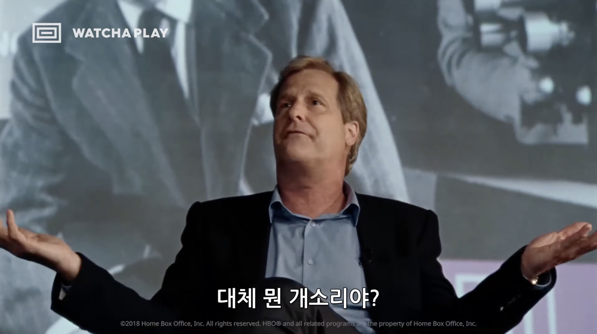

대학 학부 다닐 때 쯤에는 기자가 꿈이어서 2015년에 미드 "뉴스룸"을 정말 감명깊게 보았다. 10년이 지나 쿠팡플레이에서 시즌 1을 다시 보았을 때 생기는 감상이 있어서 간단히 기록해보려 한다.

레거시 미디어 언론이 광고주와 시청률, 모회사의 정치적 노선, 어그로와 선정성에 부역하지 않고 "유권자에게 올바른 정보를 주지 않고 가치가 없으면 뉴스를 하지 않겠다." 주장하고 이를 행한다는 것이 지금 보니까 용만 안 나왔지 거의 왕좌의 게임 수준의 하이판타지다.

처음 봤을 때도 현실적이지 않다고 대충 생각했지만 그때의 나는 꽤나 좌파여서 아 그럼에도 불구하고 이렇게 되면 좋겠다. 이렇게 될 수 있지 않을까? 생각했던 것 같다. 10년동안 영합적이고 선동적이며 선정적인 면을 가리지 않고 보여준 레거시와 뉴미디어 덕분에 이전의 희망 같은 건 잘 생각나지 않게 되었다.

약간의 스포일러가 있을 것이다. 그러니 이 작품은 결과보다 과정이 중요하고 줄거리를 알든 모르든 작품이 주는 감상이 악화되지 않을 것이라는 개인적인 생각이 있다.

## S1 EP2

> Bias towards fairness means that if the entire congressional Republican caucus were to walk in to the House and propose a resolution stating that the Earth was flat, the Times would lead with "Democrats and Republicans Can't Agree on Shape of Earth."

윌 맥어보이는 뉴스가 "공정성에 편향" 될 수 있다는 주장에 "공화당이 지구는 평평하다라고 성명을 내면 타임지는 민주당과 공화당이 지구 모양도 합의를 못 한다고 보도한다." 라는 찰진 예시를 든다. 현상의 가장 논쟁적인 부분만을 좇다 보면 타당한 관점이 여러개가 생기는 것처럼 보이지만, 사실 귀기울여 들을 말은 아니고, 몹시 간단한 사실이나 관점 하나만이 중요한 경우가 있다.

니체가 말한 [관점주의](https://www.webzineriks.or.kr/post/%EA%B4%80%EC%A0%90%EC%A3%BC%EC%9D%98%EC%97%90-%EA%B4%80%ED%95%98%EC%97%AC---%EA%B9%80%EB%8F%99%EA%B7%9C)에서는 모든 진리나 인식은 특정한 관점, 즉 주체의 위치와 조건에 따라 다르게 드러난다. 하지만 언론은 진리를 밝히고자 하는 것이 아니라 세상에 주목받아야할 관점과 이야기를 드러내는데 존재 가치가 있다. 독립언론 편집장을 할 때, 양쪽 입장에 지면을 동등하게 할당해야만 언론이 공정함을 다 한 것이라고 주장하는 독자도 있었다. 가당치도 않은 말이고 결국 보도란 언론이 가장 중요하다고 여기는 관점으로 행해지므로 어떤 식으로든 편을 들게 되어있다. 언론을 두고 "진보", "보수"라 말하는 이유일 것이다.

## S1 EP6

> There are people who look just like me, thousands and thousands, who died for the freedom to define their own lives, for themselves. How dare you presume to decide what I should think is important?

윌 맥어보이는 대통령 선거 공화당 경선 후보였던 [릭 센토럼](https://www.britannica.com/biography/Rick-Santorum) 전 상원 의원의 흑인 보좌관 서턴 월과 인터뷰한다. 그는 흑인이며 게이이지만 공화당 극보수 인사이며 인종과 동성애에 대한 혐오 발언을 남발하는 센토럼을 지지한다. 그는 인터뷰에서 "센토럼 의원이 태아를 낙태할 권리에 강하게 반대하기 때문에" 지지한다고 말하고, 맥어보이는 "센토럼 의원의 결혼생활이 어떻게 동성 결혼에 의해 위협을 당하는 것인지 이해가 안 된다.", "어떻게 자신을 열등(inferior)하다고 생각하는 후보 밑에서 일할 수 있느냐"고 공격한다.

월의 상황은 사뭇 합리적이지는 않고 그것이 맥어보이로 하여금 의문의 찬 공격을 할 빌미를 제공했다. 계속해서 심기를 건드는 맥어보이에게 월은 피부색과 성적 지향으로만 자신을 판단하지 말라고 말하며 "저와 같은 외모를 가진 사람 수 천명이 자신의 삶의 방향을 스스로 결정하기 위해 죽었는데, 당신이 누구길래 내 가치관을 결정합니까?" 라고 분노에 차 일갈한다.

학생 사회에 참여하면서 만난 사람들 중에는 정치적 입장이 그 사람이 살아온 궤적이나 또 다르게 가지고 있는 정치적 입장과 모순되었다고 생각하는 경우가 많았다. 그때라면 유색인종 여성과 결혼한 레즈비언인 [앨리스 바이델](https://fortune.com/europe/2025/02/24/west-german-openly-gay-woman-alice-weidel-lead-germany-far-right-afd/)이 독일 우익 정당(AfD, 독일을 위한 대안)의 당수인게 너무 이상해서 견디지 못했을 거다.

이게 좌파 대학생 특이긴 할 텐데, 그런 사람을 이해하지 못하고 싸우거나 멀어지는 경우도 왕왕 있었다. 하지만 수 년이 지나서 나도 인간 정치 짬뽕이 되었다. 나는 노동자의 권리를 옹호하고중대재해법 시위에 참여한 적도 있지만 스타트업에서 목표를 성취하기 위해 고통을 받으며 열심히 일해야 한다고 말했다가 X에서 비난을 받았다. 이런 일에서 인간이 모순을 해결하는 존재라기 보다는 감당하고 살아가는 존재라는 것을 인식하게 된다. 그런 모순적인 인간들이 모인 조직에서 의사 결정을 하고 어딘가에서 어딘가로 가야 한다. 타협과 이해가 없이는 힘든 일이다.

그러나 인간관과 상관없이, 앞에 말했듯 보도란 언론이 가장 중요하다고 여기는 관점으로 행해지므로, 그 관점에서 어떤 인간 입장의 모순은 공격받기 쉽고 취약한 것이 되기 마련이다.

## S1 EP7

> Captain, my name is Don Keefer. That's Elliot Hirsch and that's Sloan Sabbith. We work for Atlantis Cable News. And we wanted you and your first officer and Flight Attendant Crazy Lady to be the first ones on this plane to know that our armed forces killed Osama bin Laden for you tonight.

10년 동안 "뉴스룸" 하면 이 에피소드가 가장 먼저 생각났다. 맥어보이와 그의 팀이 9.11 테러의 주범인 빈 라덴을 미 특수부대가 사살했다는 소식을 보도하는 내용이다. 보도 전에 정보를 입수한 팀은 그러한 사실을 우연한 계기에 의해 비행기 기장, 경찰, 이전에 군에 복무했던 사람에게 알리게 되고 그들이 기뻐하는 것을 보게 된다.

과거를 생각하면 이 에피소드는 언론인이 되고 싶어하는 학생의 뽕을 극대화하는 효과가 있었다. 나도 저렇게 사람들이 좋아할만한 소식을 먼저 보도하여 사회에 기여하고 그들의 기쁜 모습을 볼 수 있다면 바랄게 없겠다 하는 생각이었겠지.

지금 다시 보니 "좋은 소식 전하기"는 언론의 역할에서 아주 일부의 일부의 일부만을 차지함에도 언론인이 되고 싶었기 때문에 너무 긍정적으로 인식한 것 같다. 생각해보면 "내가 전하는 소식이 사람들을 행복하게 했으면 좋겠다" 라는 말은 언론인이 되고자 하는 사람이 아니라, 요리사가 되고 싶은 사람에게 더 어울린다. "내가 만드는 음식이 사람들을 행복하게 했으면 좋겠다"는 자연스럽다.

내가 경험하고 배웠던 인식 안에서는 언론인은 무조건 욕먹고, 내가 의도 했든 안 했든 사람들 욕하고 불편하게 하는 직업이다. 그러면서 성취할 수 있는 지점이 중요하기 때문에 감수할 수 있어야 한다. 사실 이 드라마에서도 그런 장면이 훨씬 더 많이 나온다.

## S1 EP8, EP9

> Any candidate who can handle a cross is going to find himself at the top of the polls in the morning.

윌 맥어보이와 그의 팀이 원하는 포맷으로 대통령 선거 공화당 경선 후보 토론회를 진행시키기 위해, 선정적이지 않고 질 높은 보도로 인해 역설적으로는 떨어진 시청률을 만회해야 했다. 내키지 않지만 방송사를 소유한 모회사의 요구로 선정적인 보도를 해야만 했다. 더욱 원하는 것을 얻기 위해 비교적 소중하지만 작은 것을 희생시키는 상황에 현실 직장인의 입장을 이입해서 보게 되더라.

그런데 결국 토론 포맷 시연을 본 공화당 관계자들은 기겁하며 다른 방송사로 간다. 팀이 제안한 토론 포맷은 경선 후보들의 발언 하나 하나를 여러 차원에서 검증하며 요컨대 "헛소리를 허락하지 않는" 토론 포맷이었다. 맥어보이의 친구인 공화당 관계자는 "저런 토론에서 살아남은 사람은 다음날 바로 지지율 1위가 될 것이다." 라고 말할 정도의 혹독한 형식이었다.

결국 방송사를 옮긴 토론회에서 사회자는 [미셸 바크먼](https://www.britannica.com/biography/Michele-Bachmann) 하원의원에게 "엘비스 프레슬리랑 조니 캐쉬가 중에 누가 더 좋냐"는 질문을 한다. 토론회에서 이런 질문이 늘어날수록 정작 그녀의 발언인 "신이 대선에 출마하라고 했다."와 같이 그녀가 후보 자격이 있고 어떤 생각을 하는 사람인지 파악할 수 있는 질문들은 할 수 없게 될 것이다.

이러한 이야기 구조가 갖는 논리가 지금의 나에게도 잘 설득이 된다. 선거에 출마하는 후보자들이 해 온 헛소리를 검증하지 못 하는 것은 유권자들에게 사회적 비용을 지불하게 한다. 검증의 시간이 돌아왔을 때 정치인들은 상대방의 저열한 정치 공격이라고 말하며 얼버무리는 일이 많고 흠집 없는 무결한 상태를 유지하려고 애쓰는 것처럼 보인다. 그러나 예리하고 할 만한 질문에서 피하지 않고 살아남았을 때 유권자들은 더 좋은 공직자들을 알아볼 수 있게 될 것이다.

하지만 이상적이라서 판타지에 가깝다는 생각이 드는 드라마에서도 좌절되었는데, 현실에서 더 기대할 수 있는 바는 부족할 것이다.
