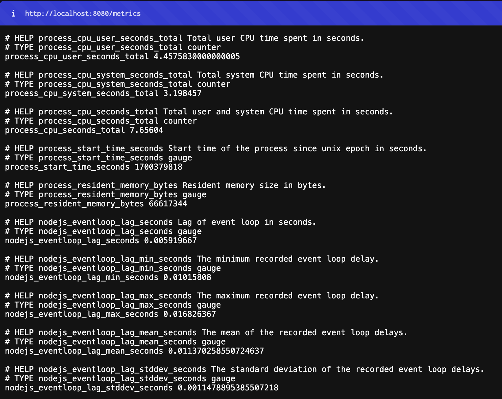
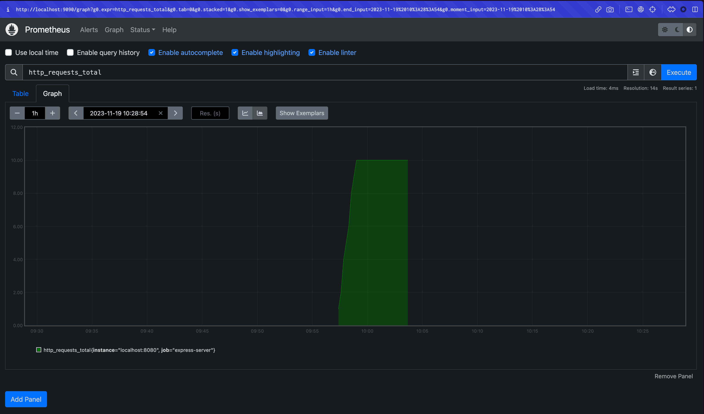

One of my primary responsibilities these days is troubleshooting operational issues on servers that serve web client resources.

Sometimes the cause of these issues is in the server application, but sometimes it's not until you get down to the infrastructure layer that the server floats on. This is the first time in my career as a web front-end developer that I've been tasked with something closer to the so-called devops, infrastructure realm.

I started out horribly clueless, and with the help of my coworkers and being bombarded with issues, I'm starting to feel like, "Oh, I know something. I feel like I know a little bit about something now," and then I feel like I still don't know anything and I feel like I still don't know anything.

Today's post is about monitoring, one of the key pillars of identifying the causes or signs of server operational issues. I'm going to summarize what I've learned and understood about server monitoring metrics in Nodejs.

# Before we get started.

## Disclaimer

- My primary audience for this post is web front-end developers who want to learn about running and monitoring Nodejs servers that serve web client resources.
- I'm a developer who has mostly worked on web client development, and for many years of my career I had no knowledge of server monitoring, but then I started learning because my job required it. Depending on your work environment, this may be something you don't need to know.
- I've leaned on references, but there are some things I've picked up along the way, and some arbitrary categorizations and descriptions, so please point out if anything is wrong or inappropriate.

## Web Frontend Developers and Server Monitoring

Web front-end developers and server monitoring may not seem to have much to do with each other.

After the days of SPAs, web front-ends are often implemented in a way that makes static files evaluate in the browser, and the storage that hosts the resources is the server. AWS provides metrics for storage services like S3, but since they don't pull resources as often or as heavily as backend servers [unless there's a lot of traffic](https://maxkim-j.github.io/posts/frontend-infrastructure#%EC%95%88%EC%A0%95%EC%A0%81%EC%9C%BC%EB%A1%9C-%EC%84%9C%EB%B9%99%ED%95%98%EA%B8%B0), failure or availability issues are not as common.

However, there have been attempts to improve performance and troubleshoot web front-end issues by utilizing the server's resources, such as SSR, ISR, and more recently RSC. SSR has become a near-common practice for web front-end applications, with frameworks like Nextjs gaining traction.

This trend has resulted in web client development naturally weaving in and out of the server, leaving web front-end developers with no freedom from the operational responsibilities of the server.

The act of evaluating React code in a nodejs environment to get rendering results can be quite CPU-intensive logic.](https://seokjun.kim/react-ssr-the-record-of-pain/) RSCs frequently send requests to the server every time a user uses the web, and the responses redraw the screen, so the server's CPU is heavily involved.](https://www.linkedin.com/pulse/leap-forward-web-development-react-server-components-sens-vn/) More recently, web client developers have been implementing BFFs with Nodejs servers, taking on responsibility for the layer that integrates complex and diverse API calls.

So, now even people who are web front-end developers should be monitoring servers **if they need to**. Although I don't think they should have to learn it until they need to.

I'm thinking of myself as an engineer who creates "software/systems that serve resources interpretable by browsers" rather than someone who draws and creates the UI of a web app, so I should be interested and capable of running the system.

## What is a server failure?

I think there are two main types of server failures.

1. fails to respond to requests smoothly and within the expected time frame
   1. excessive traffic, high CPU usage, slow response (request latency), frequent timeouts, etc.
   2. incorrect responses (5xx) due to incorrect logic at the server end, problems at the infrastructure end, etc.
2. the server (process) dies
   1. Nodejs Heap Out of Memory (OOM)
   2. server restart (due to infrastructure, etc.) causes unresponsiveness, resulting in a breaking point

It's not as cut-and-dried as it sounds: if the server can't handle the traffic, response delays, timeouts, OOM, and even process termination can all happen, depending on your infrastructure.

## Why server monitoring is important

Regular server monitoring is essential for production environments, and we believe it has the following value and implications

1. Identify peak traffic patterns: Depending on the nature of your service, you can identify peak traffic patterns and the expected values of server resource (CPU, memory) usage at that time. Based on the traffic pattern, you can already have information about when resource metrics will peak and what the peak values will be.
2. Identify signs of failure: If you know which monitoring metrics are considered normal, you can recognize when your regular monitoring shows metrics that don't match the pattern and take appropriate action, such as restarting or increasing instances.
3. Debugging: If your server fails, you can use monitoring metrics to determine the cause of the failure by looking at metrics such as resource usage, request volume, and time to response at the time of the failure.

# Explore your monitoring environment/metrics

Now let's start exploring the monitoring environment and metrics of the Nodejs server we set up earlier.

## Set up the monitoring environment (Prometheus)

[see code example](https://github.com/MaxKim-J/nodejs-server-monitoring-example)

As a monitoring tool, we use [prometheus](https://prometheus.io/). The `collectDefaultMetrics` function provided by [prom-client](https://github.com/siimon/prom-client), the nodejs client of prometheus, exports metrics by default, but we can also attach custom metrics to get information about how many requests are coming to the server and how long it took to send a response to a request.



Speaking of express servers, you can apply the prom-client like this Call the `collectDefaultMetrics` function and open up an API endpoint to respond to requests (`/metrics`). We'll discuss metrics in more detail below.

```js
import express from 'express';
import { collectDefaultMetrics } from 'prom-client';

const app = express();

app.get('/metrics', async (req, res) => {
  try {
    res.set('Content-Type', register.contentType);
    res.end(collectDefaultMetrics());
  } catch (e) {
    res.status(500).end(e);
  }
});

const port = 8080;

app.listen(port, () => {
  console.log(`Starting the express server on port ${port}`);
});
```

Add some metrics about request volume as well. Add two more metrics: one that counts all the requests that have come to the server since startup, and another that tells us how long it took from request to response for a particular request

```js
import { Counter, Histogram } from 'prom-client';

export function promTotalRequests(register, app) {
  const requestsCounter = new Counter({
    name: 'http_requests_total',
    help: 'Total number of HTTP requests',
  });

  app.use((_, __, next) => {
    requestsCounter.inc();
    next();
  });

  register.registerMetric(requestsCounter);
}

export function promRequestLatency(register, app) {
  const requestsDuration = new Histogram({
    name: 'http_request_duration_seconds',
    help: 'Duration of HTTP requests in seconds',
    buckets: [0.1, 0.2, 0.5, 1, 2, 5],
  });

  app.use((_, res, next) => {
    const start = process.hrtime();

    res.on('finish', () => {
      const duration = process.hrtime(start);
      const durationInSeconds = duration[0] + duration[1] / 1e9;
      requestsDuration.observe(durationInSeconds);
    });

    next();
  });
  register.registerMetric(requestsDuration);
}
```

We also add a custom metric for event loop utilization (ELU), a metric we'll discuss below, with a metric type of Summary. I referenced [this post](https://nodesource.com/blog/event-loop-utilization-nodejs).

```js
import { Summary } from 'prom-client';
import { performance } from 'node:perf_hooks';

export const promEventLoopUtilization = (register) => {
  let lastELU = performance.eventLoopUtilization();
  const eluMetric = new Summary({
    name: 'nodejs_eventloop_utilization',
    help: 'ratio of time the event loop is not idling in the event provider to the total time the event loop is running',
    maxAgeSeconds: 60,
    ageBuckets: 5,
    percentiles: [0.5, 0.9],
    collect() {
      const currentELU = performance.eventLoopUtilization();

      this.observe(performance.eventLoopUtilization(currentELU, lastELU).utilization);
      lastELU = currentELU;
    },
  });
  register.registerMetric(eluMetric);
};
```

Prometheus is another server that is responsible for collecting metrics at regular intervals to a specific endpoint on the server. When spinning up the Prometheus server, the config can be defined as follows

```yaml
global:
	scrape_interval: 10s

scrape_configs:
	- job_name: 'express-server'
	  static_configs:
	    - targets: ['localhost:8080']
```

You can get a better idea of how it works by spinning up the Prometheus server locally, where you can view the metrics collected from a web page that is spun up alongside the server.



Rather than using it as a dashboard out of the box, I usually use tools like Grafana to visualize the metrics collected by Prometheus.

# 1. Request-related metrics

First, let's take a look at the custom metrics we've attached to requests.

### Total Request

- `http_requests_total`: The sum of all requests received at the time the server is up and running.

Counts all incoming requests to the server from the time the server is up.

This metric is commonly used in monitoring environments, often expressed in terms of requests per second (RPS). This is expressed by dividing all requests during the time the server is up by the number of seconds the server is up.

If we were to express this in a dashboard as the average rate of change over a period of time [using promQL's rate function](https://velog.io/@skynet/Prometheus-rate-%EC%97%B0%EC%82%B0%EC%9D%98-%EC%8B%A4%ED%96%89-%EC%9B%90%EB%A6%AC)), RPS would naturally be a metric that would increase as traffic to the server increases.

We've kept it simple with (total requests/hour), but RPS can also be tied to memory or CPU resources as a metric for requests using specific resources.

### Request Latency

- http_request_duration_seconds`: The time it took for the server to receive the request and give a response.

A metric that expresses the amount of time it took for a single request to be received by the server and responded to.

It uses histogram, one of the prometheus metric types, to plot the metric over a specific interval of values. If you make a request to the `/metrics` endpoint and get a value like this, you know how many requests took more than a few seconds, how many took more than a few seconds, and so on.

Again, this is a metric that will go up if your server is underperforming and taking longer to send a response to a request, expressed as a percentage change in the dashboard.

# 2. CPU Usage

- process_cpu_user_seconds_total`: Process CPU Time in user mode.
- process_cpu_system_seconds_total`: Process CPU Time in system mode.
- process_cpu_seconds_total`: Process CPU Time in user and system mode.

These are CPU usage related metrics. High CPU usage indicates that the application is doing a lot of work or may need optimization. For more information about the distinction between user and system mode, see [this article](https://en.wikipedia.org/wiki/CPU_modes).

The busier the CPU, the longer the response time for other tasks, which can cause users to feel that the system is slower to respond.

Typical tasks that increase CPU usage are those that spend a lot of time in computation, called CPU Intensive jobs. In the context of web clients, CPU-intensive jobs include those that require a lot of computation, such as navigating graphs, those that deal with files or media (audio, video), and _renderTo_ jobs where Nodejs evaluates React code to render the UI.

# 3. Memory

If your memory usage is high, you might have a memory leak or are caching a lot of data. This is usually expressed in MB.

High memory usage will cause an OOM (Out of Memory) and the server will die (JavaScript heap out of memory). Memory leaks cause an application's memory usage to spiral upward due to [excessive memory allocation.](https://youtu.be/P3C7fzMqIYg?t=924) Memory usage continues to rise as the server runs because of leaks, and the GC doesn't fix it, so the usage continues to rise.

Node.js has a default maximum heap memory limit of about 1.4GB on 32-bit systems and about 1.7GB on 64-bit systems, so trying to allocate memory beyond this limit will cause OOM.

If GC becomes more frequent just before the OOM occurs, CPU utilization may also increase. As memory usage increases, garbage collection will work more frequently and GC operations will use CPU. Repeated GC operations can [increase CPU usage and slow down the overall response time of the system](https://blog.ycrash.io/2023/06/27/how-to-reduce-cpu-consumption-caused-by-garbage-collection/).

### 3-1) Resident Memory

- process_resident_memory_bytes` : A metric that shows how much memory the node process is actually using in bytes.
- nodejs_external_memory_bytes`: Memory allocated outside of the V8 engine's heap memory management. It is related to the node runtime but is not in heap memory.

### 3-2) Heap Memory

- nodejs_heap_size_total_bytes` : Total size of V8 heap memory of Node.js process.
- nodejs_heap_size_used_bytes`: The amount of heap memory actually used by the process
- nodejs_heap_space_size_available_bytes`: The portion of the allocated heap memory that is still unused, i.e., the amount of heap memory that is available for further use by the application.

Heap Memory is the area where nodejs' dynamic memory allocation occurs, and is included in the Resident Memory described above. I won't go into the details of the heap memory structure in V8, but you can check out [this post](https://dev.to/jennieji/memory-management-in-v8-garbage-collection-and-improvements-18e6).

## 3-3) Garbage Collections

- nodejs_gc_duration_seconds`: Garbage collection duration
- nodejs_gc_duration_seconds_bucket`: metric to measure duration for different types of GCs

GC tasks can be [GC tasks are tasks that block the main thread in Nodejs](https://medium.com/voodoo-engineering/nodejs-internals-v8-garbage-collector-a6eca82540ec), which can cause the program to stop running ("stop the world"). If the garbage collection duration is long, frequent memory free operations will occur, which can cause performance degradation.

The `gc_duration_seconds_bucket` metric [expresses GC duration as a summary](https://prometheus.io/docs/practices/histograms/), one of the metric types in Prometheus. It has the following meaning

```json
nodejs_gc_duration_seconds_bucket{le="0.001",kind="major"} 0 nodejs_gc_duration_seconds_bucket{le="0.01",kind="major"} 2 nodejs_gc_duration_seconds_bucket{le="0.1",kind="major"} 2 nodejs_gc_duration_seconds_bucket{le="1",kind="major"} 2 nodejs_gc_duration_seconds_bucket{le="2",kind="major"} 2 nodejs_gc_duration_seconds_bucket{le="5",kind="major"} 2 nodejs_gc_duration_seconds_bucket{le="+Inf",kind="major"} 2
```

- kind: major, minor GC distinction
- le (less than or equal to): Garbage collection events with duration less than or equal to.
- `nodejs_gc_duration_seconds_bucket{le="1",kind="major"} 2` means that there were 2 major GCs with a duration of 1 second or less.

If you're curious about the difference between major and minor GCs, check out [this post]()!

# 4. Event Loop

Event loops are a key mechanism for nodejs to work, and as we know, they allow us to take advantage of concurrency through the handling of synchronous and asynchronous tasks. There is a good overview of event loop behavior in nodejs in [this post](https://medium.com/zigbang/nodejs-event-loop%ED%8C%8C%ED%97%A4%EC%B9%98%EA%B8%B0-16e9290f2b30).

By looking at event loop-related metrics, you can see whether your Node.js process is overloaded or not, or how many operations are blocking the event loop.

There are two metrics we'll be looking at in this post regarding the health of event loops: Event Loop Lag and Event Loop Utilization (ELU).

### 4-1) Event Loop Lag

- `nodejs_nodejs_eventloop_lag_seconds`: The current value of the Node.js event loop lag in seconds. How much time an event loop should wait before starting a callback.
- `nodejs_eventloop_lag_mean_seconds`: The average event loop delay in seconds. The average of all delay measurements over the measurement period.
- nodejs_eventloop_lag_p50_seconds`: the 50th [percentile](https://ko.wikipedia.org/wiki/%EB%B0%B1%EB%B6%84%EC%9C%84%EC%88%98), or median, of the event loop delay

[Event Loop Lag](https://medium.com/nodejsmadeeasy/nodejs-event-loop-lag-5d5928fd03c) indicates how much time the event loop has to wait for the next event to be processed. The longer the lag, the longer it takes for a particular task to occupy the event loop and be processed, and the more time it takes for the Node.js process to process new tasks through the event loop.

Things that can cause Event Log Lag to rise include running heavy synchronous tasks that can block the event loop significantly, long timer tasks, etc.

### 4-2) Event Loop Utilization (ELU)

- nodejs_eventloop_utilization_sum` : ELU total
- `nodejs_eventloop_utilization{quantile="0.9"}` : Percentile 90 of ELU, P90 value

[ELU indicates how busy the event loop is]() You might think of this as a similar concept to CPU usage, but it's a more event loop-specific metric.

ELU allows you to measure how much time an event loop is actually spending on asynchronous tasks or processing callbacks. It's calculated like this: `(event loop using time - event loop idle time) / total time`. It can be collected using nodejs' built-in module `perf_hooks`, and I created a custom metric for prometheus using summary to capture it.

If the ELU is close to 1.0, it means that the event loop is very busy, spending most of its available time processing tasks with no idle time.

## 5. Active Handles

- `nodejs_active_handles{type="WriteStream"}` : Number of write streams among active handles
- `nodejs_active_handles{type="ReadStream"}`: number of read streams among active handles
- nodejs_active_handles{type="Server"}`: Number of servers (created when calling createServer) among active handles
- `nodejs_active_handles{type="Socket"}`: Number of sockets among active handles

A handle is an internal object associated with libuv, which is responsible for I/O in nodejs. [handles are kept internally in node to handle specific I/O behaviors as they occur](https://docs.libuv.org/en/v1.x/design.html#handles-and-requests)

Rather than general resource monitoring, I think this handle could be used to see how the resources it represents (sockets, servers, streams) are related to resource usage.

# Closing remarks

As you can see from this post, you need to understand nodejs in order to understand the metrics I mentioned. Studying monitoring gave me a chance to understand the behavior of NodeJS a bit more, which I only knew in theory.

Although the example is Prometheus, you don't need to set up all of this to monitor, you can use any of the monitoring tools provided by the Service Infrastructure Unit. I hope this post helps you understand the metrics of the monitoring tools you're using or planning to use.

As I've gotten more involved in server operations, I've become more interested in the infrastructure of web client servers, and I'd like to write more about it. I'm not sure if it's something I know enough about to write about, but I'd like to try to make it more understandable from the perspective of a web front-end developer, who is usually a little more distant from infrastructure. I look forward to feedback and criticism. (End)

# References

Looks good together

- [Hyperconnect Technology Blog - Node CPU Occupancy Optimization Experience](https://hyperconnect.github.io/2020/02/11/Node-cpu-debug.html)
- [The Two Faces of CPU Utilization - CPU Core Usage and Utilization](https://netmarble.engineering/cpu-core-usage-and-utilization/)
- [Keep the Node.js Event Loop Healthy](https://medium.com/dovetail-engineering/keep-the-node-js-event-loop-healthy-c3cae0e0e0f2)
