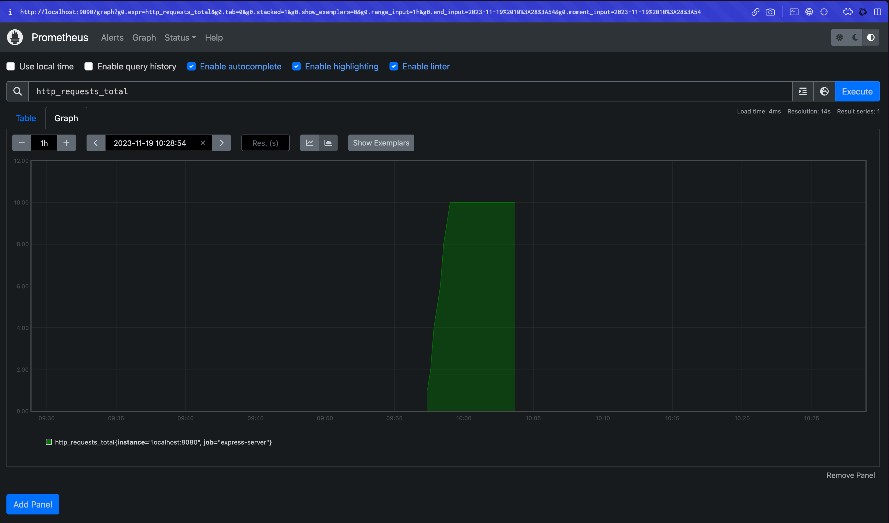

요새 제 주요 업무 중 하나는 웹 클라이언트 자원을 서빙하는 서버의 운영 이슈를 해결하는 것입니다.

이런 이슈들의 원인은 서버 애플리케이션에 있기도 하지만, 서버가 떠 있는 인프라 단까지 내려가야 알 수 있는 경우도 있습니다. 웹 프론트엔드 개발자로 커리어를 계속 이어나가고 있다가 흔히 말하는 devops, 인프라 영역에 가까운 작업을 맡은 것은 지금이 처음인데요.

시작할 때는 끔찍하게 아무것도 몰랐다가 동료분들의 도움과 각종 이슈를 온몸으로 맞으며 이제 "뭔가... 뭔가 이제 살짝 좀 아는 것 같다." 하는 상태가 되...된 것 같으면서도 여전히 아무것도 모르는 것 같고 그렇네요.

이번 포스팅은 서버 운영 이슈의 원인이나 징후를 파악할 때 중요한 축 중 하나인 모니터링에 관한 내용입니다. Nodejs의 서버 모니터링 메트릭에 대해서 나름대로 공부하고 이해한 내용을 정리해보려고 합니다.

# 들어가기 전에

## Disclaimer

- 이 포스팅에서 제가 선정한 주 독자는 웹 클라이언트 자원을 서빙하는 Nodejs 서버 운영, 모니터링에 대해 알고 싶으신 웹 프론트엔드 개발자입니다.
- 저는 웹 클라이언트 개발을 주로 해온 개발자이고 커리어 수년간 서버 모니터링에 대한 지식이 전무했다가 업무에 필요한 부분이 생겨 공부를 시작했습니다. 업무 환경에 따라 아실 필요 없는 내용일 수도 있습니다.
- 레퍼런스에 기댄 내용도 있지만 주워 먹은 지식에 근거한 내용, 자의적인 기준의 분류나 서술이 있으니 잘못되거나 적절치 않은 부분이 있다면 지적 부탁드리겠습니다.

## 웹 프론트엔드 개발자와 서버 모니터링

웹 프론트엔드 개발자와 서버 모니터링은 별로 상관 없어 보일수도 있습니다.

SPA의 시대를 지나 웹 프론트엔드는 주로 정적 파일을 브라우저에서 평가하게 만드는 방식으로 구현되는 경우가 많아졌습니다. 이때는 자원을 호스팅한 스토리지가 서버가 됩니다. S3같은 스토리지 서비스가 대표적인데요. AWS에서는 스토리지에 대한 메트릭을 제공하고 있지만 [왠만하게 많은 트래픽이 아니면 백엔드 서버에 비해서는 자원을 자주, 많이 가져오지 않기 때문에](https://maxkim-j.github.io/posts/frontend-infrastructure#%EC%95%88%EC%A0%95%EC%A0%81%EC%9C%BC%EB%A1%9C-%EC%84%9C%EB%B9%99%ED%95%98%EA%B8%B0) 장애나 가용성 이슈가 자주 있는 일은 아니었습니다.

하지만 SSR, ISR, 그리고 최근의 RSC와 같이 서버의 리소스를 활용해 웹 프론트엔드의 성능 향상과 문제를 해결하려고 하는 시도들이 이어지고 있습니다. SSR은 Nextjs와 같은 프레임워크가 각광받으며 이제는 웹 프론트엔드 애플리케이션의 거의 일반적이라고 할 수 있는 프랙티스가 되었죠.

이러한 흐름 때문에 웹 클라이언트 개발의 결과물은 자연스럽게 서버를 끼고 나오는 형태로 변모했습니다. 이 때문에 웹 프론트엔드 개발자는 서버의 운영 책임에 대해서 자유로울 수 없게 되었습니다.

React 코드를 nodejs 환경에서 평가해 렌더링 결과물을 얻는 행위는 [상당히 CPU Instensive한 로직일 수 있습니다.](https://seokjun.kim/react-ssr-the-record-of-pain/) RSC는 유저가 웹을 사용할 때마다 빈번하게 서버에 요청을 보내고 응답을 통해 다시 화면을 그리니 [서버의 CPU가 많이 관여합니다.](https://www.linkedin.com/pulse/leap-forward-web-development-react-server-components-sens-vn/) 최근에는 웹 클라이언트 개발자가 Nodejs 서버로 BFF를 구현하여 복잡하고 다양한 API 호출을 통합시키는 레이어에 대한 책임까지 맡고 있습니다.

따라서, 이제 웹 프론트엔드 개발자라는 사람들도 **필요하다면** 서버 모니터링을 해야 합니다. 필요성이 생기기 전까지는 몰라도 되니 미리 배울 필요는 없다고 생각하지만요.

웹앱의 UI를 그리고 만드는 사람이라보다는, "브라우저에서 해석 가능한 자원을 서빙하는 소프트웨어/시스템"을 만들어가는 엔지니어로써 시스템의 운영에도 관심과 능력을 갖춰야 하지 않나 - 정도로 생각하고 있습니다.

## 서버 장애란?

제가 생각하는 서버 장애의 유형은 크게 2가지입니다.

1. 요청에 대한 응답을 기대되는 시간 안에 원할히 주지 못한다
   1. 과도한 트래픽으로 CPU를 많이 사용하고, 응답이 너무 느리고(request latency), timeout이 빈번하게 발생한다
   2. 서버 단의 잘못된 로직, 인프라 단의 문제 등으로 잘못된 응답을 줘서(5xx) 애플리케이션에 영향을 미친다.
2. 서버(의 프로세스)가 죽는다
   1. Nodejs Heap Out of Memory(OOM)
   2. (인프라 등에서의) 서버 재기동으로 응답을 못 주는 순간 단절 시점 발생

사실 칼로 무 자르듯 확실히 구분되는건 아닙니다. 서버가 트래픽을 처리할 수 없는 상황이라면 인프라 환경에 따라서는 응답 지연, 타임아웃, OOM, 프로세스 종료까지 모두 일어날 수 있는 일이긴 합니다.

## 서버 모니터링의 의의

정기적인 서버 모니터링은 운영 환경에 필수적이며, 다음과 같은 가치와 의미를 가진다고 봅니다.

1. **평시 트래픽 패턴 파악**: 서비스의 특성에 맞게 평상시의 트래픽 패턴과 그 때의 서버 리소스(CPU, 메모리) 사용량에서 기대되는 값들을 파악할 수 있습니다. 트래픽 패턴에 따라 언제 리소스 메트릭들이 피크를 찍는지, 피크를 찍을 때의 값은 몇인지에 대한 정보를 미리 갖고 있을 수 있는 것이죠.
2. **장애 징후 파악**: 정상 범주로 볼 수 있는 모니터링 지표들을 알고 있다면, 정기적인 모니터링에서 패턴과 일치하지 않은 지표가 발생할 때 에러가 발생할 수 있음을 판단하고 이에 맞게 재기동, 인스턴스 증량 등 알맞은 조치를 내릴 수 있습니다.
3. **디버깅**: 서버 장애가 발생했다면 모니터링 지표를 사용해 장애 당시의 자원 사용량, 요청량, 응답까지 걸린 시간 등의 메트릭을 통해 장애의 원인을 파악할 수 있습니다.

# 모니터링 환경/메트릭 탐구하기

이제 앞에서 설정한 Nodejs 서버의 모니터링 환경과 메트릭을 본격적으로 탐구해보도록 하겠습니다.

## 모니터링 환경 설정(Prometheus)

[코드 예제 참고하기](https://github.com/MaxKim-J/nodejs-server-monitoring-example)

모니터링 도구로는 [prometheus](https://prometheus.io/)를 사용합니다. prometheus의 nodejs client인 [prom-client](https://github.com/siimon/prom-client)가 제공하는 `collectDefaultMetrics` 함수가 기본적으로 내보내주는 메트릭을 기준으로 설명하고, 서버로 들어오는 요청량, 요청에 대한 응답을 보낼 때까지 시간이 얼마나 걸렸는지에 대한 정보도 커스텀 메트릭을 붙여 확보될 수 있도록 합니다.


express 서버라고 하면, prom-client를 다음과 같이 적용할 수 있습니다. `collectDefaultMetrics` 함수를 호출하고, 요청에 응답할 수 있는 API 엔드포인트를 하나 뚫어놓는 것이죠(`/metrics`). 아래 메트릭에 대해서는 아래에서 더 자세히 설명하겠습니다.

```js
import express from 'express';
import { collectDefaultMetrics } from 'prom-client';

const app = express();

app.get('/metrics', async (req, res) => {
  try {
    res.set('Content-Type', register.contentType);
    res.end(collectDefaultMetrics());
  } catch (e) {
    res.status(500).end(e);
  }
});

const port = 8080;

app.listen(port, () => {
  console.log(`express 서버를 ${port}번 포트에서 시작합니다.`);
});
```

요청량에 대한 메트릭도 같이 붙여봅니다. 기동 시점부터 서버로 들어온 요청을 모두 세는 메트릭, 그리고 특정 요청에 대해 요청부터 응답까지 얼마나 걸렸는지 알 수 있는 메트릭을 추가로 붙입니다

```js
import { Counter, Histogram } from 'prom-client';

export function promTotalRequests(register, app) {
  const requestsCounter = new Counter({
    name: 'http_requests_total',
    help: 'Total number of HTTP requests',
  });

  app.use((_, __, next) => {
    requestsCounter.inc();
    next();
  });

  register.registerMetric(requestsCounter);
}

export function promRequestLatency(register, app) {
  const requestsDuration = new Histogram({
    name: 'http_request_duration_seconds',
    help: 'Duration of HTTP requests in seconds',
    buckets: [0.1, 0.2, 0.5, 1, 2, 5],
  });

  app.use((_, res, next) => {
    const start = process.hrtime();

    res.on('finish', () => {
      const duration = process.hrtime(start);
      const durationInSeconds = duration[0] + duration[1] / 1e9;
      requestsDuration.observe(durationInSeconds);
    });

    next();
  });
  register.registerMetric(requestsDuration);
}
```

그리고 또한 아래에서 설명할 메트릭인, ELU(event loop utilization)에 대한 커스텀 메트릭도 Summary라는 메트릭 타입으로 같이 붙여봅니다. [요 포스팅](https://nodesource.com/blog/event-loop-utilization-nodejs)을 참조했어요.

```js
import { Summary } from 'prom-client';
import { performance } from 'node:perf_hooks';

export const promEventLoopUtilization = (register) => {
  let lastELU = performance.eventLoopUtilization();
  const eluMetric = new Summary({
    name: 'nodejs_eventloop_utilization',
    help: 'ratio of time the event loop is not idling in the event provider to the total time the event loop is running',
    maxAgeSeconds: 60,
    ageBuckets: 5,
    percentiles: [0.5, 0.9],
    collect() {
      const currentELU = performance.eventLoopUtilization();

      this.observe(performance.eventLoopUtilization(currentELU, lastELU).utilization);
      lastELU = currentELU;
    },
  });
  register.registerMetric(eluMetric);
};
```

Prometheus는 서버의 특정 엔드포인트로 일정 간격을 가지고 메트릭을 수집하는 역할을 하는 또 다른 서버입니다. Prometheus 서버를 띄울 때 config는 다음과 같이 정의할 수 있습니다.

```yaml
global:
	scrape_interval: 10s

scrape_configs:
	- job_name: 'express-server'
	  static_configs:
	    - targets: ['localhost:8080']
```

Prometheus 서버를 로컬에 띄워보면 어떻게 동작하는지 더 잘 알 수 있는데요. 서버와 같이 띄워진 웹 페이지에서 수집한 메트릭을 조회할 수 있습니다.



요걸 그대로 대시보드로 쓰기보다는, 주로 Grafana와 같은 도구를 사용해 Prometheus가 수집한 메트릭들을 시각화합니다.

# 1. Request 관련 메트릭

먼저 요청 관련해서 붙인 커스텀 메트릭에 대해서 살펴보겠습니다.

### Total Request

- `http_requests_total`: 서버가 운영되고 있는 시점에서 받은 모든 리퀘스트의 총합

서버로 들어오는 모든 요청의 개수를 서버의 기동시점부터 카운팅합니다.

이 메트릭을 바탕으로 모니터링 환경에서는 주로 초당 요청 수(RPS, Request per Seconds) 등으로 표현해 모니터링을 합니다. 서버가 떠있는 기간 동안의 모든 요청을 서버가 떠 있는 기간의 초 단위로 나누어 표현하는 것이죠.

이를 대시보드에 특정 기간에 대한 평균 변화율([promQL의 rate 함수 이용](https://velog.io/@skynet/Prometheus-rate-%EC%97%B0%EC%82%B0%EC%9D%98-%EC%8B%A4%ED%96%89-%EC%9B%90%EB%A6%AC))로 표현한다면, RPS는 서버로 들어오는 트래픽이 증가하면 자연스래 높아지는 지표일 것입니다.

여기서의 RPS는 (요청 총량/시간) 으로 간단하게 표현했지만 메모리나 CPU 자원을 결부시켜 특정 리소스 사용 요청에 대한 지표로 표현하기도 합니다.

### Request Latency

- `http_request_duration_seconds`: 서버가 요청을 받고 응답을 줄 때까지 걸린 시간

하나의 요청이 서버로 들어온 요청 시점부터 응답이 이루어질 때까지 걸린 시간을 표현하는 메트릭입니다.

prometheus 메트릭 타입중 하나인 histogram을 사용해 특정 구간값에 대한 메트릭을 찍는 방식입니다. `/metrics` 엔드포인트로 요청했을 때 값이 이렇게 뜬다면, 몇초 이상 걸린 요청은 몇개, 몇초 이상 걸린 요청은 몇개, 이런식으로 표현이 되고 있는 것이죠.

이 역시 대시보드에서 변화율로 표현한다면, 서버가 성능이 떨어져 요청에 대한 응답을 보내주기까지 오래 걸린다면 높아지는 지표입니다.

# 2. CPU Usage

- `process_cpu_user_seconds_total`: 사용자 모드에서 프로세스 CPU Time.
- `process_cpu_system_seconds_total`: 시스템 모드에서 프로세스 CPU Time.
- `process_cpu_seconds_total`: 사용자 및 시스템 모드에서의 프로세스 CPU Time.

CPU 사용량 관련 지표들입니다. 높은 CPU 사용량은 애플리케이션이 많은 작업을 수행하고 있거나 최적화가 필요할 수 있음을 나타냅니다. 사용자 모드와 시스템 모드 구분은 [이 문서를 참고해주세요.](https://en.wikipedia.org/wiki/CPU_modes)

CPU가 바빠질수록, 다른 작업에 대한 응답 시간이 길어지므로 이로 인해 사용자는 시스템의 반응이 느려진다고 느낄 수 있습니다.

CPU 사용량이 오르는 대표적인 작업들은, CPU Instensive job이라고 불리우는, 주로 연산 과정에 많은 시간을 소비하는 작업입니다. 웹 클라이언트와 관련해서는 그래프 탐색 등 많은 연산이 필요한 작업, 파일이나 미디어(오디오, 비디오)를 다루는 작업들, Nodejs에서 React 코드를 평가하여 UI를 렌더링시키는 `renderTo*` 작업들이 CPU Intensive한 것들로 보여집니다.

# 3. Memory

메모리 사용량이 높은 경우 메모리 누수가 있거나 많은 데이터를 캐싱하고 있는 것일 수 있습니다. 주로 MB단위로 표현됩니다.

메모리 사용량이 높으면 OOM(Out of Memory)가 일어나고 서버가 죽습니다(JavaScript heap out of memory). 메모리 누수가 발생하면 [과도한 메모리 할당으로 인해 애플리케이션의 메모리 사용량이 지속적으로 증가하는 우상향의 형태를 띄게 됩니다.](https://youtu.be/P3C7fzMqIYg?t=924) 누수가 있어서 메모리 사용량은 서버가 운영됨에 따라 계속 올라가는데거듭된 GC로도 이게 해결되지 않아서 사용량이 계속 올라가게 되는 것이죠

Node.js는 기본적으로 32비트 시스템에서 약 1.4GB, 64비트 시스템에서 약 1.7GB의 최대 힙 메모리 한계를 가지고 있어서, 이 한계를 넘어서는 메모리를 할당하려고 할 때 OOM이 발생하게 됩니다.

이때 OOM이 일어나기 직전에 GC가 빈번해지면 CPU 사용률도 같이 올라갈 수 있습니다. 메모리 사용량이 증가함에 따라 가비지 컬렉션이 작업이 더 자주 발생하고 GC작업에는 CPU가 사용됩니다. 거듭된 GC 작업은 [CPU Usage 를 증가시키고 시스템의 전반적인 반응 시간을 느리게 만들 수 있습니다.](https://blog.ycrash.io/2023/06/27/how-to-reduce-cpu-consumption-caused-by-garbage-collection/)

### 3-1) Resident Memory

- `process_resident_memory_bytes` : 해당 노드 프로세스가 실제로 메모리에서 사용하고 있는 양을 바이트 단위로 나타내는 메트릭
- `nodejs_external_memory_bytes` : V8 엔진의 힙 메모리 관리 밖에서 할당되는 메모리. node 런타임과 관련되어있지만 힙메모리에 있는 값은 아니다.

### 3-2) Heap Memory

- `nodejs_heap_size_total_bytes` : Node.js 프로세스의 V8 힙 메모리 전체 크기
- `nodejs_heap_size_used_bytes` : 프로세스가 실제로 사용 중인 힙 메모리의 양
- `nodejs_heap_space_size_available_bytes` : 할당된 힙 메모리 중에서 아직 사용되지 않고 남아 있는 부분, 즉 애플리케이션에서 추가로 사용할 수 있는 힙 메모리의 양

Heap Memory는 nodejs의 동적 메모리 할당이 발생하는 영역이며, 위에서 설명했던 Resident Memory에 포함됩니다. V8의 힙 메모리 구조에 대해서는 따로 설명하지는 않을 건데요. [이 포스팅](https://dev.to/jennieji/memory-management-in-v8-garbage-collection-and-improvements-18e6)을 살펴보시면 좋습니다.

## 3-3) Garbage Collections

- `nodejs_gc_duration_seconds`: 가비지 컬렉션의 지속 시간
- `nodejs_gc_duration_seconds_bucket`: GC의 종류를 구분해 duration을 측정하는 메트릭

[GC작업은 Nodejs에서 메인 스레드를 블락하는 작업](https://medium.com/voodoo-engineering/nodejs-internals-v8-garbage-collector-a6eca82540ec)이 될 수 있어 프로그램 실행을 중단시킬 수도 있는 작업입니다.("stop the world") 가비지 컬렉션 지속 시간이 길 경우, 메모리 해제 작업이 빈번하게 발생하며, 이는 성능 저하의 원인이 될 수 있습니다.

`gc_duration_seconds_bucket` 메트릭은 GC duration을 Prometheus의 메트릭 타입 중 하나인 [summary로 표현](https://prometheus.io/docs/practices/histograms/)합니다. 다음과 같은 의미를 지닙니다.

```json
nodejs_gc_duration_seconds_bucket{le="0.001",kind="major"} 0 nodejs_gc_duration_seconds_bucket{le="0.01",kind="major"} 2 nodejs_gc_duration_seconds_bucket{le="0.1",kind="major"} 2 nodejs_gc_duration_seconds_bucket{le="1",kind="major"} 2 nodejs_gc_duration_seconds_bucket{le="2",kind="major"} 2 nodejs_gc_duration_seconds_bucket{le="5",kind="major"} 2 nodejs_gc_duration_seconds_bucket{le="+Inf",kind="major"} 2
```

- kind: major, minor GC 구분
- le(less than or equal to): 해당 초 이하의 지속 시간을 가진 가비지 컬렉션 이벤트
- `nodejs_gc_duration_seconds_bucket{le="1",kind="major"} 2` 라면, 1초 이하의 지속 시간을 가진 major gc가 2번 일어났다는 뜻이 됩니다.

major GC와 minor GC의 차이가 궁금하시다면, [해당 포스팅]()을 참고하세요!

# 4. Event Loop

이벤트 루프는 nodejs가 작동에 필요한 핵심적인 매커니즘으로, 익히 알려져 있듯 동기/비동기 작업의 처리를 통해 동시성을 활용할 수 있게 해주죠. nodejs의 이벤트 루프 동작에 관해서는 [이 포스팅에 정리가 잘 되어 있습니다.](https://medium.com/zigbang/nodejs-event-loop%ED%8C%8C%ED%97%A4%EC%B9%98%EA%B8%B0-16e9290f2b30)

이벤트 루프 관련 메트릭을 보며, Node.js 프로세스의 과부하 상태 여부나, event loop를 블록하는 연산이 얼마나 많이 발생하고 있는지를 살펴볼 수 있습니다.

이벤트 루프의 상태와 관련해 이 포스팅에서 볼 메트릭은 Event Loop Lag와 ELU(Event Loop Utilization), 2가지입니다.

### 4-1) Event Loop Lag

- `nodejs_nodejs_eventloop_lag_seconds` : Node.js 이벤트 루프 지연의 현재 값을 초 단위로. 이벤트 루프가 콜백을 시작하기 위해 얼마나 많은 시간을 기다려야 하는지
- `nodejs_eventloop_lag_mean_seconds` : 평균 이벤트 루프 지연을 초 단위로 나타냄. 측정 기간 동안의 모든 지연 측정값의 평균
- `nodejs_eventloop_lag_p50_seconds` : 이벤트 루프 지연의 50 [백분위수](https://ko.wikipedia.org/wiki/%EB%B0%B1%EB%B6%84%EC%9C%84%EC%88%98), 즉 중간값(median)을 나타냄

[Event Loop Lag](https://medium.com/nodejsmadeeasy/nodejs-event-loop-lag-5d5928fd03c)는 이벤트 루프가 다음 이벤트를 처리하기 위해 얼마나 많은 시간을 기다려야 하는지를 나타냅니다. lag이 길어질수록, 특정 태스크가 이벤트 루프를 점유하고 처리되기까지 오래 걸린다는 것을 의미하고, Node.js 프로세스가 이벤트 루프를 통해 새로운 태스크를 처리하는 데 더 많은 시간이 걸린다는 뜻이기도 합니다.

이벤트 루프를 크게 블락할 수 있는 무거운 동기 작업의 실행, 긴 타이머 작업 등이 Event Loog Lag를 상승시키는 원인이 될 수 있습니다.

### 4-2) ELU(Event Loop Utilization)

- `nodejs_eventloop_utilization_sum` : ELU 전체 총합
- `nodejs_eventloop_utilization{quantile="0.9"}` : ELU의 백분위수 90, P90 값

[ELU는 이벤트 루프가 얼마나 바쁜지 나타냅니다.]() CPU 사용량과 비슷한 개념이라고 생각할 수도 있는데요, 이벤트 루프에 좀 더 특화된 지표입니다.

ELU는 이벤트 루프가 비동기 작업이나 콜백 처리에 실제로 얼마나 많은 시간을 소비하고 있는지를 측정할 수 있게 합니다. `(event loop 사용(using)시간 - event loop 유휴(idle)시간) / 전체 시간` 이런 식으로 계산합니다. nodejs의 내장 모듈인 `perf_hooks` 를 이용해 수집할 수 있고, summary를 사용한 prometheus 커스텀 메트릭을 만들어 찍었습니다.

ELU가 1.0에 가깝다면, 이벤트 루프는 유휴시간 없이 가능한 시간의 대부분을 작업 처리에 소비하고 있으며 아주 바쁘다는 말이 됩니다.

## 5. Active Handles

- `nodejs_active_handles{type="WriteStream"}` : active handles 중 쓰기 스트림의 개수
- `nodejs_active_handles{type="ReadStream"}`: active handles 중 읽기 스트림의 개수
- `nodejs_active_handles{type="Server"}` : active handles 중 서버(createServer 호출시 생성)의 개수
- `nodejs_active_handles{type="Socket"}` : active handles 중 소켓의 개수

handle은 nodejs의 i/o를 담당하는 libuv와 연관이 있는 내부 객체입니다. [handle은 특정 I/O 동작이 발생할 때 이를 처리하기 위해 node 내부적으로 유지됩니다.](https://docs.libuv.org/en/v1.x/design.html#handles-and-requests)

일반적인 리소스 모니터링 보다는 이 handle이 뜻하는 자원(소켓, 서버, 스트림)이 리소스 사용량과 얼마나 연관이 되어있는지 보는데 활용할 수 있을 것이라고 생각이 듭니다.

# 맺는 말

포스팅을 보시면 결국 말씀드린 메트릭들을 이해하기 위해서는 nodejs에 대한 이해도 같이 필요합니다. 모니터링을 공부하면서 이론적으로만 알고 있는 nodejs의 동작을 좀 더 이해할 수 있는 계기가 되었던 것 같습니다.

예제는 Prometheus이긴 한데 모니터링을 하기 위해서 이 모든걸 셋업해야 하는 것은 아닙니다. 서비스 인프라 단에서 제공하는 모니터링 툴을 사용해도 충분할 수 있습니다. 이 포스팅이 지금 사용하고 계시거나 사용 예정인 모니터링 툴의 메트릭을 이해하시는데 도움이 된다면 너무 좋을 것 같습니다.

서버 운영에 관여하면서 웹 클라이언트 서버의 인프라에 관련해 관심이 많아졌고 관련해서 글도 더 써보고 싶어요. 여전히 잘 모르는 것 같아 글을 쓸만한지는 모르겠습니다. 다만 그저 일반적으로 인프라와 거리가 좀 있는 편인 웹 프론트엔드 개발자의 시각에서 더 이해하기 쉽게 써보고 싶습니다. 피드백과 지적을 기다립니다. (끝)

# References

같이 보면 좋아요

- [하이퍼커넥트 기술 블로그 - Node CPU 점유율 최적화 경험기](https://hyperconnect.github.io/2020/02/11/Node-cpu-debug.html)
- [CPU 이용률의 두 가지 얼굴 – CPU 코어 사용량(Usage)과 활용률(Utilization)](https://netmarble.engineering/cpu-core-usage-and-utilization/)
- [Keep the Node.js Event Loop Healthy](https://medium.com/dovetail-engineering/keep-the-node-js-event-loop-healthy-c3cae0e0e0f2)
