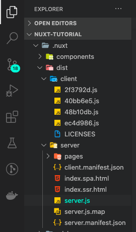
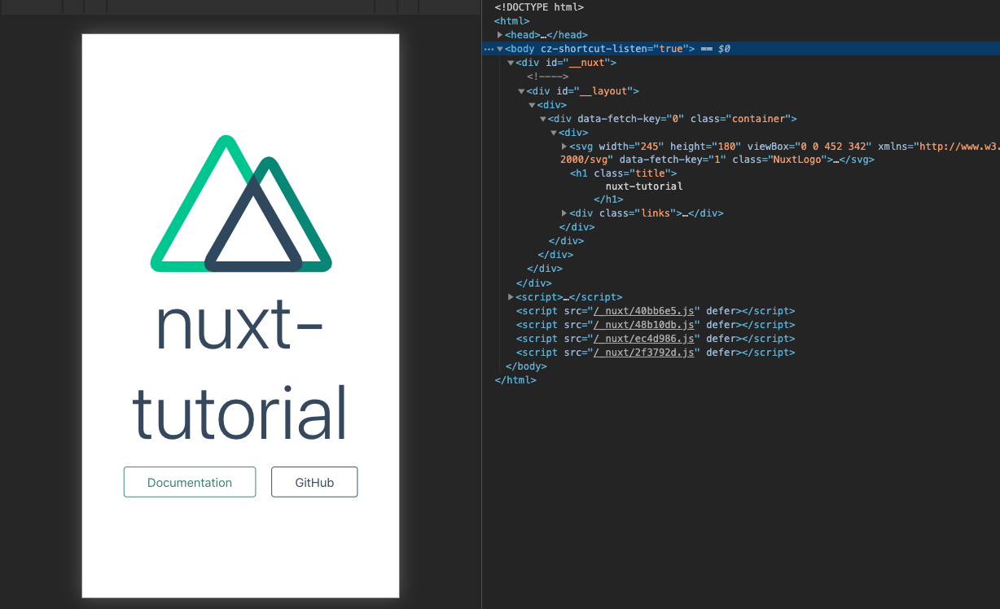
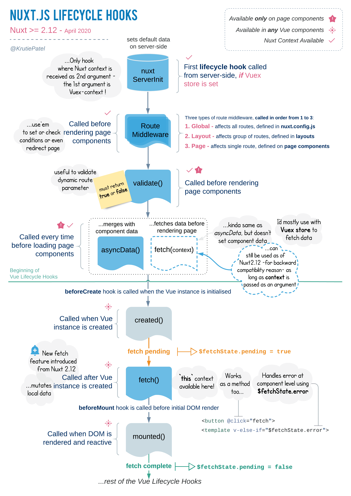

SSR libraries like Next and Nuxt seem to be widely used now, but I haven't found many Korean language posts that explain how they work, or terms like freelancing and hydration. So I thought I'd write up the results of my exploration of how SSR libraries render SPAs server-side using Nuxt, the stack we use at work.


## CSR (client-side rendering) vs SSR (server-side rendering)

CSR receives HTML with no content on the initial render, and everything after that is all JavaScript to make the web page work. This is how Single Page Applications (SPAs) made with React and Vue typically work.

The SSR receives pre-rendered HTML from the server, with content present on the initial render, and then fully operationalizes the web page with JavaScript. This is what happens when you build an app with a library that supports server-side rendering, such as Nuxt or React-based Next, which we'll look at in this post.

The biggest reason you need SSR is for search engine optimization. Search engines' crawling bots scrape the HTML content itself, so CSR apps that initially receive blank HTML are at a disadvantage in search engine visibility.


When you post a URL somewhere, you sometimes see a link box with an image or description, and the crawling bot gets the meta tag information of the link HTML. CSR apps all start with the same meta tag, so it's hard to make the meta tag different for different subpages on the same webpage. Even if you use a library like react helmet, the crawling bot can't scrape it.

With SSR, you can customize the HTML and even the meta tags to be specific to the page on initial rendering, which is beneficial for site visibility.

## Freerendering and hydration

```markdown
Request the page in the browser address bar => markdown
Server sends freelance HTML that fits the request =>
Browser receives the HTML and hydrates it with the accompanying JavaScript =>
Next, act like an SPA => SSR boom!
```

By **pre-rendering** we mean the behavior of creating a more or less complete HTML file on top of an existing SPA created with React or Vue that can be sent from the server to the browser.

The original SPA is also routed in JavaScript, but an app using the SSR library doesn't route in JavaScript, it routes by adding a small server to the build output that pre-renders and serves page components to the browser that match the request in the browser's address bar.

\*\*Hydration is the behavior of executing the remaining JavaScript code on top of the HTML file delivered to the browser after the freelancing process. Hydration ensures that SSR apps have the same behavior and responsiveness as traditional SPAs. It's exactly what it sounds like: watering the "dry land" of incomplete HTML files with JavaScript.

These two concepts are arguably the core of server-side rendering. To summarize, preflighting fills the page with content so that crawling bots can read it, and hydration ensures that the app behaves exactly like an SPA after that.

The concept of an SSR app being built in front of a server is what drives the difference between how SSR apps and SPAs are deployed. The build output of an SPA is a bunch of HTML and JavaScript files. You can store the build output in a storage like AWS S3, point a domain to it, and the browser will run the HTML and JS files on its own.

But an SSR app is a server, so it's not a resource that a browser can access and run just by putting it on storage. It needs compute to keep the server running, like a backend.

## SSR in Nuxt

Now let's take a look at how Nuxt implements SSR.

### Three ways to build

You can build differently via the build option in `nuxt.config.js`, or via npm commands defined in `package.json`.

```javascript
// nuxt.config.js

export default {
  mode:'spa',
  build: {
    ssr:true or false,
  }
}
```

- SSR: true` : Build the SSR app as described above.
- SSR: false or mode:'spa'` : Build like an SPA. Setting mode to spa will create a folder built with dist in the root directory, just like an SPA created using Vue. ([mode:'spa' has been deprecated](https://ko.nuxtjs.org/guides/configuration-glossary/configuration-mode/))
- `yarn generate`: This is a script command that runs a static site build. It will build all the HTML complete, exactly where the pages in the pages directory are.

### How it behaves when built with SSR:true.

Our interest here is in SSR-style builds. To implement server-side rendering in the manner mentioned earlier, we need two resources.



One is the **server code**, which is the Vue instance that creates the pre-rendered HTML and shoots it to the browser, and the other is the **client code**, which is the chunk of JavaScript that allows it to behave like a traditional SPA on the client side. If you look at the `dist` folder inside the build folder, you can see that it's being built in two separate folders.



If you run the app built with `SSR:true` in the browser with the `yarn start` command, you can see that the JavaScript code built with Webpack is inserted as a script tag in the freelanced HTML. The idea is to embed all of the JavaScript code in the freelanced HTML so that it can behave like an SPA.

### vue-server-renderer

Nuxt uses a library called `vue-server-renderer` to make view instances [structured for server-side rendering](https://ko.nuxtjs.org/guide#%EC%84%9C%EB%B2%84-%EB%A0%8C%EB%8D%94%EB%A7%81-%EB%B2%94%EC%9A%A9-ssr) To summarize from the [official documentation](https://ssr.vuejs.org/#what-is-server-side-rendering-ssr).

Broadly speaking, this library does two things: first, through the `renderer` class and its internal `renderToString` and `renderToStream` methods, it takes a Vue instance as an argument and turns it into an HTML string for rendering. Conveniently, any assets like css associated with the Vue instance are also injected into the html at the same time.

```javascript
// Note that it doesn't define any el properties, it just creates a Vue instance.
// because mounting is done manually on the client side
const app = new Vue({
  template: `<div>Hello World</div>`,
});

// Load the renderer.
const renderer = require('vue-server-renderer').createRenderer();

// Replace the Vue instance with HTML.
renderer.renderToString(app, (err, html) => {
  if (err) throw err;
  console.log(html);
  // => <div data-server-rendered="true">Hello World</div>
});
```

Second, by using webpack with this library, you can easily build two separate pieces of code: the server code for freelancing, and the client code for hydration. And with two entry points, server and client, you can define behavior that works both on the server and client (universal code) and behavior on each. You can create server-side rendering apps like Nuxt. There's also a webpack plugin for this.

There's an example SSR Vue app in the `vue-server-renderer` docs, let's take a look at that, it's an indirect way to understand how Nuxt works.

### vue-server-renderer example

First, let's talk about the structure: the build entry point consists of two modules, `server-entry.js` and `client-entry.js`, which refer to the `createApp` function in `app.js`.

```javascript
// server-entry.js

import { createApp } from './app';

export default (context) => {
  // Export a Vue instance to replace with HTML.
  const { app } = createApp();

  // Before exporting, you can define logic that is only used on the server end.

  return app;
};
```

```javascript
// client-entry.js

import { createApp } from './app';

// Before mounting, you can define logic that is only used on the client end.

const { app } = createApp();

// The js code on the client side will mount the Vue instance.
app.$mount('#app');
```

```javascript
// app.js

import Vue from 'vue';
import App from './App.vue';
import { createRouter } from './router';
import { createStore } from './store';
import { sync } from 'vuex-router-sync';

export function createApp() {
  // Define a router with new Router().
  // Nuxt reads the pages directory and creates a router for itself.
  const router = createRouter();

  // Define a store with new Vuex.Store().
  const store = createStore();

  // Synchronize route information to store.
  sync(store, router);

  // Inject router and store into the app Vue instance and return it.
  const app = new Vue({
    router,
    store,
    render: (h) => h(App),
  });

  return { app, router, store };
}
```

We then implement the server directly in `server.js`. When deploying, you can use this file as an entry point.

```javascript
// server.js
const createApp = require('./app');

server.get('*', (req, res) => {
  const context = { url: req.url };
  const app = createApp(context);

  renderer.renderToString(app, (err, html) => {
    // handle error...
    res.end(html);
  });
});
```

When the server accepts the request, we can first intercept the requested URL and direct it to the `router` mapped to the `app` in `server-entry`. The `router.onready` event hook allows you to define logic to be executed on the server before `renderToString` is called. Just like the `asyncData` hook in Nuxt, which only works on the server.

```javascript
// server-entry.js

import { createApp } from './app';

export default (context) => {
  return new Promise((resolve, reject) => {
    const { app, router } = createApp();

    // route the request to the incoming URL
    router.push(context.url);

    // Use the router hook to write logic to run only on the server end
    router.onReady(() => {
      const matchedComponents = router.getMatchedComponents();
      if (!matchedComponents.length) {
        return reject({ code: 404 });
      }

      // If all goes well, return the Vue instance that matches the requestURL, in the routed state.
      resolve(app);
    }, reject);
  });
};
```

In this example, that's why the first time it renders, it finds the right page for the requested URL, and after that pre-render, all subsequent routing is done via JavaScript on the client side. Nuxt works like that too.

Not only the router, but also the Vuex store can be controlled from the server. After creating a store in `createApp`, you can call the store in `server-entry.js` to perform actions like `disaptch`. The store initialized together on the server will be put into a property called `window.__INITIAL_STATE__` using `JSON.stringify` during preflighting, and the client will receive this information to initially update the Vuex store. You can see a detailed implementation [here](https://ssr.vuejs.org/guide/data.html).

Finally, the server code pre-renders the vue instance traveled through the router using `renderToString` and sends it as a response.

### Nuxt Lifecycle



In the example above, you can see that SSR apps go through different processes on the server and client side to render. Nuxt does the same thing.

Nuxt continues to deal with Vue instances throughout the rendering process, and it also defines logic that only works in each rendering process. As a result, Nuxt's rendering process calls a mix of common Vue instance lifecycle hooks and unique lifecycle hooks found only in Nuxt. Let's take a look at some of the more useful and important hooks in order of their behavior.

- middleware(client, server)\*\* : Before the hooks for both the client and server are called in earnest, the middleware that you defined during the app creation process is run first. If you've defined `serverMiddlware`, it will run before the normal middleware during the rendering process on the server side only.
- asyncData(server or client)\*\*: A hook that is called only once per lifecycle on the server or client side. Use this when you want to fetch data before the Vue instance's lifecycle and render it. It is always called before loading the component, and is only available for page components. The return value of `asyncData` is merged with the Vue instance's `data()`.
- **beforeCreated, created(client, server)**: The `created` and `beforeCreated` hooks are called when the Vue instance is created on the server, because we create a new vue instance on the server and then freelance it. They are also called when the instance is created on the client and the `$mount` method is called. In other words, they are hooks that are called on both the server and client side.
- Hooks after **beforeMount (client)**: On the client side only, the rest of the Vue lifecycle hooks are executed when the `$mount` method is called after hydration.

The full Nuxt lifecycle can be found [here](https://ko.nuxtjs.org/guides/concepts/nuxt-lifecycle).

## Wrapping Up

This was a long post because I wanted to identify and explain every single behavior. I actually wanted to tear into the internals of Nuxt and see what the freelancing server looks like and how it uses `vue-server-renderer`, but it was too big and complicated, so I gave up. I'll have to take a look at it when I have time. Hopefully this is a good reference to get a general idea of how the SSR libraries work!

## Reference

- [Nuxt Docs](https://ko.nuxtjs.org/)
- [Vue SSR Guide](https://ssr.vuejs.org/)
- [Lukas Bombach - The case of partial hydration](https://medium.com/@luke_schmuke/how-we-achieved-the-best-web-performance-with-partial-hydration-20fab9c808d5)
- [Evan Moon - Vue Server Side Rendering](https://evan-moon.github.io/2018/09/25/vue-ssr/)
