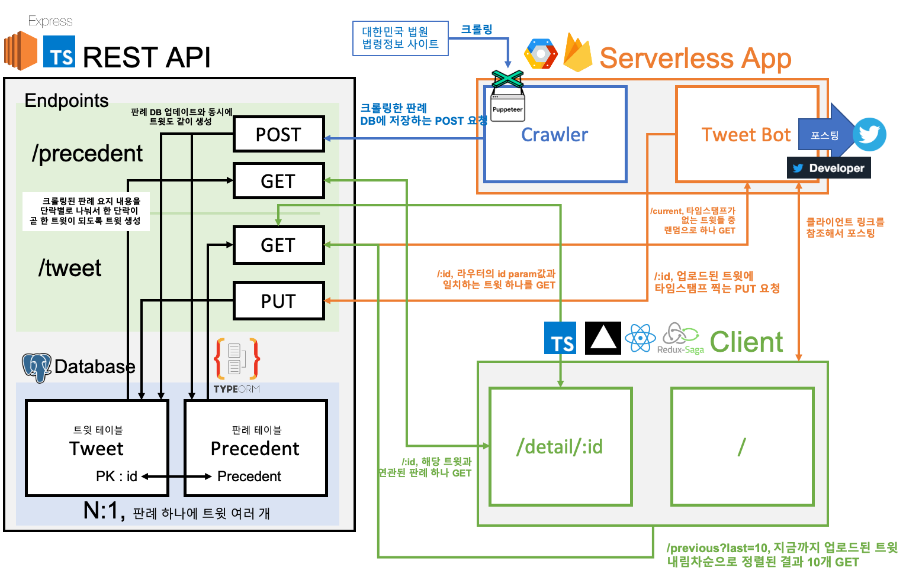
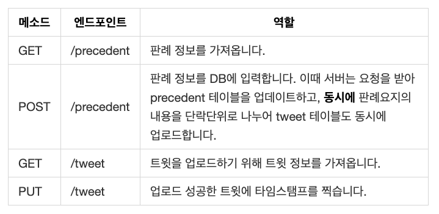
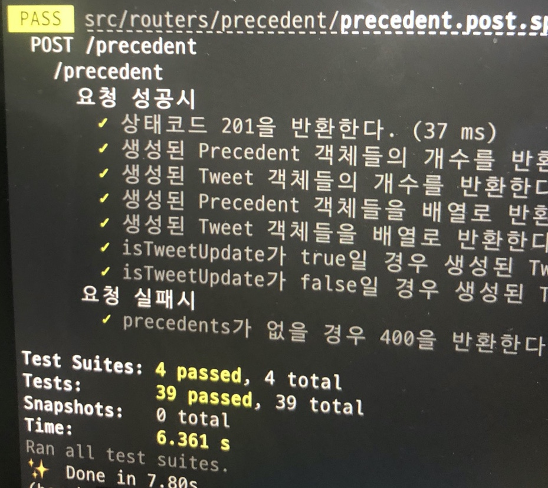
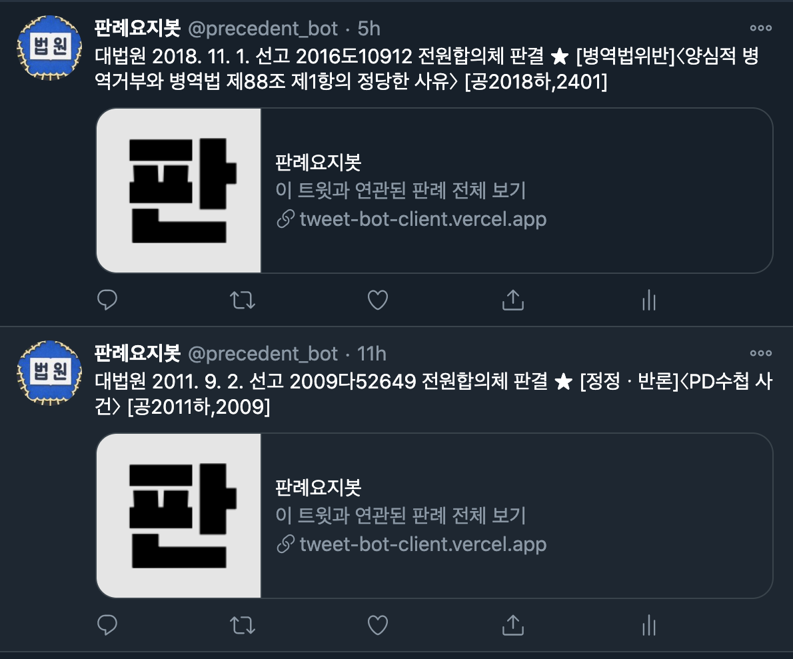

As a personal project, I spent about two months from late July to September this year building an unusual app called **Case Summary Tweetbot** that automatically tweets case summaries. It was my first full-stack project where I built both the server and the client of the service. Here are my thoughts on developing the case summary bot.

## About the app


[Twitter account @precedent_bot](https://twitter.com/precedent_bot)
[Precedent View Web App](https://tweet-bot-client.vercel.app/)

The Precedent Bot is a tweetbot service that crawls publicly available case summaries from the [court's comprehensive legal information site](https://glaw.scourt.go.kr/wsjo/intesrch/sjo022.do) at regular intervals and tweets a single paragraph three times a day. The summary of a case is also known as a judgment summary, which summarizes the conclusion of the most important legal issues in a judgment, and is the most important part of a judgment for those who study law. If you want to take a look at the structure of a Korean court's judgment, check out this [link](https://glaw.scourt.go.kr/wsjo/panre/sjo100.do?contId=3239542) (I can't believe I'm linking to a judgment on a development blog. 😲)

I saw that my girlfriend who is in law school often communicates with other law students on Twitter, and it seems that quite a few law students use Twitter, and they continue to study by clipping the latest case law from a few sites. Therefore, I thought it would be useful for many law students to keep uploading the latest case law summarized on Twitter, so that they can remind themselves of the case law even while looking at Twitter.

Also, I thought that if we could crawl the case information and put it into the DB continuously, the data could be useful later (such as making a nice textbook 😎).

For the service, we needed 4 main products.


1. **Server + Database** : We needed a server and database to store the precedents and case summaries that the crawler has crawled. I made the API endpoint accessible to the crawler and client through http communication. For the database tables, we created two tables: precedent and tweet, and when the crawler updates the precedent table, it breaks the case summary of the case into paragraphs so that the tweet table is also updated.
2. **Crawler** : I needed a crawler that periodically monitors the comprehensive legal information site and crawls the number of cases and adds them to the DB if they are updated. I decided to create a serverless crawler using firebase functions that I used while creating a foreign university end-of-term clock.
3. **Tweetbot** : We needed a bot to request tweet information from the server and upload tweets using the tweeter developer API. We implemented it together with the crawler as a serverless function.
4. **Web Client** : This is a web app that allows users to view case summaries in detail. It receives case information from the server as HTTP communication and displays it on the screen. We made it by including the id number of the tweet we are requesting from the database in the URL.


I didn't set out to create a precedent viewing web client from scratch, and originally intended to tweet snippets of precedent summaries and link to them as threads (Twitter has a 140-character limit, so any additional tweeted content beyond 140 characters must be linked as a comment as above, which is called a thread). But the case summary was almost 2000 characters long, so... It kept breaking up and was too hard to read for a 140-character tweet and a thread.

I figured no one would see it, so I built a bot to tweet just the basic information like the case title, date, and number, and attach a link to the web app where you can view the case summary. Much cleaner, right?


## Project structure

The overall structure of the project looks like this



The server, client, and serverless functions are all implemented in Node (because that's pretty much all I know how to do...) I was able to feel the power of the JS and Node ecosystem across client and server 👍🏻

The server was made with express + TypeScript and connected to a postrgeSQL database using TypeORM. The client is made in React + TypeScript and uses Redux + Redux Saga to manage asynchronous http requests and manage the state of the app. The serverless functions were implemented in JavaScript on Node.

## Things to note

Since I created multiple products in one project, I have quite a few quirks 😇.

### 1 - API not RESTful(ㅜㅜ)

Here's the full API endpoint used by the server of the precedent yojibot service. I omitted the detailed query params.



You can see that `POST /precedent` is not very RESTful. A RESTful API should neatly represent the behavior of only one resource with endpoints and methods, because `POST /precedent` updates both the precedent and the tweet at the same time. You can't tell which resource is being accessed by looking at the endpoint.

I think this is not a good API design for fast development. A more RESTful API would also have a `POST /tweet` endpoint: the client requesting the API, not the server, would perform the operation to POST the tweet, and then update the tweet table with a `POST /tweet` request. However, I have some doubts that RESTful design is always a good thing. I'll have to do more research on this!

### 2 - Developing REST APIs with TDD



**Before** creating the server, I applied TDD by dividing the test code files on an endpoint-by-endpoint basis, `precedent.post.spec.ts`/`tweet.put.spec.ts` and so on, writing 39 unit tests in 4 test files and creating an API that PASSES all tests. The testing library was [Jest](https://github.com/facebook/jest).

I noticed a big difference between front-end and back-end testing. Compared to front-end testing, testing REST APIs is just so... cleaner. The inputs and outputs are very clear. Every test has a clear endpoint, usually **give me a request, give me a response code and a response**. Like this.

```javascript
describe('/precedent', () => {
  describe('On request success', () => {
    it('Returns a status code of 200.', async (done) => {
      res = await mockGetResponse(app, '/precedent');
      expect(res.status).toBe(200);
      done();
    });
    it('Returns an array of Precedent objects.', async (done) => {
      res = await mockGetResponse(app, '/precedent');
      expect(Array.isArray(res.body.precedents)).toBe(true);
      done();
    });
  });
});

describe('On request failure', () => {
  it('Return 400 if type is not criminal or civil.', async (done) => {
    res = await mockGetResponse(app, '/precedent?type=general');
    expect(res.status).toBe(400);
    done();
  });
});
```

On the other hand, front-end test code needs to test the UI, but there's not a specific way to do it, and testing the variable that provides the rendered value feels like testing the internals instead of the endpoint. That's why I haven't been able to apply TDD to the front-end app of my personal project. I'm looking forward to experiencing more effective front-end testing methods 🧐.

### 3 - Implementing a crawler with puppeteer

For crawling, I used [puppeteer](https://github.com/puppeteer/puppeteer), a headless browser from the JS development ecosystem. It was very interesting to me to be able to move the browser with just code to achieve the desired purpose. In the source code of the crawling bot, I modularized the part that uses puppeteer by enclosing it in a class, defining the behavior as a method, and instantiating it in a serverless function.

The API documentation is very friendly, so it's not a problem to learn and apply it to your project, but at the same time, there is a lack of Korean resources. If I have time, I'll post a post summarizing the core APIs of puppeteer.

### 4 - Introducing Redux Saga

I applied [Redux Saga](https://github.com/redux-saga/redux-saga/) to my React project for the first time. In my previous projects, even though I used Redux, I wrote asynchronous logic in components, but I finally tried Saga. I was able to understand the middleware concept of Redux more clearly, and it was very convenient to write asynchronous logic in one place. The idea of using generator syntax to manage asynchronous logic alongside synchronous logic was also interesting, and I think I'll always use Saga to handle asynchronous logic with Redux.

At the same time, I'm curious about the asynchronous logic of other state management apps, and I'd like to learn more about libraries like mobX and the recently released Recoil.

### 5 - Failed to apply dynamic meta tags

I knew about [React Helmet](https://github.com/nfl/react-helmet) during the planning stage, so I thought I would use it to dynamically change metatags according to the precedents. However, in the SPA created with CRA, even if I use Helmet, [Twitter does not recognize dynamically changed metatags](https://jeonghwan-kim.github.io/dev/2020/08/15/react-helmet.html#%ED%81%AC%EB%A1%A4%EB%9F%AC%EA%B0%80-%EC%9D%BD%EC%9D%84-%EC%88%98-%EC%9E%88%EC%9D%84%EA%B9%8C).

I thought about switching to a server-side library like Next, but since I was still working on the client, I didn't end up doing that. So the metatags of the links referenced by the tweets all stayed the same, as shown in the image below.



It looks like server-side rendering is the way to go if you want to dynamically set metatags based on the content of the document!

### 6 - I'm an infrastructure kid

Infrastructure has always been something I've been lacking, so this experience of installing a DB on EC2 Linux, uploading a project and deploying it myself was a good learning experience. Of course, I kept fiddling with the settings and popping up multiple instances until I got it right... 😅 I also used pm2 to create a non-disruptive service, bought my own domain, and applied HTTPS with ELB.

When I successfully deployed it and saw requests going to the URL, I was proud of myself, thinking, "I've finally been through the entire web service from start to finish." I've been through the front-end, back-end, and infrastructure at least once. Of course, the road ahead is more difficult.

Although I succeeded in deploying it, there are many things I didn't get to try that I had planned. First of all, I was going to build the serverless function in AWS Lambda, but I wanted to finish the project quickly, so I used firebase functions because it was accessible with an easier interface and I had experience with it when I was developing an external pocket watch.

I realized that I should definitely learn CI/CD implementation. I didn't have CI/CD in place, so whenever I made changes to the code after the initial deployment, I'd blow up the entire EC2 instance directory, get a clone from the latest master branch, set it up again, and deploy it again. By the time the project was finished, I really didn't want to modify it anymore... 😭 Deployment automation that takes care of these tedious tasks seems like a must-have. At work, we're implementing CI/CD using AWS S3, and I thought I'd take a look at it.

## Closing thoughts

After summarizing this, I think I'm probably not the kind of developer who works that hard on personal projects, and I think it's important to balance between what you want to do with your personal projects and the time and stress that developers put into them. I'm also working at a company, so I tend to make adjustments so that I can get things done early, even if it means giving up some of the things I had planned.

The things that I think I've 'missed' in this project, I've also given up in order to achieve that balance, although I'm still disappointed 🙁 I'm planning to make another study plan soon so that I can make up for what I've missed.


As of November, 236 people have followed Precedent Bot on Twitter. It doesn't have a lot of features and doesn't have a wide target audience, but it was rewarding to see that there were quite a few people who said it was "useful" on Twitter. There are also retweets that quote precedent tweets and talk about them with other users, so I think it's meaningful to give people who are studying law something to talk about. They often mention precedents in this way.


In the future, when I work on personal projects, I'll try to pick items that are small but can directly help some users. That's it!
