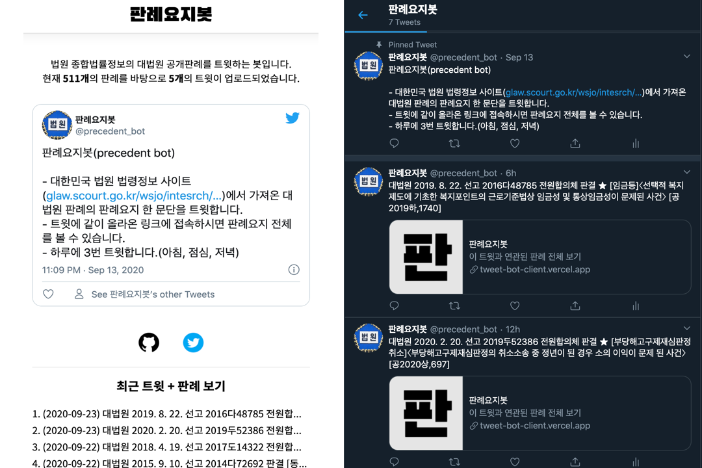
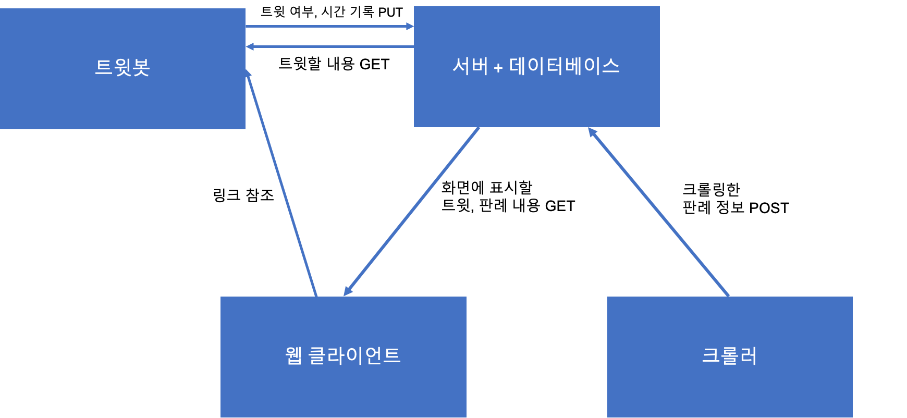
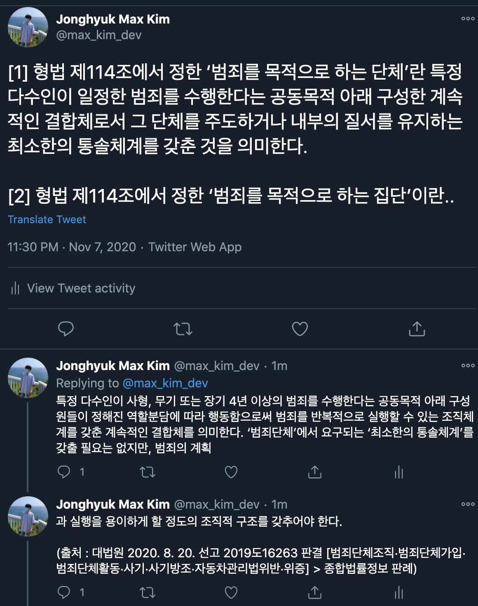
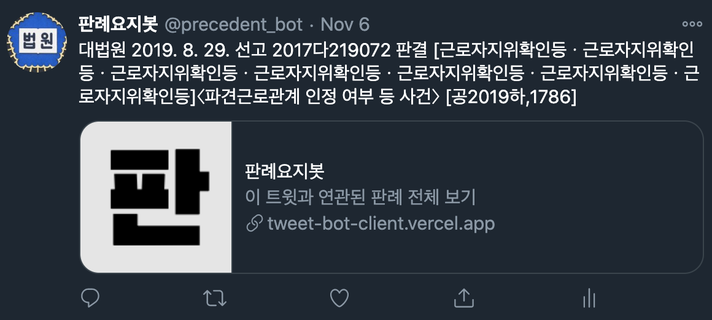
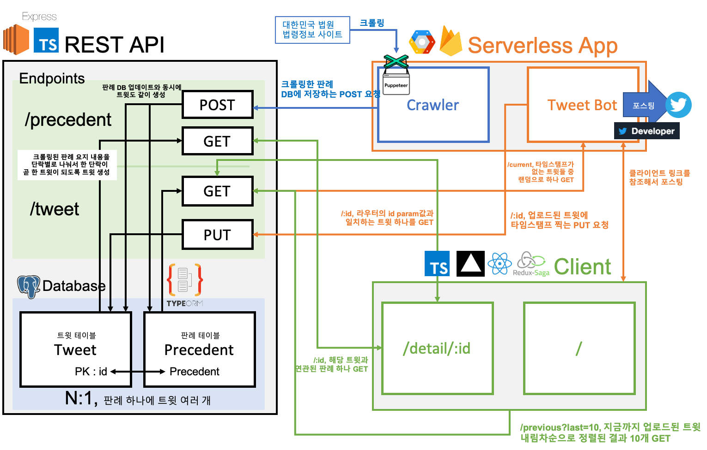
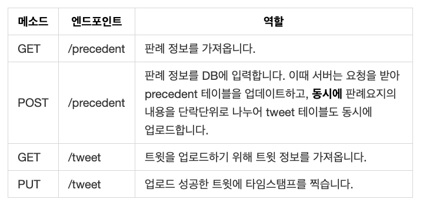
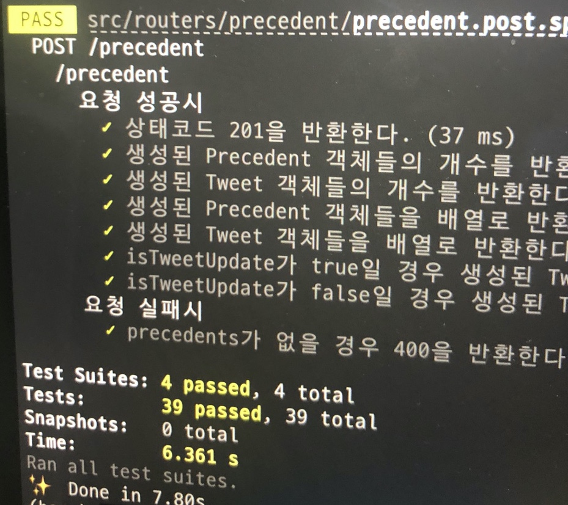
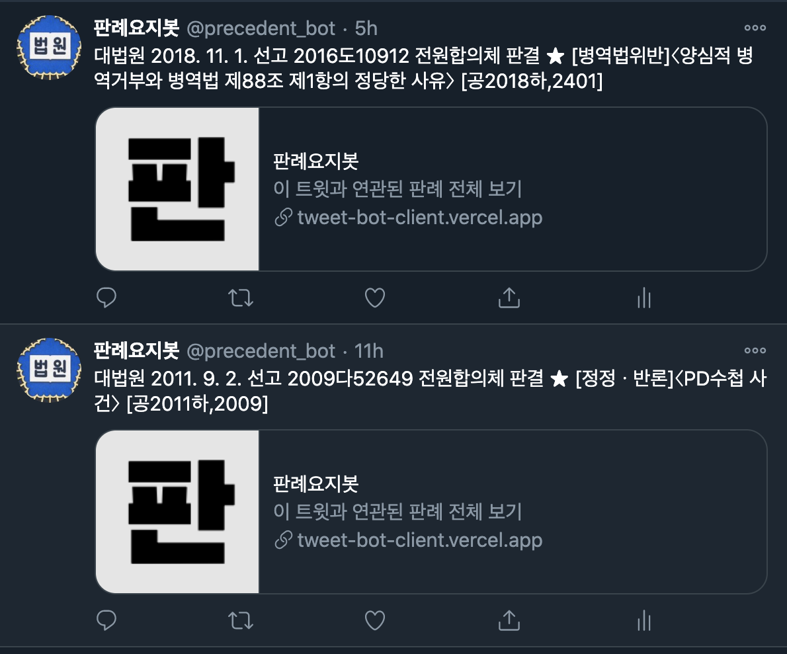
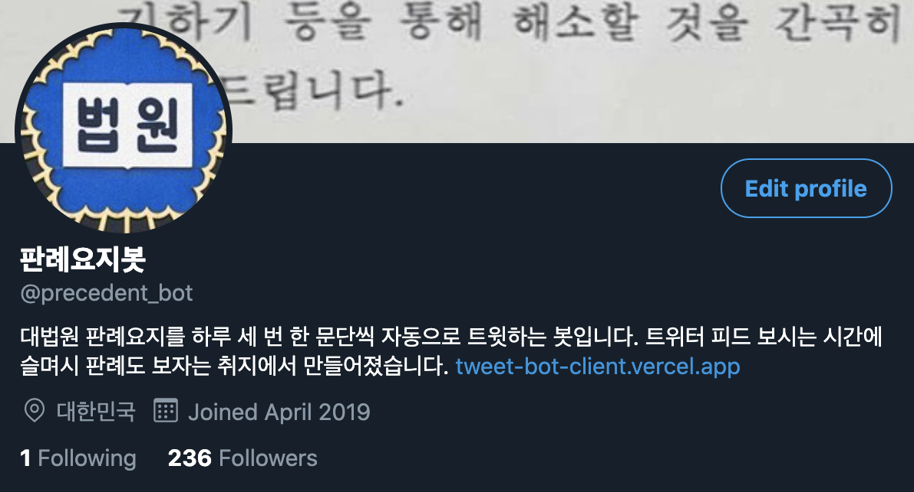
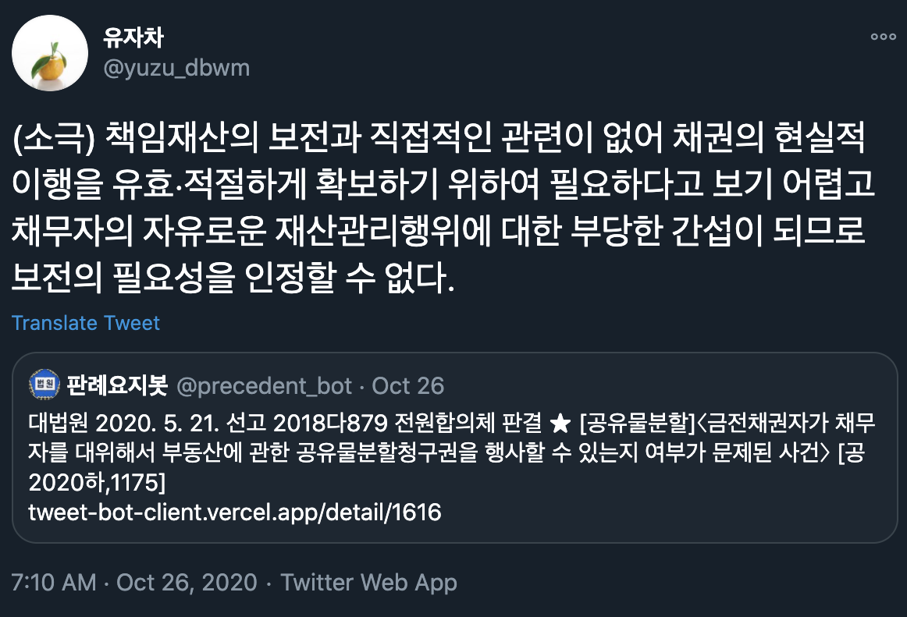

올해 7월 말부터 9월까지 약 두달동안 개인 프로젝트로 판례요지를 자동으로 트윗해주는 **판례요지 트윗봇**이라는 특이한 앱을 만들었습니다. 서비스의 서버와 클라이언트를 모두 빌드해보는 풀스택 프로젝트는 처음으로 시도해보았는데요. 판례요지봇을 개발하면서 느낀 점들을 정리해보았습니다.

## 앱 소개



[트위터 계정 @precedent_bot](https://twitter.com/precedent_bot)  
[판례보기 웹앱](https://tweet-bot-client.vercel.app/)

판례요지봇은 [법원 종합법률정보 사이트](https://glaw.scourt.go.kr/wsjo/intesrch/sjo022.do)의 공개판례 요지를 일정한 주기로 크롤링하여 한단락씩 하루에 세번 트윗하는 트윗봇 서비스입니다. 판례의 요지는 판결요지라고도 하는데요, **판결문에서 가장 중요한 법적 쟁점들에 대한 결론을 요약한 것**으로 법을 공부하시는 분들이 판결문에서 가장 중요하게 챙겨보시는 부분입니다. 대한민국 법원의 판결문 구조를 한번 살펴보시고 싶다면 이 [링크](https://glaw.scourt.go.kr/wsjo/panre/sjo100.do?contId=3239542)를 참고하세요(개발 블로그에서 판결문 링크를 걸다니 넘 신기한 상황..😲)

로스쿨에 다니는 애인이 다른 로스쿨 원생분들과 트위터로 소통을 자주 하는 모습을 보았는데, 꽤 많은 로생분들이 트위터를 하시는거 같았어요. 그리고 최신 판례를 몇 개의 사이트에서 스크랩하셔서 토대로 계속 공부를 하시더군요. 따라서 트위터에 요약된 최신 판례를 계속 업로드한다면, 트위터를 보다가도 판례 내용을 리마인드할 수 있어 많은 로생분들이 유용하다 느끼시지 않을까 생각했습니다.

그리고 판례정보를 크롤링해 DB에 지속적으로 넣을 수 있다면 그 데이터는 나중에 유용하게 사용할 수 있지 않을까 하는 생각도 있었습니다(보기좋게 교재로 만든다던지요😎).

서비스를 위해서 프로덕트는 크게 4가지가 필요했습니다.



1. **서버 + 데이터베이스** : 크롤러가 크롤링해온 판례, 판례요지 정보를 저장할 수 있는 서버와 데이터베이스가 필요했습니다. API 엔드포인트에 http 통신으로 크롤러와 클라이언트에서 접근할 수 있도록 만들었습니다. 데이터베이스 테이블로는 크게 precedent(판례), tweet(트윗) 두 개의 테이블을 만들고 크롤러에서 판례 테이블을 업데이트 할 때 해당 판례의 판례요지 내용을 단락으로 끊어 tweet 테이블도 업데이트하게끔 만들었습니다.
2. **크롤러** : 종합법률정보 사이트를 주기적으로 관찰하고, 판례 갯수가 업데이트 되었다면 크롤링해 DB에 추가하는 크롤러가 필요했습니다. 외대 종강시계를 만들면서 사용했었던 firebase functions를 이용해 서버리스 크롤러를 만들기로 결정했습니다.
3. **트윗봇** : 서버에 트윗 정보를 요청하고 tweeter developer API를 이용하여 트윗을 업로드해주는 봇이 필요했습니다. 크롤러와 함께 서버리스 함수로 같이 구현했습니다.
4. **웹 클라이언트** : 판례요지 내용을 상세하게 살펴볼 수 있는 웹앱입니다. 서버에서 판례 정보를 http 통신으로 받아와서 화면에 표시합니다. URL에 데이터베이스에 요청하는 트윗의 id 번호를 포함시켜 만들었습니다.



판례보기 웹 클라이언트의 경우는 처음부터 만들려고 한 것은 아니었고, 원래는 트윗에 판례요지 내용의 일부분을 트윗하고 스레드로 연결하려 했습니다(트위터는 140자의 글자수 제한이 있어서 140자가 넘어가는 추가적인 트윗 내용은 위처럼 댓글로 연결해야 합니다. 이걸 thread라고 하더군요). 하지만 판례요지가 긴 것은 거의 2000자가 넘어가는 바람에... 140자의 트윗과 스레드로 연결하기에는 계속 끊겨서 가독성이 너무 안 좋았습니다.

이렇게 올리면 아무도 안 볼거라는 생각에 판례 제목과 날짜, 번호같은 기본적인 정보만 내용으로 트윗하고 해당 판례요지를 조회할 수 있는 웹앱 링크를 첨부하여 트윗하도록 봇을 만들었습니다. 훨씬 깔끔해졌죠?



## 프로젝트 구조

프로젝트의 전체 구조는 이렇습니다.



서버, 클라이언트, 서버리스 함수 모두 Node 기반으로 구현했습니다(할 줄 아는게 거의 JS밖에 없어서...) 클라이언트와 서버를 아우르는 JS와 Node 생태계의 파워를 느낄 수 있었달까요 👍🏻

서버는 express + TypeScript로 만들고 postrgeSQL 데이터베이스를 TypeORM을 사용해서 연결했습니다. 클라이언트는 React + TypeScript로 만들고 Redux + Redux Saga를 통해 비동기로 이루어지는 http 요청을 관리하며 앱의 상태를 관리합니다. 서버리스 함수는 Node 기반의 자바스크립트로 구현했습니다.

## 기록할만한 점들

한 프로젝트에 프로덕트를 여러개 만들어서 그런지, 특기할 점이 꽤 있네요 😇

### 1 - RESTful하지 않은 API(ㅜㅜ)

판례요지봇 서비스의 서버에서 쓰는 전체 API 엔드포인트는 이렇습니다. 상세한 쿼리파람은 생략했습니다.



`POST /precedent`를 보시면 그다지 RESTful하지 않다는 것을 알 수 있습니다. RESTful한 API는 한 가지 자원에 대한 동작만을 엔드포인트와 메소드로 깔끔하게 표현해야 하는데, `POST /precedent`는 판례와 트윗을 동시에 업데이트하기 때문입니다. 접근하는 자원을 엔드포인트만 보고 파악할 수 없습니다.

빠른 개발을 위해 위와 같이 만들었습니다만 좋은 API 설계는 아닌 것 같습니다. 이보다 더 RESTful한 API는 `POST /tweet` 엔드포인트도 존재하겠죠. 서버가 아니라 API을 요청하는 클라이언트단에서 트윗을 POST하기 위한 연산을 수행한 후에 `POST /tweet` 요청으로 트윗 테이블을 업데이트할 것입니다. 그런데 RESTful한 설계가 항상 무조건 좋은 것인지는 살짝 의문이 들기는 합니다. 관련해서 더 공부를 해봐야 할 것 같아요!

### 2 - TDD 적용한 REST API 개발



서버를 만들기 **이전에** 엔드포인트 단위로, `precedent.post.spec.ts`/`tweet.put.spec.ts` 이런 식으로 테스트 코드 파일을 나누어 4개의 테스트 파일에 39개의 유닛 테스트를 작성하고 모든 테스트를 PASS하는 API를 만드는 방법으로 TDD를 적용했습니다. 테스팅 라이브러리는 [Jest](https://github.com/facebook/jest) 였구요.

프론트엔드와 백엔드 테스트의 차이를 크게 느꼈습니다. 프론트엔드 테스팅에 비해 REST API 테스팅은 그저 너무... 깔끔합니다. 입력과 출력이 매우 명확해서 그렇습니다. 모든 테스팅이 일반적으로 **어떤 요청을 주면 어떤 응답코드와 응답을 준다** 식으로 종단점을 확실히 정할 수 있습니다. 이런 식으로요

```javascript
describe('/precedent', () => {
  describe('요청 성공시', () => {
    it('상태코드 200을 반환한다.', async (done) => {
      res = await mockGetResponse(app, '/precedent');
      expect(res.status).toBe(200);
      done();
    });
    it('Precedent 객체로 이루어진 배열을 반환한다.', async (done) => {
      res = await mockGetResponse(app, '/precedent');
      expect(Array.isArray(res.body.precedents)).toBe(true);
      done();
    });
  });
});

describe('요청 실패시', () => {
  it('type이 criminal이나 civil이 아닐 경우 400를 반환한다.', async (done) => {
    res = await mockGetResponse(app, '/precedent?type=general');
    expect(res.status).toBe(400);
    done();
  });
});
```

이에 비해 프론트엔드 테스트 코드는 UI를 테스팅해야 하지만 일반적인 방법이 딱 정해져있는 것이 아니고, 그렇다고 렌더링되는 값을 제공하는 변수를 테스팅하자니 종단점이 아닌 내부를 테스트하는 것 같아서 찜찜하고 그렇습니다. 그래서 개인 프로젝트의 프론트엔드 앱에는 TDD를 거침없이 적용해나가지 못했던 건데요. 더 효과적인 프론트엔드 테스팅 방법을 경험해보고 싶은 마음이 큽니다🧐

### 3 - puppeteer로 크롤러 구현

크롤링을 위해 JS 개발 생태계의 headless 브라우저인 [puppeteer](https://github.com/puppeteer/puppeteer)를 사용했습니다. 코드만으로 브라우저를 움직여 원하는 목적을 달성할 수 있다는 것이 굉장히 흥미롭게 느껴졌었는데요. 크롤링 봇의 소스코드에서는 puppeteer을 사용하는 부분을 class로 묶고 동작을 메소드로 정의하여 모듈화하고, 서버리스 함수에서 인스턴스화해서 사용했습니다.

API 문서가 매우 친절한 편이라 익히고 프로젝트에 적용하는 것은 문제가 없지만, 동시에 한국어 자료가 부족한 편입니다. 시간이 되면 puppeteer의 핵심 API들을 정리하는 글을 포스팅해볼까 합니다.

### 4 - Redux Saga 도입

[Redux Saga](https://github.com/redux-saga/redux-saga/)를 처음으로 React 프로젝트에 적용해봤습니다. 그동안의 프로젝트에서는 Redux를 쓰더라도 비동기 로직은 컴포넌트단에서 작성을 했었는데, 드디어 Saga를 써보게 되었네요. Redux의 미들웨어 개념을 더 확실히 이해할 수 있었고, 비동기 로직들을 한 곳에 모아 작성할 수 있어 매우 편리했습니다. 제너레이터 문법을 사용하여 동기 로직들과 함께 비동기 로직들을 관리한다는 측면도 흥미로웠고요. 앞으로는 Redux와 함께 언제나 Saga를 적용해 비동기 로직 처리를 할 것 같다는 생각이 듭니다.

동시에 다른 상태관리 앱들의 비동기 처리 로직도 궁금해졌습니다. 언젠간 mobX나 최근에 출시된 Recoil 같은 라이브러리도 공부해보면 좋을 것 같습니다.

### 5 - 동적 메타 태그 적용 실패

기획 단계에서 [React Helmet](https://github.com/nfl/react-helmet)이란 것이 있다는 것을 예전부터 알아서, 판례 내용에 따라 메타태그를 동적으로 바꾸기 위해 써봐야겠다고 생각했습니다. 그런데 CRA로 만든 SPA에서는 Helmet을 쓴다 한들 [트위터에서 동적으로 바뀐 메타태그를 인식하지 못합니다](https://jeonghwan-kim.github.io/dev/2020/08/15/react-helmet.html#%ED%81%AC%EB%A1%A4%EB%9F%AC%EA%B0%80-%EC%9D%BD%EC%9D%84-%EC%88%98-%EC%9E%88%EC%9D%84%EA%B9%8C).

Next같은 서버사이드 라이브러리로 전환할까 고민했지만 클라이언트 개발이 어느정도 진행 중이라서 결국 그렇게는 못했습니다. 그래서 트윗이 참조하는 링크의 메타태그는 아래 이미지와 같이 모두 동일하게 유지되었습니다.



메타태그를 문서의 내용에 따라 동적으로 설정하려면 서버사이드 렌더링을 적용하는게 좋은 것 같습니다!

### 6 - 나는야 인프라 어린이

인프라는 항상 부족한 부분이었기에 이번에 EC2 Linux 위에 DB를 설치하고 프로젝트를 업로드해 직접 배포해 본 경험은 좋은 공부가 되었습니다. 물론 세팅을 계속 삐끗해서 성공할때까지 인스턴스 여러개를 뻥뻥 터트리긴 했지만요...😅 더불어 pm2를 사용해 무중단 서비스를 만들고, 도메인을 직접 구입하여 ELB로 HTTPS 적용도 해봤습니다.

배포에 성공해 URL로 요청이 들어가는 걸 확인했을 때, 드디어 **"웹 서비스의 처음부터 끝까지 한 번 쭉 다 와봤구나"** 라는 생각이 들고 뿌듯했습니다. 프론트엔드-백엔드-인프라까지 미약하게나마 한번 이상씩은 경험해봤으니까요. 물론 앞으로 가야할 길이 더 어렵겠죠 ㅎㅎ

배포에 성공하긴 했지만 계획했던 것 중에 시도해보지 못한 것들도 많습니다. 일단 서버리스 함수를 AWS Lambda로 구축하려고 했지만 프로젝트를 빨리 완성시키고 싶은 마음에 좀 더 쉬운 인터페이스로 접근이 가능하고 외대 종강시계를 개발할 때 써본 경험이 있는 firebase functions를 사용했습니다.

그리고 무조건 CI/CD 구축을 공부해야겠다는 생각이 들었습니다. CI/CD를 구축하지 못해서 처음 배포 이후에 코드를 수정할때는 EC2 인스턴스 디렉토리를 통째로 날리고 다시 최신 master 브랜치에서 클론을 받아 다시 세팅하고 배포하는 과정을 계속 거쳤습니다. 프로젝트가 완성될 때 쯤에는 진짜 더는 수정하기 싫어지더군요...😭 이렇게 귀찮은 작업을 대신 해주는 배포 자동화는 무조건 필요한 것 같습니다. 회사에서는 AWS S3를 이용하는 CI/CD를 적용하고 있는데, 관련해서 좀 살펴봐야겠다는 생각이 들었습니다.

## 맺는말

이렇게 정리해놓고 보니, 저는 개인 프로젝트를 진행할 때 그렇게 열심히 하는 개발자가 아닐지도 모르겠습니다. 저는 개인 프로젝트를 통해 해보고 싶은 것과 개발자가 프로젝트에 들이는 시간과 스트레스 사이에서 중심을 맞추는 것이 중요하다고 생각합니다. 회사에서 일도 하고 있으니깐요. 그래서 계획했던 것들을 좀 포기하더라도, 어느정도 결과물을 일찍 완성해낼 수 있도록 조정하는 편인것 같습니다.

이 프로젝트에서 '놓쳤다'고 생각하는 것들도 그런 균형을 맞추기 위해 포기했습니다. 물론 별개로 아쉽기는 하죠🙁 빨리 다른 공부 계획을 짜서 놓친 것들을 보완할 수 있도록 계속 공부를 이어나갈 예정입니다.



판례요지봇은 11월 현재 트위터에서 236분이 팔로우 해주시고 있습니다. 그렇다할 기능이 많은 것도 아니고, 타겟층이 넓지 않은 앱이지만 그래도 트위터에서 "쓸만하다"고 말해주신 분들이 꽤 있으셔서 보람을 느꼈습니다. 판례 트윗을 인용해서 다른 유저들과 관련해 이야기를 나누는 리트윗도 있어 법을 공부하시는 분들께 무언가 이야기할 거리를 드렸다는데서 의미가 있는 것 같습니다. 이런식으로 판례 언급도 종종 해주시고요.



앞으로도 개인 프로젝트를 진행할 때는 작을지언정 어떤 유저들에게는 직접 도움이 될 수 있는 아이템을 선정해 계속 진행해보려고 합니다. 마치겠습니다!
