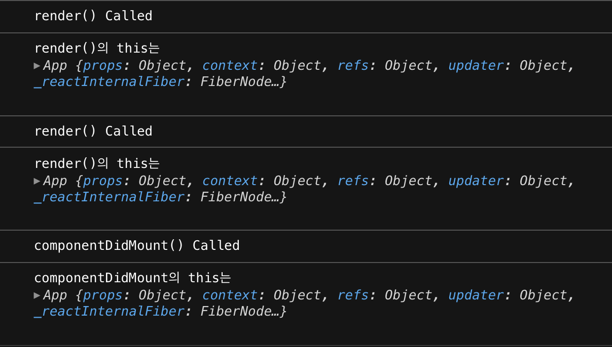
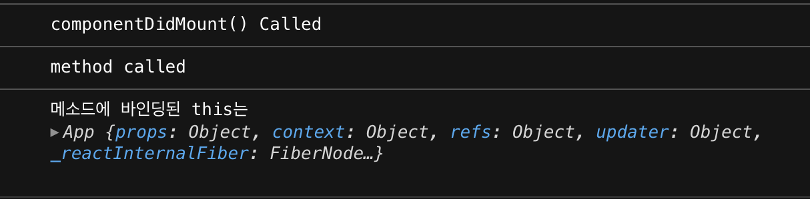
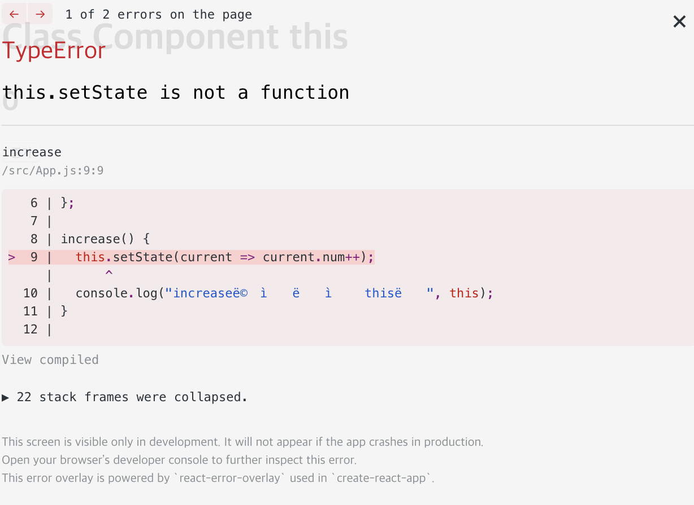
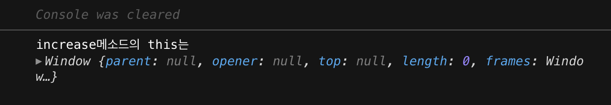

When writing React class components, you need to care about `this`. If you follow along with many React tutorials, you'll intuitively understand that we use `this` to refer to state, props, and methods we declare in our components. In this post, we'll summarize what exactly the `this` bindings of the properties that make up a component look like.


## Properties that can be referenced by this inside a component

1. state (+setState)
2. props
3. refs
4. component methods ⇒ throw an exception when handling events
5. lifecycle methods

## Lifecycle Methods

First, let's see where the `this` of a lifecycle method is bound.

```jsx
import React from 'react';

class App extends React.Component {
  componentDidMount() {
    console.log('componentDidMount() Called');
    console.log('this in componentDidMount is', this); //App
  }

  render() {
    console.log('render() Called');
    console.log('this in render() is', this); //App
    return (
      <div> <div
        <h1>Class Component this</h1>
      </div> </div
    );
  }
}

} export default App;
```

If you create a class component like this and run it, you'll see that the console will print something like this (I used [codesandbox](https://codesandbox.io/s/new)).

The this in a lifecycle method points to the **component** that called the method. Since `this` points to the component, any other methods you declare inside the component will be called just fine using `this` inside the lifecycle method.

```jsx
import React from "react";

class App extends React.Component {

// Declare a method
componentMethod() => {
  console.log("method called");
  console.log("method bound to this is", this); //App
};

componentDidMount() {
  console.log("componentDidMount() Called");
  this.componentMethod();
}

render() {
  return (
    <div> <h1>Class Component this</h1
      <h1>Class Component this</h1>
    </div> </div
    );
  }
}

} export default App;
```



You can see that the methods declared by the component are also bound to `this`.

## Component method exceptions

Methods declared by a component are by default binding that component to this. However, things are a little different when passing a method declared in a component to a callback function in a JSX event handler. Let's build a very simple React app that increments a number when a button on the screen is clicked.


```jsx
import React from 'react';

class App extends React.Component {
  // declare state value num
  state = {
    num: 0,
  };

  // Increase this.state.num by 1 when button is pressed
  increase() {
    this.setState((current) => ({ num: current.num + 1 }));
    console.log('this in the increase method', this);
  }

  render() {
    return (
      <div> <h1>Class Component this</h1
        <h1>Class Component this</h1>
        <h2>{this.state.num}</h2>
        {/* Pass component methods to the callback of the click event handler */}
        <button onClick={this.increase}>Increase</button>
      </div> </div>
    );
  }
}

} export default App;
```

If we pass the method with `this` as an argument to the `onClick` event as is, the number doesn't increment and we get the error `this.setState is not a function` \*\*.


This is because we can't reference the `setState()` function with the bound `this` when the method is executed. This is strange, because as we saw earlier, the `this` of a method declared by a component is bound to that component, so we should be able to reference the `setState()` function with that `this`.

To see why, let's first comment out the line of `setState()' that is causing the error.

```jsx
increase() {
  // this.setState(current => ({ num: current.num + 1 }));
  console.log("This in the increase method is", this);
}
```

This way, we know where `this` is bound when the `increase()` method is called when a click event occurs. Let's look at the console.

Interestingly, `this` is bound to the global object `window`! This is despite the fact that we checked earlier that the `this` of the method we declared in the component was bound to that component. Why is this happening?

I'm not going to dissect the exact behavior of React event handlers in this post, but I can probably guess that something like this is happening. Take a look at the class we've declared below.

```jsx
class App {
  constructor(state) {
    this.state = state;
  }

  showState() {
    console.log(this.state);
  }
}

const app = new App('num');
app.showState(); // num

const showState = app.showState;
showState(); // TypeError: Cannot read property 'state' of undefined
```

It's fine to call a method on an instance of a class, but if you move the method to another variable and call it, you get a TypeError. **This is because the method has lost `this`.** When you call a class method on an instance with `.`, `this` is bound to the class as it should be, and you can refer to the member variable `this.state`. However, when you call the method by assigning it to another variable, `this` loses the class it was originally bound to and is bound to a global object, either `windows` or `global`, which means it can't reference `this.state` either.

So we can cautiously assume that somewhere along the way React detected the event and called the callback function, something **equivalent to a component method being assigned to a different variable and called separately** happened, causing the method to lose its original `this` binding, the parent component, and become bound to a global object. So how do we fix this situation?

### Solution 1) bind()

The `Function` object's method, `bind()`, serves to specify the `this` of a function. When called, it returns a new function with the object as its argument and the function's this. Write it in `Constructor()`, or pass the method that called `bind()` as an argument to an event handler.

```jsx
render() {
  return (
    <div> <div
      <h1>Class Component this</h1>
      <h2>{this.state.num}</h2>
      {/* Binds the existing increase method to the App that is this in render() */}
      {/* We don't lose this because we've written it explicitly */}
      <button onClick={this.increase.bind(this)}>Increase</button>
    </div>
  );
}
```

### Solution 2) Arrow function

Unlike other functions, arrow functions do not have their own `this`; they always bind to the `this` of their parent scope. (This is called `lexical this`.) An arrow function passed as an argument to an event handler binds to `App`, the `this` of its parent scope, the `render()` method, and returns a component method, where the `this` preceding the component method refers to the `this` of the arrow function, which is `App`.

```jsx
render() {
  return (
  <div> <h1>Class Component
    <h1>Class Component this</h1>
    <h2>{this.state.num}</h2>
    {/* The yo this that precedes component methods refers to the App */}
    <button onClick={() => this.increase()}>Increase</button>
  </div> </div>
  );
}
```

## Call the functional component's this

The `this` in functional components is not as important as it is in class components.

```jsx
import React, { useState } from 'react';

function App() {
  const [num, setNumber] = useState(0);

  const increase = () => {
    setNumber(num + 1);
    console.log('this in the increase method is', this); //window
  };

  return (
    <div> <h1>Class Component this</h1
      <h1>Class Component this</h1>
      <h2>{num}</h2>
      {/* You don't have to do anything! */}
      <button onClick={increase}>Increase</button>
    </div>
  );
}

} export default App;
```

First of all, the state of the functional component is managed by the `useState` hook, so it's free from the component's `this`. Also, both the functional component itself and the functions we declare inside the functional component have a global object as `this`, so they all have the same `this` in the first place, so we don't have to worry about passing callback functions to event handlers.

Functional components seem to have more natural logic to the eye than class components. Classical components have lifecycle methods that are executed when they are created and updated, and these methods are executed automatically without having to be specified in the component. This structure is probably not explicit.

However, functional components [including hooks](https://ko.reactjs.org/docs/hooks-rules.html) work in the order of the functions and variables you declare inside them, and you don't have to worry about binding `this`. I think they have a more explicit structure than class components.

## reference

- [This is why we need to bind event handlers in Class Components in React](https://www.freecodecamp.org/news/this-is-why-we-need-to-bind-event-handlers-in-class-components-in-react-f7ea1a6f93eb/)
- [mdn - Function.prototype.bind()](https://developer.mozilla.org/ko/docs/Web/JavaScript/Reference/Global_Objects/Function/bind)
