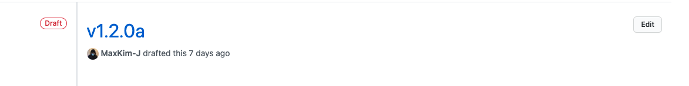

This time, I tried to build a CI/CD pipeline for a [mobile app](https://apps.apple.com/kr/app/moye-%EC%83%88%EB%A1%9C%EC%9A%B4-%ED%8C%A8%EC%85%98%EC%9D%84-%EA%B0%80%EC%9E%A5-%EB%A8%BC%EC%A0%80/id1561711601) made by my company using React Native. I don't have advanced integration or test automation, but almost just deployment automation, so it's a bit big to call it CI/CD..lol

I'd like to summarize the process of designing and implementing the CI/CD pipeline in this post! I think this post will focus on the flow and results of the process of **what problems we tried to solve, what problems we solved, and what problems remained** rather than the detailed aspects of the technologies we used (github actions, fastlane, React Native).

# Why CI/CD?

We implemented CI/CD for three main reasons. To solve the problems of the example mobile app, which I will describe later.

1. minimize the human error and resources involved in the complex and time-consuming process of building mobile apps.
2. reduce the additional resources required to use Code Push. (Determining if Code Push is available + tangled bugging)
3. build a pipeline that allows you to seamlessly perform QA that you may not have been able to do effectively due to lack of manpower.

# Problems with the Moye mobile app

## 1. Complex build process that is prone to human error

First, we need to explain why production builds of Moye apps are unusually complex.

### Incomplete module sharing between web and app

The Moye mobile app is built on React, which doesn't have a lot of functional differences from the web, so I've carried over some modules written in TypeScript from the web project (like custom hooks, API request functions, and various helper functions) and used them in the mobile project.

I'm not using yarn workspace and lerna, or module separation via npm. I'm using a really simple and cheap method, which I'm a little embarrassed to share... I use the `git submodule` function in my mobile project to take the web project and use it as it is.

In the dependencies property of package.json, I link the files of the submodule I want to use in the mobile project, and when I do a yarn install, the files are installed in node_modules.

```json
"dependencies" :{
  "@moye-en/hooks": "file:moye-web/src/hooks",
  "@moye-en/utils": "file:moye-web/src/utils",
  ...
}
```

This way, inside your app project, you can write something like this.

````typescript
import someHooks from '@moye-en/hooks/someHooks';
```typescript

This is a very simple and quick way to share modules between projects, but it's bad because it makes your app project effectively dependent on the web. It breaks the workflow between developers because you sometimes have to touch the web project before you can work on the app, and it complicates the project itself because you have to manage where the commit head of the web project is in the submodule.

The front-end team is aware of this problem... In the future, we plan to separate the logic that is common to both web and app into core modules and deploy them as internal NPM modules to manage them.

### Shared environment variables between web and app

In web projects, we use `.env` files to manage environment variables and refer to them as `process.env`. When I share a web module with my app, it also comes with a reference to `process.env`. If I don't take care of it, it will be referenced as undefined.

In our mobile app development environment, we use [`babel-plugin-transform-inline-environment-variables`](https://github.com/babel/minify/tree/master/packages/babel-plugin-transform-inline-environment-variables) to replace the `process.env` reference in the shared module with the value of the environment variable injected when the development server is spun up.

```json
"scripts": {
  ...
  "start:dev": "export $(cat env/.env.dev | xargs) && react-native start",
  "start:prod": "export $(cat env/.env.prod | xargs) && react-native start",
},

````

The problem is not in development, but in production build of the app, the environment variables should be applied when the JS bundle is created during the build process for Android and Ios apps, but I haven't found a good way to inject the environment variables during the build... I need to do more research.

So, we're going to modify the references to `process.env` directly before we build and deploy. You can do this by running a script that replaces the shared module's `process.env` with a predefined string value. The script might look something like this

```typescript
// releaseModeScript.js
fs.readFile(
  'node_modules/@moye-kr/api/index.ts',
  'utf8',
  (err, data) => {
    if (err) {
    return;
  }

  const result = data
    .replace(
      /process.env\['BASE_URL_PATH'\]/g,
      '"https://api.base.url"', // API Base Url for production
    )
...
  }
)
```

```json
"scripts": {
  "mode:release": "node ./scripts/releaseMode.js",
},

```

### Lots of build steps

The nature of React Native projects, which include both IOS and Android projects, already requires a lot of build steps, which is further complicated by the fact that the web and app share logic. If you try to build and deploy in a CI/CD environment, you need to go through all of the following steps.

```shell

1. modify the version number and app bundle number to deploy to Android, IOS, etc.
2. install fastlane, install App center cli # locally it is already installed
3. git submodule update # Set the web submodule that the app looks at to be up to date
4. yarn # update dependencies up to date, where shared modules from the web are injected into node_modules
5. npx patch-package # reflect changes to node_modules made by pacth-package
6. yarn mode:release # Replace process.env with a string, which was referencing environment variables
7. cd ios && pod install # Resolves the dependency on the pod part
8. deploy with fastlane or codepush

```

It's a fairly large build staff, and it's easy to miss any of these steps when trying to do a production build locally, so we were in desperate need of automation.

## 2. Problems with using Code Push


Code Push is a cloud service that allows you to update your app without going through the store. It is provided by Maso, which is a bit of a surprise(?).

If you set up Code Push for your production app, when the app is run, it sends an HTTP request to App Center, which uploads a pre-modified JS bundle, to fetch the JS bundle for the current native app version and replace it with the existing JS bundle. If you already have the latest version of the bundle, it won't update anymore. For more information, check out the [Docs](https://docs.microsoft.com/ko-kr/appcenter/distribution/codepush/)!

### Developers should determine if they can do a Code Push release

Code Push releases only change the JS bundle of your production app, so if your app's native code has changed, you can't release with Code Push. The most common cases where the native code of an RN app changes are when you need to install a new third-party library or modify information on the native app side (app version, metadata, etc.).

To determine if we can do a Code Push release, we need to know if all the developers who worked on the native side have modified the code since the last release. Of course, we can check it visually by grabbing the diff of the PR on github, but it seems very cumbersome to have a human check every time. This is where automation would come in handy.

### Tangled bugging

Releasing to the App Store and Play Store is a sure thing. The native part of the app requires you to enter a unique number and version of the app bundle, so the store knows if these values are distributable, and if not, it won't request a new version for review.

Even if you update with Code Push, an update is still an update, so you need to modify the version to record the release, but the problem is that you can't modify the version name on the native side, which makes it ambiguous to record the release.\*\* It's hard to buzz with just the version recorded in the native app.

This is because when you upload a JS bundle to App Center via Code Push, it is targeted based on the version currently written to the native side of the code. For example, if the native version of your local project is 1.1.1 when you do a Code Push release, App Center will only pull the new version if production is 1.1.1.

In this situation, I suggested to the team that we could use the repository's release feature to manage versions, using the 3-digit version (v1.1.1) written in the native code when released via the store, and the 4-digit version (v1.1.1a) appended to the existing version when released via Code Push. I also thought it would be nice to be able to create these version tags and releases automatically in the CI/CD pipeline.

## 3. Lack of explicit QA steps

One of the biggest frustrations for developers in early-stage startups is that QA is not something they want to do. No one does QA professionally, and it's often awkward to ask someone else who knows the requirements of the added feature.

At our company, we used to do a cursory QA using the app's internal testing capabilities after a feature was fixed, but when things got busy or we needed to deploy quickly, the QA process was often ignored. This led us to think that we needed to build in an explicit QA point in the pipeline.

To accomplish this, I came up with a flow that would allow internal people to test modified apps before deployment, and only manually push them to production if QA didn't raise any issues.

Of course, with fastlane, we can automate submitting apps for review and even writing release notes. But I thought it would be safe to manually transition to production to create an explicit step for QA, and to make it easy to go back to the previous step if something goes wrong in QA.

# Implement CI/CD

Let's describe the actual pipeline implementation! The implementation is based on a github environment, so all references to `Release` or `Tag` are to github and git.

## 1. When pushing PR to master

> **Determine whether to deploy via Code Push or Store, and create a Draft Release.** \*\*2.


The front-end team is using git flow for development, so the features they've been working on on the feature branch are gathered together on the develop branch and moved to master. The fixes that go into each release are the same as the changes in the PR from develop to master.

When you push a PR from the develop branch to master, an Action is executed that compares the diffs of the develop and master branches to determine if the code in the android or ios project directory has been modified. It takes the return value of the `git diff` command as a shell script array and evaluates the value by traversing it. The shell script code used in github actions is as follows.

```shell

# fetch the remote master branch fetch

git fetch origin master

# compare diffs of develop and master

DIFF=$(git diff --name-only HEAD origin/master)
IS_REVIEW_RELEASE=false

# Traverse the diff to see if the android, ios directories have changed

for diff in $DIFF
  do
  echo $diff
    if [[$diff == _android_]] || [[$diff == *ios*]]
    then
    IS_REVIEW_RELEASE=true
    break
  fi
done

# substitute global variables

echo "ENV_IS_REVIEW_RELEASE=$IS_REVIEW_RELEASE" >> $GITHUB_ENV

```

As a result of running this script, if `ENV_IS_REVIEW_RELEASE` is true, we will tag the version of the native code (/android/app/build.gradle to be precise) and prepare a release via the Store. If false, we will prepare a release via Code Push, tagging the version one alphabet up from the previous release.

Create only up to a draft release. Creating a draft release will create a release without the tags or releases you entered being published yet.



## 2. When publishing the release

> **Evaluate the version name and deploy it to the Staging environment in an appropriate way.** \*\*3.


When we write to the release in DRAFT and publish it, another Action is executed, like this


In this Action, we evaluate the tags of the latest release that has been switched to publish and prepare for a Code Push deployment to Staging Track if it has an alphabet at the end, or to internal test, testflight if not. It sends a message to our internal Slack channel when the deployment is complete.


At this point, the deployment to the staging environment where we can do QA is complete. When writing the fastlane-related logic in the Action in this step, we had to make sure that the code sinning and authentication on ios went through the correct steps so that the deployment to testflight would go well. I did a lot of shoveling, and [this post](https://dev-yakuza.posstree.com/ko/react-native/github-actions-fastlane/) was very helpful.

## 3. QA and beyond.

> **Manually transition to production after QA based on the staging release.**


We're almost there. If there are no issues after Staging QA, manually switch to the production release.

For releases via stores, we QA using the internal testing features (internal test, testflight) provided by each store and manually hand over reviews in each store's console.

For Code Push releases, we first deploy to Staging Track and test the bundle on QA devices with older versions of the app to make sure the bundle changes well and the features work before promoting it to Production Track.

# remaining issues

That's all there is to building a CI/CD pipeline for an RN mobile app. While we were able to solve many of the issues in our app project, there are still some issues that need to be addressed.

## Sharing environment variables with the web

This is the issue we talked about when we explained why our builds became so complicated. It would be nice if we could find a way to inject environment variables into the JS bundle even in production build situations, so that we can cut down on one build step.

## expensive and slow github actions macos images


The macos image in github actions is **10x** more expensive than the existing linux image.\*\* If you used 10 minutes when using the linux image, 10 minutes will be deducted from your github actions usage (2000 minutes per month by default), but the mac image will add 100 minutes (...)

My company registered a card for me so that if I went over 2000 minutes, it would be converted to a paid payment. This month, I was probably in the middle of implementing a pipeline, so debugging took up most of my time. I'm sure next month will be fine.

Also, the build-to-deploy time is slower than local. Locally, I could deploy both android and ios in about 20 minutes, but with github actions, it takes almost 50 minutes. Of course, I can turn it back and do something else locally, so it saves resources, but it still takes a lot of time...

I think I need to find a way to reduce the build time, or I heard that you can pay for a macos image for Circle CI as well, but it would be good to try it out in Circle CI and compare the time.

## Is there a good way to determine when Code Push can be used and when it can't?

In the first step of the pipeline, if the `ios` and `android` folders are modified, we prepare a release via the Store, and if they are not modified, we prepare a Code Push release. This seems to make sense, but it hasn't been proven that this is the right way to go in all situations.

For example, when installing a third-party library, the code in the ios directory changes because the dependencies are managed by cocoapod on the ios side, but on the android side, gradle resolves the dependencies to build, so the change in dependencies may not be explicitly reflected in the code.

Of course, I haven't tried using RN third-party libraries that are specific to the android side yet, and if I do, I'll have to make sure I can release them through the store.

# Closing remarks

I'm actually embarrassed by how little I know. I'm not familiar with React Native and the development environment for mobile apps, and I'm sure I've missed a lot of things while rushing through my app project.

Implementing a CI/CD pipeline has forced me to think about the structure of my projects, how I share modules with the web, and the way I work. I've thought about what it takes to implement a pipeline in a way that is most beneficial to my company, and this is what I've come up with.

I'm sure there's a more formal way to do it, but at the end of the day, I believe (probably...) that the way I came up with is the best for the situation my company and development team are in, and I'll continue to refine and improve it. I'd be happy if you can gain even a little insight into my approach to the situation and the way I designed it 😃
